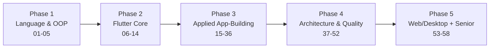

# Learning Path — Foundations to Architect

## Introduction

The 58 modules are dependency-ordered, but real learning happens in **phases** with checkpoints. This document maps modules into a phased roadmap with rough time estimates, prerequisite gates, and the capstone strategy.

> Time estimates assume ~10 focused hours/week. Halve them if full-time, double them if casual. They measure *understanding + building*, not just reading.

---

## The five phases

### Phase 1 — Language & OOP foundations (Modules 01–05)

**Goal:** Write idiomatic, null-safe, well-structured Dart. Understand OOP, SOLID, and core patterns before touching Flutter.

| Module | Est. | Gate to pass |
|--------|------|--------------|
| 01 Dart Fundamentals | 15h | Explain `final` vs `const` vs `late`; use collections + null safety fluently |
| 02 Advanced Dart | 20h | Explain the event loop, microtask vs event queue, isolates, streams |
| 03 OOP | 12h | Model a domain with inheritance, mixins, composition; deep vs shallow copy |
| 04 SOLID | 10h | Refactor a violating class to satisfy each principle |
| 05 Design Patterns | 18h | Implement Factory, Strategy, Observer, Repository, Singleton in Dart |

**Phase checkpoint:** Build a CLI or pure-Dart library (no Flutter) applying SOLID + one pattern.

### Phase 2 — Flutter core & internals (Modules 06–14)

**Goal:** Understand how Flutter *renders and rebuilds*, and wire up state, navigation, and DI.

| Module | Est. | Gate to pass |
|--------|------|--------------|
| 06 Flutter Fundamentals | 10h | Explain widget/element/render trees |
| 07 Widgets | 15h | Compose complex layouts from the catalog |
| 08 Widget Lifecycle | 8h | Trace `initState`→`build`→`dispose`; when `didChangeDependencies` fires |
| 09 Rendering Pipeline | 12h | Explain build→layout→paint→composite→raster; constraints go down, sizes go up |
| 10 Flutter Architecture | 8h | Diagram framework/engine/embedder |
| 11 State Management | 25h | Implement the same feature in setState, Provider, Riverpod, BLoC |
| 12 Navigation | 8h | Imperative + declarative navigation |
| 13 Routing | 8h | Deep links, guards, nested navigators |
| 14 Dependency Injection | 8h | Wire `get_it`/Riverpod DI, keep it testable |

**Phase checkpoint:** Beginner + Intermediate capstones (Todo, Notes, Weather).

### Phase 3 — Applied app-building & integrations (Modules 15–36)

**Goal:** Ship real features — storage, networking, auth, device capabilities, files, payments.

Grouped tracks (do the tracks your target projects need first):

- **Data track:** 15 Local Storage · 16 Networking · 20 Database · 19 Offline First
- **Identity track:** 17 Authentication · 18 Firebase · 37 Security (preview)
- **UX track:** 22 Animations · 23 Custom Painting · 24 Responsive · 25 Adaptive
- **Native track:** 26 Platform Channels · 27 Android · 28 iOS · 29 Device Features · 30 Maps
- **Feature track:** 31 Payments · 32 Notifications · 33 Background · 34–36 Files/PDF/Excel

Est. **90–120h** total depending on tracks chosen.

**Phase checkpoint:** Advanced capstone (Chat App or Food Delivery) with real backend, offline cache, and auth.

### Phase 4 — Architecture, quality & operations (Modules 37–52)

**Goal:** Make it enterprise-grade — architecture, testing, security, CI/CD, monitoring.

| Track | Modules |
|-------|---------|
| Reliability | 37 Security · 38 Error Handling · 39 Logging |
| Architecture | 40 Clean · 41 MVC · 42 MVP · 43 MVVM · 44 Feature-First · 45 Modular · 46 DDD · 47 Scalable · 48 System Design |
| Quality & Ops | 49 Testing · 50 CI/CD · 51 Deployment · 52 Monitoring |

Est. **100h+**. This is the phase that separates senior from mid.

**Phase checkpoint:** Enterprise capstone (Banking or E-Commerce) with Clean Architecture + full test suite + CI/CD.

### Phase 5 — Platforms & senior mastery (Modules 53–58)

| Module | Focus |
|--------|-------|
| 53 Flutter Web / 54 Desktop | Multi-platform delivery |
| 55 Interview Preparation | Topic- & company-wise banks |
| 56 Machine Coding Rounds | Timed builds |
| 57 Enterprise Projects | Flagship builds (5-way state comparison) |
| 58 Senior Architect Notes | Tech selection, ADRs, mentoring |

---

## Capstones

Every major module ships four capstones:

| Tier | Scope | Example |
|------|-------|---------|
| **Beginner** | Single feature, one screen | Todo (local only) |
| **Intermediate** | Multi-screen + state + storage | Notes with search + tags |
| **Advanced** | Backend + auth + offline + animations | Chat app |
| **Enterprise** | Clean arch + tests + CI/CD + monitoring | Banking / E-commerce |

Each capstone specifies: Requirements · Folder Structure · Architecture · UI Design · API · Database · Authentication · Error Handling · Offline Support · Caching · Animations · Testing · Deployment.

### The 5-way flagship comparison

Flagship projects (Module 57) are built **five times** and compared:

| Criterion | Provider | Riverpod | GetX | BLoC | Cubit |
|-----------|----------|----------|------|------|-------|
| Folder structure | | | | | |
| Performance | | | | | |
| Scalability | | | | | |
| Boilerplate | | | | | |
| Maintainability | | | | | |
| Interview value | | | | | |

(Filled in within Module 57 with measured results, not opinions.)

---

## Interview-prep fast track

Short on time before an interview? Read in this order:

1. **Revision Notes** of Modules 01, 02, 08, 09, 11.
2. Module **40 Clean Architecture** + **43 MVVM**.
3. Module **48 System Design** + **55 Interview Preparation** (target company section).
4. Module **56 Machine Coding** — do two timed builds.

---

## Summary

- Five phases: Language → Flutter Core → Applied → Architecture/Quality → Platforms/Senior.
- Each phase has a gate and a capstone checkpoint.
- Flagship projects are built five ways and compared on six axes.
- A dedicated fast track exists for imminent interviews.
