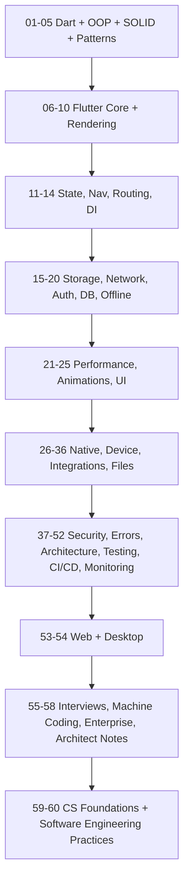

# 00 · Repository Guide

## Introduction

This is the **master index and operating manual** for the Flutter Architect Handbook — a 60-module curriculum that takes you from writing your first `main()` to designing an enterprise super-app and passing a Staff-level system design interview.

This guide file tells you **what exists, in what order to read it, and to what standard every file is written.** Read it once fully, then use it as your map.

## Why this repository exists

Most Flutter learning material stops at "here's a `ListView`, here's `setState`." That produces developers who can ship a screen but cannot:

- explain **why** a widget rebuild is cheap but a layout pass is not,
- reason about **isolates vs async** when the UI jank starts,
- defend an **architecture** to a skeptical staff engineer,
- or scale a codebase past ~50 screens without it collapsing.

This handbook closes that gap. It is deliberately **internals-first and WHY-first**, because senior engineering is about understanding tradeoffs, not memorizing APIs.

## Who this is for

| Level | You are here if… | Start at |
|-------|------------------|----------|
| **Absolute beginner** | New to Dart/Flutter | Module 01 |
| **Junior → Mid** | Can build screens, shaky on internals/architecture | Module 06, revisit 01–05 |
| **Senior candidate** | Building features, prepping for product-company interviews | Modules 10, 40, 48, 55 |
| **Architect** | Designing systems, mentoring, making tech-selection calls | Modules 45–58 |

---

## The complete module index

Legend for **Level**: 🟢 Foundations · 🔵 Flutter Core · 🟡 Applied/Integrations · 🟠 Architecture · 🔴 Senior/Architect.

| # | Module | Level | What it makes you able to do |
|---|--------|-------|------------------------------|
| 00 | **Repository Guide** | — | Navigate the handbook, follow the standard |
| 01 | Dart Fundamentals | 🟢 | Read/write idiomatic, null-safe Dart |
| 02 | Advanced Dart | 🟢 | Async, isolates, generics, extensions, streams |
| 03 | Object Oriented Programming | 🟢 | Model domains with encapsulation & polymorphism |
| 04 | SOLID Principles | 🟢 | Write code that survives change |
| 05 | Design Patterns | 🟢 | Apply Creational/Structural/Behavioral patterns |
| 06 | Flutter Fundamentals | 🔵 | Understand what Flutter *is* and how it runs |
| 07 | Widgets | 🔵 | Compose UI from the widget catalog |
| 08 | Widget Lifecycle | 🔵 | Reason about `State` and rebuilds |
| 09 | Rendering Pipeline | 🔵 | Explain build→layout→paint→composite→raster |
| 10 | Flutter Architecture | 🔵 | Map framework/engine/embedder layers |
| 11 | State Management | 🔵 | Choose & implement setState→Riverpod→BLoC |
| 12 | Navigation | 🔵 | Imperative & declarative navigation |
| 13 | Routing | 🔵 | Deep links, guards, nested routers |
| 14 | Dependency Injection | 🟠 | Wire dependencies testably |
| 15 | Local Storage | 🟡 | Preferences, secure storage, files |
| 16 | Networking | 🟡 | REST/GraphQL/gRPC/WebSockets |
| 17 | Authentication | 🟡 | Sessions, tokens, OAuth, biometrics |
| 18 | Firebase | 🟡 | Auth, Firestore, Storage, Functions, FCM |
| 19 | Offline First | 🟠 | Sync, conflict resolution, cache strategy |
| 20 | Database | 🟡 | SQLite/Drift/Isar/Hive modeling |
| 21 | Performance | 🔴 | Kill jank, optimize memory & frames |
| 22 | Animations | 🔵 | Implicit/explicit/physics-based motion |
| 23 | Custom Painting | 🔵 | `CustomPainter`, canvas, shaders |
| 24 | Responsive UI | 🔵 | Layouts across sizes |
| 25 | Adaptive UI | 🔵 | Platform-correct UI (Material/Cupertino) |
| 26 | Platform Channels | 🟡 | Bridge to native code |
| 27 | Native Android | 🟡 | Kotlin interop, plugins |
| 28 | Native iOS | 🟡 | Swift interop, plugins |
| 29 | Device Features | 🟡 | Camera, location, sensors, BLE, NFC |
| 30 | Google Maps | 🟡 | Maps, markers, geolocation |
| 31 | Payments | 🟡 | Razorpay/Stripe/UPI integration |
| 32 | Notifications | 🟡 | Local & push, deep-linked |
| 33 | Background Services | 🟡 | WorkManager, isolates, background fetch |
| 34 | File Handling | 🟡 | Upload/download, ZIP, CSV, encryption |
| 35 | PDF | 🟡 | Generate & render PDFs |
| 36 | Excel | 🟡 | Read/write spreadsheets |
| 37 | Security | 🔴 | Storage, transport, obfuscation, App Check |
| 38 | Error Handling | 🟠 | Failure modeling, `Result`, global handlers |
| 39 | Logging | 🟠 | Structured logs, observability hooks |
| 40 | Clean Architecture | 🟠 | Layers, boundaries, dependency rule |
| 41 | MVC | 🟠 | The classic separation |
| 42 | MVP | 🟠 | Presenter-driven UI |
| 43 | MVVM | 🟠 | ViewModel + reactive binding |
| 44 | Feature First Architecture | 🟠 | Organize by feature, not by layer |
| 45 | Modular Architecture | 🔴 | Multi-package, enforced boundaries |
| 46 | Domain Driven Design | 🔴 | Entities, value objects, aggregates |
| 47 | Scalable Applications | 🔴 | Patterns for 100+ screen apps |
| 48 | System Design | 🔴 | HLD/LLD for mobile systems |
| 49 | Testing | 🟠 | Unit/widget/integration/golden, TDD |
| 50 | CI CD | 🔴 | Pipelines, signing, store automation |
| 51 | Deployment | 🟡 | Play Store/App Store/web/desktop |
| 52 | Monitoring | 🔴 | Crashlytics, analytics, performance traces |
| 53 | Flutter Web | 🟡 | Web renderers, SEO, deployment |
| 54 | Flutter Desktop | 🟡 | Windows/macOS/Linux targets |
| 55 | Flutter Interview Preparation | 🔴 | Topic- & company-wise question banks |
| 56 | Machine Coding Rounds | 🔴 | Timed build challenges |
| 57 | Enterprise Projects | 🔴 | Full production-grade builds |
| 58 | Senior Architect Notes | 🔴 | Tech selection, mentoring, decision records |
| 59 | Computer Science Foundations | 🔴 | OS, memory, networking, DNS, HTTP/TLS, DB, caching, crypto — the substrate under Flutter |
| 60 | Software Engineering Practices | 🔴 | Git, Agile, code review, RFCs, delivery & release, observability as a discipline |

> **Modules 59–60** are the *platform-agnostic* CS and software-engineering layer a senior/staff engineer is expected to know beyond Flutter APIs. They teach each concept vendor-neutrally and cross-link to the Flutter-specific modules rather than duplicating them.

> Each module folder contains a `README.md` (module overview + file index) plus one `.md` per topic, every file following [`FILE_TEMPLATE.md`](FILE_TEMPLATE.md).

---

## Recommended reading order

Read numerically on the **first pass** — the modules are dependency-ordered. For targeted prep, jump using the [`LEARNING_PATH.md`](LEARNING_PATH.md) phase map.

> **Modules 59–60 are cross-cutting** — read them whenever you want, but they land hardest after Module 21, once you have enough Flutter context to see the substrate underneath it.

---

## How every topic file is structured

To guarantee that **reading a single file gives complete understanding**, every topic `.md` follows the fixed section order defined in [`FILE_TEMPLATE.md`](FILE_TEMPLATE.md):

`Title → Introduction → Why this concept exists → Real-world analogy → Problem Statement → Internal Working → Memory Representation → Compiler Behavior → Runtime Behavior → Flutter Engine Behavior → Dart VM Behavior → Examples → Diagrams → Common Mistakes → Best Practices → Performance → Advantages → Disadvantages → Interview Questions → Senior Engineer Tips → Architect Perspective → Summary → Revision Notes → Practice Questions → Coding Questions → Mini Project`

Sections marked *(if applicable)* — Flutter Engine / Dart VM — are included only when relevant, and the file says so explicitly rather than padding.

---

## Production & writing standards

All content adheres to [`STANDARDS.md`](STANDARDS.md), which enforces:

- **WHY before HOW**, internals wherever they exist.
- **Mermaid diagrams** for anything with structure or flow.
- **Tables** for comparisons, tradeoffs, and API surfaces.
- **Runnable, null-safe, lint-clean** code samples following Effective Dart.
- **Interview questions + coding exercises + a mini project** in every topic.
- **References** to official [dart.dev](https://dart.dev) / [docs.flutter.dev](https://docs.flutter.dev).

---

## Capstone strategy

Every **major module** ships four capstones — Beginner, Intermediate, Advanced, Enterprise — and the flagship projects (Module 57) are built **five ways** (Provider, Riverpod, GetX, BLoC, Cubit) and compared on folder structure, performance, scalability, boilerplate, maintainability, and interview value. See [`LEARNING_PATH.md`](LEARNING_PATH.md#capstones).

---

## Summary

- This handbook is an internals-first, WHY-first path from beginner to architect across **60 modules** (plus this guide), including the platform-agnostic CS and software-engineering layer in modules 59–60.
- Read numerically first; revise by index; drill with the phase map.
- Every file is self-contained and follows one strict template and quality bar.

## Revision Notes

- 60 modules, 5 levels (🟢🔵🟡🟠🔴); modules 59–60 add the vendor-neutral CS + software-engineering foundations.
- One template for every topic file; one standards doc for quality.
- Capstones at four difficulties; flagship projects built five ways.
- First pass = numeric order; interviews = Revision Notes + Module 55/56.

## Next step

Folder **00 is complete**. On your confirmation I will author **`01 Dart Fundamentals`** in full (README + one file per topic: variables, data types, operators, functions, collections, null safety, records/patterns, generics, and the rest listed in the Dart coverage spec), each following the template.
