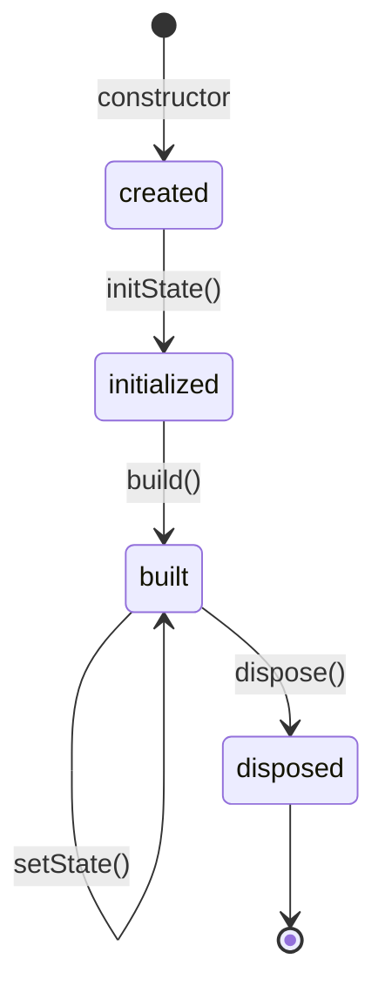

# Standards — Writing, Code, Diagrams, Production

## Introduction

This document is the **quality contract** for the handbook. Every file is written to these standards so the repository reads as one coherent, production-grade body of knowledge rather than a pile of blog posts.

---

## 1. Writing standards

- **WHY before HOW, internals whenever they exist.** State the problem a concept solves before its API.
- **No dumbing down.** Simplify *explanation*, never the *concept*. If something is genuinely hard, say so and explain it properly.
- **Second person, active voice.** "You dispatch an event" not "an event is dispatched."
- **Define jargon on first use**, then use it freely.
- **Cite sources** — link [dart.dev](https://dart.dev) and [docs.flutter.dev](https://docs.flutter.dev) for authoritative claims; avoid unverifiable performance claims.

## 2. Code standards

Follow **[Effective Dart](https://dart.dev/effective-dart)** and these rules:

| Rule | Requirement |
|------|-------------|
| Null safety | All code is sound-null-safe. |
| Linting | Passes `dart analyze` with `flutter_lints` / `lints`. |
| Const correctness | Use `const` constructors wherever possible. |
| Immutability | Prefer immutable models; document mutability when needed. |
| Naming | `lowerCamelCase` members, `UpperCamelCase` types, `_private` per library. |
| Formatting | `dart format` applied; no manual misalignment. |
| Error handling | No empty `catch`; model failures explicitly (see Module 38). |
| Comments | Explain *why*, not *what*; match surrounding density. |

**Every non-trivial snippet states its expected output** as a comment or trailing note.

## 3. Diagram standards

- Use **Mermaid** so diagrams render in VS Code and GitHub.
- Choose the right type: `flowchart` (structure/flow), `sequenceDiagram` (interactions over time), `classDiagram` (relationships), `stateDiagram-v2` (lifecycles).
- Keep node labels short; put detail in surrounding prose.

Example — a lifecycle as a state diagram:

## 4. Table standards

Use tables for: comparisons, tradeoff matrices, API surfaces, decision guides, and "when to use X vs Y." Tables beat paragraphs for anything with ≥ 3 parallel items.

## 5. Production standards (for all sample apps)

- **Architecture:** layered, testable, dependency-rule respected (see Modules 40–47).
- **State:** explicit, predictable, no hidden globals.
- **Errors:** typed failures, user-safe messages, logged internals (Modules 38–39).
- **Security:** no secrets in code, secure storage for tokens, TLS enforced (Module 37).
- **Testing:** unit + widget + at least one integration/golden test (Module 49).
- **Performance:** const widgets, keys where needed, no rebuilds of static subtrees (Module 21).
- **Accessibility:** semantics labels, sufficient contrast, scalable text.
- **CI/CD:** format + analyze + test gates before merge (Module 50).

## 6. Anti-patterns to always flag

| Anti-pattern | Why it's wrong | Correct approach |
|--------------|----------------|------------------|
| `setState` in `build` | Infinite rebuild loop | Trigger from callbacks/effects |
| Business logic in widgets | Untestable, coupled | Move to ViewModel/BLoC/UseCase |
| Blocking the UI isolate | Jank/ANR | Offload to isolate/async (Module 33) |
| Catch-all `catch (_) {}` | Swallows bugs | Model failures, log, rethrow selectively |
| God classes / God widgets | Unmaintainable | Compose, apply SRP (Module 04) |
| Secrets in source | Security breach | Env/secure storage, obfuscation |

## 7. Google-recommended practices

Where Flutter/Google publish official guidance (e.g., app architecture guide, state management recommendations, performance best practices), the handbook aligns with it and links the source, noting any place where common community practice diverges and why.

## Summary

- One writing voice, one code standard (Effective Dart), Mermaid diagrams, tables for comparisons.
- Sample apps meet production bars for architecture, security, testing, performance, a11y, CI/CD.
- Anti-patterns are called out explicitly with corrections.
- Claims are cited to official docs.
