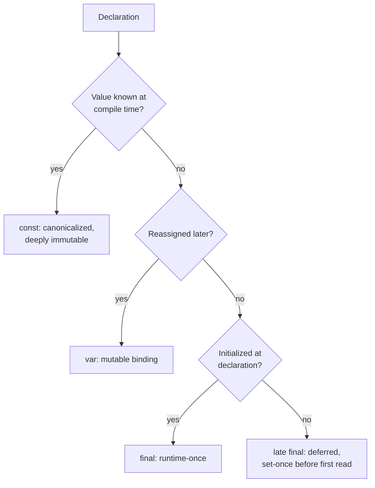
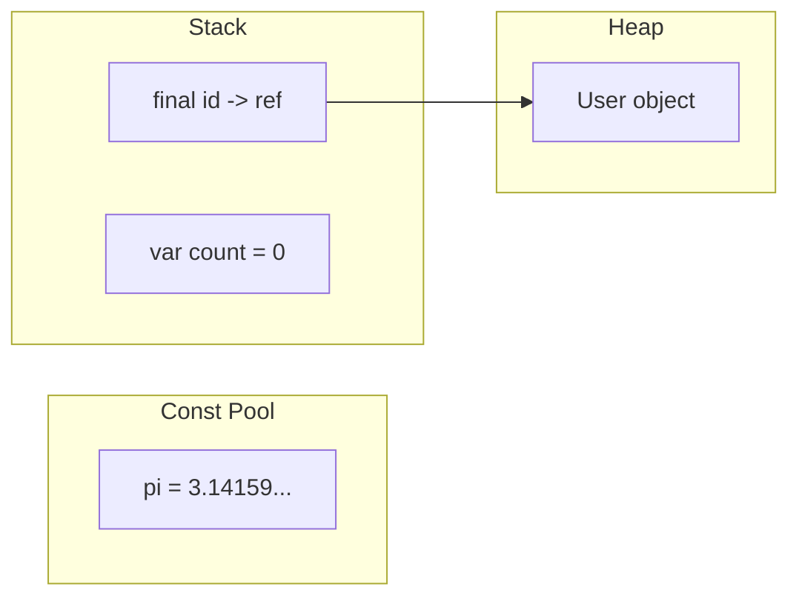
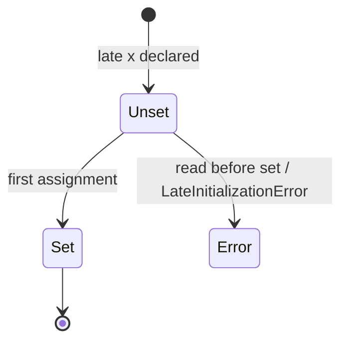

# Variables & Mutability (`var`, `final`, `const`, `late`)

> A variable is a named reference to a value; the keyword you declare it with decides *when* the value is fixed and *whether* it can change.

## Introduction

Dart gives you four ways to introduce a variable — `var`, `final`, `const`, and `late` — plus explicit type annotations. They differ along two axes: **when the value is determined** (compile time vs runtime) and **whether it can be reassigned**. Choosing correctly is the first mark of an idiomatic Dart developer.

## Why this concept exists

Every language needs to bind names to values. Dart adds compile-time constants (`const`) and lazy/deferred initialization (`late`) because Flutter leans heavily on **immutability** for performance: `const` widgets are canonicalized and skipped during rebuilds, and `final` fields make objects predictable. The keywords exist to let the compiler prove and optimize what your code guarantees.

## Real-world analogy

- `var` — a **whiteboard**: write a value, erase, write another (same kind of thing).
- `final` — a **signed contract**: filled in once at signing (runtime), never changed after.
- `const` — a value **carved into a printed textbook**: known before the book ships (compile time), identical copies everywhere are literally the same page.
- `late` — a **reserved parking spot**: the space exists now, the car arrives later; sit in it before the car arrives and you get an error.

## Problem Statement

You must store: (a) a counter that changes, (b) a user's ID set once after login, (c) the mathematical constant `pi`, and (d) a configuration object that is expensive to build and may never be used. Which keyword for each? By the end you'll answer instantly: `var`, `final`, `const`, `late final`.

## Internal Working



- **`var`** infers the type once from the initializer and locks that type. The binding is mutable.
- **`final`** allows exactly one assignment, at runtime. The *binding* is immutable; the *object* may still be mutable (`final list` can still `.add`).
- **`const`** requires a value computable at compile time. `const` objects are **canonicalized**: two structurally-equal const values are the *same instance* in memory (`identical()` is `true`).
- **`late`** defers initialization of a non-nullable variable, or makes a `final` field **lazily** initialized on first access.

## Memory Representation

- `const` values live in a **canonicalized constant pool** — one copy shared across the whole program.
- `final`/`var` locals live on the stack (the reference); the object they point to lives on the heap.
- A `late` variable reserves its slot immediately but the backing store is only populated on first assignment; a lazy `late final x = expr()` stores a sentinel until first read, then caches the computed value.



## Compiler Behavior

- `var x = 5;` → the compiler **infers** `int` and rejects `x = 'hi';`.
- `const` expressions are **evaluated by the compiler**; illegal (`const x = DateTime.now();`) is a compile-time error because the value isn't known until runtime.
- Const canonicalization is a compile-time optimization enabling Flutter to skip rebuilding `const` widget subtrees.
- Reassigning a `final` is a compile-time error, not a runtime one.

## Runtime Behavior

- `final id = fetchId();` computes `fetchId()` at runtime and assigns once.
- Reading a `late` variable before assignment throws **`LateInitializationError`** at runtime.
- `late final config = expensiveSetup();` runs `expensiveSetup()` on **first access only**, then caches.

## Flutter Engine Behavior

Not applicable directly — but `const` correctness is what lets the Flutter framework short-circuit widget rebuilds (see [Module 21 Performance](../21%20Performance/README.md)). A `const` widget instance is identical across builds, so the framework can skip it.

## Dart VM Behavior

- In **JIT** (debug) the VM evaluates and canonicalizes consts during compilation to kernel; in **AOT** (release) consts are baked into the snapshot's constant table.
- `late` lowering: the VM generates a guard that checks an initialization flag on each read (lazy) or on the first read (deferred), throwing if unset.

## Examples

```dart
void main() {
  // (a) changes -> var
  var count = 0;
  count = 1; // ok

  // (b) set once at runtime -> final
  final userId = _login(); // computed at runtime
  // userId = 'x'; // COMPILE ERROR: can't reassign a final

  // (c) compile-time constant -> const
  const pi = 3.1415926535;

  // (d) expensive, maybe-unused -> late final (lazy)
  late final config = _buildConfig(); // not run yet
  print(count + pi.floor()); // config still not built

  // final binding, mutable object:
  final items = <int>[1, 2];
  items.add(3); // OK — the LIST is mutable, the BINDING is fixed
  print(items); // [1, 2, 3]

  // const is deeply immutable + canonicalized:
  const a = [1, 2, 3];
  const b = [1, 2, 3];
  print(identical(a, b)); // true — same instance in memory
}

String _login() => 'user_42';
Map<String, Object> _buildConfig() => {'theme': 'dark'};
```

## Diagrams



## Common Mistakes

| Mistake | Why it's wrong | Fix |
|---------|----------------|-----|
| `const now = DateTime.now();` | Not compile-time | Use `final now = DateTime.now();` |
| Assuming `final list` is immutable | Only the binding is fixed | Use `const []` or `List.unmodifiable` for true immutability |
| Overusing `late` to silence null errors | Trades compile-time safety for runtime crashes | Prefer nullable `T?` when null is a valid state |
| `var` when the type should be explicit in a public API | Hurts readability | Annotate return/param types in public surfaces |

## Best Practices

- Prefer **`final` by default**; reach for `var` only when you genuinely reassign.
- Prefer **`const`** wherever the value is compile-time known (especially widgets).
- Use `late final x = ...` for expensive, lazily-computed, set-once values.
- Reserve `late` (non-final) for framework patterns like `initState`-assigned fields.

## Performance

- `const` eliminates repeated allocation and enables widget-rebuild skipping — measurable in large trees.
- `late` lazy init avoids paying for values you never use, but adds a per-read init check (negligible but non-zero).

## Advantages

- Explicit intent: readers know instantly whether a value can change.
- Compiler can prove immutability and optimize (canonicalization, const folding).

## Disadvantages

- `late` moves a class of errors from compile time to runtime.
- `const` has strict requirements (all inputs must themselves be const).

## Interview Questions

1. **🟢 Difference between `final` and `const`?** — `final` = single assignment, value computed at **runtime**. `const` = **compile-time** constant, deeply immutable, and **canonicalized** (equal consts share one instance).
2. **🟢 Is `final` immutability deep or shallow?** — Shallow: the binding can't be reassigned, but the referenced object can still mutate (`final list.add(x)` works).
3. **🟡 What does `late` do, and what are its two uses?** — (1) Deferred init of a non-nullable variable (set before first read); (2) lazy init of a `final` (runs initializer on first access, then caches).
4. **🟡 What happens if you read a `late` variable before assigning it?** — Throws `LateInitializationError` at runtime.
5. **🟡 Why does `identical(const [1,2], const [1,2])` return `true`?** — Const canonicalization: the compiler stores one shared instance for structurally-equal const values.
6. **🔴 How does `const` help Flutter performance?** — `const` widgets are identical across rebuilds, so the framework can skip re-creating and re-diffing that subtree.
7. **🔴 Can a `const` constructor produce non-const instances?** — Yes; a class with a `const` constructor can be instantiated with or without `const`. Only the `const` invocation is canonicalized.

## Senior Engineer Tips

- "Prefer `final`" isn't dogma — it's about **local reasoning**: fewer mutable bindings means fewer states to track when debugging.
- Watch for `const` propagation: making a leaf widget `const` often unlocks `const` on its parents, compounding rebuild savings.
- `late` on instance fields is a code smell if overused; it usually signals a constructor or nullable type would be cleaner.

## Architect Perspective

Immutability is an architectural lever, not a micro-optimization. A codebase that defaults to `final`/`const` and immutable models is dramatically easier to make reactive, testable, and concurrency-safe (immutable data can cross isolates without defensive copies). Enforce it via lints (`prefer_final_locals`, `prefer_const_constructors`).

### Unpacking That, With Examples

#### The headline: "lever, not micro-optimization"

A **micro-optimization** is a small local win — saves a few bytes, a few microseconds. A **lever** is a small decision that moves the whole system. Choosing `final`/`const` by default isn't about speed; it's about *what kinds of bugs become impossible* across your entire codebase.

The core idea: **if a value can never change after creation, you never have to ask "who changed it?"** That single guarantee is what makes the three benefits below fall out.

#### `final` vs `const` — the foundation

```dart
// final: value assigned once, but decided at RUNTIME
final now = DateTime.now();

// const: value known at COMPILE TIME, deeply immutable, canonicalized
const pi = 3.14159;
const padding = EdgeInsets.all(16);
```

`const` widgets are the more famous case — Flutter can skip rebuilding a `const` widget entirely because it knows the instance is identical every time. That's a direct performance win from immutability, not just style.

#### Immutable models

Instead of a mutable class you mutate in place:

```dart
// Mutable — dangerous
class User {
  String name;
  int age;
  User(this.name, this.age);
}

user.age = 30; // who else was holding a reference to this?
```

You do this:

```dart
// Immutable — safe
@immutable
class User {
  final String name;
  final int age;
  const User({required this.name, required this.age});

  User copyWith({String? name, int? age}) =>
      User(name: name ?? this.name, age: age ?? this.age);
}
```

Any "change" produces a **new object** via `copyWith`. Nothing else holding a reference to the old `User` is affected.

#### Why this matters for the three claims

**Reactive** — State management (Riverpod, Bloc, Provider) relies on detecting "did the state change?" With immutable state that's just `oldState != newState`, a cheap reference/equality check. With mutable objects you can't tell — the object may have been silently edited in place, so the old and new value are *literally the same object* and widgets never learn they should rebuild.

```dart
// MUTABLE — the bug
class Cart { List<String> items = []; }

cart.items.add('Shoes');   // same list object as before
setState(() {});           // old.items == new.items → rebuild may be skipped

// IMMUTABLE — the fix
class Cart {
  final List<String> items;
  const Cart(this.items);
  Cart addItem(String item) => Cart([...items, item]); // brand new object
}

state = state.addItem('Shoes'); // old != new → rebuild guaranteed
```

In the mutable version the old and new value are *literally the same object*, so every `==`-based optimization in the framework concludes "nothing changed" — `AnimatedBuilder`, `Provider`'s `updateShouldNotify`, `Bloc`'s state comparison, `const` widget caching. In the immutable version every change produces a **new identity**, so "did it change?" becomes a cheap, reliable reference check instead of a guess.

**Testable** — An immutable object is a *value*. Pass it into a function, get a result, and nothing about the input changed underneath you. No hidden state, no setup/teardown of shared mutable fixtures, no test-ordering bugs.

```dart
final user = User(name: 'Aditya', age: 29);
sendToAnalytics(user);          // final fields → it CANNOT have modified user
expect(user.name, 'Aditya');    // guaranteed by the compiler, not by hope
```

**Concurrency-safe / isolates** — This is the sharper Flutter-specific point. Dart isolates don't share memory, so sending data between them normally means **copying** it. Immutable data can be shared without fear, because nothing can mutate it out from under the receiving isolate. This is why `compute()` and isolate-based background work pair so well with immutable models — no defensive copying, no race conditions, no locks.

```dart
final bigList = List.generate(1000000, (i) => i);
await Isolate.run(() => process(bigList)); // mutable → whole object graph copied, slow
```

Dart can share **immutable** data by pointer instead of copying it, because there is no risk of two isolates fighting over it — `const` objects, strings, and numbers cross isolate boundaries for free.

The phrase "defensive copy" refers to this habit:

```dart
// "Defensive copy" — the habit mutable data forces on you
class Order {
  List<Item> _items;
  List<Item> get items => List.from(_items); // copy, so callers can't wreck my internals
}

// Immutable needs none of it
class Order {
  final List<Item> items;   // hand it out freely
  const Order(this.items);
}
```

> **The one-line summary:** default to `final`/`const` not to save memory, but so that "did this change?" always has a trustworthy answer — which is what makes reactive rebuilds correct, tests isolated, and isolate messaging cheap.

> In practice this is exactly what packages like **freezed**
 automate — generating `copyWith`, `==`, `hashCode`, and immutable constructors so you get all of the above without hand-writing boilerplate.

### Enforcing It With Lints

#### What a linter actually is

A **linter** is a static analysis tool — it reads your code *without running it* and flags patterns that are technically valid Dart but likely to cause bugs, hurt performance, or violate conventions. Dart ships this built into the `analyzer` package, and Flutter projects get it for free.

You don't install anything extra. Every Flutter project has an `analysis_options.yaml` at the root (create it if missing). Whatever rules you list there are checked continuously — in your IDE (squiggly underlines) and when you run `flutter analyze`.

#### How it shows up day-to-day

Say you write this:

```dart
Widget build(BuildContext context) {
  var padding = EdgeInsets.all(16); // could be const
  return Padding(padding: padding, child: Text('Hi'));
}
```

With `prefer_const_constructors` and `prefer_final_locals` enabled, your editor underlines that line and hovering offers a **Quick Fix** to auto-convert it:

```dart
Widget build(BuildContext context) {
  const padding = EdgeInsets.all(16); // fixed
  return const Padding(padding: padding, child: Text('Hi'));
}
```

You didn't have to remember the rule — the tool caught it and offered the fix in one click.

#### The rules, explained plainly

| Rule | What it flags | Why it matters |
| --- | --- | --- |
| `prefer_final_locals` | A local declared with `var` that's never reassigned | Signals intent — "this won't change" — and blocks accidental reassignment later |
| `prefer_final_fields` | A class field never reassigned outside the constructor | Same idea, for class members |
| `prefer_const_constructors` | A widget constructor call that could be `const` but isn't | Lets Flutter skip rebuilding that subtree — real performance win |
| `prefer_const_constructors_in_immutables` | Same, but inside classes marked `@immutable` | Keeps immutable classes consistent |
| `prefer_const_literals_to_create_immutables` | A `List`/`Map`/`Set` literal that could be `const` | Same rebuild-skipping benefit for collections |
| `avoid_returning_this` | Methods returning `this` for chaining | Pushes you toward `copyWith`-style returns instead of in-place mutation |

#### Setting it up

```yaml
# analysis_options.yaml
include: package:flutter_lints/flutter.yaml

linter:
  rules:
    - prefer_final_locals
    - prefer_final_fields
    - prefer_const_constructors
    - prefer_const_constructors_in_immutables
    - prefer_const_literals_to_create_immutables
    - avoid_returning_this
```

The `include:` line pulls in Flutter's recommended baseline rule set (already a dependency in new Flutter projects); the `rules:` block adds/overrides on top of it.

#### Why bother instead of just "being careful"

Because "being careful" doesn't scale past one person or one week. A lint rule is:

- **Automatic** — you see it the moment you type the offending code, not in code review three days later.
- **Team-wide** — everyone's editor enforces the same rule, no debates in PR comments.
- **CI-enforceable** — run `flutter analyze` in your build pipeline and fail the build on violations, so nothing slips through.

So "enforce it via lints" really means: don't rely on developers *remembering* to write `final`/`const` — make the tool refuse to let them forget, so immutability becomes the path of least resistance instead of something you have to opt into.

## Summary

- `var` = mutable, inferred-once. `final` = runtime, set-once (shallow immutable). `const` = compile-time, deeply immutable, canonicalized. `late` = deferred/lazy non-nullable init.
- Default to `final`, upgrade to `const` when possible, use `late` deliberately.

## Revision Notes

- `final` = runtime-once; `const` = compile-time + canonicalized + deeply immutable.
- `final list.add()` works (binding fixed, object mutable).
- `late` read-before-write → `LateInitializationError`.
- `const` widgets → skipped rebuilds.
- Lint: `prefer_final_locals`, `prefer_const_constructors`.

## Practice Questions

1. Explain why `const config = {'t': DateTime.now()}` fails to compile.
2. Give a case where `late final` is strictly better than `final`.
3. When is `var` more readable than a type annotation, and when is it worse?

## Coding Questions

1. Write a class `Circle` with a `const` constructor and a computed `area` getter; prove two `const Circle(1)` are `identical`.
2. Implement a lazily-initialized `Logger` singleton field using `late final`.
3. Given `final ids = <int>[]`, show two lines: one that compiles (mutation) and one that doesn't (reassignment), with comments.

## Mini Project

**Config loader:** Build a pure-Dart `AppConfig` class with `const` defaults, a `late final` lazily-loaded `overrides` map (simulate an expensive load), and `final` resolved values. Print which fields came from defaults vs overrides. Acceptance: no field is `var`; `dart analyze` is clean; the expensive load runs only if overrides are accessed.

---

## Solutions

> Every snippet below was run against Dart 3.2.5 — `dart analyze` reports **No issues found**, and the printed output shown is the real output.

### Practice Questions — Answers

**1. Why does `const config = {'t': DateTime.now()}` fail to compile?**

Two independent reasons, either one is fatal:

- `const` means *the value is fully computed by the compiler, before your app ever runs*. `DateTime.now()` reads the system clock — the answer literally does not exist at compile time.
- `DateTime` has no `const` constructor at all. Even `const t = DateTime(2024, 1, 1)` fails, because a `const` expression can only call `const` constructors.

```dart
const config = {'t': DateTime.now()};      // ❌ not a compile-time constant
const config2 = {'t': DateTime(2024)};     // ❌ still fails — no const constructor
final config3 = {'t': DateTime.now()};     // ✅ runtime value, set once
```

Rule of thumb: `const` can only contain literals, other `const` values, and calls to `const` constructors. Anything that touches the clock, the network, the filesystem, or `Random` is runtime-only.

**2. When is `late final` strictly better than `final`?**

When the value must be set exactly once, but you *cannot* compute it at construction time. `final` demands the value in the initializer list or constructor body; `late final` defers it while keeping the write-once guarantee.

Three real cases:

```dart
// (a) The initializer is expensive and might never be needed — lazy
class Repo {
  late final Database _db = _openDatabase(); // opens on FIRST access, not on construction
}

// (b) The value depends on `this`, which isn't available in an initializer
class Node {
  final String id;
  late final String path = '/nodes/$id'; // can read `id` because it runs after construction
  Node(this.id);
}

// (c) The value arrives from a lifecycle callback, not the constructor
class _MyWidgetState extends State<MyWidget> {
  late final AnimationController _controller;
  @override
  void initState() {
    super.initState();
    _controller = AnimationController(vsync: this); // needs `this` as a TickerProvider
  }
}
```

Without `late`, case (c) forces you to make the field nullable (`AnimationController? _controller`) and litter every use with `!` or `?.`. `late final` keeps it non-nullable *and* write-once.

The cost: the "did you assign it?" check moves from compile time to runtime — reading it too early throws `LateInitializationError`.

**3. When is `var` more readable than a type annotation — and when is it worse?**

`var` is better when the right-hand side already states the type loudly:

```dart
var user = User(name: 'Aditya');   // ✅ type is obvious, annotation would be noise
var count = 0;                     // ✅ obviously int
var items = <String>[];            // ✅ type is in the literal
```

`var` is worse when the right-hand side is opaque — the reader has to go hunt down a signature:

```dart
var result = repo.fetch();         // ❌ Future<User>? List<User>? Response? no idea
var value = json['role'];          // ❌ silently `dynamic` — all type safety gone
Future<List<User>> result2 = repo.fetch(); // ✅ self-documenting at the call site
```

The `json['...']` case is the dangerous one: `var` there gives you `dynamic`, which turns every downstream typo into a runtime crash instead of a compile error. And in this file's spirit — prefer `final` over `var` whenever the binding is never reassigned, which is most of the time.

### Coding Questions — Answers

**1. `const` constructor + computed getter, proving canonicalization**

```dart
class Circle {
  final double radius;
  const Circle(this.radius);          // const constructor: all fields must be final
  double get area => 3.141592653589793 * radius * radius; // computed, not stored
}

void main() {
  const a = Circle(1);
  const b = Circle(1);
  print(identical(a, b));                       // true  — canonicalized to ONE instance
  print(identical(Circle(1), Circle(1)));       // false — same class, non-const invocation
  print(a.area);                                // 3.141592653589793
}
```

The second line is the important one: a `const` constructor lets you build instances *either* way. Only the `const` **invocation** gets canonicalized. That is why `prefer_const_constructors` matters — the class being const-capable does nothing on its own.

**2. Lazily-initialized `Logger` using `late final`**

```dart
class Logger {
  Logger._(this.tag) {
    print('  [Logger created — expensive setup ran]');
  }

  final String tag;

  // instance-level lazy field: built on first read of `child`, then reused
  late final Logger _child = Logger._('$tag.child');
  Logger get child => _child;

  static final Logger instance = Logger._('app');

  void log(String m) => print('[$tag] $m');
}
```

Output:

```
  [Logger created — expensive setup ran]
[app] first use
  [Logger created — expensive setup ran]
[app.child] nested
```

⚠️ **Subtlety worth knowing:** Dart **static fields are already lazy** — `static final Logger instance = Logger._('app')` does not run until `Logger.instance` is first touched, so writing `static late final` there adds nothing. `late final` earns its keep on **instance** fields (like `_child` above), which are otherwise eager.

**3. Mutation compiles, reassignment does not**

```dart
final ids = <int>[];

ids.add(1);        // ✅ compiles — the LIST OBJECT is mutable
// ids = <int>[];  // ❌ error: 'ids' can't be used as a setter because it's final
```

`final` freezes the **binding** (which object the name points at), not the **object** (its contents). For a genuinely unmodifiable list you need `const []`, `List.unmodifiable(...)`, or an immutable collection type.

### Mini Project — Reference Solution

```dart
class AppConfig {
  // const defaults: compile-time, canonicalized, deeply immutable, zero runtime cost
  static const Map<String, String> defaults = {
    'apiUrl': 'https://api.example.com',
    'timeout': '30',
    'theme': 'light',
  };

  // late final: the expensive load runs on FIRST access and exactly once
  late final Map<String, String> _overrides = _loadOverrides();

  // final binding, mutable contents — fine, and a live example of the distinction
  final List<String> _report = [];

  Map<String, String> _loadOverrides() {
    print('  [expensive override load running...]');
    return const {'theme': 'dark', 'timeout': '60'}; // simulates a disk/remote read
  }

  String _resolve(String key) {
    final override = _overrides[key];              // <- this read triggers the lazy load
    _report.add('$key = ${override ?? defaults[key]!}'
        '  (${override != null ? 'override' : 'default'})');
    return override ?? defaults[key]!;
  }

  // resolved values: each computed once, on demand, then cached by `late final`
  late final String apiUrl = _resolve('apiUrl');
  late final String timeout = _resolve('timeout');
  late final String theme = _resolve('theme');

  void printReport() {
    print('--- resolved config ---');
    for (final line in _report) {
      print('  $line');
    }
  }
}

void main() {
  print('Creating AppConfig (nothing loaded yet)...');
  final config = AppConfig();
  print('Still nothing loaded.');

  print('apiUrl -> ${config.apiUrl}');   // triggers _loadOverrides() exactly here
  print('theme  -> ${config.theme}');    // reuses the already-loaded map
  print('timeout-> ${config.timeout}');
  config.printReport();
}
```

Actual output:

```
Creating AppConfig (nothing loaded yet)...
Still nothing loaded.
  [expensive override load running...]
apiUrl -> https://api.example.com
theme  -> dark
timeout-> 60
--- resolved config ---
  apiUrl = https://api.example.com  (default)
  theme = dark  (override)
  timeout = 60  (override)
```

**How each acceptance criterion is met:**

| Criterion | How |
| --- | --- |
| No field is `var` | Every field is `static const`, `final`, or `late final` |
| `dart analyze` is clean | Verified — *No issues found* |
| Expensive load runs only if accessed | `[expensive override load running...]` prints **after** "Still nothing loaded", and only once despite three lookups |

The load happens exactly once because `late final` caches: the first read of `_overrides` runs the initializer and stores the result; every later read returns the stored value. That is the whole pattern — **`const` for what you know now, `late final` for what you will know later but only once.**
