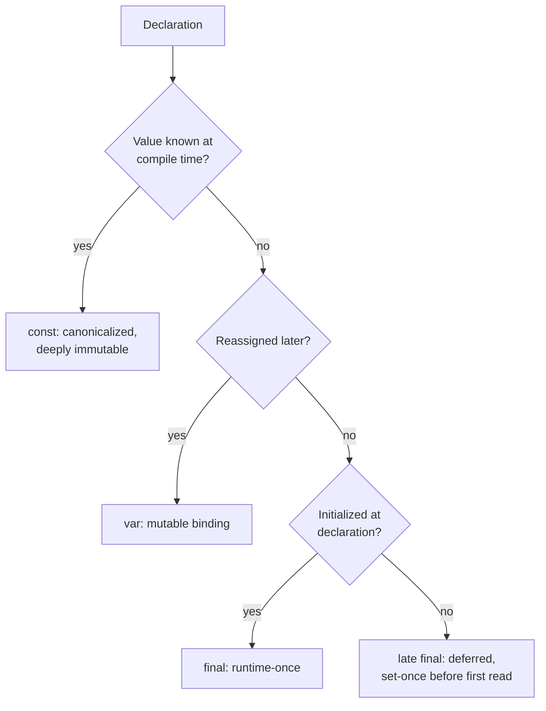
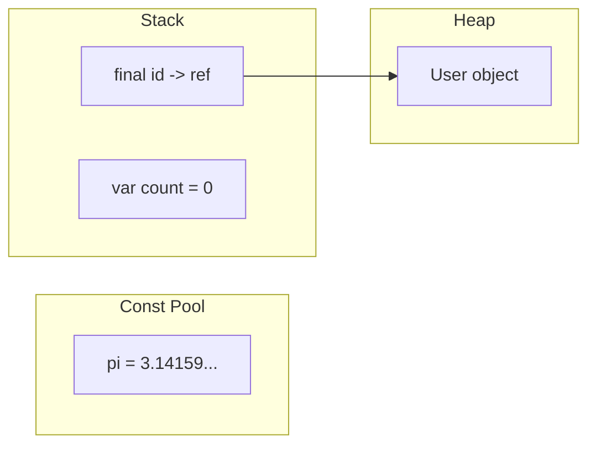
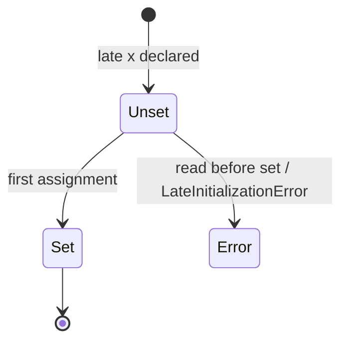

# Variables & Mutability (`var`, `final`, `const`, `late`)

> A variable is a named reference to a value; the keyword you declare it with decides *when* the value is fixed and *whether* it can change.

## Introduction

Dart gives you four ways to introduce a variable — `var`, `final`, `const`, and `late` — plus explicit type annotations. They differ along two axes: **when the value is determined** (compile time vs runtime) and **whether it can be reassigned**. Choosing correctly is the first mark of an idiomatic Dart developer.

## Why this concept exists

Every language needs to bind names to values. Dart adds compile-time constants (`const`) and lazy/deferred initialization (`late`) because Flutter leans heavily on **immutability** for performance: `const` widgets are canonicalized and skipped during rebuilds, and `final` fields make objects predictable. The keywords exist to let the compiler prove and optimize what your code guarantees.

## Real-world analogy

- `var` — a **whiteboard**: write a value, erase, write another (same kind of thing).
- `final` — a **signed contract**: filled in once at signing (runtime), never changed after.
- `const` — a value **carved into a printed textbook**: known before the book ships (compile time), identical copies everywhere are literally the same page.
- `late` — a **reserved parking spot**: the space exists now, the car arrives later; sit in it before the car arrives and you get an error.

## Problem Statement

You must store: (a) a counter that changes, (b) a user's ID set once after login, (c) the mathematical constant `pi`, and (d) a configuration object that is expensive to build and may never be used. Which keyword for each? By the end you'll answer instantly: `var`, `final`, `const`, `late final`.

## Internal Working



- **`var`** infers the type once from the initializer and locks that type. The binding is mutable.
- **`final`** allows exactly one assignment, at runtime. The *binding* is immutable; the *object* may still be mutable (`final list` can still `.add`).
- **`const`** requires a value computable at compile time. `const` objects are **canonicalized**: two structurally-equal const values are the *same instance* in memory (`identical()` is `true`).
- **`late`** defers initialization of a non-nullable variable, or makes a `final` field **lazily** initialized on first access.

## Memory Representation

- `const` values live in a **canonicalized constant pool** — one copy shared across the whole program.
- `final`/`var` locals live on the stack (the reference); the object they point to lives on the heap.
- A `late` variable reserves its slot immediately but the backing store is only populated on first assignment; a lazy `late final x = expr()` stores a sentinel until first read, then caches the computed value.



## Compiler Behavior

- `var x = 5;` → the compiler **infers** `int` and rejects `x = 'hi';`.
- `const` expressions are **evaluated by the compiler**; illegal (`const x = DateTime.now();`) is a compile-time error because the value isn't known until runtime.
- Const canonicalization is a compile-time optimization enabling Flutter to skip rebuilding `const` widget subtrees.
- Reassigning a `final` is a compile-time error, not a runtime one.

## Runtime Behavior

- `final id = fetchId();` computes `fetchId()` at runtime and assigns once.
- Reading a `late` variable before assignment throws **`LateInitializationError`** at runtime.
- `late final config = expensiveSetup();` runs `expensiveSetup()` on **first access only**, then caches.

## Flutter Engine Behavior

Not applicable directly — but `const` correctness is what lets the Flutter framework short-circuit widget rebuilds (see [Module 21 Performance](../21%20Performance/README.md)). A `const` widget instance is identical across builds, so the framework can skip it.

## Dart VM Behavior

- In **JIT** (debug) the VM evaluates and canonicalizes consts during compilation to kernel; in **AOT** (release) consts are baked into the snapshot's constant table.
- `late` lowering: the VM generates a guard that checks an initialization flag on each read (lazy) or on the first read (deferred), throwing if unset.

## Examples

```dart
void main() {
  // (a) changes -> var
  var count = 0;
  count = 1; // ok

  // (b) set once at runtime -> final
  final userId = _login(); // computed at runtime
  // userId = 'x'; // COMPILE ERROR: can't reassign a final

  // (c) compile-time constant -> const
  const pi = 3.1415926535;

  // (d) expensive, maybe-unused -> late final (lazy)
  late final config = _buildConfig(); // not run yet
  print(count + pi.floor()); // config still not built

  // final binding, mutable object:
  final items = <int>[1, 2];
  items.add(3); // OK — the LIST is mutable, the BINDING is fixed
  print(items); // [1, 2, 3]

  // const is deeply immutable + canonicalized:
  const a = [1, 2, 3];
  const b = [1, 2, 3];
  print(identical(a, b)); // true — same instance in memory
}

String _login() => 'user_42';
Map<String, Object> _buildConfig() => {'theme': 'dark'};
```

## Diagrams



## Common Mistakes

| Mistake | Why it's wrong | Fix |
|---------|----------------|-----|
| `const now = DateTime.now();` | Not compile-time | Use `final now = DateTime.now();` |
| Assuming `final list` is immutable | Only the binding is fixed | Use `const []` or `List.unmodifiable` for true immutability |
| Overusing `late` to silence null errors | Trades compile-time safety for runtime crashes | Prefer nullable `T?` when null is a valid state |
| `var` when the type should be explicit in a public API | Hurts readability | Annotate return/param types in public surfaces |

## Best Practices

- Prefer **`final` by default**; reach for `var` only when you genuinely reassign.
- Prefer **`const`** wherever the value is compile-time known (especially widgets).
- Use `late final x = ...` for expensive, lazily-computed, set-once values.
- Reserve `late` (non-final) for framework patterns like `initState`-assigned fields.

## Performance

- `const` eliminates repeated allocation and enables widget-rebuild skipping — measurable in large trees.
- `late` lazy init avoids paying for values you never use, but adds a per-read init check (negligible but non-zero).

## Advantages

- Explicit intent: readers know instantly whether a value can change.
- Compiler can prove immutability and optimize (canonicalization, const folding).

## Disadvantages

- `late` moves a class of errors from compile time to runtime.
- `const` has strict requirements (all inputs must themselves be const).

## Interview Questions

1. **🟢 Difference between `final` and `const`?** — `final` = single assignment, value computed at **runtime**. `const` = **compile-time** constant, deeply immutable, and **canonicalized** (equal consts share one instance).
2. **🟢 Is `final` immutability deep or shallow?** — Shallow: the binding can't be reassigned, but the referenced object can still mutate (`final list.add(x)` works).
3. **🟡 What does `late` do, and what are its two uses?** — (1) Deferred init of a non-nullable variable (set before first read); (2) lazy init of a `final` (runs initializer on first access, then caches).
4. **🟡 What happens if you read a `late` variable before assigning it?** — Throws `LateInitializationError` at runtime.
5. **🟡 Why does `identical(const [1,2], const [1,2])` return `true`?** — Const canonicalization: the compiler stores one shared instance for structurally-equal const values.
6. **🔴 How does `const` help Flutter performance?** — `const` widgets are identical across rebuilds, so the framework can skip re-creating and re-diffing that subtree.
7. **🔴 Can a `const` constructor produce non-const instances?** — Yes; a class with a `const` constructor can be instantiated with or without `const`. Only the `const` invocation is canonicalized.

## Senior Engineer Tips

- "Prefer `final`" isn't dogma — it's about **local reasoning**: fewer mutable bindings means fewer states to track when debugging.
- Watch for `const` propagation: making a leaf widget `const` often unlocks `const` on its parents, compounding rebuild savings.
- `late` on instance fields is a code smell if overused; it usually signals a constructor or nullable type would be cleaner.

## Architect Perspective

Immutability is an architectural lever, not a micro-optimization. A codebase that defaults to `final`/`const` and immutable models is dramatically easier to make reactive, testable, and concurrency-safe (immutable data can cross isolates without defensive copies). Enforce it via lints (`prefer_final_locals`, `prefer_const_constructors`).

## Summary

- `var` = mutable, inferred-once. `final` = runtime, set-once (shallow immutable). `const` = compile-time, deeply immutable, canonicalized. `late` = deferred/lazy non-nullable init.
- Default to `final`, upgrade to `const` when possible, use `late` deliberately.

## Revision Notes

- `final` = runtime-once; `const` = compile-time + canonicalized + deeply immutable.
- `final list.add()` works (binding fixed, object mutable).
- `late` read-before-write → `LateInitializationError`.
- `const` widgets → skipped rebuilds.
- Lint: `prefer_final_locals`, `prefer_const_constructors`.

## Practice Questions

1. Explain why `const config = {'t': DateTime.now()}` fails to compile.
2. Give a case where `late final` is strictly better than `final`.
3. When is `var` more readable than a type annotation, and when is it worse?

## Coding Questions

1. Write a class `Circle` with a `const` constructor and a computed `area` getter; prove two `const Circle(1)` are `identical`.
2. Implement a lazily-initialized `Logger` singleton field using `late final`.
3. Given `final ids = <int>[]`, show two lines: one that compiles (mutation) and one that doesn't (reassignment), with comments.

## Mini Project

**Config loader:** Build a pure-Dart `AppConfig` class with `const` defaults, a `late final` lazily-loaded `overrides` map (simulate an expensive load), and `final` resolved values. Print which fields came from defaults vs overrides. Acceptance: no field is `var`; `dart analyze` is clean; the expensive load runs only if overrides are accessed.
