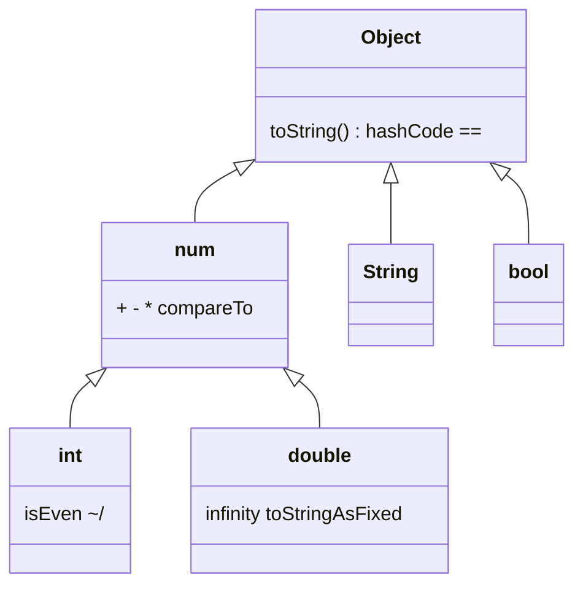
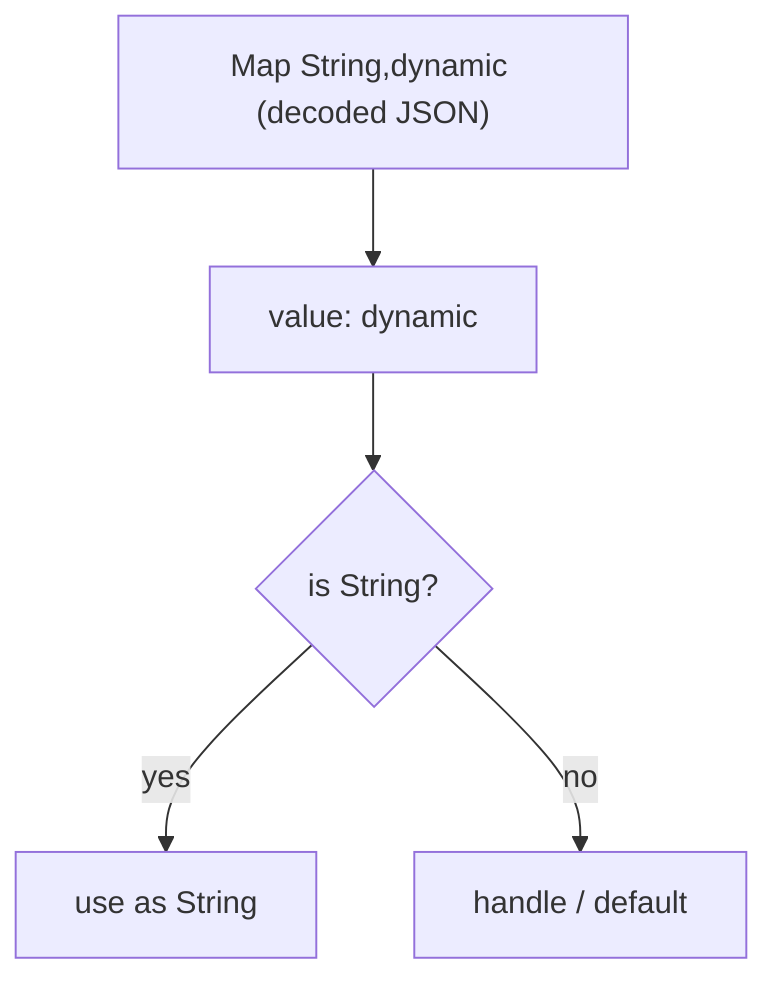

# Data Types (`num`, `int`, `double`, `String`, `bool`, `dynamic`, `Object?`)

> Every value in Dart is an object with a type; the type system decides what you can do with a value and when mistakes are caught.

## Introduction

Dart is **statically typed with type inference**, and **everything is an object** — including numbers, booleans, functions, and `null`. This file covers the core built-in types, the `num`/`int`/`double` hierarchy, and the crucial distinction between `dynamic` (opt-out of checking) and `Object?` (safe top type).

## Why this concept exists

A type system exists to catch errors **before** the program runs and to enable the compiler to generate efficient code. Dart's "everything is an object" model gives a uniform mental model (no primitive/object split like Java's `int` vs `Integer`), while `dynamic` and `Object?` give controlled escape hatches for genuinely dynamic data (like decoded JSON).

## Real-world analogy

Types are **labeled shipping containers**. A container labeled `int` can only hold whole numbers; the port (compiler) rejects a mislabeled load before the ship sails (runtime). `dynamic` is an **unlabeled container** — anything fits, but nobody checks until you open it at sea (runtime crash). `Object?` is a container labeled "some object, contents unknown" — you must inspect before using the contents.

## Problem Statement

You decode JSON into a `Map<String, dynamic>`. You need the `"age"` field as an `int` and the `"name"` as a `String`, safely, without runtime crashes. By the end you'll know why the map is `dynamic`-valued and how to narrow safely with `is`/casts.

## Internal Working



- `num` is the supertype of `int` and `double`. `num x = 5; x = 5.5;` is legal.
- `int` is an arbitrary-precision-ish integer (64-bit on native; on web it's a JS `double`-backed integer — a portability gotcha).
- `String` is an immutable sequence of UTF-16 code units.
- `bool` has exactly two instances: `true`, `false`.
- `dynamic` disables static checking. `Object?` is the top type: everything is an `Object?`.

## Memory Representation

- Small `int`s and `double`s may be represented efficiently (boxed/unboxed) by the VM; conceptually they're heap objects but the VM optimizes common cases.
- `String` is immutable — concatenation creates a new object; heavy building should use `StringBuffer`.
- `null` is a single canonical object (`Null` type).

## Compiler Behavior

- Type inference: `var n = 5` → `int`; `var d = 5.0` → `double`; `var s = 'x'` → `String`.
- Calling a member the static type doesn't have is a **compile error** for `Object?` but **allowed** for `dynamic` (deferred to runtime).
- Numeric literals: `5` is `int`, `5.0` is `double`; `double d = 5;` is allowed (int literal coerced to double in a double context).

## Runtime Behavior

- `dynamic value = 5; value.length;` compiles, then throws `NoSuchMethodError` at runtime.
- Type checks (`is`) and casts (`as`) are evaluated at runtime; a failing `as` throws `TypeError`.
- Integer division `~/` returns `int`; `/` always returns `double`.

## Flutter Engine Behavior

Not applicable — data types are a pure language concern.

## Dart VM Behavior

- The VM specializes numeric operations; in AOT, monomorphic numeric code is highly optimized.
- **Web caveat:** on `dart2js`/`dartdevc`, `int` and `double` share JavaScript's IEEE-754 double, so very large integers lose precision. Native (mobile/desktop) uses true 64-bit ints.

## Examples

```dart
void main() {
  // num holds both:
  num x = 5;      // int
  x = 5.5;        // now double — legal because both are num
  print(x is double); // true

  // int vs double division:
  print(7 / 2);   // 3.5   (double)
  print(7 ~/ 2);  // 3     (int)
  print(7 % 2);   // 1

  // String is immutable UTF-16:
  const name = 'Dart';
  print(name.length);            // 4
  print(name.toUpperCase());     // DART  (new string)

  // dynamic vs Object? safety:
  dynamic d = 'hello';
  print(d.length);   // 5 — no compile check; would crash if d were an int

  Object? o = 'hello';
  // print(o.length); // COMPILE ERROR: 'length' not defined for Object
  if (o is String) {
    print(o.length); // 5 — promoted to String inside the check
  }

  // Safe JSON narrowing:
  final json = <String, dynamic>{'name': 'Ada', 'age': 36};
  final ageName = json['name'];         // dynamic
  final age = json['age'] as int;       // explicit cast
  final safeName = json['name'] as String? ?? 'unknown';
  print('$safeName is $age'); // Ada is 36
}
```

## Diagrams



## Common Mistakes

| Mistake | Why it's wrong | Fix |
|---------|----------------|-----|
| Using `dynamic` for JSON everywhere | Loses all safety | Cast at the boundary; model with classes |
| `int` assumptions on web | Precision loss with big ints | Use `BigInt` or strings for large IDs on web |
| Building strings with `+=` in loops | O(n²) allocations | Use `StringBuffer` |
| `as` without a null check | Throws on mismatch | Use `as T?` + `??`, or `is` promotion |

## Best Practices

- Keep `dynamic` at the **edges** (deserialization) and convert to typed models immediately.
- Prefer `Object?` over `dynamic` when you want "anything, but safely."
- Use `num` only when a value is genuinely int-or-double; otherwise be specific.
- Format money/precision with `toStringAsFixed`, never rely on `double` for exact currency math (use integers of the smallest unit, e.g. paise/cents).

## Performance

- `StringBuffer` turns repeated concatenation from O(n²) to O(n).
- Monomorphic numeric code (always `int`, or always `double`) is faster than mixed `num`.

## Advantages

- Uniform object model — no primitive/wrapper split.
- Strong inference keeps code concise while type-safe.
- Escape hatches (`dynamic`, `Object?`) for real-world dynamic data.

## Disadvantages

- `dynamic` can silently defer bugs to runtime.
- Web numeric semantics differ from native — a portability footgun.

## Interview Questions

1. **🟢 What's the supertype of `int` and `double`?** — `num`. Both extend it.
2. **🟢 Difference between `/` and `~/`?** — `/` returns a `double` always; `~/` is integer (truncating) division returning `int`.
3. **🟡 `dynamic` vs `Object?` — which is safer and why?** — `Object?`. Both hold anything, but `dynamic` allows *any* member call (unchecked, may crash), while `Object?` only allows `Object` members until you check/cast — so mistakes are caught at compile time.
4. **🟡 Why is `String` concatenation in a loop slow?** — Strings are immutable; each `+=` allocates a new string. Use `StringBuffer`.
5. **🟡 Is `double d = 5;` legal?** — Yes; an `int` literal is coerced to `double` in a double context. But `int i = 5.0;` is not.
6. **🔴 What breaks about `int` on Flutter Web?** — Web ints are JS doubles (IEEE-754); integers beyond 2^53 lose precision. Use `BigInt`/strings for large values.
7. **🔴 Why avoid `double` for currency?** — Binary floating point can't represent decimals like 0.1 exactly, causing rounding errors. Store the smallest integer unit instead.

## Senior Engineer Tips

- Treat the deserialization boundary as a **type firewall**: `dynamic` in, typed models out, with validation.
- Prefer exhaustive modeling (sealed classes/enums) over `dynamic` flags — it moves errors to compile time.
- Remember web numeric semantics when building cross-platform apps with large numeric IDs.

### Unpacking the Tips, With Examples

> All Dart below was run on Dart 3.2.5 — `dart analyze` reports **No issues found**, and every output block is the real output.

#### Tip 1 — The deserialization boundary as a "type firewall"

**The problem.** `jsonDecode` returns `dynamic`. `dynamic` means *the compiler stops checking*. If that leaks into your app, a backend typo becomes a crash three screens away, far from the cause.

```dart
// ❌ No firewall — dynamic leaks inward
final json = jsonDecode(response.body);
final name = json['user']['name'];        // dynamic
Text(name);                               // compiles fine
// backend sends name: null → crash in build(), 200 lines from the real bug
```

**The firewall idea:** one narrow chokepoint where `dynamic` goes *in*, a validated typed object comes *out*, and nothing untyped passes through. After that line, the rest of your app is fully type-checked.

```dart
class ParseException implements Exception {
  final String message;
  ParseException(this.message);
  @override
  String toString() => 'ParseException: $message';
}

class User {
  final int id;
  final String name;
  final String? email;
  final DateTime createdAt;

  const User({required this.id, required this.name, this.email, required this.createdAt});

  // THE FIREWALL — the only place dynamic is allowed
  factory User.fromJson(Map<String, dynamic> json) {
    final rawId = json['id'];
    final id = rawId is int ? rawId : int.tryParse('$rawId');
    if (id == null) throw ParseException('id: expected int, got $rawId');

    final name = json['name'];
    if (name is! String || name.isEmpty) {
      throw ParseException('name: expected non-empty String, got $name');
    }

    final email = json['email'];
    if (email != null && email is! String) {
      throw ParseException('email: expected String?, got $email');
    }

    final created = DateTime.tryParse('${json['created_at']}');
    if (created == null) {
      throw ParseException('created_at: bad timestamp ${json['created_at']}');
    }

    return User(id: id, name: name, email: email as String?, createdAt: created);
  }
}
```

Real output (note the `id` arrived as the **string** `'42'`):

```
42 Aditya null 2026-08-19T10:00:00.000Z
ParseException: name: expected non-empty String, got
```

Three things this bought:

- **`dynamic` in, typed out** — after `User.fromJson`, `user.name` is a `String`, guaranteed. No `!`, no `as`, no defensive null checks downstream.
- **Validation, not just casting** — `name is! String || name.isEmpty` rejects empty strings too. A blind `json['name'] as String` would pass `''` straight through. Casting checks *shape*; validation checks *meaning*.
- **Failure happens at the boundary, with a useful message** — `id: expected int, got null` names the field. Compare that to `Null is not a subtype of String` thrown from somewhere in your widget tree.

The tolerant `id` handling (`'42'` → `42`) shows the other half of the job: the firewall is also where you absorb backend inconsistency, so exactly one file knows the API is sloppy.

#### Tip 2 — Exhaustive modeling over `dynamic` flags

**The problem.** Modeling state as loose flags means the compiler cannot tell you what you forgot.

```dart
// ❌ Flag soup — 16 representable combinations, only 4 are legal
class PaymentState {
  bool isLoading = false;
  bool isSuccess = false;
  String? error;
  double? amount;
}

if (state.isLoading) showSpinner();
else if (state.error != null) showError(state.error!);
// forgot the success case → silently renders nothing. Compiles fine.
```

Nothing stops `isLoading = true` *and* `isSuccess = true` at once. The type permits states that make no sense.

**Sealed classes** (Dart 3) close both holes:

```dart
sealed class PaymentState {
  const PaymentState();
}
class Idle       extends PaymentState { const Idle(); }
class Processing extends PaymentState { final double amount;    const Processing(this.amount); }
class Success    extends PaymentState { final String receiptId; const Success(this.receiptId); }
class Failure    extends PaymentState { final String reason;    const Failure(this.reason); }

String describe(PaymentState state) => switch (state) {
      Idle()                    => 'Ready',
      Processing(:final amount) => 'Charging \$$amount...',
      Success(:final receiptId) => 'Paid, receipt $receiptId',
      Failure(:final reason)    => 'Failed: $reason',
    };
```

Real output:

```
Ready
Charging $99.5...
Paid, receipt R-1
Failed: card declined
```

What `sealed` actually does: it tells the compiler *this list of subclasses is complete*. That unlocks **exhaustiveness checking** — delete any one of those four `switch` branches and you get a compile error, not a runtime surprise:

> The type 'PaymentState' is not exhaustively matched by the switch cases since it doesn't match 'Failure()'.

**The payoff is at maintenance time.** Add a `Refunded` state six months later, and *every* `switch` in the codebase that handles `PaymentState` stops compiling until you handle it. The compiler hands you the complete to-do list. With flags, you would ship, and find the missing branch in production.

Two bonuses visible in the code: each state **carries only its own data** (`receiptId` exists only on `Success` — no nullable field to `!`), and destructuring (`Success(:final receiptId)`) pulls it out already typed.

Enums get the same treatment for simple closed sets:

```dart
enum Role { admin, editor, viewer }

bool canPublish(Role role) => switch (role) {   // exhaustive — add a Role, this breaks
      Role.admin  => true,
      Role.editor => true,
      Role.viewer => false,
    };
```

Compare `if (role == 'admin')` with a `String`: infinite possible values, typos compile, and adding a role breaks nothing loudly.

#### Tip 3 — Web numeric semantics with large IDs

**The problem, in one sentence:** on the web, Dart's `int` is not a 64-bit integer.

| | Native (Android/iOS/desktop) | Web (dart2js / DDC) |
| --- | --- | --- |
| `int` backing | true 64-bit integer | JavaScript number = IEEE-754 **double** |
| Exact integer range | ±9,223,372,036,854,775,807 | ±9,007,199,254,740,991 (2⁵³−1) |
| `1.0 is int` | `false` | **`true`** — one numeric type underneath |

Above 2⁵³, integers stop being exactly representable — they round to the nearest even value, **silently**. Run on the VM:

```dart
const bigId = 9007199254740993;
print(bigId);                                      // 9007199254740993   ✅ native
print(9007199254740992 + 1 != 9007199254740992);   // true               ✅ native
```

The exact same code compiled to web prints `9007199254740992` and `false`. No exception, no warning — just a wrong ID.

**Who this bites:** Twitter/Discord snowflake IDs, Postgres `bigint` primary keys, Stripe-style numeric identifiers, nanosecond timestamps. All routinely exceed 2⁵³.

```dart
// Backend sends: {"id": 1234567890123456789}
final user = User.fromJson(jsonDecode(body));
// Native: id == 1234567890123456789
// Web:    id == 1234567890123456800   ← wrong user, and every lookup fails
```

**The nasty part:** `jsonDecode` has *already* destroyed the precision before your code ever sees the value. You cannot recover it in Dart — the damage happens during parsing. So no client-side fix works.

**The actual fixes:**

```dart
// ✅ Best: have the API send large IDs as JSON strings — "id": "1234567890123456789"
class User {
  final String id;   // opaque identifier, never arithmetic — String is the honest type
}

// ✅ If you must compute on them, and they arrive as strings:
final big = BigInt.parse('1234567890123456789');  // arbitrary precision, all platforms

// ❌ Doesn't help — the number was already mangled by jsonDecode
final id = BigInt.from(json['id']);
```

Rule of thumb: **an ID is a name, not a number.** You never add or multiply it, so `String` costs you nothing and is exact everywhere. This is a design decision that has to happen at the API contract level — which ties back to Tip 1, since your `fromJson` firewall is where you enforce it.

## Architect Perspective

Type discipline at boundaries (API, DB, platform channels) is a system-wide reliability decision. Centralize parsing/validation so the rest of the codebase never touches `dynamic`. This is the foundation for the `Result`/failure modeling in [Module 38](../38%20Error%20Handling/README.md) and DTO↔entity mapping in Clean Architecture ([Module 40](../40%20Clean%20Architecture/README.md)).

## Summary

- Everything is an object; `num` → `int`/`double`; `String` is immutable UTF-16.
- `dynamic` opts out of checking (risky); `Object?` is the safe top type.
- Narrow `dynamic` at the edges; beware web int precision and `double` currency math.

## Revision Notes

- `num` supertype of `int`/`double`. `/`→double, `~/`→int.
- `dynamic` = no checks (runtime crash); `Object?` = safe, must check/cast.
- `String` immutable → `StringBuffer` for building.
- Web `int` = JS double (precision loss); currency → integer smallest unit.

## Practice Questions

1. Predict the type: `var a = 5; var b = 5.0; var c = 5 / 5; var d = 5 ~/ 5;`.
2. Why does `Object? o = 5; o.isEven;` fail to compile but `dynamic d = 5; d.isEven;` compile?
3. Explain the web precision issue with a concrete large-int example.

## Coding Questions

1. Write `T? tryCast<T>(Object? value)` returning `value as T?` safely (null on mismatch).
2. Parse `{'price': '19.99', 'qty': '3'}` into a total **in cents** as an `int`, avoiding `double` currency errors.
3. Benchmark `+=` vs `StringBuffer` building a 100k-char string; print both durations.

## Mini Project

**Typed JSON firewall:** Given a raw `Map<String, dynamic>` for a `User` (`id`, `name`, `email`, optional `age`), write a `User.fromJson` that casts/validates every field, throws a descriptive `FormatException` on bad data, and exposes only typed fields. Acceptance: no `dynamic` escapes the class; invalid input produces a clear error; `dart analyze` clean.

---

## Solutions

> Every snippet below was run on Dart 3.2.5 — `dart analyze` reports **No issues found**, and each output block is the real output.

### Practice Questions — Answers

**1. Predict the type: `var a = 5; var b = 5.0; var c = 5 / 5; var d = 5 ~/ 5;`**

```dart
var a = 5;      // int    — integer literal
var b = 5.0;    // double — decimal literal
var c = 5 / 5;  // double — `/` ALWAYS returns double, even for two ints
var d = 5 ~/ 5; // int    — `~/` is truncating integer division
```

Real output:

```
a=5 int | b=5.0 double | c=1.0 double | d=1 int
```

The one that catches people is `c`. `5 / 5` is `1.0`, **not** `1` — Dart's `/` is declared as `double operator /(num other)` on `num`, so the result is a `double` no matter what you feed it. That's why this fails:

```dart
int half = 10 / 2;   // ❌ A value of type 'double' can't be assigned to 'int'
int half = 10 ~/ 2;  // ✅ 5
```

Use `~/` whenever you want an `int` back (list indices, page counts, pagination math). Note it *truncates toward zero*, it does not round: `7 ~/ 2 == 3` and `-7 ~/ 2 == -3`.

**2. Why does `Object? o = 5; o.isEven;` fail to compile, but `dynamic d = 5; d.isEven;` compile?**

Because the two types mean opposite things about *who checks*.

- `Object?` is the **top type** — a real static type that happens to be very wide. The compiler checks every member call against it, and `Object?` has no `isEven` (it only has `toString`, `hashCode`, `==`, `runtimeType`, `noSuchMethod`). So it's a compile error — actually two, since `Object?` is also nullable:

  ```dart
  Object? o = 5;
  o.isEven;  // ❌ The getter 'isEven' isn't defined for the type 'Object?'
             // ❌ The property can't be unconditionally accessed because the receiver can be 'null'
  ```

- `dynamic` is **not a wide type — it's an instruction to stop type-checking.** The compiler accepts *any* member name and defers the lookup to runtime:

  ```dart
  dynamic d = 5;
  d.isEven;      // ✅ compiles; at runtime 5 really is an int, so it works → false
  d.flyToMoon(); // ✅ ALSO compiles — crashes at runtime with NoSuchMethodError
  ```

Verified at runtime:

```
dynamic isEven -> false
NoSuchMethodError at RUNTIME (dynamic gave no compile-time protection)
```

**The correct way** to use `Object?` is to narrow it first. Dart's flow analysis promotes the variable inside the check, so no cast is needed:

```dart
Object? o = 5;
if (o is int) {
  print(o.isEven);   // ✅ `o` is promoted to int inside this block
}
```

That's the whole point of the tip in this file: `Object?` forces you to *prove* the type and gives you compile-time safety; `dynamic` lets you skip the proof and pay at runtime. Prefer `Object?` and narrow.

**3. Explain the web precision issue with a concrete large-int example**

On native (Android/iOS/desktop), `int` is a true 64-bit integer. On web (dart2js/DDC), it is a JavaScript number — an IEEE-754 **double** — so integers are exact only up to 2⁵³−1 = `9007199254740991`.

```dart
const bigId = 9007199254740993;                  // 2^53 + 1
print(bigId);                                    // native: 9007199254740993
                                                 // web:    9007199254740992  ← silently wrong
print(9007199254740992 + 1 != 9007199254740992); // native: true / web: false
```

A realistic failure — a Postgres `bigint` or a snowflake ID:

```dart
// Backend sends: {"id": 1234567890123456789}
final id = jsonDecode(body)['id'];
// native: 1234567890123456789
// web:    1234567890123456800   ← wrong user; every subsequent lookup 404s
```

No exception, no warning — just a wrong number. And the precision is destroyed **inside `jsonDecode`**, before your code ever touches the value, so no client-side fix can recover it.

The fix is at the API contract: send large IDs as **JSON strings** and model them as `String`. An ID is a name, not a number — you never do arithmetic on it, so `String` costs nothing and is exact on every platform. If you genuinely need arithmetic on huge values, parse to `BigInt` from a string.

### Coding Questions — Answers

**1. `T? tryCast<T>(Object? value)`**

```dart
T? tryCast<T>(Object? value) => value is T ? value : null;
```

Output:

```
tryCast<int>(5)     = 5
tryCast<int>("5")   = null
tryCast<String>(5)  = null
tryCast<num>(5.0)   = 5.0
tryCast<int>(null)  = null
```

⚠️ **Do not write it as `value as T?`** — that's the trap in the question. `as` *throws* on mismatch instead of returning null, so `tryCast<int>('5')` would blow up rather than give you `null`:

```dart
T? bad<T>(Object? value) => value as T?;   // ❌ throws TypeError on mismatch
T? good<T>(Object? value) => value is T ? value : null;  // ✅ test first
```

`is` **tests**, `as` **asserts**. Use `is` whenever failure is an expected outcome you want to handle.

Two behaviours worth noticing: `tryCast<num>(5.0)` returns `5.0` because `double` **is a** `num` (the subtype relationship works as expected), and `tryCast<int>(null)` returns `null` because `null is int` is `false` — so nulls fall through the same path as mismatches.

Typical use at the JSON boundary:

```dart
final age = tryCast<int>(json['age']) ?? 0;      // one-liner with a default
final tags = tryCast<List<dynamic>>(json['tags']) ?? const [];
```

**2. Parse `{'price': '19.99', 'qty': '3'}` into a total in cents**

**Why you can't just use `double`.** Binary floating point cannot represent most decimal fractions, so money math silently drifts:

```dart
print(19.99 * 100);            // 1998.9999999999998
print((19.99 * 100).toInt());  // 1998   ← you just lost a cent
print(1.15 * 100);             // 114.99999999999999
print((1.15 * 100).toInt());   // 114    ← again
print(0.1 + 0.2);              // 0.30000000000000004
```

`toInt()` truncates, so anything landing a hair below the true value loses a whole cent. Multiply that across a million transactions.

**The rule: never store money as `double`. Store the smallest unit as an `int`.** Parse the string directly into cents, never passing through a `double` at all:

```dart
int parseToCents(String raw) {
  final parts = raw.split('.');
  if (parts.length > 2) throw FormatException('not a decimal number: $raw');

  final whole = int.tryParse(parts[0]);
  if (whole == null) throw FormatException('bad whole part: $raw');

  var frac = parts.length == 2 ? parts[1] : '0';
  if (frac.length > 2) throw FormatException('more than 2 decimal places: $raw');

  final fracValue = int.tryParse(frac.padRight(2, '0')); // '5' → '50', so 19.5 → 1950
  if (fracValue == null) throw FormatException('bad fraction: $raw');

  return whole * 100 + fracValue;
}

String formatCents(int cents) =>
    '\$${cents ~/ 100}.${(cents % 100).toString().padLeft(2, '0')}';

void main() {
  const cart = {'price': '19.99', 'qty': '3'};
  final cents = parseToCents(cart['price']!);   // 1999
  final qty = int.parse(cart['qty']!);          // 3
  final total = cents * qty;                    // 5997 — pure integer math, exact
  print('unit=$cents cents, qty=$qty, total=$total cents = ${formatCents(total)}');
}
```

Output:

```
unit=1999 cents, qty=3, total=5997 cents = $59.97
```

Every step is integer arithmetic, so the result is exact by construction — not "close enough then rounded". Note `formatCents` uses `~/` and `%` (Question 1's operators) and `padLeft(2, '0')` so `$5.07` never renders as `$5.7`.

**3. Benchmark `+=` vs `StringBuffer` for a 100k-char string**

```dart
const target = 100000;

final sw1 = Stopwatch()..start();
var s = '';
for (var i = 0; i < target; i++) {
  s += 'x';            // allocates a NEW string every iteration
}
sw1.stop();

final sw2 = Stopwatch()..start();
final buf = StringBuffer();
for (var i = 0; i < target; i++) {
  buf.write('x');      // appends into a growable internal buffer
}
final s2 = buf.toString();  // one allocation, at the end
sw2.stop();

print('+=           : ${s.length} chars in ${sw1.elapsedMilliseconds} ms');
print('StringBuffer : ${s2.length} chars in ${sw2.elapsedMilliseconds} ms');
```

Real measured output:

```
+=           : 100000 chars in 261 ms
StringBuffer : 100000 chars in 3 ms
microseconds : += 261063  vs  buffer 3696
```

**~70× slower** — and the gap widens as the string grows, because this is a complexity difference, not a constant factor:

| | Work per iteration | Total | Allocations |
| --- | --- | --- | --- |
| `s += 'x'` | copy all *n* existing chars into a new string | **O(n²)** — ~5 billion char copies at n=100k | 100,000 strings, all but one immediately garbage |
| `buf.write('x')` | append 1 char, occasionally grow the buffer | **O(n)** | ~log₂(n) internal grows + 1 final string |

The root cause is straight from this file's **Memory Representation** section: **`String` is immutable.** `s += 'x'` *cannot* modify `s` — it must allocate a brand-new string and copy everything over. `StringBuffer` exists precisely to give you a mutable staging area, collapsing to a single immutable `String` when you call `toString()`.

Rule of thumb: concatenating a fixed handful of pieces → `+` or interpolation is fine and more readable. Building in a **loop** → always `StringBuffer`.

### Mini Project — Reference Solution

```dart
class User {
  final int id;
  final String name;
  final String email;
  final int? age;          // optional — nullable by design, not by accident

  const User({required this.id, required this.name, required this.email, this.age});

  factory User.fromJson(Map<String, dynamic> json) {
    // id — required int, but tolerate a numeric string from a sloppy backend
    final rawId = json['id'];
    final id = rawId is int ? rawId : int.tryParse('$rawId');
    if (id == null) {
      throw FormatException('User.id: expected int, got ${rawId.runtimeType} ($rawId)');
    }

    // name — required, non-blank
    final rawName = json['name'];
    if (rawName is! String || rawName.trim().isEmpty) {
      throw FormatException(
          'User.name: expected non-empty String, got ${rawName.runtimeType} ($rawName)');
    }

    // email — required, must at least look like an address
    final rawEmail = json['email'];
    if (rawEmail is! String || !rawEmail.contains('@')) {
      throw FormatException(
          'User.email: expected String containing "@", got ${rawEmail.runtimeType} ($rawEmail)');
    }

    // age — OPTIONAL: absent is fine, present-but-garbage is not
    final rawAge = json['age'];
    int? age;
    if (rawAge != null) {
      age = rawAge is int ? rawAge : int.tryParse('$rawAge');
      if (age == null || age < 0 || age > 150) {
        throw FormatException(
            'User.age: expected int in 0..150, got ${rawAge.runtimeType} ($rawAge)');
      }
    }

    return User(id: id, name: rawName.trim(), email: rawEmail, age: age);
  }

  @override
  String toString() => 'User(id: $id, name: $name, email: $email, age: $age)';
}
```

Driving it with good and bad input:

```dart
void main() {
  print(User.fromJson({'id': 1, 'name': 'Aditya', 'email': 'a@b.com', 'age': 29}));
  print(User.fromJson({'id': '2', 'name': '  Riya  ', 'email': 'r@b.com'})); // string id, no age

  for (final bad in <Map<String, dynamic>>[
    {'id': null, 'name': 'X', 'email': 'x@y.com'},
    {'id': 3, 'name': '', 'email': 'x@y.com'},
    {'id': 4, 'name': 'X', 'email': 'not-an-email'},
    {'id': 5, 'name': 'X', 'email': 'x@y.com', 'age': 'old'},
  ]) {
    try {
      User.fromJson(bad);
    } on FormatException catch (e) {
      print(e.message);
    }
  }
}
```

Real output:

```
User(id: 1, name: Aditya, email: a@b.com, age: 29)
User(id: 2, name: Riya, email: r@b.com, age: null)
User.id: expected int, got Null (null)
User.name: expected non-empty String, got String ()
User.email: expected String containing "@", got String (not-an-email)
User.age: expected int in 0..150, got String (old)
```

**How each acceptance criterion is met:**

| Criterion | How |
| --- | --- |
| No `dynamic` escapes the class | The only `dynamic` is the `Map<String, dynamic>` **parameter**. Every field is `int`, `String`, or `int?`; every value is narrowed with `is` / `tryParse` before it reaches a field |
| Invalid input produces a clear error | Each message names the **class, the field, the expected type, the actual type, and the actual value** — `User.age: expected int in 0..150, got String (old)` |
| `dart analyze` is clean | Verified — *No issues found* |

Design notes worth carrying forward:

- **Every field gets its own check with its own message.** A single `try { ... } catch` around the whole method would tell you *that* parsing failed but not *which field* — the thing you actually need at 2am.
- **Validation goes beyond casting.** `rawName.trim().isEmpty` and `rawEmail.contains('@')` reject values that are the right *type* but the wrong *value*. A bare `json['name'] as String` would happily let `''` through.
- **Optional means optional, not lenient.** `age` absent → `null`, fine. `age: 'old'` → hard failure. Missing data and corrupt data are different problems and deserve different outcomes.
- **`id` accepts `'2'` deliberately.** The firewall is the one place that knows the backend is inconsistent, so the rest of the app never has to.
- After `User.fromJson` returns, `user.name.toUpperCase()` needs no `!`, no `as`, no null check. That is the entire payoff.
