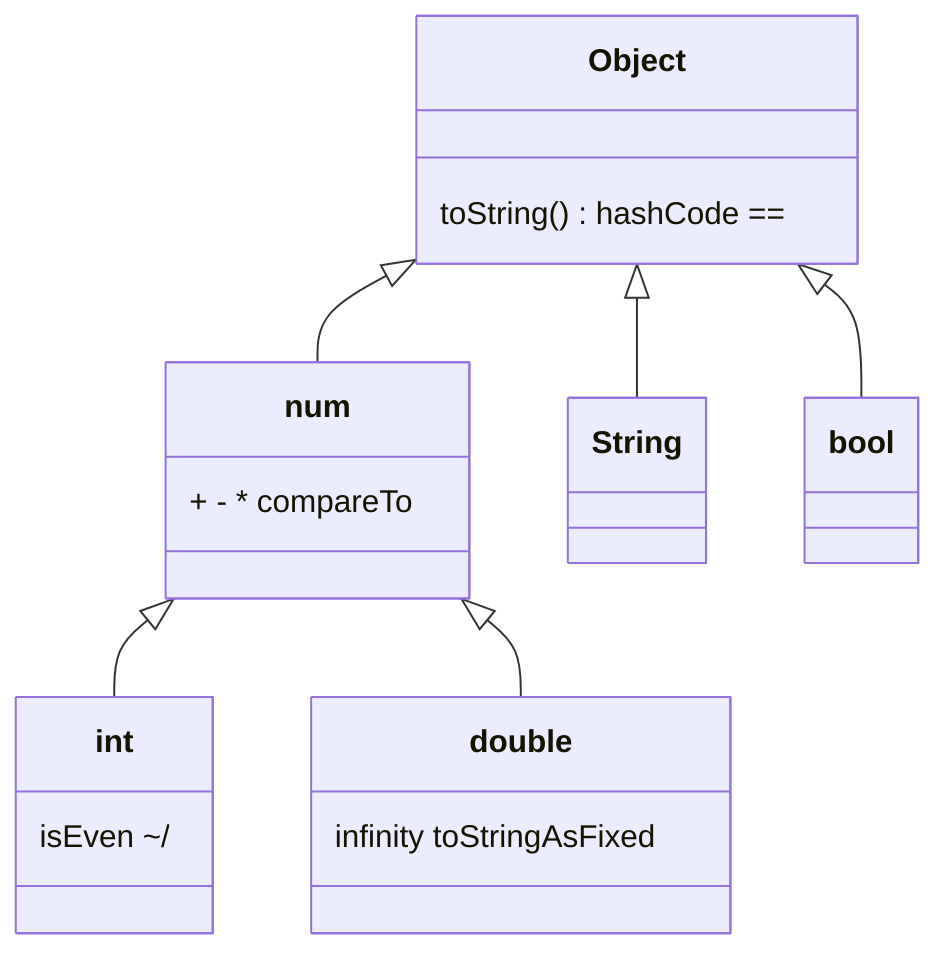
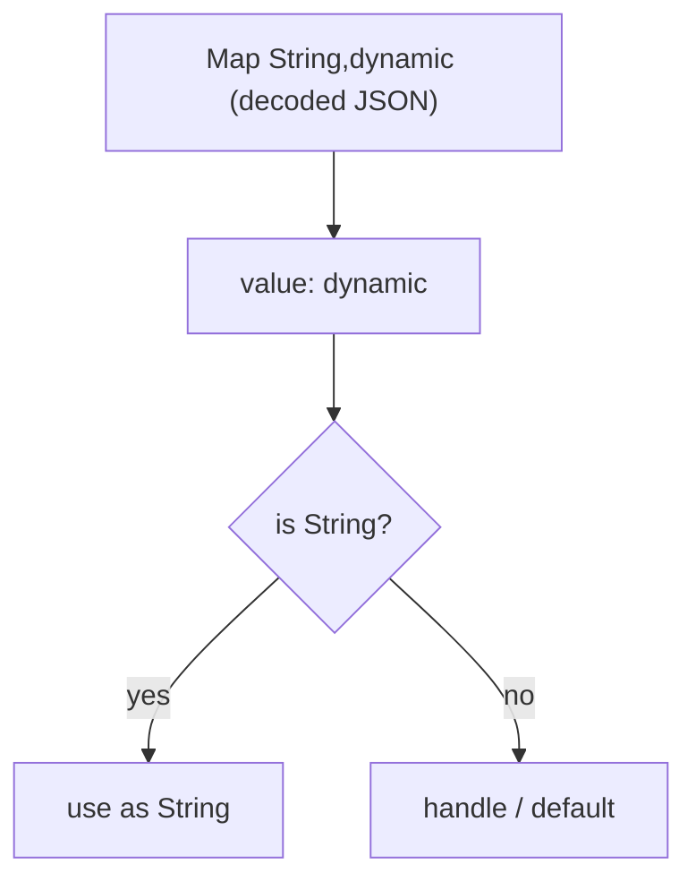

# Data Types (`num`, `int`, `double`, `String`, `bool`, `dynamic`, `Object?`)

> Every value in Dart is an object with a type; the type system decides what you can do with a value and when mistakes are caught.

## Introduction

Dart is **statically typed with type inference**, and **everything is an object** — including numbers, booleans, functions, and `null`. This file covers the core built-in types, the `num`/`int`/`double` hierarchy, and the crucial distinction between `dynamic` (opt-out of checking) and `Object?` (safe top type).

## Why this concept exists

A type system exists to catch errors **before** the program runs and to enable the compiler to generate efficient code. Dart's "everything is an object" model gives a uniform mental model (no primitive/object split like Java's `int` vs `Integer`), while `dynamic` and `Object?` give controlled escape hatches for genuinely dynamic data (like decoded JSON).

## Real-world analogy

Types are **labeled shipping containers**. A container labeled `int` can only hold whole numbers; the port (compiler) rejects a mislabeled load before the ship sails (runtime). `dynamic` is an **unlabeled container** — anything fits, but nobody checks until you open it at sea (runtime crash). `Object?` is a container labeled "some object, contents unknown" — you must inspect before using the contents.

## Problem Statement

You decode JSON into a `Map<String, dynamic>`. You need the `"age"` field as an `int` and the `"name"` as a `String`, safely, without runtime crashes. By the end you'll know why the map is `dynamic`-valued and how to narrow safely with `is`/casts.

## Internal Working



- `num` is the supertype of `int` and `double`. `num x = 5; x = 5.5;` is legal.
- `int` is an arbitrary-precision-ish integer (64-bit on native; on web it's a JS `double`-backed integer — a portability gotcha).
- `String` is an immutable sequence of UTF-16 code units.
- `bool` has exactly two instances: `true`, `false`.
- `dynamic` disables static checking. `Object?` is the top type: everything is an `Object?`.

## Memory Representation

- Small `int`s and `double`s may be represented efficiently (boxed/unboxed) by the VM; conceptually they're heap objects but the VM optimizes common cases.
- `String` is immutable — concatenation creates a new object; heavy building should use `StringBuffer`.
- `null` is a single canonical object (`Null` type).

## Compiler Behavior

- Type inference: `var n = 5` → `int`; `var d = 5.0` → `double`; `var s = 'x'` → `String`.
- Calling a member the static type doesn't have is a **compile error** for `Object?` but **allowed** for `dynamic` (deferred to runtime).
- Numeric literals: `5` is `int`, `5.0` is `double`; `double d = 5;` is allowed (int literal coerced to double in a double context).

## Runtime Behavior

- `dynamic value = 5; value.length;` compiles, then throws `NoSuchMethodError` at runtime.
- Type checks (`is`) and casts (`as`) are evaluated at runtime; a failing `as` throws `TypeError`.
- Integer division `~/` returns `int`; `/` always returns `double`.

## Flutter Engine Behavior

Not applicable — data types are a pure language concern.

## Dart VM Behavior

- The VM specializes numeric operations; in AOT, monomorphic numeric code is highly optimized.
- **Web caveat:** on `dart2js`/`dartdevc`, `int` and `double` share JavaScript's IEEE-754 double, so very large integers lose precision. Native (mobile/desktop) uses true 64-bit ints.

## Examples

```dart
void main() {
  // num holds both:
  num x = 5;      // int
  x = 5.5;        // now double — legal because both are num
  print(x is double); // true

  // int vs double division:
  print(7 / 2);   // 3.5   (double)
  print(7 ~/ 2);  // 3     (int)
  print(7 % 2);   // 1

  // String is immutable UTF-16:
  const name = 'Dart';
  print(name.length);            // 4
  print(name.toUpperCase());     // DART  (new string)

  // dynamic vs Object? safety:
  dynamic d = 'hello';
  print(d.length);   // 5 — no compile check; would crash if d were an int

  Object? o = 'hello';
  // print(o.length); // COMPILE ERROR: 'length' not defined for Object
  if (o is String) {
    print(o.length); // 5 — promoted to String inside the check
  }

  // Safe JSON narrowing:
  final json = <String, dynamic>{'name': 'Ada', 'age': 36};
  final ageName = json['name'];         // dynamic
  final age = json['age'] as int;       // explicit cast
  final safeName = json['name'] as String? ?? 'unknown';
  print('$safeName is $age'); // Ada is 36
}
```

## Diagrams



## Common Mistakes

| Mistake | Why it's wrong | Fix |
|---------|----------------|-----|
| Using `dynamic` for JSON everywhere | Loses all safety | Cast at the boundary; model with classes |
| `int` assumptions on web | Precision loss with big ints | Use `BigInt` or strings for large IDs on web |
| Building strings with `+=` in loops | O(n²) allocations | Use `StringBuffer` |
| `as` without a null check | Throws on mismatch | Use `as T?` + `??`, or `is` promotion |

## Best Practices

- Keep `dynamic` at the **edges** (deserialization) and convert to typed models immediately.
- Prefer `Object?` over `dynamic` when you want "anything, but safely."
- Use `num` only when a value is genuinely int-or-double; otherwise be specific.
- Format money/precision with `toStringAsFixed`, never rely on `double` for exact currency math (use integers of the smallest unit, e.g. paise/cents).

## Performance

- `StringBuffer` turns repeated concatenation from O(n²) to O(n).
- Monomorphic numeric code (always `int`, or always `double`) is faster than mixed `num`.

## Advantages

- Uniform object model — no primitive/wrapper split.
- Strong inference keeps code concise while type-safe.
- Escape hatches (`dynamic`, `Object?`) for real-world dynamic data.

## Disadvantages

- `dynamic` can silently defer bugs to runtime.
- Web numeric semantics differ from native — a portability footgun.

## Interview Questions

1. **🟢 What's the supertype of `int` and `double`?** — `num`. Both extend it.
2. **🟢 Difference between `/` and `~/`?** — `/` returns a `double` always; `~/` is integer (truncating) division returning `int`.
3. **🟡 `dynamic` vs `Object?` — which is safer and why?** — `Object?`. Both hold anything, but `dynamic` allows *any* member call (unchecked, may crash), while `Object?` only allows `Object` members until you check/cast — so mistakes are caught at compile time.
4. **🟡 Why is `String` concatenation in a loop slow?** — Strings are immutable; each `+=` allocates a new string. Use `StringBuffer`.
5. **🟡 Is `double d = 5;` legal?** — Yes; an `int` literal is coerced to `double` in a double context. But `int i = 5.0;` is not.
6. **🔴 What breaks about `int` on Flutter Web?** — Web ints are JS doubles (IEEE-754); integers beyond 2^53 lose precision. Use `BigInt`/strings for large values.
7. **🔴 Why avoid `double` for currency?** — Binary floating point can't represent decimals like 0.1 exactly, causing rounding errors. Store the smallest integer unit instead.

## Senior Engineer Tips

- Treat the deserialization boundary as a **type firewall**: `dynamic` in, typed models out, with validation.
- Prefer exhaustive modeling (sealed classes/enums) over `dynamic` flags — it moves errors to compile time.
- Remember web numeric semantics when building cross-platform apps with large numeric IDs.

## Architect Perspective

Type discipline at boundaries (API, DB, platform channels) is a system-wide reliability decision. Centralize parsing/validation so the rest of the codebase never touches `dynamic`. This is the foundation for the `Result`/failure modeling in [Module 38](../38%20Error%20Handling/README.md) and DTO↔entity mapping in Clean Architecture ([Module 40](../40%20Clean%20Architecture/README.md)).

## Summary

- Everything is an object; `num` → `int`/`double`; `String` is immutable UTF-16.
- `dynamic` opts out of checking (risky); `Object?` is the safe top type.
- Narrow `dynamic` at the edges; beware web int precision and `double` currency math.

## Revision Notes

- `num` supertype of `int`/`double`. `/`→double, `~/`→int.
- `dynamic` = no checks (runtime crash); `Object?` = safe, must check/cast.
- `String` immutable → `StringBuffer` for building.
- Web `int` = JS double (precision loss); currency → integer smallest unit.

## Practice Questions

1. Predict the type: `var a = 5; var b = 5.0; var c = 5 / 5; var d = 5 ~/ 5;`.
2. Why does `Object? o = 5; o.isEven;` fail to compile but `dynamic d = 5; d.isEven;` compile?
3. Explain the web precision issue with a concrete large-int example.

## Coding Questions

1. Write `T? tryCast<T>(Object? value)` returning `value as T?` safely (null on mismatch).
2. Parse `{'price': '19.99', 'qty': '3'}` into a total **in cents** as an `int`, avoiding `double` currency errors.
3. Benchmark `+=` vs `StringBuffer` building a 100k-char string; print both durations.

## Mini Project

**Typed JSON firewall:** Given a raw `Map<String, dynamic>` for a `User` (`id`, `name`, `email`, optional `age`), write a `User.fromJson` that casts/validates every field, throws a descriptive `FormatException` on bad data, and exposes only typed fields. Acceptance: no `dynamic` escapes the class; invalid input produces a clear error; `dart analyze` clean.
