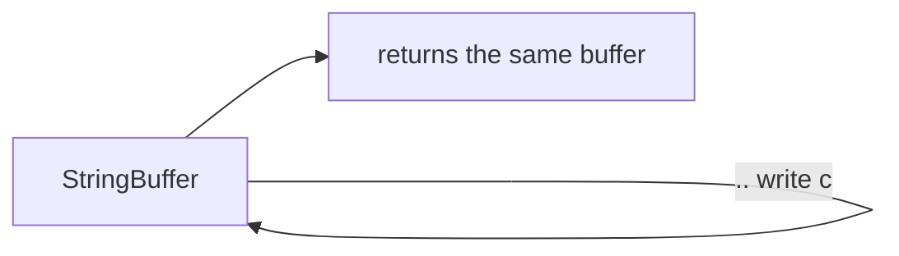

# Operators (Arithmetic, Logical, Null-aware, Cascade, Spread)

> Operators are just method calls in disguise — which is why you can override most of them on your own types.

## Introduction

Dart operators cover arithmetic, equality/relational, logical, type-test, assignment, null-aware, cascade (`..`), and spread (`...`). Crucially, most operators are **instance methods** you can override, and several (null-aware, cascade, spread) are ergonomics that show up constantly in Flutter widget trees.

## Why this concept exists

Operators give concise, readable syntax for common operations, and making them overridable lets your value types (`Money`, `Vector`) behave like built-ins. Cascade and spread exist specifically to make **declarative object/collection construction** (Flutter's bread and butter) terse and readable.

## Real-world analogy

Cascade (`..`) is a **barista making one drink**: pour, add milk, add foam — all to the *same cup*, without re-naming the cup each step. Spread (`...`) is **emptying one bag of groceries into another** in a single motion.

## Problem Statement

Build a widget's children list that always includes a header, conditionally includes a banner, and expands a variable list of items — in one literal. And configure a `Paint` object with several properties without repeating its name. You'll use collection-`if`/`for`, spread, and cascade.

## Internal Working

| Category | Operators |
|----------|-----------|
| Arithmetic | `+ - * / ~/ % -expr` |
| Relational/Equality | `== != < > <= >=` |
| Logical | `&& || !` |
| Type test | `is  is!  as` |
| Assignment | `=  +=  -=  ??=  ...` |
| Null-aware | `?.  ??  ??=  ...?  ?..` |
| Other | `..` (cascade), `...` (spread), `[]`/`[]=` (index) |

- `a + b` compiles to `a.+(b)` — operators are methods; override with `operator +`.
- `==` defaults to identity; override **with `hashCode`** for value equality.
- Cascade `..` returns the **receiver**, not the method result.
- Spread `...` inlines an iterable's elements into a collection literal; `...?` skips a null iterable.

## Memory Representation

Not applicable beyond ordinary object semantics — operators don't have special storage. Cascade/spread produce ordinary objects/collections.

## Compiler Behavior

- Operator calls are resolved to the receiver's method; unknown operator on a static type is a compile error.
- Collection-`if`/`for` and spread are compiled into efficient element-adding code (no intermediate temp list for spread of a known iterable).
- `a ?? b`: `b` is only evaluated if `a` is null (short-circuit).

## Runtime Behavior

- `&&`/`||` short-circuit: the right side runs only if needed.
- `as` throws `TypeError` on failure at runtime; `is` returns bool.
- `~/` and `%` follow integer semantics; `/` yields double.

## Flutter Engine Behavior

Not applicable.

## Dart VM Behavior

- Overloaded operators on hot value types (e.g., `Offset + Offset` in animations) are inlined by the AOT compiler when monomorphic.

## Examples

```dart
class Money {
  final int cents;
  const Money(this.cents);
  Money operator +(Money o) => Money(cents + o.cents);
  @override
  bool operator ==(Object o) => o is Money && o.cents == cents;
  @override
  int get hashCode => cents.hashCode;
  @override
  String toString() => '\$${(cents / 100).toStringAsFixed(2)}';
}

void main() {
  print(Money(150) + Money(250)); // $4.00
  print(Money(100) == Money(100)); // true (value equality)

  // null-aware
  int? n;
  print(n ?? 0);   // 0
  print(n?.isEven); // null

  // cascade — configure one object
  final buffer = StringBuffer()
    ..write('a')
    ..write('b')
    ..write('c');
  print(buffer); // abc

  // spread + collection-if/for (very Flutter-like)
  final extra = [2, 3];
  const showZero = true;
  final list = [
    if (showZero) 0,
    1,
    ...extra,
    for (var i = 4; i < 6; i++) i,
  ];
  print(list); // [0, 1, 2, 3, 4, 5]

  // null-aware spread
  List<int>? maybeNull;
  final safe = [0, ...?maybeNull];
  print(safe); // [0]
}
```

## Diagrams



## Common Mistakes

| Mistake | Why | Fix |
|---------|-----|-----|
| Override `==` without `hashCode` | Breaks Set/Map keys | Always override both together |
| Expecting `..` to return the method's result | It returns the receiver | Use a normal call if you need the result |
| `as` without handling failure | Throws | Prefer `is` promotion or `as T?` + `??` |
| Forgetting `...?` for nullable spreads | Crashes on null | Use `...?` |

## Best Practices

- Override `==`/`hashCode` (or use `records`/`equatable`/`freezed`) for value types.
- Use cascades to build/configure objects fluently.
- Use collection-`if`/`for`/spread in widget `children` for declarative UI.

## Performance

- Spread of a large known list is O(n) copy; prefer building directly if you can avoid intermediate lists in hot paths.
- Short-circuit operators avoid unnecessary work — order cheap conditions first.

## Advantages / Disadvantages

- **+** Concise, readable, extensible to custom types; declarative construction.
- **−** Operator overloading can obscure cost if abused (a "cheap-looking" `+` doing heavy work).

## Interview Questions

1. **🟢 Are operators methods in Dart?** — Yes; `a + b` is `a.+(b)`, and most are overridable via `operator`.
2. **🟢 What does cascade `..` return?** — The receiver object, not the invoked method's result.
3. **🟡 Why override `hashCode` with `==`?** — Hash-based collections use `hashCode` to bucket and `==` to confirm; overriding one without the other breaks `Set`/`Map` semantics.
4. **🟡 `is` vs `as`?** — `is` tests type (returns bool, enables promotion); `as` casts (throws on mismatch).
5. **🔴 How do collection-`if`/spread compile?** — Into element-adding operations within the literal, avoiding manual `add`/`addAll` boilerplate; the compiler emits efficient code.
6. **🔴 When is operator overloading a bad idea?** — When it hides significant cost or surprises readers (non-intuitive semantics); explicitness beats cleverness.

## Senior Engineer Tips

- Reach for `records` (Dart 3) or `freezed`/`equatable` instead of hand-writing `==`/`hashCode` across many models.
- Cascades shine in builders and test setup; don't overuse where a local variable reads clearer.

## Architect Perspective

Value equality is foundational for reactive state: frameworks compare old/new state to decide rebuilds. Consistent `==`/`hashCode` (or immutable value types) makes state diffing correct and cheap — a prerequisite for `Bloc`/`Riverpod` selectors ([Module 11](../11%20State%20Management/README.md)).

## Summary

- Operators are overridable methods; override `==` with `hashCode`.
- Null-aware (`?.`/`??`/`??=`/`...?`), cascade (`..`), and spread (`...`) power concise, declarative code.
- Short-circuiting and integer/double division semantics matter for correctness.

## Revision Notes

- `a + b` == `a.+(b)`; override `==` + `hashCode` together.
- `..` returns receiver; `...`/`...?` spread; collection-`if`/`for` in literals.
- `/`→double, `~/`→int; `&&`/`||` short-circuit; `as` throws, `is` promotes.

## Practice Questions

1. Why does a `Set<Money>` misbehave if you override only `==`?
2. Rewrite a `children` list built with `add`/`addAll` using spread + collection-`if`.
3. What's the difference between `?.` and `..` — one word each?

## Coding Questions

1. Implement `Vector2(x, y)` with `+`, `-`, `*` (scalar), `==`, `hashCode`, `toString`.
2. Build a widget-like `Column`'s children list mixing header, optional error, and a spread of items.
3. Write `T pipe<T>(T seed, List<T Function(T)> steps)` and configure an object via cascade inside it.

## Mini Project

**Immutable geometry library:** Implement `Point`, `Size`, `Rect` value types with overloaded operators, correct value equality, and cascade-friendly builders. Add tests proving equality and Set/Map key correctness. Acceptance: no mutable state; `dart analyze` clean; equality tests pass.
