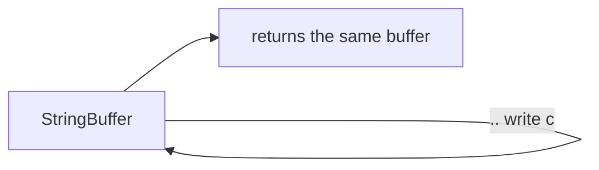

# Operators (Arithmetic, Logical, Null-aware, Cascade, Spread)

> Operators are just method calls in disguise — which is why you can override most of them on your own types.

## Introduction

Dart operators cover arithmetic, equality/relational, logical, type-test, assignment, null-aware, cascade (`..`), and spread (`...`). Crucially, most operators are **instance methods** you can override, and several (null-aware, cascade, spread) are ergonomics that show up constantly in Flutter widget trees.

## Why this concept exists

Operators give concise, readable syntax for common operations, and making them overridable lets your value types (`Money`, `Vector`) behave like built-ins. Cascade and spread exist specifically to make **declarative object/collection construction** (Flutter's bread and butter) terse and readable.

## Real-world analogy

Cascade (`..`) is a **barista making one drink**: pour, add milk, add foam — all to the *same cup*, without re-naming the cup each step. Spread (`...`) is **emptying one bag of groceries into another** in a single motion.

## Problem Statement

Build a widget's children list that always includes a header, conditionally includes a banner, and expands a variable list of items — in one literal. And configure a `Paint` object with several properties without repeating its name. You'll use collection-`if`/`for`, spread, and cascade.

## Internal Working

| Category | Operators |
|----------|-----------|
| Arithmetic | `+ - * / ~/ % -expr` |
| Relational/Equality | `== != < > <= >=` |
| Logical | `&& || !` |
| Type test | `is  is!  as` |
| Assignment | `=  +=  -=  ??=  ...` |
| Null-aware | `?.  ??  ??=  ...?  ?..  ?[]` |
| Null assertion | `!` (postfix, e.g. `x!`) — distinct from logical `!x` |
| Conditional | `cond ? a : b` (ternary) |
| Other | `..` (cascade), `...` (spread), `[]`/`[]=` (index) |

- `a + b` compiles to `a.+(b)` — operators are methods; override with `operator +`.
- `==` defaults to identity; override **with `hashCode`** for value equality.
- Cascade `..` returns the **receiver**, not the method result.
- Spread `...` inlines an iterable's elements into a collection literal; `...?` skips a null iterable.

## Memory Representation

Not applicable beyond ordinary object semantics — operators don't have special storage. Cascade/spread produce ordinary objects/collections.

## Compiler Behavior

- Operator calls are resolved to the receiver's method; unknown operator on a static type is a compile error.
- Collection-`if`/`for` and spread are compiled into efficient element-adding code (no intermediate temp list for spread of a known iterable).
- `a ?? b`: `b` is only evaluated if `a` is null (short-circuit).

## Runtime Behavior

- `&&`/`||` short-circuit: the right side runs only if needed.
- `as` throws `TypeError` on failure at runtime; `is` returns bool.
- `~/` and `%` follow integer semantics; `/` yields double.

## Flutter Engine Behavior

Not applicable.

## Dart VM Behavior

- Overloaded operators on hot value types (e.g., `Offset + Offset` in animations) are inlined by the AOT compiler when monomorphic.

## Examples

```dart
class Money {
  final int cents;
  const Money(this.cents);
  Money operator +(Money o) => Money(cents + o.cents);
  @override
  bool operator ==(Object o) => o is Money && o.cents == cents;
  @override
  int get hashCode => cents.hashCode;
  @override
  String toString() => '\$${(cents / 100).toStringAsFixed(2)}';
}

void main() {
  print(Money(150) + Money(250)); // $4.00
  print(Money(100) == Money(100)); // true (value equality)

  // null-aware
  int? n;
  print(n ?? 0);   // 0
  print(n?.isEven); // null

  // cascade — configure one object
  final buffer = StringBuffer()
    ..write('a')
    ..write('b')
    ..write('c');
  print(buffer); // abc

  // spread + collection-if/for (very Flutter-like)
  final extra = [2, 3];
  const showZero = true;
  final list = [
    if (showZero) 0,
    1,
    ...extra,
    for (var i = 4; i < 6; i++) i,
  ];
  print(list); // [0, 1, 2, 3, 4, 5]

  // null-aware spread
  List<int>? maybeNull;
  final safe = [0, ...?maybeNull];
  print(safe); // [0]
}
```

### Null-aware operators explained

Four operators, four different jobs. The confusion is almost always between `?.` and `??`.

```dart
class User {
  final String name;
  final User? manager;
  User(this.name, {this.manager});
}

void main() {
  // ---- 1. `?.`  conditional member access ----
  // "If the receiver is null, don't call anything — evaluate to null."
  User? u;
  print(u?.name);        // null  (no crash — the `.name` call is SKIPPED)
  // print(u.name);      // compile error: receiver may be null

  u = User('Aditya');
  print(u?.name);        // Aditya

  // The whole chain short-circuits at the FIRST null, so this is safe
  // even though `manager` is null — `.manager?.name` is never reached:
  print(u.manager?.name);          // null
  print(u.manager?.manager?.name); // null

  // Key point: the RESULT TYPE becomes nullable.
  String? maybeName = u.manager?.name; // String? not String

  // ---- 2. `??`  if-null (default value) ----
  // "Use the left side, unless it's null — then use the right side."
  print(u.manager?.name ?? 'no manager'); // no manager
  // The right side is LAZY: only evaluated when the left side is null.
  print(u.name ?? expensiveDefault());    // Aditya — expensiveDefault() never runs

  // This is the idiom that turns a `String?` back into a `String`:
  String display = u.manager?.name ?? 'Unassigned'; // non-nullable

  // ---- 3. `??=`  null-aware assignment ----
  // "Assign ONLY if the variable is currently null." (lazy caching)
  int? cached;
  cached ??= compute();  // compute() runs -> cached = 42
  cached ??= compute();  // compute() SKIPPED — cached is already non-null
  print(cached);         // 42

  // ---- 4. `...?`  null-aware spread ----
  // "Spread this iterable, but if the iterable itself is null, add nothing."
  List<String>? tags;                    // null list, not an empty list
  final all = ['base', ...?tags];        // ['base'] — no crash
  // final bad = ['base', ...tags];      // runtime/compile error on null
  print(all);

  tags = ['a', 'b'];
  print(['base', ...?tags]);             // [base, a, b]
}

String expensiveDefault() { print('ran!'); return 'fallback'; }
int compute() => 42;
```

| Operator | Reads as | Guards against | Yields |
|----------|----------|-----------------|--------|
| `?.` | "call only if not null" | calling a member on `null` | nullable result |
| `??` | "or else use this" | *having* a null value | non-nullable (if RHS is) |
| `??=` | "fill in if empty" | overwriting an existing value | assigns at most once |
| `...?` | "spread if not null" | spreading a null iterable | contributes 0 elements |

> **`?.` vs `??` in one line:** `?.` protects the **call**; `??` replaces the **value**. You usually need both together: `a?.b ?? fallback`.

### `?` and `!` — every meaning, and how they differ

Both symbols are **overloaded**: each means something completely different depending on *where* it sits. Read the position first, then the meaning.

#### The four faces of `?`

```dart
void main() {
  // 1. `?` AFTER A TYPE  -> nullability marker (not an operator at all)
  String? a;        // "a String, or null"      — allowed to be null
  String  b = 'hi'; // "a String, never null"   — cannot be null
  int? count;
  List<String>? items;
  // It's part of the TYPE. There is no runtime cost; it's a static promise.

  // 2. `?` BEFORE A DOT/INDEX/CASCADE -> null-shorting access
  print(a?.length);       // `?.`  member access
  print(items?[0]);       // `?[]` index access — skipped if items is null
  a?..toLowerCase();      // `?..` cascade

  // 3. `??` / `??=` -> value fallback / conditional assign
  print(a ?? 'default');  // default
  a ??= 'filled';         // assigns only because a was null

  // 4. `? :` TERNARY -> conditional EXPRESSION (needs the `:`)
  final label = count == null ? 'unknown' : 'has $count';
  print(label);           // unknown
}
```

The one that trips people up: **`x ?? y` vs `x != null ? x : y`** are the same thing, but `??` evaluates `x` only once. If `x` is a getter or function call with side effects, the ternary form calls it twice.

```dart
int calls = 0;
int? get flaky { calls++; return null; }

void demo() {
  final v1 = flaky ?? 0;                    // calls == 1
  final v2 = flaky != null ? flaky! : 0;    // calls == 2  (and needs `!`)
}
```

#### The two faces of `!`

```dart
void main() {
  // 1. `!` BEFORE a bool -> logical NOT
  bool isReady = false;
  print(!isReady);          // true
  if (!isReady) print('waiting');

  // 2. `!` AFTER an expression -> NULL ASSERTION ("bang operator")
  //    "I promise this isn't null — remove the `?` from its type."
  String? name = 'Aditya';
  String definitely = name!;     // String, not String?
  print(definitely.length);      // 6

  // `!` does NOT make null safe. It makes null LOUD:
  String? missing;
  // print(missing!.length);      // throws TypeError at RUNTIME

  // They can stack, and read in opposite directions:
  bool? flag;
  print(!flag!);                 // assert non-null, THEN negate -> crashes here
  print(!(flag ?? false));       // safe version -> true

  // `is!` is a third, separate thing: the negated type test
  Object o = 5;
  print(o is! String);           // true
}
```

#### `?.` vs `!.` — the decision that actually matters

Same syntax shape, opposite philosophies:

```dart
User? user = fetchUser();

final n1 = user?.name;   // String?  — if null, RESULT is null. No crash.
final n2 = user!.name;   // String   — if null, THROWS immediately.
```

| | `user?.name` | `user!.name` |
|---|---|---|
| If `user` is null | evaluates to `null` | throws `TypeError` |
| Result type | `String?` | `String` |
| Says | "might be absent, handle it" | "absent is a bug, fail loudly" |
| Use when | absence is a valid state | you've already proven non-null |

#### Choosing between them

| Situation | Use | Why |
|-----------|-----|-----|
| Value may legitimately be absent | `?.` + `??` | produces a real fallback, never throws |
| Just need a default | `??` | one evaluation, non-nullable result |
| Field you know is set (e.g. after `initState`) | `late` | non-nullable, no `!` at every use site |
| Already null-checked in an `if` | *nothing* | flow analysis **promotes** the variable for you |
| Truly can't prove it to the compiler | `!` | last resort — document why |

The most common *unnecessary* `!` — the compiler already knows:

```dart
void show(String? msg) {
  if (msg != null) {
    print(msg.length);   // ✅ promoted to String — no `!` needed
    // print(msg!.length); // ❌ redundant noise
  }
}
```

Promotion **fails** for fields (another isolate/subclass could change them mid-method), which is why `!` shows up so often on class fields — and why `late` or a local copy is usually the better fix:

```dart
class Widget {
  String? title;
  void render() {
    // if (title != null) print(title.length); // ❌ won't promote — it's a field
    final t = title;                            // ✅ copy to a local
    if (t != null) print(t.length);
  }
}
```

> **Rule of thumb:** every `!` is an assertion you're personally responsible for. `?.`/`??`/`late`/promotion cover ~95% of cases; reach for `!` only when you can explain in a comment why null is impossible.

### Cascade (`..` and `?..`) explained

A cascade lets you run a sequence of operations **on the same object** and still get *the object* back — not the return value of the last operation.

```dart
class Paint {
  double strokeWidth = 0;
  String color = 'black';
  bool antiAlias = false;
  void moveTo(double x, double y) => print('moveTo($x, $y)');
  @override
  String toString() => 'Paint($color, $strokeWidth, aa: $antiAlias)';
}

void main() {
  // WITHOUT cascade — the name repeats on every line
  final a = Paint();
  a.strokeWidth = 4;
  a.color = 'red';
  a.antiAlias = true;

  // WITH cascade — one expression, name mentioned once
  final b = Paint()
    ..strokeWidth = 4     // returns the Paint, not 4
    ..color = 'red'
    ..antiAlias = true
    ..moveTo(0, 0);       // works for methods too
  print(b);               // Paint(red, 4.0, aa: true)

  // WHY it works: `..` DISCARDS the operation's result and hands back
  // the receiver. Compare with a single dot:
  final list = <int>[];
  list.add(1);                           // `.add` returns void — nothing to chain
  final cascadeResult = <int>[]..add(1);  // List<int> <- the list itself
  print(cascadeResult);                   // [1]
  // This is why `<int>[].add(1)` can't be assigned but `<int>[]..add(1)` can.

  // `?..`  null-shorting cascade: skip the WHOLE chain if receiver is null
  Paint? maybe;
  maybe?..strokeWidth = 9      // nothing happens, no crash
       ..color = 'green';      // also skipped
  print(maybe);                // null

  maybe = Paint();
  maybe?..strokeWidth = 9      // now the whole chain runs
       ..color = 'green';
  print(maybe);                // Paint(green, 9.0, aa: false)
}
```

Gotchas worth memorizing:

- `..` is **not** `.` — `obj..foo()` throws away `foo()`'s return value on purpose. If you need the return value, use a plain `.`.
- Only the **first** link needs `?..`; subsequent links reuse the same short-circuit. Writing `a?..b()?..c()` is redundant.
- A cascade is a single expression, so the `;` goes only after the **last** link.
- Assignments work in cascades (`..color = 'red'`) because `=` is an operation on the receiver too.

### Spread (`...`) and collection-`if`/`for` explained

Spread **inlines the elements** of one iterable into a collection literal being built.

```dart
void main() {
  final middle = [2, 3];

  // `...` unwraps the iterable — contrast with plain insertion
  print([1, ...middle, 4]);  // [1, 2, 3, 4]  <- flat, 4 elements
  print([1, middle, 4]);     // [1, [2, 3], 4] <- NESTED, 3 elements

  // Equivalent to addAll(), but usable inside a literal / const context
  final manual = <int>[1]..addAll(middle)..add(4);
  print(manual);             // [1, 2, 3, 4]

  // Works for Set and Map literals too
  print({1, ...middle});               // {1, 2, 3}
  print({'a': 1, ...{'b': 2}});        // {a: 1, b: 2}

  // Spread accepts any Iterable, not just List — no .toList() needed
  print([0, ...middle.map((e) => e * 10)]); // [0, 20, 30]

  // ---- Combined with collection-if / collection-for ----
  // This is the pattern you'll write constantly in Flutter `children:`
  final items = ['Item A', 'Item B'];
  const showBanner = false;
  String? error;

  final children = [
    'Header',                                  // always present
    if (showBanner) 'Banner',                  // 0 or 1 element
    if (error != null) 'Error: $error',        // `error` promotes to String
    ...items,                                  // n elements, flattened
    for (final i in items) 'Tile: $i',         // n generated elements
    ...?null as List<String>?,                 // 0 elements, safely
  ];
  print(children);
  // [Header, Item A, Item B, Tile: Item A, Tile: Item B]

  // Note there's no `else`-less awkwardness: collection-if has an else too
  print([if (showBanner) 'on' else 'off']);    // [off]
}
```

Why this beats building the list imperatively:

- It stays an **expression**, so it works inline in a widget constructor's `children:` argument — no temp variable, no `build`-helper method.
- It can be `const` when every element is constant (`addAll` cannot).
- `if`/`for` inside a literal removes the classic bug of forgetting to `add` a conditionally-built element.

In Flutter, exactly the same list reads:

```dart
Column(
  children: [
    const Header(),
    if (state.hasError) ErrorBanner(state.error!),
    ...state.items.map(ItemTile.new),
    if (state.isLoading) const CircularProgressIndicator(),
  ],
)
```

## Diagrams



## Common Mistakes

| Mistake | Why | Fix |
|---------|-----|-----|
| Override `==` without `hashCode` | Breaks Set/Map keys | Always override both together |
| Expecting `..` to return the method's result | It returns the receiver | Use a normal call if you need the result |
| `as` without handling failure | Throws | Prefer `is` promotion or `as T?` + `??` |
| Forgetting `...?` for nullable spreads | Crashes on null | Use `...?` |
| Using `!` to "fix" a null error | Silences the analyzer, moves the crash to runtime | Handle absence with `?.`/`??`, or use `late` |
| Writing `x!` after `if (x != null)` | Flow analysis already promoted `x` | Drop the `!` |
| Expecting a **field** to promote after a null check | Only locals/finals promote | Copy to a local first |
| Confusing `!x` with `x!` | Prefix = logical NOT, postfix = null assertion | Read the position, not the symbol |
| `x != null ? x! : y` instead of `x ?? y` | Evaluates `x` twice | Use `??` |

## Best Practices

- Override `==`/`hashCode` (or use `records`/`equatable`/`freezed`) for value types.
- Use cascades to build/configure objects fluently.
- Use collection-`if`/`for`/spread in widget `children` for declarative UI.

## Performance

- Spread of a large known list is O(n) copy; prefer building directly if you can avoid intermediate lists in hot paths.
- Short-circuit operators avoid unnecessary work — order cheap conditions first.

## Advantages / Disadvantages

- **+** Concise, readable, extensible to custom types; declarative construction.
- **−** Operator overloading can obscure cost if abused (a "cheap-looking" `+` doing heavy work).

## Interview Questions

1. **🟢 Are operators methods in Dart?** — Yes; `a + b` is `a.+(b)`, and most are overridable via `operator`.
2. **🟢 What does cascade `..` return?** — The receiver object, not the invoked method's result.
3. **🟡 Why override `hashCode` with `==`?** — Hash-based collections use `hashCode` to bucket and `==` to confirm; overriding one without the other breaks `Set`/`Map` semantics.
4. **🟡 `is` vs `as`?** — `is` tests type (returns bool, enables promotion); `as` casts (throws on mismatch).
5. **🔴 How do collection-`if`/spread compile?** — Into element-adding operations within the literal, avoiding manual `add`/`addAll` boilerplate; the compiler emits efficient code.
6. **🔴 When is operator overloading a bad idea?** — When it hides significant cost or surprises readers (non-intuitive semantics); explicitness beats cleverness.
7. **🟢 `?.` vs `!.`?** — `?.` short-circuits to `null` when the receiver is null (result is nullable); `!.` asserts non-null and throws `TypeError` if wrong (result is non-nullable).
8. **🟢 What are the two meanings of `!`?** — Prefix `!x` is logical NOT; postfix `x!` is the null-assertion operator. `is!` is a separate negated type test.
9. **🟡 Is `?` in `String?` an operator?** — No. It's part of the *type*, a static nullability marker with no runtime cost — unlike `?.`/`??`/`??=`, which are real operators.
10. **🟡 Why prefer `x ?? y` over `x != null ? x : y`?** — `??` evaluates `x` once; the ternary evaluates it twice (a bug if `x` is a getter with side effects) and needs `!` to type-check.
11. **🟡 Why doesn't a null check promote a class field?** — The field could be mutated between the check and the use (subclass override, another closure), so the compiler can't guarantee it; copy to a local to get promotion.
12. **🔴 `late` vs `!` vs `?`?** — `?` admits absence into the type; `!` asserts absence is impossible at one use site; `late` defers initialization while keeping the type non-nullable, so you assert once instead of at every access.

## Senior Engineer Tips

- Reach for `records` (Dart 3) or `freezed`/`equatable` instead of hand-writing `==`/`hashCode` across many models.
- Cascades shine in builders and test setup; don't overuse where a local variable reads clearer.

## Architect Perspective

Value equality is foundational for reactive state: frameworks compare old/new state to decide rebuilds. Consistent `==`/`hashCode` (or immutable value types) makes state diffing correct and cheap — a prerequisite for `Bloc`/`Riverpod` selectors ([Module 11](../11%20State%20Management/README.md)).

## Summary

- Operators are overridable methods; override `==` with `hashCode`.
- Null-aware (`?.`/`??`/`??=`/`...?`), cascade (`..`), and spread (`...`) power concise, declarative code.
- Short-circuiting and integer/double division semantics matter for correctness.

## Revision Notes

- `a + b` == `a.+(b)`; override `==` + `hashCode` together.
- `..` returns receiver; `...`/`...?` spread; collection-`if`/`for` in literals.
- `/`→double, `~/`→int; `&&`/`||` short-circuit; `as` throws, `is` promotes.
- `?` by position: `T?` = type marker · `?.`/`?[]`/`?..` = null-shorting access · `??`/`??=` = fallback · `? :` = ternary.
- `!` by position: `!x` = NOT · `x!` = null assertion (throws) · `is!` = negated type test.
- `?.` → null result, no crash. `!.` → non-null result, crashes if null. Prefer promotion/`late` over `!`.

## Practice Questions

1. Why does a `Set<Money>` misbehave if you override only `==`?
2. Rewrite a `children` list built with `add`/`addAll` using spread + collection-`if`.
3. What's the difference between `?.` and `..` — one word each?

## Coding Questions

1. Implement `Vector2(x, y)` with `+`, `-`, `*` (scalar), `==`, `hashCode`, `toString`.
2. Build a widget-like `Column`'s children list mixing header, optional error, and a spread of items.
3. Write `T pipe<T>(T seed, List<T Function(T)> steps)` and configure an object via cascade inside it.

## Mini Project

**Immutable geometry library:** Implement `Point`, `Size`, `Rect` value types with overloaded operators, correct value equality, and cascade-friendly builders. Add tests proving equality and Set/Map key correctness. Acceptance: no mutable state; `dart analyze` clean; equality tests pass.
