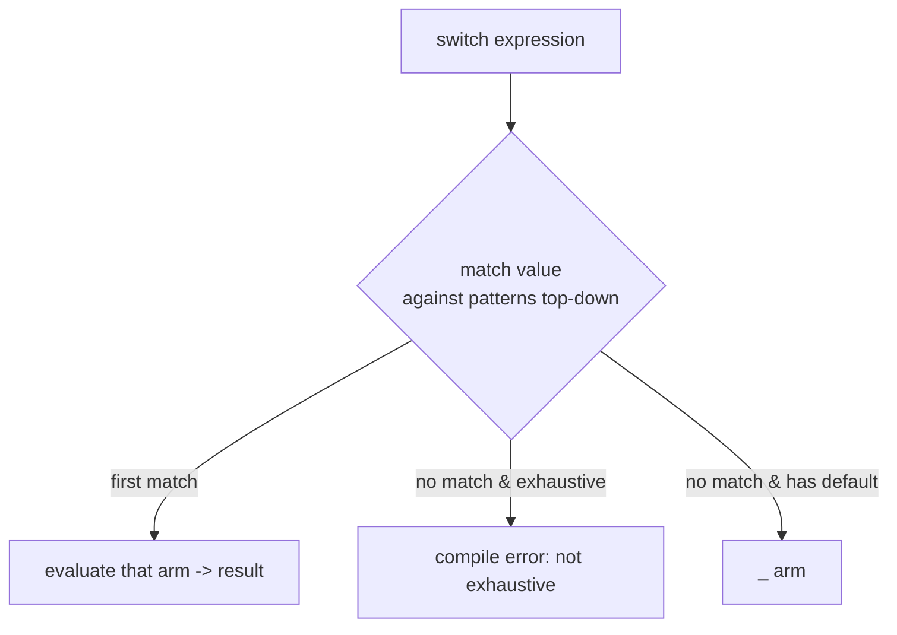
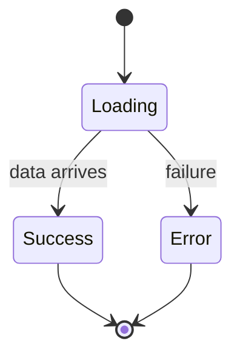

# Control Flow (`if`, `for`, `while`, `switch`, collection-`if`/`for`)

> Control flow decides *which* code runs and *how often* — and in Dart 3, `switch` graduated from a statement into a powerful pattern-matching expression.

## Introduction

This file covers conditionals (`if`/`else`), loops (`for`, `for-in`, `while`, `do-while`), `break`/`continue`, the modern `switch` (statement **and** expression), and collection-`if`/`for` used inside literals. Dart 3's pattern-enabled `switch` is a major upgrade covered here at an introductory level (full treatment in [09_records_and_patterns.md](09_records_and_patterns.md)).

## Why this concept exists

Programs must branch and repeat. Dart modernized `switch` into an **exhaustive expression** because exhaustiveness (the compiler forcing you to handle every case) turns whole categories of logic bugs into compile errors — especially valuable when switching over sealed types/enums that model app state.

## Real-world analogy

`if`/`else` is a **fork in the road**; a loop is a **lap around a track**; `switch` is a **mail sorter** dropping each letter into exactly one labeled bin — and exhaustive switch means the sorter refuses to operate until every possible label has a bin.

## Problem Statement

Given an `enum Status { loading, success, error }`, render a different message for each, with the compiler guaranteeing you didn't forget a case. And build a list that conditionally includes items. You'll use a `switch` expression and collection-`if`.

## Internal Working



- `if (cond) {...} else {...}` — `cond` must be `bool` (no truthy/falsy coercion).
- `for (final x in iterable)` gives a **fresh binding** per iteration (safe for closures).
- `switch` **expression** returns a value: `final msg = switch (x) { ... };`.
- **Exhaustiveness:** switching over an `enum` or sealed hierarchy without covering all cases (and no `_`) is a compile error.
- Collection-`if`/`for` build elements conditionally/repeatedly inside `[]`/`{}`.

## Memory Representation

Not applicable — control flow is code structure, not data. (Loop variables follow normal stack/heap rules; `for-in` fresh bindings avoid the classic closure-capture bug.)

## Compiler Behavior

- `switch` expressions are checked for **exhaustiveness**; missing cases are compile errors.
- Unreachable code after `return`/`break` is flagged.
- The old fall-through rule: statement `case`s don't fall through (each needs `break`/`return`/`continue`), unlike C.

## Runtime Behavior

- Loops evaluate their condition each iteration; `break` exits, `continue` skips to next.
- A non-exhaustive `switch` *statement* with no matching case and no `default` simply does nothing (no throw), which is why expressions (exhaustive) are safer.

## Flutter Engine Behavior

Not applicable. (But `switch` expressions over state enums are the idiomatic way to map state → widget in `build`.)

## Dart VM Behavior

- Dense integer/enum switches may be compiled to jump tables for O(1) dispatch; sparse ones become comparisons.

## Examples

```dart
enum Status { loading, success, error }

String message(Status s) => switch (s) {
      Status.loading => 'Please wait…',
      Status.success => 'Done!',
      Status.error => 'Something went wrong',
    }; // exhaustive — remove one arm and it won't compile

void main() {
  print(message(Status.success)); // Done!

  // for-in with fresh binding (closure-safe)
  final actions = <void Function()>[];
  for (final i in [1, 2, 3]) {
    actions.add(() => print(i));
  }
  for (final a in actions) a(); // 1, 2, 3 (not 3,3,3)

  // classic for + break/continue
  for (var i = 0; i < 5; i++) {
    if (i == 1) continue;
    if (i == 4) break;
    print(i); // 0, 2, 3
  }

  // while
  var n = 3;
  while (n > 0) {
    n--;
  }

  // collection-if / collection-for
  const isAdmin = true;
  final menu = [
    'Home',
    if (isAdmin) 'Admin',
    for (final p in ['A', 'B']) 'Page $p',
  ];
  print(menu); // [Home, Admin, Page A, Page B]

  // switch with guard (when)
  final int score = 85;
  final grade = switch (score) {
    >= 90 => 'A',
    >= 80 => 'B',
    _ => 'C',
  };
  print(grade); // B
}
```

## Diagrams



## Common Mistakes

| Mistake | Why | Fix |
|---------|-----|-----|
| Using a non-bool condition | Dart has no truthy/falsy | Compare explicitly: `if (list.isNotEmpty)` |
| Capturing a C-style loop index in a closure | Shares one variable | Use `for (final x in ...)` |
| Relying on `switch` statement to catch all cases | Statements aren't forced exhaustive | Use `switch` **expression** over enums/sealed |
| Adding a `default`/`_` on an enum switch unnecessarily | Defeats exhaustiveness checking | Omit `_`; let the compiler enforce new cases |

## Best Practices

- Prefer **`switch` expressions** over enums/sealed types and **omit `_`** so adding a new variant forces you to handle it.
- Use `for-in` over index loops unless you need the index.
- Keep loop bodies small; extract complex bodies into named functions.
- Use collection-`if`/`for` in widget `children` instead of building lists imperatively.

## Performance

- `switch` over dense ints/enums → jump table (fast).
- Avoid heavy work inside tight loops; hoist invariants out.

## Advantages / Disadvantages

- **+** Exhaustive `switch` moves bugs to compile time; collection-`if`/`for` keep UI declarative.
- **−** Pattern `switch` has a learning curve; deeply nested control flow hurts readability (refactor to functions).

## Interview Questions

1. **🟢 Does Dart have truthy/falsy?** — No; conditions must be `bool`.
2. **🟢 `switch` statement vs expression?** — Statement runs side effects; expression returns a value and is checked for exhaustiveness.
3. **🟡 What is exhaustiveness and why does it matter?** — The compiler forces every case of an enum/sealed type to be handled; adding a new variant then becomes a compile error until you handle it — catching bugs early.
4. **🟡 Why does `for-in` avoid the closure-capture bug?** — Each iteration gets a fresh binding, so captured closures see distinct values.
5. **🔴 How is a `switch` compiled for dense integer cases?** — Often as a jump table for O(1) dispatch.
6. **🔴 When should you NOT add `default`/`_` to a switch?** — Over sealed types/enums, so you lose exhaustiveness protection when new variants appear.

## Senior Engineer Tips

- Model UI state as a sealed type and `switch` on it in `build` — the compiler becomes your reviewer for "did you handle every state?"
- Guards (`case x when cond`) express complex branching without nested `if`s.

## Architect Perspective

Exhaustive switching over sealed state types is the backbone of predictable, self-documenting state machines — the same idea powering BLoC state handling and DDD domain events. It shifts "did we handle every case?" from code review to the compiler, which scales far better across a large team.

## Summary

- Conditions are strictly `bool`; loops favor `for-in`; `switch` is now an exhaustive expression.
- Collection-`if`/`for`/spread build declarative literals.
- Omit `_` on enum/sealed switches to keep exhaustiveness enforcement.

## Revision Notes

- No truthy/falsy — conditions must be `bool`.
- `switch` expression returns a value + exhaustive; omit `_` on enums.
- `for-in` = fresh binding (closure-safe); jump table for dense switches.
- Collection-`if`/`for` in `[]`/`{}`.

## Practice Questions

1. Why does the C-style `for` closure print `3,3,3` while `for-in` prints `1,2,3`?
2. When is a `switch` expression strictly safer than an `if`/`else` chain?
3. Give a UI case where omitting `_` in a switch prevents a future bug.

## Coding Questions

1. Write `String httpCategory(int code)` using a `switch` expression with guards (`2xx`→success, etc.).
2. Build a settings menu list using collection-`if`/`for` based on a `Set<Permission>`.
3. Implement a tiny state machine `TrafficLight` using an enum + exhaustive `switch`.

## Mini Project

**State-to-view mapper:** Define a sealed `ScreenState` (`Loading`, `Empty`, `Loaded(items)`, `Failure(message)`) and a pure function mapping it to a text description via an exhaustive `switch`. Add a new state and observe the compile error until handled. Acceptance: no `_` used; adding a variant breaks compilation; tests cover each state.
