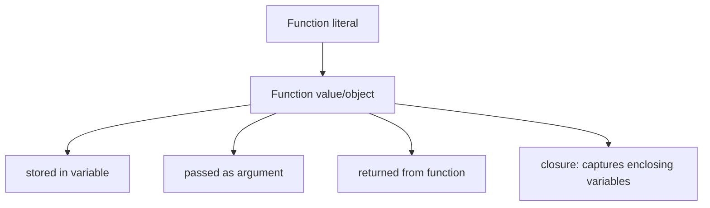
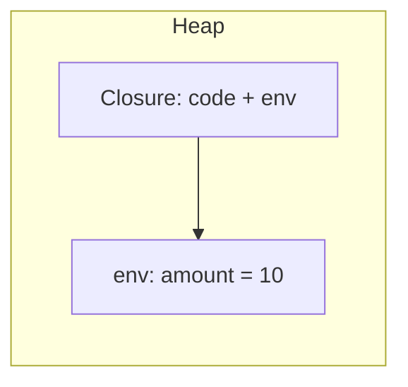
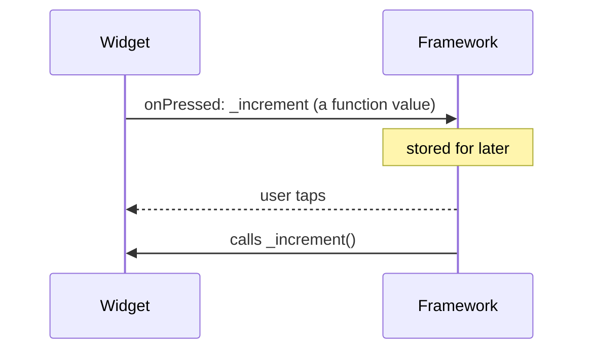

# Functions (Parameters, Arrow, Closures, Higher-Order, `typedef`)

> A function is a first-class value in Dart: it can be stored, passed, and returned — which is what makes callbacks, `map`/`where`, and Flutter's builder pattern possible.

## Introduction

Functions in Dart are **first-class objects**. This file covers the parameter system (positional, optional, named, required), arrow syntax, closures, higher-order functions, and `typedef` — the machinery behind every Flutter callback (`onPressed`, `builder`, `onChanged`).

## Why this concept exists

UI is event-driven: you must hand the framework code to run *later* ("when tapped, do this"). That requires treating functions as values you can pass around. First-class functions and closures make declarative, reactive UIs expressible without boilerplate observer classes.

## Real-world analogy

A function is a **recipe card**. A first-class function means you can hand the card to someone else (pass it), file it in a box (store it), or have a recipe that produces new recipes (return one). A closure is a recipe card with a **sticky note** attached remembering an ingredient from where it was written.

## Problem Statement

You want a button that increments a counter, a list that maps `Person → name`, and a factory that builds `+N` adder functions. All three need functions-as-values. By the end you'll write each idiomatically.

## Internal Working



Parameter kinds:

| Kind | Syntax | Notes |
|------|--------|-------|
| Positional required | `f(a, b)` | order matters |
| Optional positional | `f(a, [b, c])` | must be nullable or have default |
| Named | `f({a, b})` | optional by default, order-free |
| Named required | `f({required a})` | caller must pass |

- **Arrow** `=> expr` is sugar for `{ return expr; }` for a single expression.
- **Closure**: an inner function that captures and retains variables from its lexical scope, keeping them alive after the outer scope returns.
- **Higher-order function**: takes and/or returns a function.
- **`typedef`**: a named alias for a function signature.

## Memory Representation

- A closure is a heap object holding a code pointer **plus** references to the captured variables (its *environment*). Captured variables are promoted from the stack to the heap so they survive after the enclosing function returns.
- Each call to a closure factory creates a **new, independent** environment.



## Compiler Behavior

- The compiler infers function types; `(p) => p.city` has inferred type `String Function(Person)` from context.
- Passing `f()` (call) where `f` (reference) is expected is a common type error the compiler catches.
- Tear-offs: `list.forEach(print)` passes `print` as a value (a method tear-off).

## Runtime Behavior

- Calling a closure reads its captured environment; a counter closure mutates the *same* captured variable each call.
- Missing required named arg → compile error; a wrong-type arg to a `dynamic`-typed call → runtime error.

## Flutter Engine Behavior

Not applicable directly — but the framework stores your callback/builder closures and invokes them during event dispatch and the build phase.

## Dart VM Behavior

- Closures are ordinary allocations subject to GC; heavily-created short-lived closures (e.g., rebuilt every frame) add GC pressure — a real Flutter performance consideration.

## Examples

```dart
typedef IntTransform = int Function(int value); // named signature

IntTransform makeAdder(int amount) {
  return (value) => value + amount; // closure capturing `amount`
}

int Function() makeCounter() {
  var count = 0;                 // captured, mutable
  return () => ++count;          // remembers & mutates the same count
}

String describe(String name, {int age = 0, required String city}) =>
    '$name ($age) from $city';

void main() {
  final addTen = makeAdder(10);
  print(addTen(5)); // 15

  final counter = makeCounter();
  print(counter()); // 1
  print(counter()); // 2 — same captured count

  // higher-order: map takes a function
  final people = [('Alice', 'Mumbai'), ('Bob', 'Delhi')];
  final names = people.map((p) => p.$1).toList();
  print(names); // [Alice, Bob]

  // named + required + default
  print(describe('Ada', city: 'London'));        // Ada (0) from London
  print(describe('Ada', age: 36, city: 'London')); // Ada (36) from London

  // reference vs call:
  void sayHi() => print('hi');
  final ref = sayHi; // store the function
  ref();             // hi — now it runs
}
```

## Diagrams



## Common Mistakes

| Mistake | Why it's wrong | Fix |
|---------|----------------|-----|
| `onPressed: myFn()` | Runs during build, not on tap | `onPressed: myFn` (reference) |
| Mixing `[optional]` and `{named}` | Illegal in one signature | Choose one style |
| Capturing a loop variable unexpectedly | Closures capture the variable, not its value | Use `for (final x in ...)` (fresh binding) |
| Rebuilding heavy closures every frame | GC pressure/jank | Hoist stable callbacks; use `const`/fields |

## Best Practices

- Prefer **named parameters** for 2+ optional args (self-documenting — why Flutter widgets use them).
- Use arrow syntax only for genuinely single expressions.
- Pass function **references**, not calls, to callbacks.
- Name function-type parameters clearly (`onTap`, `keyOf`, `builder`).

## Performance

- Method tear-offs and hoisted callbacks avoid per-frame closure allocation.
- Closures are cheap individually but costly in hot paths (per-item in huge lists, per-frame in animations).

## Advantages

- Enables declarative, reactive, callback-driven APIs.
- Closures give encapsulated, private mutable state without a class.

## Disadvantages

- Over-capturing can retain memory longer than expected (a captured object can't be GC'd while the closure lives).
- Closures in hot paths add allocation/GC cost.

## Interview Questions

1. **🟢 What is a first-class function?** — Functions can be stored in variables, passed as arguments, and returned from other functions.
2. **🟢 Difference between `=>` and `{}` bodies?** — `=>` is a single expression with an implicit return; `{}` is a block requiring an explicit `return`.
3. **🟡 What is a closure? Give an example.** — A function that captures and retains variables from its lexical scope. `int Function() c() { var n=0; return ()=>++n; }` keeps `n` alive across calls.
4. **🟡 Named vs optional-positional parameters — when each?** — Named for clarity/many optionals (order-free, `required`-able); optional positional for a few natural, ordered args.
5. **🟡 Why is `onPressed: myFn()` a bug?** — It *calls* `myFn` during build and passes its return value; you want to pass the function reference `myFn` to be called on the event.
6. **🔴 How can closures cause memory leaks in Flutter?** — A closure retains its captured variables (e.g., `this`/`BuildContext`); if stored long-lived (a stream subscription, a static), it keeps those objects alive. Cancel/dispose to release.
7. **🔴 What is a higher-order function? Name three in the SDK.** — Takes/returns a function; e.g., `Iterable.map`, `where`, `fold`, `List.sort` (compare).

## Senior Engineer Tips

- Treat callbacks as part of your API contract — document *when* they fire and on which thread.
- In lists/animations, hoist callbacks out of `build` to avoid per-frame allocations.
- `typedef` your recurring callback signatures for readability and refactorability.

## Architect Perspective

Function-as-value is the backbone of dependency inversion in Dart: instead of injecting whole strategy classes, you can inject a function. This underpins clean separation between UI and logic (pass a `VoidCallback` up, a `ValueChanged<T>` down) and the builder/strategy patterns in [Module 05](../05%20Design%20Patterns/README.md).

## Summary

- Functions are first-class values; closures capture their environment.
- Parameters: positional required, optional positional `[]`, named `{}`, `required`.
- Pass references to callbacks; prefer named params; mind closure allocation in hot paths.

## Revision Notes

- First-class: store/pass/return functions. Closure: remembers outer-scope vars.
- `=>` single expr; `{}` needs `return`.
- Named `{}` optional by default; add `required`. Can't mix `[]` and `{}`.
- Callback = pass `fn` not `fn()`.
- Closures in hot paths → GC pressure; hoist them.

## Practice Questions

1. Explain why each `makeCounter()` call has an independent count.
2. When would you `typedef` a function signature instead of inlining it?
3. Why do Flutter widgets favor named parameters?

## Coding Questions

1. Implement `List<R> mapList<T, R>(List<T> xs, R Function(T) f)` from scratch.
2. Write `Function debounce(void Function() fn, Duration d)` using a closure + `Timer`.
3. Build `makeMultiplier(int factor)` and demonstrate two independent multipliers.

## Mini Project

**Mini functional toolkit:** Implement `pipe`, `compose`, `memoize`, and `once` as pure-Dart higher-order functions with tests. `memoize` caches results in a captured `Map`; `once` runs a function at most one time. Acceptance: all four are generic, closure-based, and covered by simple assertions.
