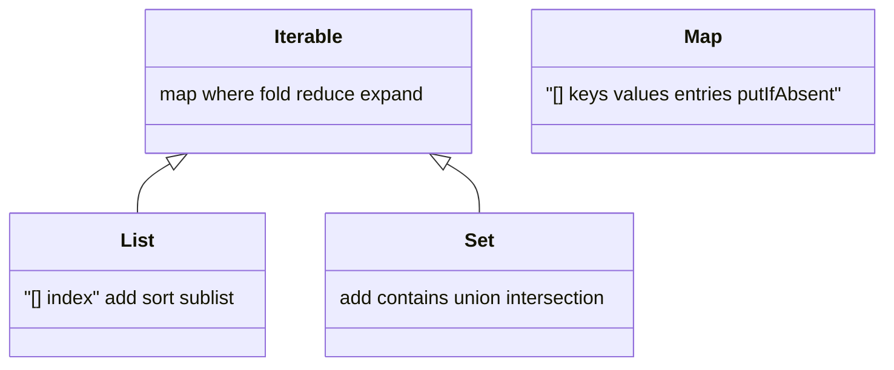
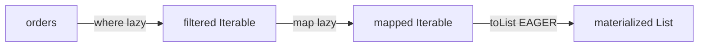

# Collections (`List`, `Set`, `Map`, `Iterable`, `Queue`) & Lazy Ops

> `Iterable` is the lazy sequence you compute on demand; `List`/`Set`/`Map` are the concrete, materialized structures you store data in.

## Introduction

Collections are how you group data. Dart's core collections are `List` (ordered, indexed, duplicates), `Set` (unique, fast membership), and `Map` (key→value). They all implement or relate to `Iterable`, whose methods (`map`, `where`, `fold`, `reduce`, `expand`) are the daily tools of every Dart developer — and several are **lazy**, which surprises people.

## Why this concept exists

Different access patterns need different structures: ordered access (`List`), deduplication/membership (`Set`), keyed lookup (`Map`), FIFO/deque (`Queue`). Laziness in `Iterable` avoids building intermediate collections you never fully consume — important for performance in pipelines and large data.

## Real-world analogy

- `List` = a **numbered shelf** (position matters, duplicates allowed).
- `Set` = a **guest list** (each name once; "is X invited?" is instant).
- `Map` = a **dictionary** (look up a definition by word).
- Lazy `Iterable` = a **recipe you haven't cooked yet** — nothing happens until you actually plate it (`toList()`/iterate).

## Problem Statement

You have a list of orders. You need: unique customer IDs, orders grouped by status, the total revenue, and the first order over ₹1000. You'll pick `Set` for uniqueness, a `Map<K,List<T>>` for grouping, `fold` for the total, and `firstWhere` for the search — and understand which of these are lazy.

## Internal Working



| Structure | Order | Duplicates | Lookup | Backing (default) |
|-----------|-------|-----------|--------|-------------------|
| `List` | insertion/index | yes | O(1) by index | growable array |
| `Set` | insertion (LinkedHashSet) | no | O(1) contains | hash set |
| `Map` | insertion (LinkedHashMap) | unique keys | O(1) by key | hash map |
| `Queue` | FIFO/deque | yes | O(1) ends | doubly linked / list |

**Lazy vs eager `Iterable` methods:**

| Lazy (return an `Iterable`, run on iteration) | Eager (run immediately) |
|----------------------------------------------|-------------------------|
| `map`, `where`, `expand`, `take`, `skip`, `followedBy` | `toList`, `toSet`, `forEach`, `fold`, `reduce`, `any`, `every`, `join`, `length` |

## Memory Representation

- `List` is a contiguous growable array (amortized O(1) append, occasional realloc + copy on growth).
- `Set`/`Map` are hash tables; iteration order preserved via a linked structure (`LinkedHashSet`/`LinkedHashMap`).
- Lazy `Iterable`s store the source + transformation, not the results — minimal memory until materialized.

## Compiler Behavior

- Literal inference: `[1,2]`→`List<int>`, `{1,2}`→`Set<int>`, `{'a':1}`→`Map<String,int>`. **`{}` alone is a `Map`, not a `Set`** — annotate `<int>{}` for an empty set.
- Type args flow through: `map((x)=>x.toString())` yields `Iterable<String>`.

## Runtime Behavior

- `reduce` on an empty iterable **throws**; `fold` returns the seed.
- Modifying a collection while iterating throws `ConcurrentModificationError`.
- Lazy chains re-execute on each iteration — iterating a lazy `where().map()` twice runs the transforms twice.

## Flutter Engine Behavior

Not applicable. (But `ListView.builder` relies on lazy, index-driven construction — the same "compute on demand" philosophy; see [Module 07 Widgets](../07%20Widgets/README.md).)

## Dart VM Behavior

- Growable list growth is amortized; large known sizes benefit from `List.filled`/`List.generate` to avoid repeated reallocs.
- Hash collections rely on correct `hashCode`/`==` — custom keys with bad hashing degrade to O(n).

## Examples

```dart
class Order {
  final String customer;
  final String status; // 'paid' | 'pending'
  final int amount;
  const Order(this.customer, this.status, this.amount);
}

Map<K, List<T>> groupBy<T, K>(Iterable<T> items, K Function(T) keyOf) {
  final result = <K, List<T>>{};
  for (final item in items) {
    result.putIfAbsent(keyOf(item), () => <T>[]).add(item);
  }
  return result;
}

void main() {
  final orders = [
    const Order('A', 'paid', 1200),
    const Order('B', 'pending', 300),
    const Order('A', 'paid', 800),
  ];

  // unique customers -> Set
  final customers = orders.map((o) => o.customer).toSet();
  print(customers); // {A, B}

  // group by status -> Map<K, List<T>>
  final byStatus = groupBy(orders, (o) => o.status);
  print(byStatus.keys); // (paid, pending)

  // total revenue -> fold (eager, empty-safe)
  final total = orders.fold<int>(0, (sum, o) => sum + o.amount);
  print(total); // 2300

  // first over 1000 -> firstWhere with orElse
  final big = orders.firstWhere((o) => o.amount > 1000,
      orElse: () => const Order('none', 'n/a', 0));
  print(big.amount); // 1200

  // LAZY gotcha:
  var evaluations = 0;
  final lazy = orders.where((o) {
    evaluations++;
    return o.status == 'paid';
  });
  print('evaluations so far: $evaluations'); // 0 — nothing ran yet!
  final paid = lazy.toList();                 // NOW it runs
  print('after toList: $evaluations, paid: ${paid.length}'); // 3, 2

  // empty set vs empty map:
  final emptySet = <int>{}; // {} alone would be a Map
  print(emptySet.runtimeType);
}
```

## Diagrams



## Common Mistakes

| Mistake | Why | Fix |
|---------|-----|-----|
| `{}` for an empty Set | It's a `Map` | Use `<T>{}` |
| `reduce` on possibly-empty list | Throws | Use `fold(seed, ...)` |
| Assuming `map`/`where` ran | They're lazy | Materialize with `toList()`/`toSet()` |
| Mutating during iteration | `ConcurrentModificationError` | Iterate a copy or build a new collection |
| Custom map keys without `hashCode`/`==` | Lookups fail / O(n) | Implement both (or use records/`equatable`) |

## Best Practices

- Pick the structure by access pattern: `List` ordered, `Set` unique/contains, `Map` lookups, `Queue` FIFO/deque.
- Prefer immutable/`const` collections where possible; `List.unmodifiable` for defensive exposure.
- Materialize lazy chains once if you'll iterate multiple times.
- Use `fold` (empty-safe, any result type) over `reduce` unless the first element is a natural seed.

## Performance

- Lazy pipelines avoid intermediate lists — great for large data, but re-run on each iteration.
- `List.generate`/`filled` for known sizes; `StringBuffer` for string joins in hot loops.
- Hash-collection performance hinges on good `hashCode`.

## Advantages / Disadvantages

- **+** Rich, uniform `Iterable` API; laziness saves memory/time; hash structures are O(1).
- **−** Laziness surprises (side effects, repeated evaluation); wrong structure choice costs performance.

## Interview Questions

1. **🟢 `List` vs `Set` vs `Map`?** — Ordered+indexed+dups; unique+fast-contains; key→value+unique-keys.
2. **🟢 How to dedupe a list?** — `list.toSet().toList()` (order preserved via LinkedHashSet).
3. **🟡 Are `map`/`where` eager or lazy?** — Lazy; they return an `Iterable` computed on iteration. Materialize with `toList()`/`toSet()`.
4. **🟡 `fold` vs `reduce`?** — `reduce` uses the first element as seed and throws on empty (result type = element type); `fold` takes an explicit seed (empty-safe, result type can differ).
5. **🟡 Why is `{}` a Map, not a Set?** — Historical/literal-ambiguity resolution; empty braces default to `Map`. Use `<T>{}` for a Set.
6. **🔴 What breaks hash-based lookups for custom keys?** — Not overriding `hashCode`/`==`; equal-by-value keys hash differently, so lookups miss.
7. **🔴 What is `expand`?** — flatMap: maps each element to an iterable, then flattens — 1→many.

## Senior Engineer Tips

- Beware side effects inside lazy `map`/`where`; they run at iteration time, possibly more than once.
- For grouping, `putIfAbsent(key, () => [])..add(x)` (or the `collection` package's `groupBy`) is the idiom.
- Expose collections as unmodifiable views from APIs to prevent external mutation.

## Architect Perspective

Choice of collection and immutability policy ripples into state management correctness (diffing relies on equality), memory (large lists vs lazy streams), and API safety (unmodifiable views). Establish conventions early: immutable domain collections, lazy pipelines for large transforms, and value-equality on keys.

## Summary

- `Iterable` is lazy; `List`/`Set`/`Map`/`Queue` are concrete with distinct tradeoffs.
- `map`/`where`/`expand`/`take`/`skip` are lazy; `toList`/`fold`/`forEach` are eager.
- `{}` = Map; use `<T>{}` for a Set; override `hashCode`/`==` for custom keys.

## Revision Notes

- `List`=ordered/dups, `Set`=unique/contains, `Map`=lookup, `Queue`=FIFO/deque.
- Lazy: map/where/expand/take/skip. Eager: toList/toSet/fold/reduce/forEach/join.
- `reduce` throws on empty; `fold` empty-safe + any result type.
- `{}`→Map; `<T>{}`→Set. Custom keys → `hashCode`+`==`.
- Dedupe: `toSet().toList()`.

## Practice Questions

1. Predict the printed `evaluations` count in the lazy example and explain.
2. When does `firstWhere` throw, and how do you make it safe?
3. Why does a `Set` of a class with only `==` overridden still allow "duplicates"?

## Coding Questions

1. Implement `groupBy<T,K>` and group a list of words by first letter.
2. Write `Map<T,int> frequency<T>(Iterable<T> xs)` counting occurrences.
3. Implement a bounded LRU-ish cache using `LinkedHashMap` (evict oldest at capacity).

## Mini Project

**Order analytics (pure Dart):** From a list of `Order`s, compute unique customers, revenue per status (grouped map), top customer by spend, and a lazily-filtered "large orders" pipeline you materialize once. Print a small report. Acceptance: correct use of `Set`/`Map`/`fold`; a comment proving you understand where laziness kicks in; `dart analyze` clean.
