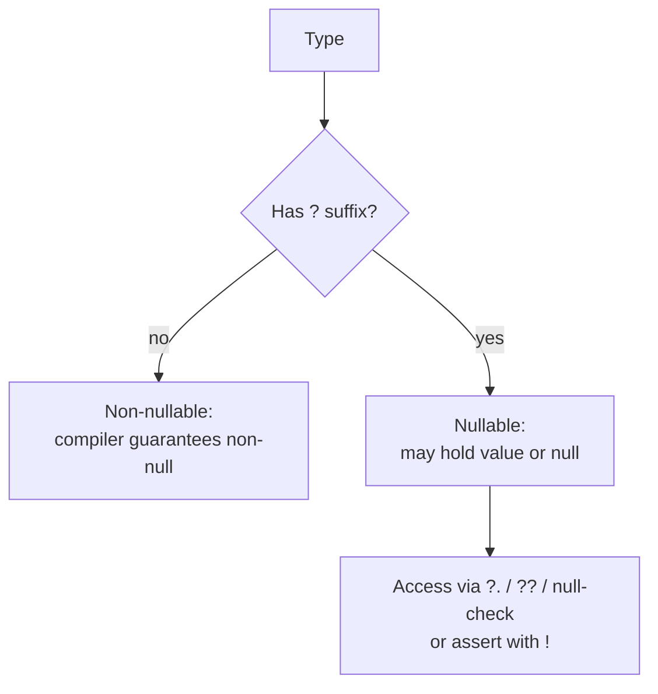
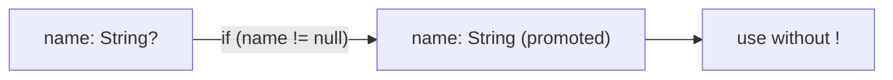

# Null Safety (`?`, `!`, `??`, `??=`, `late`, flow analysis)

> Sound null safety means a non-nullable type is *guaranteed* non-null at runtime — the compiler proves it, so a whole class of crashes becomes impossible.

## Introduction

Dart has **sound null safety**: types are non-nullable by default, and you opt into nullability with `?`. This file covers the operators (`?.`, `??`, `??=`, `!`), the `late` keyword, and **flow analysis / type promotion** — the compiler feature that makes null safety ergonomic.

## Why this concept exists

The "billion-dollar mistake" — null dereferences — was the single largest source of mobile crashes. Null safety moves those errors from **runtime** (crash in the user's hands) to **compile time** (red squiggle in your editor). "Sound" means the guarantee can be *trusted*: there are no hidden nulls sneaking through typed code.

## Real-world analogy

A non-nullable `String` is a **sealed box guaranteed to contain a letter**. `String?` is a box that **might be empty**. `?.` = "open only if there's a letter." `??` = "if empty, use this spare letter." `!` = "I swear this box has a letter" — and if you're wrong, it explodes immediately (fail-fast).

## Problem Statement

A user profile has an optional `middleName` and a required `id`. You must display the middle name or a fallback, never crash, and assert the `id` is present after login. By the end you'll pick `?.`/`??` for the optional field and `!` (or better) for the guaranteed one.

## Internal Working



Operators:

| Operator | Meaning |
|----------|---------|
| `T?` | nullable type |
| `?.` | null-aware access — whole expression is `null` if receiver is `null` |
| `??` | if-null — `a ?? b` returns `b` when `a` is `null` |
| `??=` | null-aware assign — assign only if currently `null` |
| `!` | null assertion — asserts non-null; **throws** if actually `null` |
| `...?` | null-aware spread; `?..` null-aware cascade |

**Flow analysis / promotion:** after `if (x != null)`, the compiler *promotes* `x` to non-nullable inside that block, so you can use it without `!`.

## Memory Representation

- `null` is a single canonical `Null` instance shared program-wide.
- Nullability is a **static** property (compile-time type), not a runtime tag — there's no per-value "nullable flag"; the type system tracks it.

## Compiler Behavior

- A non-nullable variable **must** be definitely assigned before use.
- Promotion works on **local** variables and `final` fields, but **not** on non-final instance fields (another method could mutate them between check and use).
- Using `!` compiles to a runtime null-check that throws on failure.

## Runtime Behavior

- `x!` when `x` is `null` → throws `_TypeError`: *"Null check operator used on a null value."*
- `late` variable read before assignment → `LateInitializationError`.
- `?.`, `??`, `??=` never throw due to null; they gracefully short-circuit.

## Flutter Engine Behavior

Not applicable — pure language feature. (But null safety eliminates a large share of Flutter runtime crashes, improving perceived stability.)

## Dart VM Behavior

- Sound null safety lets the AOT compiler **omit** many null checks it would otherwise insert, and enables tighter code generation — a modest performance win alongside the correctness win.

## Examples

```dart
class User {
  final String id;
  final String? middleName; // optional
  User(this.id, {this.middleName});
}

String display(User u) {
  // optional -> graceful fallback
  final mid = u.middleName ?? '(none)';
  return '${u.id}: $mid';
}

void main() {
  final a = User('u1', middleName: 'Quorra');
  final b = User('u2');
  print(display(a)); // u1: Quorra
  print(display(b)); // u2: (none)

  String? maybe;
  print(maybe?.length);      // null — null-aware, no crash
  print(maybe ?? 'default'); // default
  maybe ??= 'assigned';      // assigns because it was null
  print(maybe);              // assigned

  // flow promotion:
  String? name = _fetch();
  if (name != null) {
    print(name.length); // OK — promoted to non-null String here
  }

  // ! asserts an invariant (fail-fast if wrong):
  final id = _loggedInUserId()!; // we KNOW we're logged in
  print(id.length);
}

String? _fetch() => 'Ada';
String? _loggedInUserId() => 'u42';
```

## Diagrams



## Common Mistakes

| Mistake | Why it's wrong | Fix |
|---------|----------------|-----|
| Sprinkling `!` to silence the analyzer | Reintroduces crashes | Use `?.`/`??`/null-check; reserve `!` for true invariants |
| Expecting promotion on instance fields | Non-final fields don't promote | Copy to a local: `final v = obj.field; if (v != null) ...` |
| `late` to dodge nullability when null is valid | Turns a valid state into a crash | Use `T?` when absence is legitimate |
| `a ?? b` vs `a ??= b` confusion | Different semantics | `??` returns; `??=` assigns-if-null |

## Best Practices

- Ask: **"Can null happen in normal use?"** → yes: `?.`/`??`. **"Would null mean a bug?"** → yes: `!` (fail-fast).
- Prefer nullable types over `late` unless you have a real deferred-init pattern.
- Copy nullable instance fields to locals to enable promotion.
- Provide sensible defaults with `??` at the UI boundary.

## Performance

- Null safety enables the compiler to drop redundant null checks (minor speedup).
- `!` inserts a check; negligible individually, but don't scatter it needlessly.

## Advantages

- Eliminates null-dereference crashes from typed code.
- Self-documents intent (which values can be absent).
- Enables compiler optimizations.

## Disadvantages

- `late` and `!` can move errors back to runtime if misused.
- Migration friction for legacy code (historical).

## Interview Questions

1. **🟢 What does "sound" null safety mean?** — The non-null guarantee holds at runtime; the compiler statically proves non-nullable values are never null, so no hidden null crashes from typed code.
2. **🟢 Difference between `?` and `!`?** — `?` makes a type nullable (declaration); `!` asserts non-null at a use site (may throw).
3. **🟡 When does `!` throw?** — When applied to a value that is actually `null`, throwing "Null check operator used on a null value."
4. **🟡 `??` vs `??=`?** — `a ?? b` is an expression returning `a` or `b`; `a ??= b` assigns `b` to `a` only if `a` is `null`.
5. **🟡 Why might promotion fail on a class field?** — Non-final fields can be mutated between the check and use (even concurrently), so the compiler can't guarantee it stays non-null. Use a local or `final`.
6. **🔴 Why does `!` even exist if `?.` is safe?** — `!` asserts an *invariant the compiler can't prove* (e.g., "we're logged in"). If violated, you want a loud, immediate crash (fail-fast) rather than silently corrupt state.
7. **🔴 The two legitimate uses of `late`?** — Deferred init of a non-nullable (set before first read, e.g., in `initState`); and lazy init of a `final` (computed once on first access).

## Senior Engineer Tips

- `!` is a *claim about your system*, not a null handler. Put it only where a layer above genuinely guarantees non-null (post-login, required ctor arg, validated input).
- Treat every `late` as a small debt: it's a runtime check you accepted in exchange for non-null typing.
- In reactive code, model "loading/absent/present" with a sealed type rather than nullable-plus-bool flags.

## Architect Perspective

Null safety is a system-wide invariant strategy. Decide *where* nullability is allowed (edges/DTOs) and *where* it's forbidden (domain entities). Domain models should be non-nullable and validated at construction, so the rest of the system never null-checks business data. This dovetails with DDD value objects ([Module 46](../46%20Domain%20Driven%20Design/README.md)) and typed failures ([Module 38](../38%20Error%20Handling/README.md)).

## Summary

- Non-nullable by default; opt in with `?`. Sound = trustworthy at runtime.
- `?.`/`??`/`??=` handle null gracefully; `!` asserts non-null and fails fast.
- Flow analysis promotes locals/finals after a null check; instance fields don't promote.

## Revision Notes

- `?` declares nullable; `!` asserts non-null (may throw).
- `??` fallback (expression); `??=` assign-if-null.
- Promotion: locals/finals yes, non-final fields no → copy to local.
- Null valid → `?.`/`??`; null = bug → `!` (fail fast).
- `late`: deferred non-null init OR lazy final; read-before-set → `LateInitializationError`.

## Practice Questions

1. Rewrite `if (u.middleName != null) print(u.middleName!.length);` without `!` (hint: local).
2. Give one case each where `!` is correct and where it's an abuse.
3. Why can't the compiler promote a `var` instance field?

## Coding Questions

1. Implement `T orElse<T>(T? value, T fallback) => value ?? fallback;` and test with null/non-null.
2. Write a `Cache` with `late final Map<String,int> _store` initialized lazily; prove it initializes on first access only.
3. Model a `RemoteData` sealed type (`Loading`/`Error`/`Data<T>`) that replaces `T? data + bool loading + String? error`.

## Mini Project

**Null-safe settings resolver:** Build `Settings` where each getter resolves user override → remote default → hardcoded default using `??` chains, exposes only non-nullable resolved values, and uses `!` nowhere. Add one `late final` expensive computed value. Acceptance: no runtime null crash possible; `dart analyze` clean; a test proves fallbacks resolve correctly.
