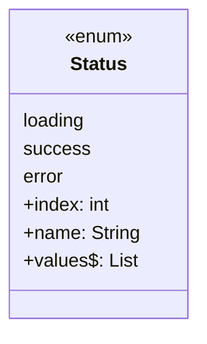
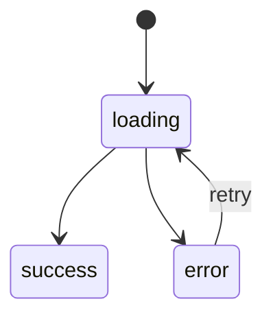

# Enums (Basic & Enhanced)

> An enum is a type with a fixed, named set of instances — the safest way to model "one of a known set of options."

## Introduction

Enums model a closed set of constants (`Status.loading`, `Status.error`). Dart 2.17+ added **enhanced enums**: enums can now have fields, constructors, methods, and implement interfaces — closing much of the gap with full classes while keeping exhaustiveness.

## Why this concept exists

Using raw strings/ints for states (`"loading"`, `0`) is error-prone: typos compile, invalid values slip through, and `switch` can't be exhaustive. Enums give the compiler a **closed set** to check, enabling exhaustive `switch` and eliminating "magic value" bugs.

## Real-world analogy

An enum is a **gear stick**: P, R, N, D — a fixed set of positions. You can't shift into "banana." Enhanced enums add a **label and behavior** to each position (e.g., each gear knows its display name and whether the car can move).

## Problem Statement

Model an HTTP request state and a set of user roles where each role carries a permission level and a display label, then exhaustively map state → UI. You'll use a basic enum for state and an enhanced enum for roles.

## Internal Working



- Every enum value has `index` (declaration order) and `name` (its identifier as a string).
- `Status.values` is the list of all values (great for iteration/dropdowns).
- **Enhanced enums** declare a `const` constructor and `final` fields; each value calls the constructor with its arguments.
- Enums can implement interfaces and define methods/getters, but cannot be `extended`.

## Memory Representation

- Enum values are `const`, canonicalized singletons — one instance per value, shared everywhere. Comparisons are identity-fast.

## Compiler Behavior

- `switch` over an enum without covering all values (and no `_`) is a **compile error** — exhaustiveness.
- Enhanced enum constructors must be `const`; fields must be `final`.

## Runtime Behavior

- `Status.values`, `.name`, `.index` available at runtime.
- Parse from string via `Status.values.byName('error')` (throws if absent) or `firstWhere` with `orElse`.

## Flutter Engine Behavior

Not applicable. (Enums are the idiomatic backing for state in `build` switches and for typed configuration like `MainAxisAlignment`.)

## Dart VM Behavior

- Enum switches over dense indices may compile to jump tables (fast dispatch).

## Examples

```dart
// Basic enum
enum Status { loading, success, error }

// Enhanced enum: fields + const ctor + method + interface
enum Role implements Comparable<Role> {
  guest(0, 'Guest'),
  member(1, 'Member'),
  admin(2, 'Administrator');

  const Role(this.level, this.label);
  final int level;
  final String label;

  bool get canModerate => level >= member.level;

  @override
  int compareTo(Role other) => level.compareTo(other.level);
}

String view(Status s) => switch (s) {
      Status.loading => 'Spinner',
      Status.success => 'Content',
      Status.error => 'Retry',
    };

void main() {
  print(view(Status.success)); // Content

  print(Status.error.name);    // error
  print(Status.error.index);   // 2
  print(Status.values);        // [Status.loading, Status.success, Status.error]

  final r = Role.admin;
  print('${r.label} lvl=${r.level} mod=${r.canModerate}'); // Administrator lvl=2 mod=true

  // parse from string safely
  final parsed = Role.values.byName('member');
  print(parsed.label); // Member

  // sort using Comparable
  final roles = [Role.admin, Role.guest, Role.member]..sort();
  print(roles.map((e) => e.label).toList()); // [Guest, Member, Administrator]
}
```

## Diagrams



## Common Mistakes

| Mistake | Why | Fix |
|---------|-----|-----|
| Using `String`/`int` constants instead of enums | Typos compile, no exhaustiveness | Use an enum |
| Adding `_`/`default` to enum `switch` | Kills exhaustiveness protection | Handle each case explicitly |
| `byName` on untrusted input without catch | Throws `ArgumentError` | `values.firstWhere(..., orElse:)` or try/catch |
| Persisting `index` to storage | Reordering values corrupts data | Persist `name` (stable string) |

## Best Practices

- Prefer enums (basic or enhanced) over magic values.
- Persist/serialize by **`name`**, not `index`.
- Use enhanced enums when each value needs data/behavior; keep them small and cohesive.
- Omit `_` in switches to keep the compiler enforcing new variants.

## Performance

- Enum values are canonical singletons — equality/switch is very cheap; safe to use in hot paths.

## Advantages / Disadvantages

- **+** Type-safe closed set, exhaustive switching, self-documenting; enhanced enums carry data/behavior.
- **−** Can't be extended; not suitable for open/extensible sets (use sealed classes for open hierarchies with payloads).

## Interview Questions

1. **🟢 What is an enum and why prefer it over string constants?** — A type with a fixed set of named instances; it gives compile-time safety and exhaustive switching that string constants can't.
2. **🟢 What do `.name`, `.index`, and `.values` give you?** — The value's identifier string, its zero-based declaration position, and the list of all values.
3. **🟡 What are enhanced enums?** — Enums with `const` constructors, `final` fields, methods/getters, and interface implementation (Dart 2.17+).
4. **🟡 Why persist `name` instead of `index`?** — `index` shifts if you reorder/insert values, corrupting stored data; `name` is stable.
5. **🔴 Enum vs sealed class — when each?** — Enum for a fixed set of simple singletons; sealed class when variants carry different payloads/shapes (e.g., `Success(data)` vs `Failure(error)`).
6. **🔴 Can enums implement interfaces or extend classes?** — Implement interfaces: yes. Extend classes: no.

## Senior Engineer Tips

- Reach for enhanced enums to attach display labels, API codes, or capability flags to each value — avoids parallel maps.
- For state with data, prefer **sealed classes** (Dart 3) over enums; use enums for pure options.
- Add a `fromApi`/`byName`-with-fallback factory for robust deserialization.

## Architect Perspective

Enums (and sealed types) are the vocabulary of your domain's finite states and options. Modeling them precisely makes state machines, feature flags, and permissions type-safe end to end, and keeps serialization stable across app versions — a real production concern for stored/enum'd data.

## Summary

- Enums model a closed set of named singletons with `name`/`index`/`values`.
- Enhanced enums add fields, `const` ctors, methods, and interfaces.
- Prefer them over magic values; serialize by `name`; use sealed classes when variants carry data.

## Revision Notes

- Enum = fixed named singletons; canonical + cheap equality.
- `.name` `.index` `.values`; parse via `values.byName`/`firstWhere`.
- Enhanced enum = fields + `const` ctor + methods + `implements`.
- Persist `name` not `index`. Sealed class for payload-carrying variants.

## Practice Questions

1. Why does adding a new enum value to an exhaustive switch cause a helpful compile error?
2. When would you migrate an enum to a sealed class?
3. What goes wrong if you stored `index` and later alphabetized the enum?

## Coding Questions

1. Model `enum Weekday` with an enhanced `isWeekend` getter and a `today`-style parser.
2. Build `enum HttpStatus` carrying the numeric code + category, with a `fromCode` factory.
3. Implement a role-based `canAccess(Role, Feature)` using an enhanced enum's `level`.

## Mini Project

**Permissions engine (pure Dart):** Define an enhanced `Role` enum (level + label) and a `Feature` enum, plus a function gating features by role level. Add safe parsing from strings and an exhaustive `switch` mapping roles to a home-screen label. Acceptance: no magic strings; serialization by name; `dart analyze` clean; tests cover access rules.
