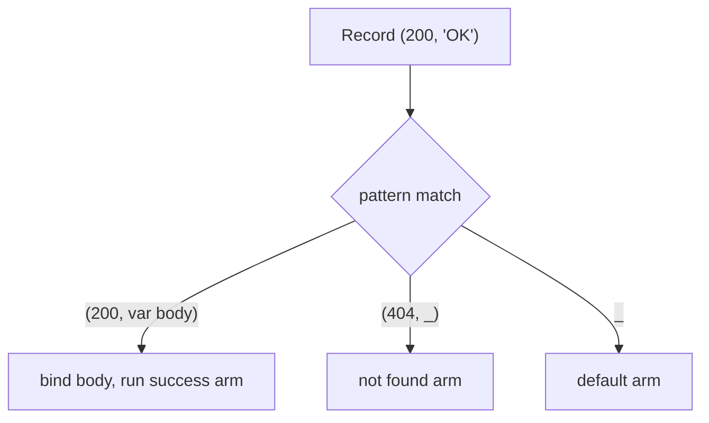
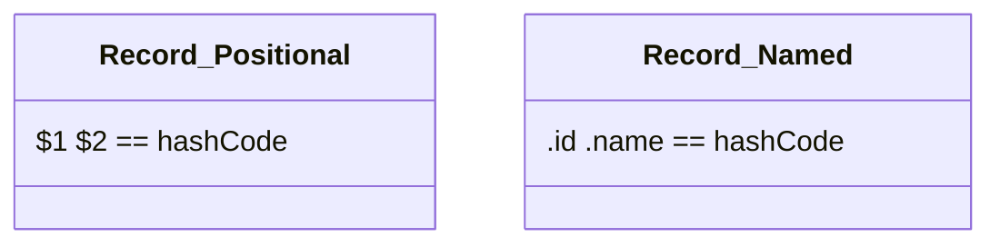

# Records & Patterns (Dart 3)

> Records are lightweight anonymous tuples for bundling values; patterns are a syntax for destructuring and matching them — together they make data flow concise and type-safe.

## Introduction

**Records** (Dart 3) are immutable, anonymous aggregates: `(int, String)` or `(id: 1, name: 'A')`. **Patterns** let you *destructure* records, lists, maps, and objects, and *match* them in `switch`, `if-case`, and variable declarations. This is one of the biggest ergonomic leaps in modern Dart.

## Why this concept exists

Before records, returning multiple values meant creating a throwaway class or abusing `List`/`Map`. Records solve that with zero boilerplate. Patterns solve the inverse problem: pulling structured data apart safely and exhaustively, replacing towers of `if`/`is`/cast with declarative matching.

## Real-world analogy

A record is a **labeled lunchbox** with compartments (`(main: rice, side: salad)`) — no need to design a "LunchBox class." A pattern is a **cookie cutter**: press it onto dough (your data) and it both *checks the shape* and *cuts out the pieces* you named.

## Problem Statement

A function must return both a status code and a body. A caller must handle `(200, body)` vs `(404, _)` vs anything else, and destructure a `{'lat':.., 'lng':..}` map. You'll return a record and match with patterns.

## Internal Working



**Records:**
- Positional: `(1, 'a')` with fields `$1`, `$2`. Named: `(id: 1, name: 'a')` with fields `.id`, `.name`.
- Immutable; **structural equality** (two records with equal fields are `==`) and a sensible `hashCode` — for free.
- The type is the shape: `(int, String)` or `({int id, String name})`.

**Patterns** appear in:
- Destructuring declarations: `final (a, b) = (1, 2);`
- `switch` expressions/statements (with exhaustiveness).
- `if-case`: `if (json case {'lat': double lat}) ...`
- Guards: `case (var x, var y) when x > y`.

Pattern kinds: record, list `[a, b, ...rest]`, map `{'k': v}`, object `User(:name)`, variable `var x`, constant `200`, wildcard `_`, logical-or `A || B`, cast `x as T`, null-check `x?`.

## Memory Representation

- Records are immutable heap objects holding their fields; the compiler generates their equality/hashCode. Small records are cheap; they're value-like in behavior but reference objects in memory.

## Compiler Behavior

- Record types are structural: `(int, String)` from two places are the same type.
- `switch` with patterns is checked for **exhaustiveness** (over sealed types/enums/bool).
- Refutable patterns in `if-case`/`switch` compile to efficient tests + binds; irrefutable ones in declarations always match.

## Runtime Behavior

- Destructuring binds new variables; `if-case` runs the branch only if the pattern matches.
- Record equality compares fields structurally at runtime.

## Flutter Engine Behavior

Not applicable. (Records are handy for returning e.g. `(Widget, VoidCallback)` from helpers, and patterns clean up `build` logic.)

## Dart VM Behavior

- Pattern matching lowers to comparisons/type-tests; dense constant patterns can use jump tables like `switch`.

## Examples

```dart
// return multiple values with a record
(int code, String body) fetch(bool ok) =>
    ok ? (200, 'OK') : (404, 'Not Found');

// named record
({double lat, double lng}) origin() => (lat: 0.0, lng: 0.0);

void main() {
  // destructure a record
  final (code, body) = fetch(true);
  print('$code $body'); // 200 OK

  // switch with record patterns + guard
  final result = fetch(false);
  final message = switch (result) {
    (200, final b) => 'Success: $b',
    (404, _) => 'Missing',
    (final c, _) when c >= 500 => 'Server error $c',
    _ => 'Other',
  };
  print(message); // Missing

  // named record fields
  final o = origin();
  print('${o.lat}, ${o.lng}'); // 0.0, 0.0

  // structural equality — no class, still equal
  print((1, 'a') == (1, 'a')); // true

  // if-case: destructure a map safely
  final json = {'lat': 12.9, 'lng': 77.6};
  if (json case {'lat': final double lat, 'lng': final double lng}) {
    print('coords $lat,$lng'); // coords 12.9,77.6
  }

  // object pattern destructuring
  const user = (name: 'Ada', age: 36);
  final (name: n, age: a) = user;
  print('$n $a'); // Ada 36
}
```

## Diagrams



## Common Mistakes

| Mistake | Why | Fix |
|---------|-----|-----|
| Overusing records for domain models | Loses names/behavior/validation | Use a class for real domain concepts |
| Forgetting records are immutable | Can't reassign fields | Build a new record |
| Assuming positional and named interchange | Different types | Match the declared shape |
| Non-exhaustive pattern switch expecting a throw | Compile error (expression) or no-op (statement) | Cover cases or add `_` |

## Best Practices

- Use records for **transient, local** multi-value returns; graduate to a class when the shape gains meaning, invariants, or methods.
- Prefer **named** record fields when positions are ambiguous.
- Use `if-case` to validate+destructure JSON at boundaries.
- Keep pattern arms readable; extract complex logic into functions.

## Performance

- Records avoid allocating bespoke classes and give free equality — efficient for local data flow. Don't churn huge records in tight loops unnecessarily.

## Advantages / Disadvantages

- **+** Zero-boilerplate multi-returns, structural equality, powerful destructuring/matching, exhaustiveness.
- **−** No named type/behavior (records), can reduce self-documentation if overused; patterns have a learning curve.

## Interview Questions

1. **🟢 What is a record?** — An immutable, anonymous aggregate of values (positional and/or named) with structural equality and hashCode for free.
2. **🟢 How do you return two values without a class?** — Return a record: `(int, String) f() => (1, 'a');`.
3. **🟡 Records vs a class?** — Records for transient, unnamed bundles; classes for named domain types with invariants/behavior.
4. **🟡 Where can patterns appear?** — Destructuring declarations, `switch` expressions/statements, `if-case`, and `for-in` destructuring.
5. **🟡 Are records equal by value?** — Yes; structural equality — equal fields ⇒ `==` true.
6. **🔴 How do patterns improve JSON handling?** — `if (json case {'k': int v})` validates presence+type and binds in one expression, replacing nested `containsKey`/`is`/cast.
7. **🔴 What is a refutable vs irrefutable pattern?** — Refutable can fail to match (used in `switch`/`if-case`); irrefutable always matches (used in declarations).

## Senior Engineer Tips

- Records are perfect for `Iterable` transforms carrying an index/key alongside a value, and for returning `(value, error)` in simple internal APIs.
- Combine sealed classes + patterns for exhaustive, payload-carrying state machines — the modern replacement for enum-plus-nullable-fields.

## Architect Perspective

Patterns + sealed classes give Dart algebraic-data-type ergonomics: model domain states precisely and let the compiler enforce total handling. This raises correctness across large teams and pairs naturally with BLoC states, `Result` types ([Module 38](../38%20Error%20Handling/README.md)), and DDD ([Module 46](../46%20Domain%20Driven%20Design/README.md)).

## Summary

- Records: immutable anonymous tuples (positional/named) with free equality — great for multi-returns.
- Patterns: destructure + match across records/lists/maps/objects in `switch`/`if-case`/declarations.
- Prefer classes for domain types; use records for transient data.

## Revision Notes

- Record: `(1,'a')` / `(id:1)`; fields `$1`/`.id`; immutable; structural `==`.
- Patterns: destructure + match; `switch`/`if-case`/declaration; guards via `when`.
- `if (json case {'k': int v})` = validate + bind in one step.
- Sealed class + patterns = exhaustive ADT-style state.

## Practice Questions

1. Rewrite a "return a Map with 'ok' and 'data'" function to return a named record.
2. Convert a nested `if/is/cast` JSON parse into a single `if-case`.
3. When is a record the wrong choice, and what do you use instead?

## Coding Questions

1. Write `(int min, int max) bounds(List<int> xs)` and destructure the result.
2. Parse `{'type':'circle','r':2}` / `{'type':'rect','w':..,'h':..}` via `switch` map patterns into an area.
3. Implement a `divmod(int a, int b)` returning `(quotient, remainder)` as a record.

## Mini Project

**Tiny JSON shape validator:** Given raw maps for `Circle`/`Rectangle`/`Triangle`, use map + constant patterns in a `switch` to validate the shape and compute area, returning a `(bool ok, String message, double? area)` record. Acceptance: no manual `containsKey` chains; invalid shapes handled by a `_` arm; tests cover valid and invalid inputs.
