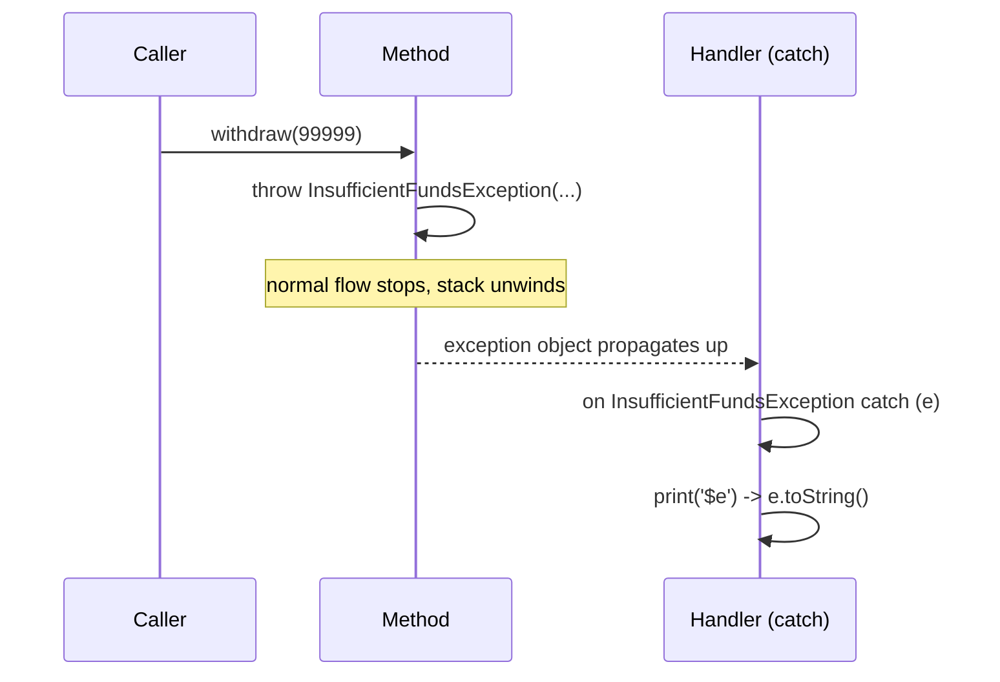
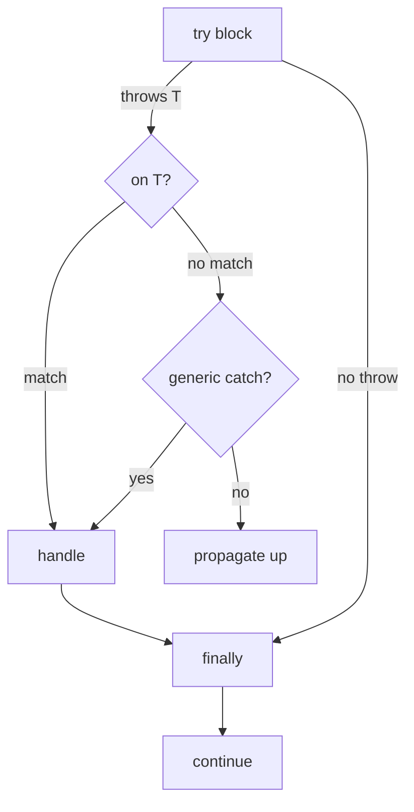

# Exception Handling (`throw`, `try`/`catch`/`on`/`finally`, custom exceptions)

> An exception is an object that signals "the normal flow can't continue"; handling it well means failing loudly where it's a bug and gracefully where it's expected.

## Introduction

Dart separates `Error` (programming bugs you should *fix*, e.g., `RangeError`, `AssertionError`) from `Exception` (recoverable conditions you should *handle*, e.g., `FormatException`, `IOException`). This file covers `throw`, `try`/`on`/`catch`/`finally`, custom exception types, and how the readable message actually comes from `toString()`.

## Why this concept exists

Real programs meet bad input, network failures, and missing files. Exceptions let you *interrupt* a failing computation and transfer control to a handler, instead of threading error codes through every return value. The `Error` vs `Exception` split encodes intent: fix the bug vs handle the situation.

## Real-world analogy

`throw` is pulling a **fire alarm**: it stops what you're doing and hands control to whoever is trained to respond (`catch`). `finally` is the **"turn off the stove no matter what"** step that runs whether or not there was a fire. A custom exception is a **specific alarm** ("kitchen fire") rather than a generic one.

## Problem Statement

A `withdraw` must reject over-limit amounts with a *meaningful* domain error, callers must catch that specific type and show a friendly message, and a file handle must always close. You'll define a custom exception, catch it with `on`, and clean up in `finally`.

## Internal Working



- `throw obj;` sends **any object** up the call stack (idiomatically an `Exception`/`Error`).
- `try { } on T catch (e) { } catch (e, st) { } finally { }`:
  - `on T` catches a specific type; `catch (e)` catches anything; `catch (e, st)` also binds the `StackTrace`.
  - `finally` always runs (success, throw, or return).
- `rethrow` re-throws the current exception preserving its stack trace.
- The human-readable text comes from the exception's `toString()`, invoked automatically by string interpolation.

## Memory Representation

- An exception is an ordinary heap object. The captured `StackTrace` references frames at throw time. Uncaught exceptions propagate to the zone's/Isolate's error handler.

## Compiler Behavior

- Dart has **no checked exceptions** — methods don't declare what they throw; the compiler won't force `try`/`catch`.
- `on`/`catch` ordering matters: put specific types before general ones (unreachable clauses are flagged).

## Runtime Behavior

- Throwing unwinds the stack until a matching handler is found; if none, the isolate reports an uncaught error (in Flutter, `FlutterError.onError`/zone handlers catch these).
- `finally` runs during unwinding; a `throw`/`return` in `finally` overrides the original.

## Flutter Engine Behavior

Not applicable at engine level, but Flutter installs global handlers (`FlutterError.onError`, `PlatformDispatcher.onError`, `runZonedGuarded`) to catch and report uncaught errors — see [Module 38](../38%20Error%20Handling/README.md).

## Dart VM Behavior

- Zones (`runZonedGuarded`) intercept uncaught async errors. Async errors propagate through `Future`/`await` and are caught by surrounding `try`/`catch` when `await`ed.

## Examples

```dart
class InsufficientFundsException implements Exception {
  final double requested;
  final double available;
  final String? reason;
  InsufficientFundsException(
      {required this.requested, required this.available, this.reason});

  @override
  String toString() {
    final base = 'InsufficientFunds: requested '
        '${requested.toStringAsFixed(2)}, available '
        '${available.toStringAsFixed(2)}';
    return reason == null ? base : '$base ($reason)';
  }
}

class Account {
  double _balance;
  Account(this._balance);

  void withdraw(double amount) {
    if (amount <= 0) {
      throw ArgumentError.value(amount, 'amount', 'must be positive');
    }
    if (amount > _balance) {
      throw InsufficientFundsException(
          requested: amount, available: _balance);
    }
    _balance -= amount;
  }
}

void main() {
  final acc = Account(1000);
  try {
    acc.withdraw(99999);
  } on InsufficientFundsException catch (e) {
    print('Caught: $e'); // toString() runs automatically
  } on ArgumentError catch (e) {
    print('Bad arg: ${e.message}');
  } catch (e, st) {
    print('Unexpected: $e');
    print(st);
  } finally {
    print('done'); // always runs
  }
}
```

## Diagrams



## Common Mistakes

| Mistake | Why | Fix |
|---------|-----|-----|
| `catch (_) {}` (swallow) | Hides bugs | Log + handle or `rethrow` |
| Catching `Error` types to "recover" | Errors are bugs, not conditions | Fix the bug; only catch `Exception`s to recover |
| General `catch` before `on T` | `on T` becomes unreachable | Order specific → general |
| Losing the stack trace | Harder debugging | Use `catch (e, st)` / `rethrow` |
| No `toString()` on custom exception | Prints `Instance of '...'` | Override `toString()` |

## Best Practices

- Model domain failures as **custom exceptions** (`implements Exception`) with a helpful `toString()`.
- Catch the **narrowest** type you can handle; let the rest propagate.
- Use `rethrow` to add context/log without erasing the original trace.
- Always release resources in `finally` (or use patterns that auto-close).
- Distinguish `Error` (fix) from `Exception` (handle); don't catch to hide programmer errors.

## Performance

- Throwing is comparatively expensive (stack capture) — don't use exceptions for normal control flow in hot paths. Prefer returning a `Result`/sealed type for *expected* branching (see [Module 38](../38%20Error%20Handling/README.md)).

## Advantages / Disadvantages

- **+** Cleanly separates happy path from error handling; carries rich context; centralizes recovery.
- **−** No compile-time enforcement (uncaught exceptions surface at runtime); overuse for control flow is slow and unclear.

## Interview Questions

1. **🟢 `Error` vs `Exception` in Dart?** — `Error` = programming bug you should fix (e.g., `RangeError`), generally not caught to recover; `Exception` = recoverable condition you handle (e.g., `FormatException`).
2. **🟢 What does `finally` guarantee?** — It runs whether the `try` completes normally, throws, or returns.
3. **🟡 `on` vs `catch`?** — `on T` filters by type; `catch (e)` catches anything; `catch (e, st)` also binds the stack trace. Order specific before general.
4. **🟡 Where does the readable error message come from?** — The exception's `toString()`, called automatically by string interpolation (`'$e'`); `throw` only sends the object.
5. **🟡 What is `rethrow` and why prefer it over `throw e`?** — Re-throws the caught exception **preserving the original stack trace**; `throw e` resets it.
6. **🔴 Does Dart have checked exceptions?** — No; methods don't declare thrown types, so handling isn't compiler-enforced. Discipline/documentation fills the gap.
7. **🔴 How are uncaught async errors handled?** — Via `runZonedGuarded`, `PlatformDispatcher.onError`, and `FlutterError.onError` in Flutter; awaited async errors surface in surrounding `try`/`catch`.

## Senior Engineer Tips

- For *expected* failures (validation, not-found), prefer a typed `Result`/`Either` over throwing — it makes handling explicit and testable, and avoids exception cost.
- Throw only for *exceptional* conditions; reserve custom exceptions for domain-meaningful errors.
- Always attach context on `rethrow` (log the operation), and never let `catch` erase stack traces.

## Architect Perspective

An error strategy is an architectural decision: define a failure taxonomy (domain, infrastructure, unexpected), decide where exceptions convert to `Result` types (usually the data/repository boundary), and install global handlers + logging/monitoring ([Modules 38, 39, 52](../38%20Error%20Handling/README.md)). Consistency here determines how debuggable and resilient the whole system is.

## Summary

- `throw` sends an object; `try`/`on`/`catch`/`finally` handle and clean up; `rethrow` preserves the trace.
- `Error` = fix the bug; `Exception` = handle the condition.
- The readable message comes from `toString()`; model domain failures as custom exceptions; prefer `Result` types for expected branching.

## Revision Notes

- `throw obj` sends object; message from `toString()` (auto via `$e`).
- `on T catch (e, st)`; order specific→general; `finally` always runs.
- `rethrow` keeps stack trace; no checked exceptions in Dart.
- `Error`=bug (don't recover), `Exception`=handle. Hot path → prefer `Result`.

## Practice Questions

1. Why is `catch (_) {}` dangerous, and what should you do instead?
2. Explain why `throw e` inside a catch is worse than `rethrow`.
3. When should a failure be a `Result` value rather than a thrown exception?

## Coding Questions

1. Write `int parsePositive(String s)` that throws `FormatException` for non-numbers and `ArgumentError` for negatives; test both.
2. Implement `T withResource<T>(Resource r, T Function() body)` that always closes `r` in `finally`.
3. Convert a throwing `fetchUser` into one returning `Result<User, AppFailure>` (sealed type).

## Mini Project

**Robust CSV importer:** Parse a CSV of transactions; on a malformed row, throw a custom `RowParseException` carrying the row number and reason, catch per-row to collect errors (continue importing valid rows), and always close the reader in `finally`. Return `(imported, List<RowParseException> errors)`. Acceptance: meaningful `toString()`; no swallowed errors; valid rows still import; `dart analyze` clean.
