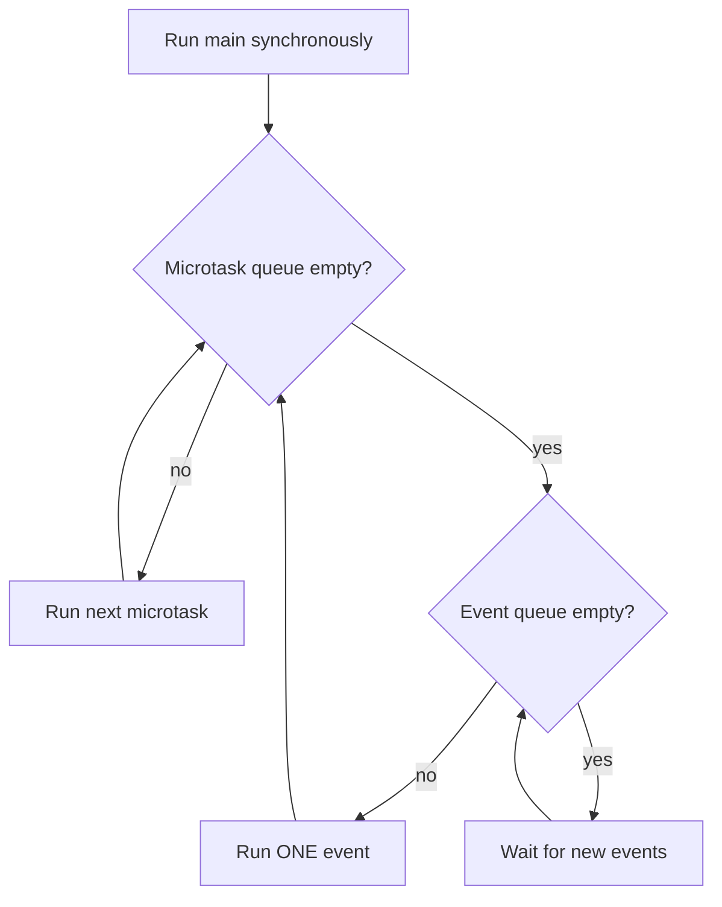
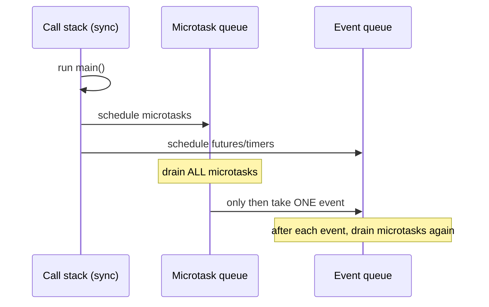

# The Event Loop (Microtask Queue vs Event Queue)

> Dart runs your code on a single thread driven by an event loop that drains a high-priority microtask queue to empty before taking one event from the event queue — understand this and all async behavior becomes predictable.

## Introduction

Each Dart isolate has **one thread** and **one event loop**. Concurrency in Dart is *not* parallelism by default: `async`/`await`, `Future`, and `Stream` all schedule work onto two queues that the single event loop drains in a strict order. This file explains that order — the key to reasoning about why UI stays responsive and in what sequence async callbacks run.

## Why this concept exists

A single-threaded model avoids data races and locks entirely, which makes UI code dramatically simpler and safer. The event loop is how one thread juggles many pending operations (timers, I/O, gestures) without blocking. Knowing the queue priority lets you predict and control execution order.

## Real-world analogy

The event loop is a **barista** working alone. The **microtask queue** is a stack of "quick touch-ups I promised to finish before serving anyone new" (top up foam). The **event queue** is the **line of customers**. Rule: finish *all* pending touch-ups before calling the next customer — and after serving each customer, finish any new touch-ups before the next. If a touch-up spawns endless touch-ups, the customer line never moves (starvation).

## Problem Statement

Predict the exact print order of a program mixing `print`, `Future(() => ...)`, `Future.microtask`, `scheduleMicrotask`, and `await`. By the end you'll order microtasks before events, every time.

## Internal Working



Priority rules:
1. Run all **synchronous** code first (the current call stack).
2. Drain the **entire microtask queue** (scheduled via `scheduleMicrotask`, `Future.microtask`, and continuations of already-completed futures).
3. Take **one** item from the **event queue** (timers, I/O, gestures, `Future` from `Future(() => ...)`/`Future.delayed`).
4. After that one event, **drain microtasks again**, then next event. Repeat.

Microtasks always beat events. New microtasks created during microtask draining run *before* any event.

## Memory Representation

- The two queues hold **closures** (callbacks) plus captured state. They live on the heap for the isolate.
- Each isolate owns its own loop + queues + heap; nothing is shared across isolates (see [04_isolates.md](04_isolates.md)).

## Compiler Behavior

- `async`/`await` is compiled into a **state machine**: the function body is split at each `await` into continuation callbacks scheduled as microtasks when the awaited future completes.
- `await` on an already-completed future still yields to the microtask queue (doesn't run synchronously).

## Runtime Behavior

- `Future(() {})` / `Future.delayed` → **event** queue.
- `Future.microtask(() {})` / `scheduleMicrotask` → **microtask** queue.
- Continuations of `.then`/`await` on a completed future → **microtask**.
- A long synchronous computation **blocks the loop** → no events processed → UI jank/ANR.

## Flutter Engine Behavior

The Flutter framework's frame scheduling (`SchedulerBinding`, `vsync`) posts frame work as events. If your synchronous work or a microtask flood blocks the loop, the engine can't produce frames on time → dropped frames (jank). This is *why* heavy work belongs in an isolate. See [Module 09 Rendering Pipeline](../09%20Rendering%20Pipeline/README.md) and [Module 21 Performance](../21%20Performance/README.md).

## Dart VM Behavior

- The VM's isolate message loop implements these queues natively. Timer and I/O completions enqueue events; future continuations enqueue microtasks.

## Examples

```dart
import 'dart:async';

void main() {
  print('1: sync start');

  Future(() => print('5: event (Future)')); // event queue

  Future.microtask(() => print('3: microtask A')); // microtask queue

  Future(() => print('6: event 2'))
      .then((_) => print('7: event 2 .then (microtask after its event)'));

  scheduleMicrotask(() => print('4: microtask B'));

  print('2: sync end');
}

// Output:
// 1: sync start
// 2: sync end
// 3: microtask A
// 4: microtask B
// 5: event (Future)
// 6: event 2
// 7: event 2 .then (microtask after its event)
```

```dart
// await yields even for a completed future:
Future<void> demo() async {
  print('A');
  await Future.value();      // suspends -> continuation is a microtask
  print('C');                // runs after current microtasks drain
}
void main() {
  demo();
  print('B'); // prints between A and C: A, B, C
}
```

## Diagrams



## Common Mistakes

| Mistake | Why | Fix |
|---------|-----|-----|
| Expecting `Future(() {})` to run before a microtask | Events are lower priority | Use `Future.microtask` if you need microtask timing |
| Heavy CPU work in an `async` function | `async` ≠ another thread; still blocks the loop | Offload to an isolate/`compute` |
| Microtask recursion | Starves the event queue (UI freezes) | Break work across events (`Future(() ...)`) |
| Assuming `await` runs synchronously on completed futures | It always yields to microtask | Don't rely on synchronous continuation |

## Best Practices

- Keep synchronous work per event **short** (target < a frame budget, ~16ms at 60fps).
- Use microtasks only for tiny, must-happen-before-next-event work.
- Chunk large loops across events, or move them to an isolate.
- Never busy-wait; yield with `await Future.delayed(Duration.zero)` to let the loop breathe (sparingly).

## Performance

- Loop-blocking is the #1 cause of jank. The fix is architectural: isolate CPU-bound work; stream I/O results.
- Microtask floods are subtle jank sources — profile with DevTools if frames drop with no obvious cause.

## Advantages / Disadvantages

- **+** No locks/races; simple mental model; responsive I/O without threads.
- **−** One blocking call freezes everything; true parallelism needs isolates.

## Interview Questions

1. **🟢 Is Dart single-threaded?** — Each isolate is single-threaded with one event loop; parallelism requires multiple isolates.
2. **🟢 Microtask vs event queue priority?** — The loop drains the *entire* microtask queue before taking *one* event, and re-drains microtasks after every event. Microtasks always win.
3. **🟡 What schedules a microtask vs an event?** — Microtask: `scheduleMicrotask`, `Future.microtask`, `.then`/`await` continuations. Event: `Future(() {})`, `Future.delayed`, timers, I/O, gestures.
4. **🟡 Does `await` on a completed future run synchronously?** — No; it schedules the continuation as a microtask and yields.
5. **🟡 Why does heavy work in `async` still cause jank?** — `async` doesn't create a thread; the CPU work runs on the same loop and blocks frame events.
6. **🔴 How can microtasks starve the UI?** — A microtask that keeps scheduling more microtasks prevents the loop from ever reaching the event queue (where frames live).
7. **🔴 How does `async`/`await` compile?** — Into a state machine split at each `await`; continuations are scheduled as microtasks when the awaited future completes.

## Senior Engineer Tips

- When debugging ordering bugs, mentally tag each callback "microtask" or "event" — the order falls out immediately.
- Prefer `Future.delayed(Duration.zero)` over microtasks to intentionally *yield to the event queue* (let a frame render).
- Treat "UI froze for 300ms" as "something blocked the loop" — search for sync loops, big JSON parses, or crypto on the main isolate.

## Architect Perspective

The event-loop model dictates your concurrency architecture: I/O-bound work → `async`/`Stream` on the main isolate; CPU-bound work → isolates. Designing this boundary correctly (a "compute offload" layer) is what keeps large apps at 60/120fps. It also shapes testability — deterministic async ordering makes `fakeAsync` tests reliable ([Module 49](../49%20Testing/README.md)).

## Summary

- One thread, one loop, two queues: drain all microtasks, then one event, repeat.
- Microtasks (`scheduleMicrotask`, `.then`/`await` continuations) outrank events (timers, I/O, `Future(() {})`).
- `async` isn't a thread; blocking the loop blocks the UI — offload CPU work to isolates.

## Revision Notes

- Sync first → drain ALL microtasks → ONE event → re-drain microtasks → repeat.
- Microtask: `scheduleMicrotask`, `Future.microtask`, `.then`/`await`. Event: `Future(() {})`, `Future.delayed`, timers, I/O.
- `await` always yields (even on completed future).
- Blocking the loop = jank; CPU work → isolate.

## Practice Questions

1. Order the output of a snippet mixing `Future`, `Future.microtask`, and `print`.
2. Explain why `async` can't fix a CPU-bound freeze.
3. What is microtask starvation and how would you detect it?

## Coding Questions

1. Write a program that prints `A,B,C,D` in a specific order using one sync line, one microtask, and one event — and justify the order.
2. Implement `yieldToEventLoop()` and use it to chunk a 1M-iteration loop so a periodic timer still fires.
3. Demonstrate `.then` on a completed future running as a microtask before a pending event.

## Mini Project

**Event-loop visualizer (CLI):** Build a small program that schedules a mix of sync statements, microtasks, and events with labels, and prints them in execution order with a running "queue state" comment. Add a deliberately loop-blocking function and a chunked version; show a timer that fires on time only in the chunked version. Acceptance: predicted vs actual order documented; blocking vs chunked behavior demonstrated.
