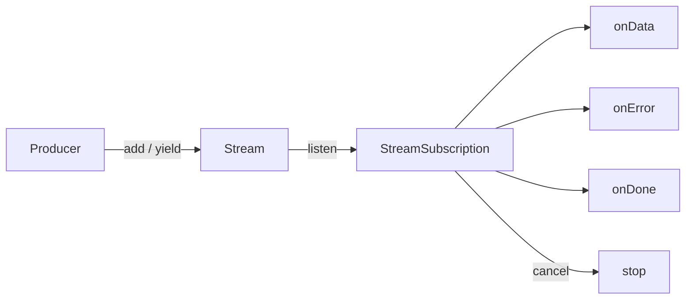
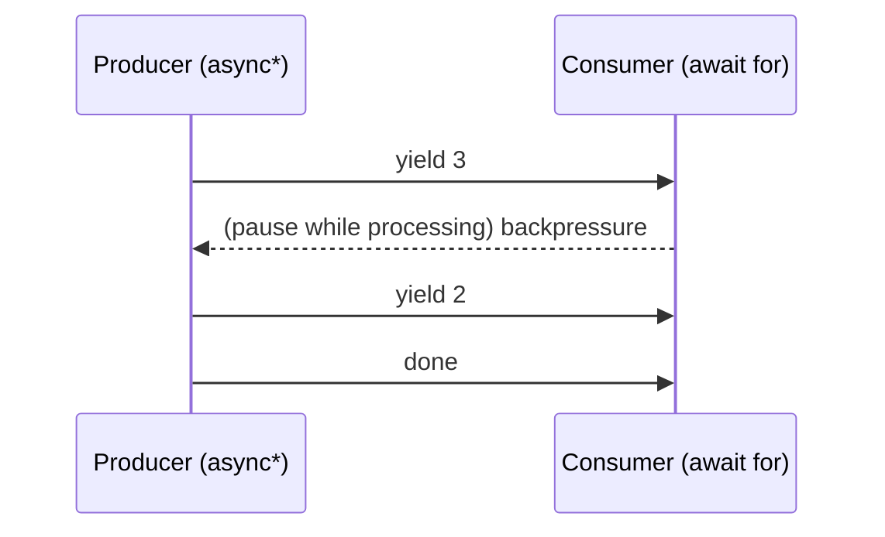

# Streams (`Stream`, controllers, `async*`, transformers, broadcast)

> A `Stream<T>` is a `Future` that can deliver many values over time — the backbone of reactive Flutter (BLoC, `StreamBuilder`, gesture/sensor/websocket feeds).

## Introduction

Where a `Future` yields one value, a `Stream<T>` yields **zero or more** values (and possibly an error, and a done signal) over time. This file covers consuming streams (`await for`, `listen`), producing them (`async*`/`yield`, `StreamController`), transforming them (`map`/`where`/`transform`), and the crucial **single-subscription vs broadcast** distinction.

## Why this concept exists

Many data sources are *ongoing*: user input, sensor readings, websocket messages, database change feeds, timers. Modeling them as a pull-once `Future` doesn't fit. Streams provide a uniform, composable abstraction for asynchronous *sequences*, with backpressure and cancellation built in.

## Real-world analogy

A `Future` is a **letter** (arrives once). A `Stream` is a **subscription to a magazine**: issues arrive over time until you cancel. A **single-subscription** stream is a magazine with exactly one subscriber slot; a **broadcast** stream is a radio station many listeners can tune into simultaneously.

## Problem Statement

Emit a countdown, transform sensor values, multiplex one event source to several widgets, and always cancel subscriptions to avoid leaks. You'll use `async*`, `StreamController.broadcast`, transformers, and `StreamSubscription.cancel`.

## Internal Working



- **Single-subscription** (default): one listener; buffers events until listened; errors if listened twice. For results of a single async sequence (file read, HTTP body).
- **Broadcast**: many listeners; events not buffered for late listeners. For shared event sources (user events, app-wide notifications).
- Produce with `async*` + `yield`/`yield*`, or imperatively with a `StreamController`.
- Consume with `await for` (in an `async` function) or `.listen(onData, onError, onDone, cancelOnError)`.
- Transform lazily: `map`, `where`, `expand`, `take`, `distinct`, `asyncMap`, `transform(StreamTransformer)`.

## Memory Representation

- A `StreamController` holds a buffer (single-sub) or a listener list (broadcast) plus callbacks. Subscriptions are heap objects; **not cancelling them leaks** the subscription and anything it captures.

## Compiler Behavior

- `async*` compiles to a stream-generating state machine; `yield` emits a value, `yield*` delegates to another stream, execution pauses when the consumer pauses (backpressure).
- `await for` desugars into listen + pause/resume handling.

## Runtime Behavior

- Single-subscription streams **buffer** events until first `listen`; broadcast streams **drop** events that occur before a listener subscribes.
- Pausing a subscription pauses an `async*` producer (backpressure); resuming continues it.
- `cancelOnError` controls whether the subscription ends on the first error.

## Flutter Engine Behavior

Not applicable at engine level. `StreamBuilder` listens and rebuilds on each event; framework input (gestures) and platform channels surface as streams.

## Dart VM Behavior

- Stream events are delivered via microtasks/events on the isolate loop; `async*` producers integrate with the scheduler for pause/resume.

## Examples

```dart
import 'dart:async';

// produce with async* + backpressure
Stream<int> countdown(int from) async* {
  for (var i = from; i >= 0; i--) {
    await Future.delayed(const Duration(milliseconds: 50));
    yield i;
  }
}

Future<void> main() async {
  // consume with await for
  await for (final n in countdown(3)) {
    print('tick $n'); // 3,2,1,0
  }

  // transform lazily
  final evens = countdown(5).where((n) => n.isEven).map((n) => 'E$n');
  print(await evens.toList()); // [E4, E2, E0]

  // broadcast: multiple listeners
  final ctrl = StreamController<String>.broadcast();
  final s1 = ctrl.stream.listen((e) => print('L1: $e'));
  final s2 = ctrl.stream.listen((e) => print('L2: $e'));
  ctrl.add('hello'); // both L1 and L2 receive it
  await Future.delayed(Duration.zero);

  // ALWAYS cancel to avoid leaks
  await s1.cancel();
  await s2.cancel();
  await ctrl.close();

  // single-subscription buffers until listened:
  final single = StreamController<int>();
  single.add(1);
  single.add(2);
  single.stream.listen((e) => print('buffered $e')); // 1, 2
  await single.close();
}
```

## Diagrams



## Common Mistakes

| Mistake | Why | Fix |
|---------|-----|-----|
| Not cancelling subscriptions | Memory leaks, callbacks after dispose | `cancel()` in `dispose`/`onDone` |
| Listening to a single-sub stream twice | Throws | Use `.broadcast()` or `.asBroadcastStream()` |
| Expecting late broadcast listeners to get past events | Broadcast doesn't buffer | Use a `BehaviorSubject` (rxdart) or replay |
| Not closing `StreamController` | Leak; `done` never fires | `close()` when finished |
| Heavy sync work in `onData` | Blocks the loop | Offload/throttle |

## Best Practices

- Choose single-subscription for one-shot sequences, broadcast for shared events.
- Cancel subscriptions in `dispose`; close controllers you own.
- Prefer `async*` for producing derived streams; use transformers for reusable pipelines.
- Use `distinct`, `debounce`/`throttle` (rxdart) to tame chatty sources.
- Expose `Stream<T>` (read-only) from APIs; keep the `StreamController` private.

## Performance

- Broadcast to many listeners is cheap per-event but each listener's `onData` runs on the loop — keep handlers light.
- Backpressure (pause/resume) prevents unbounded buffering from fast producers.

## Advantages / Disadvantages

- **+** Composable async sequences, backpressure, cancellation, reactive UI.
- **−** More moving parts than futures; leak-prone if subscriptions aren't cancelled; broadcast doesn't replay.

## Interview Questions

1. **🟢 `Future` vs `Stream`?** — Future: one async value. Stream: many async values over time (plus errors/done).
2. **🟢 Single-subscription vs broadcast?** — Single: exactly one listener, buffers until listened. Broadcast: many listeners, no buffering for late subscribers.
3. **🟡 How do you produce a stream?** — `async*` with `yield`/`yield*`, or imperatively via a `StreamController`.
4. **🟡 What is backpressure and how do streams handle it?** — When the consumer is slower than the producer; pausing a subscription pauses an `async*` producer so it doesn't overproduce.
5. **🟡 Why must you cancel subscriptions?** — An active subscription keeps the callback (and its captures, e.g., `State`/`context`) alive → memory leak and post-dispose callbacks.
6. **🔴 How do you make late broadcast listeners see the latest value?** — Use a replay/behavior subject (rxdart) or cache the last value and re-emit on subscribe; core Dart broadcast doesn't buffer.
7. **🔴 `await for` vs `.listen`?** — `await for` consumes sequentially inside an `async` function (auto pause between iterations); `.listen` is callback-based and non-blocking with explicit lifecycle handlers.

## Senior Engineer Tips

- Treat every `.listen` as a resource with an owner responsible for `cancel()`. In Flutter, store subscriptions and cancel in `dispose`.
- For UI, `StreamBuilder` handles subscribe/cancel for you — but mind that it rebuilds per event; select/throttle upstream.
- rxdart's `BehaviorSubject`/`debounceTime`/`switchMap` cover most real-world reactive needs; reach for them over hand-rolling.

## Architect Perspective

Streams are the substrate of reactive architectures (BLoC, MVVM with reactive bindings). Deciding what is a stream (ongoing state/events) vs a future (one-shot command) shapes your state-management design ([Module 11](../11%20State%20Management/README.md)). Enforce subscription-lifecycle discipline app-wide to prevent leaks at scale.

## Summary

- `Stream<T>` delivers many async values; consume via `await for`/`.listen`, produce via `async*`/`StreamController`.
- Single-subscription buffers for one listener; broadcast serves many without buffering.
- Always cancel subscriptions and close controllers; use backpressure and transformers.

## Revision Notes

- Stream = many values over time; Future = one.
- Produce: `async*`+`yield`, or `StreamController(.broadcast)`. Consume: `await for` / `.listen`.
- Single-sub buffers + one listener; broadcast many + no replay.
- Cancel subscriptions + close controllers (leaks!). Backpressure via pause/resume.

## Practice Questions

1. When would you pick broadcast over single-subscription?
2. Why can a forgotten subscription cause a `setState after dispose` error?
3. What's the difference between `map` and `asyncMap` on a stream?

## Coding Questions

1. Implement `Stream<int> range(int start, int end)` with `async*`.
2. Build a `Debouncer` that exposes a debounced `Stream<String>` from raw input events.
3. Implement `Stream<T> merge<T>(List<Stream<T>> streams)` using a broadcast controller.

## Mini Project

**Live search pipeline (pure Dart):** Simulate keystrokes into a `StreamController`, apply `debounce` + `distinct` + `switchMap`-style cancellation so only the latest query's results emit, and print results. Ensure all subscriptions/controllers are cancelled/closed. Acceptance: stale queries never emit; no leaks (all cancelled); tests drive fake keystrokes and assert only latest results appear.
