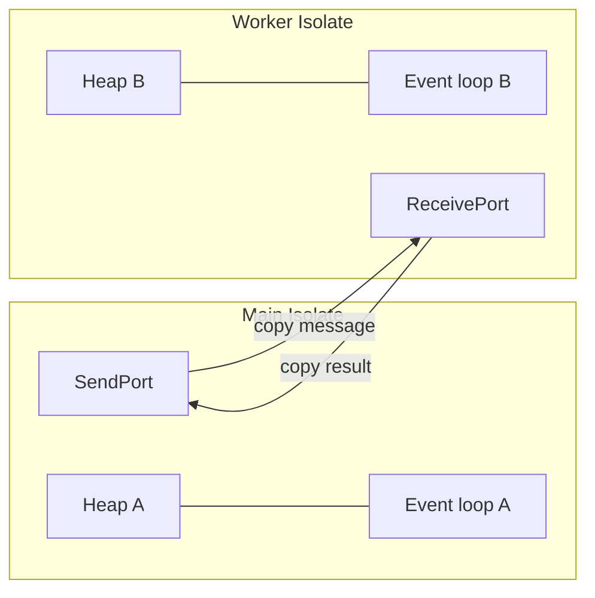
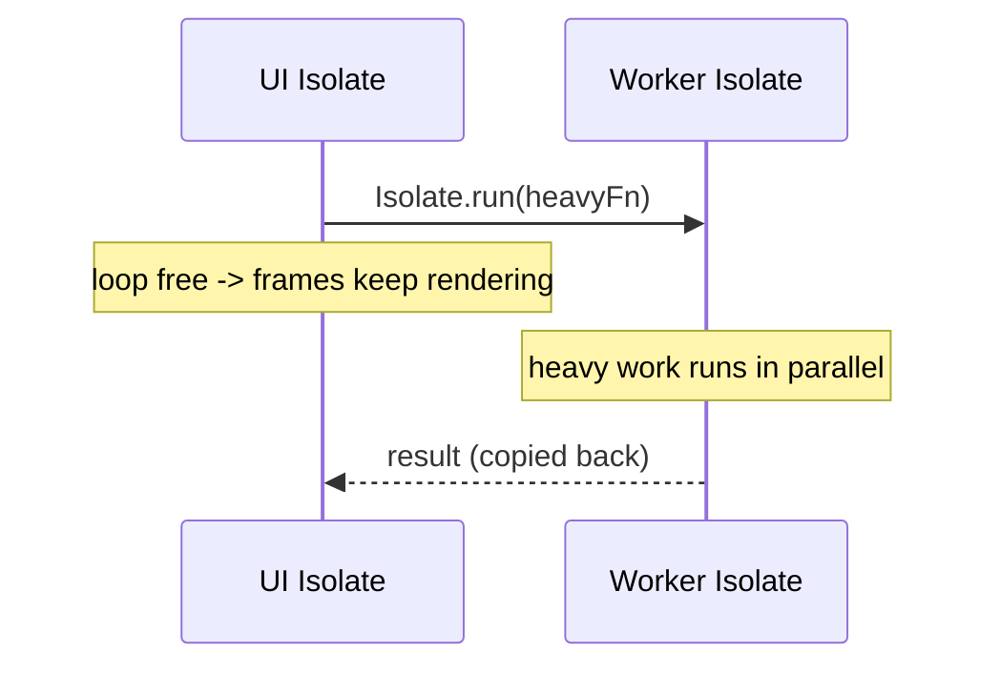

# Isolates (True Parallelism)

> An isolate is Dart's unit of concurrency with its *own* memory and event loop; because isolates share nothing, they achieve real parallelism without locks — by passing messages, not memory.

## Introduction

`async`/`Future`/`Stream` give **concurrency** on one thread; they do *not* run CPU work in parallel. **Isolates** do: each is an independent worker with its own heap and event loop. This file covers why isolates exist, `Isolate.run`, Flutter's `compute`, ports for messaging, and the "share nothing" model.

## Why this concept exists

The event loop is single-threaded, so a heavy computation (parse a 20MB JSON, resize an image, run crypto) **blocks the UI**. Isolates move that work to another thread. Dart chose "share nothing + message passing" over shared-memory threads to eliminate data races and locks entirely — safety by design.

## Real-world analogy

Isolates are **separate kitchens**, each with its own ingredients (heap) and cook (loop). They can't reach into each other's fridges (no shared memory). To collaborate, they pass **sealed containers through a hatch** (messages over ports). Two kitchens cook simultaneously (true parallelism) without fighting over the same knife (no locks).

## Problem Statement

Your app freezes for 500ms parsing a large JSON on tap. Move the parse off the UI isolate so frames keep rendering, get the result back, and understand what data can cross the boundary. You'll use `compute`/`Isolate.run`.

## Internal Working



- Each isolate has a **private heap** and its own event loop. No shared mutable state.
- Communication is via **ports**: `SendPort`/`ReceivePort`. Messages are **copied** (deep) between isolates (except a few transferable types).
- `Isolate.run(fn)` (modern, Dart 2.19+) runs a function on a fresh isolate and returns its result as a `Future` — the easiest path.
- Flutter's `compute(fn, arg)` is a thin wrapper spawning a one-shot isolate.
- For long-lived workers, spawn with `Isolate.spawn` and set up two-way port communication.

## Memory Representation

- Objects passed to another isolate are **deep-copied** into that isolate's heap (structured-clone-like). Large messages cost copy time + memory.
- **`TransferableTypedData`** moves byte buffers with zero-copy transfer of ownership (for big binary payloads).
- Closures passed to `Isolate.run` must not capture non-sendable state; top-level/static functions are safest.

## Compiler Behavior

- The entry function for `Isolate.spawn` must be a top-level or static function (it's referenced by a sendable closure); the compiler/runtime enforces sendability of messages.

## Runtime Behavior

- Spawning an isolate has real cost (memory + startup ~ms); for tiny tasks the copy+spawn overhead can exceed the savings.
- Sending non-sendable objects (e.g., a `SendPort` is fine, but a socket or a closure over UI state is not) throws at runtime.

## Flutter Engine Behavior

Flutter runs the UI on the **main (root) isolate**; the engine's raster/IO threads are separate. Heavy Dart work must leave the UI isolate (via `compute`/`Isolate.run`) to avoid dropped frames. `RootIsolateToken` + `BackgroundIsolateBinaryMessenger` are needed if a background isolate must use platform channels/plugins. See [Module 21 Performance](../21%20Performance/README.md) and [Module 33 Background Services](../33%20Background%20Services/README.md).

## Dart VM Behavior

- The VM schedules isolates across OS threads (an isolate group can share the runtime/code, reducing memory in newer VMs). AOT isolates start faster than one might expect but still aren't free.

## Examples

```dart
import 'dart:convert';
import 'dart:isolate';

// Must be a top-level or static function for Isolate.run/spawn.
int _sumOfSquares(int n) {
  var total = 0;
  for (var i = 1; i <= n; i++) {
    total += i * i;
  }
  return total;
}

Map<String, dynamic> _parse(String raw) =>
    jsonDecode(raw) as Map<String, dynamic>;

Future<void> main() async {
  // Modern one-shot parallel work — does NOT block the caller's loop:
  final result = await Isolate.run(() => _sumOfSquares(100000000));
  print('sum = $result');

  // Offload a heavy parse (in Flutter you'd use compute(_parse, raw)):
  final parsed = await Isolate.run(() => _parse('{"a":1,"b":2}'));
  print(parsed); // {a: 1, b: 2}

  // Long-lived worker with two-way messaging:
  final rp = ReceivePort();
  await Isolate.spawn(_worker, rp.sendPort);
  final workerSendPort = await rp.first as SendPort;

  final answer = ReceivePort();
  workerSendPort.send([21, answer.sendPort]);
  print(await answer.first); // 42
}

void _worker(SendPort toMain) {
  final rp = ReceivePort();
  toMain.send(rp.sendPort);
  rp.listen((msg) {
    final value = msg[0] as int;
    final reply = msg[1] as SendPort;
    reply.send(value * 2); // runs on the worker isolate, in parallel
  });
}
```

## Diagrams



## Common Mistakes

| Mistake | Why | Fix |
|---------|-----|-----|
| Using `async` to "parallelize" CPU work | Same thread; still blocks | Use `Isolate.run`/`compute` |
| Spawning an isolate for tiny work | Spawn+copy cost > savings | Keep small work on main; batch |
| Passing non-sendable objects | Throws at runtime | Send plain data; rebuild objects in the isolate |
| Using plugins in a background isolate without setup | Platform channel unavailable | Register `RootIsolateToken`/background messenger |
| Forgetting to close `ReceivePort` | Leak; isolate stays alive | `close()` ports and `kill()` workers when done |

## Best Practices

- Reach for `Isolate.run`/`compute` for any main-isolate work exceeding a frame budget (JSON parse, image/crypto/compression).
- Send **immutable plain data**; use `TransferableTypedData` for large byte buffers.
- Pool/reuse long-lived isolates for repeated heavy tasks instead of respawning.
- Measure: only offload when the copy+spawn cost is worth it.

## Performance

- True parallelism: N isolates use N cores for CPU-bound work.
- Cost model: `spawn` (~ms + memory) + message copy (∝ payload size). For big results, prefer transferable buffers or streaming partial results back.

## Advantages / Disadvantages

- **+** Real parallelism, no locks/races (share-nothing), keeps UI at 60/120fps.
- **−** No shared memory (copy overhead), spawn cost, more complex messaging, plugin restrictions in background isolates.

## Interview Questions

1. **🟢 What is an isolate?** — An independent Dart execution unit with its own memory heap and event loop; isolates share no mutable memory and communicate by message passing.
2. **🟢 Isolate vs Thread?** — Threads share memory (need locks); isolates share nothing and pass copied messages, eliminating data races.
3. **🟡 Why doesn't `async` give parallelism?** — `async` schedules work on the *same* single-threaded loop; only isolates run on other threads.
4. **🟡 How do you offload heavy work in Flutter?** — `compute(fn, arg)` or `Isolate.run(() => ...)`; both spawn a worker isolate.
5. **🟡 How do isolates communicate?** — Via `SendPort`/`ReceivePort`; messages are deep-copied into the receiver's heap.
6. **🔴 What crosses the isolate boundary cheaply?** — `TransferableTypedData` (zero-copy ownership transfer of byte buffers); most objects are deep-copied.
7. **🔴 Can a background isolate call plugins?** — Only with `RootIsolateToken` + `BackgroundIsolateBinaryMessenger.ensureInitialized`; otherwise platform channels aren't wired up.

## Senior Engineer Tips

- Default to `Isolate.run` for one-shot tasks; only build long-lived worker isolates with ports when you have sustained/streaming workloads.
- Profile before offloading — the copy of a huge object back to main can itself jank; consider returning summarized/transferable results.
- Structure code so the offloaded function is a **pure, top-level function** over plain data — easiest to send and test.

## Architect Perspective

An explicit "compute offload" boundary is a scaling decision: define which operations are CPU-bound and route them to isolates behind a clean API, so feature code stays synchronous-looking and the UI isolate stays free. This is essential for media apps, sync engines, and anything crunching data locally ([Modules 19, 33](../19%20Offline%20First/README.md)).

## Summary

- Isolates = share-nothing parallelism with private heap + loop, communicating via copied messages.
- `Isolate.run`/`compute` offload CPU-bound work to keep the UI responsive.
- Mind copy/spawn costs; send plain data; use transferable buffers for big binaries.

## Revision Notes

- Isolate = own heap + own loop; no shared memory; message passing (deep copy).
- `Isolate.run`/`compute` for CPU work; `async` ≠ parallel.
- Ports: `SendPort`/`ReceivePort`; big bytes → `TransferableTypedData`.
- Background isolate + plugins → `RootIsolateToken`.

## Practice Questions

1. Why does moving a JSON parse to `compute` stop the UI from freezing?
2. When is spawning an isolate *not* worth it?
3. What data can and cannot be sent across isolates?

## Coding Questions

1. Use `Isolate.run` to compute the nth prime without blocking a concurrent periodic timer.
2. Build a long-lived worker isolate that squares numbers on request via ports; kill it cleanly.
3. Compare wall-clock time of parsing a large synthetic JSON on the main isolate vs `Isolate.run`.

## Mini Project

**Parallel batch processor (pure Dart):** Given a list of heavy tasks, process them across a small pool of worker isolates with bounded concurrency, stream progress back to main, and aggregate results. Measure speedup vs sequential. Acceptance: workers reused (not respawned per task); ports closed and isolates killed on completion; measured speedup reported.
