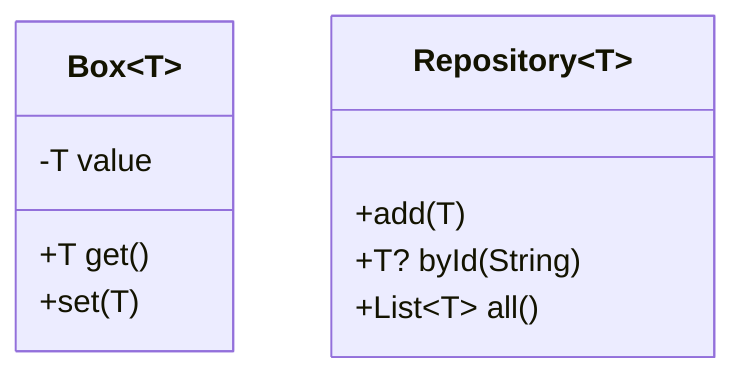
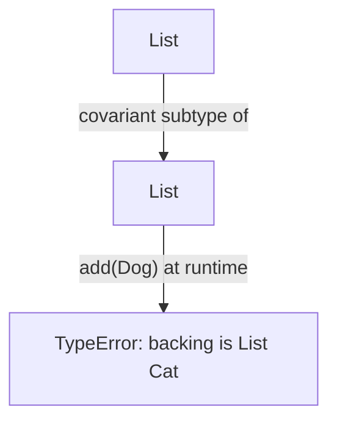

# Generics (Classes, Methods, Bounds, Variance)

> Generics let you write one type-safe implementation that works for many types — reuse without sacrificing the compiler's guarantees.

## Introduction

Generics parameterize code by type: `List<T>`, `Map<K,V>`, `Future<T>`. This file covers generic classes and methods, type parameters, **bounds** (`T extends X`), Dart's **covariance** rules, and advanced patterns (generic constructors, `F`-bounded generics). You met a generic `groupBy<T,K>` in Module 01; here we go deep.

## Why this concept exists

Without generics you either duplicate code per type (a `IntList`, a `StringList`) or drop to `dynamic` and lose safety. Generics give you **both** reuse and static type-checking — the compiler tracks `T` so a `List<int>` can't accidentally hold a `String`.

## Real-world analogy

A generic class is a **vending machine blueprint** with a slot for "what it dispenses." Build one configured for `Soda`, another for `Snack`. Same machine mechanism (`add`, `dispense`), different, type-checked contents. Bounds (`T extends Drink`) mean "this machine only accepts drinks."

## Problem Statement

Build a type-safe `Box<T>`, a `max<T extends Comparable>` function, and a generic `Repository<T>` — and understand why `List<int>` is assignable to `List<num>` but that can bite you. You'll use bounds and reason about variance.

## Internal Working



- A **type parameter** (`<T>`) is a placeholder filled per use; it must be *declared* before use (`class Box<T>`, `T fn<T>(...)`).
- **Bounds** constrain it: `T extends Comparable<T>` means only comparable types, and `T` gains `Comparable`'s API.
- **Generic methods** declare their own parameters: `R map<R>(R Function(T) f)`.
- **Variance:** Dart generics are **covariant** — `List<Cat>` is a subtype of `List<Animal>`. Convenient, but *unsound for writes*, so the runtime inserts checks.

## Memory Representation

- Generics are **reified** in Dart: type arguments exist at runtime (`list is List<int>` is meaningful), unlike Java's erasure. This costs a little metadata but enables real runtime type checks.

## Compiler Behavior

- Type inference fills `T` from arguments/return context (`Box(5)` → `Box<int>`).
- Using `T` outside a declaring scope is a compile error (see Module 01's generics gotcha).
- Covariant assignment `List<Cat> → List<Animal>` compiles; an illegal write is caught at **runtime** with a `TypeError`.

## Runtime Behavior

- Reified types let `is`/`as` inspect type arguments: `x is List<String>`.
- Covariance check: `(cats as List<Animal>).add(Dog())` throws at runtime because the backing list is really `List<Cat>`.

## Flutter Engine Behavior

Not applicable. (But generics power `State<T>`, `ValueNotifier<T>`, `Future`/`Stream<T>` throughout the framework.)

## Dart VM Behavior

- Reified generics are represented via type argument vectors; AOT specializes/monomorphizes hot generic code paths where possible.

## Examples

```dart
class Box<T> {
  T value;
  Box(this.value);
  R mapTo<R>(R Function(T) f) => f(value); // generic method
}

// bound: T must be Comparable to itself
T maxOf<T extends Comparable<T>>(T a, T b) => a.compareTo(b) >= 0 ? a : b;

abstract class Entity {
  String get id;
}

class Repository<T extends Entity> {
  final _store = <String, T>{};
  void add(T item) => _store[item.id] = item;
  T? byId(String id) => _store[id];
  List<T> all() => _store.values.toList(growable: false);
}

class User extends Entity {
  @override
  final String id;
  final String name;
  User(this.id, this.name);
}

void main() {
  final b = Box<int>(5);
  print(b.mapTo((v) => 'val=$v')); // val=5

  print(maxOf(3, 9));        // 9
  print(maxOf('a', 'z'));    // z
  // maxOf(User('1','A'), ...) // COMPILE ERROR: User isn't Comparable

  final repo = Repository<User>();
  repo.add(User('u1', 'Ada'));
  print(repo.byId('u1')?.name); // Ada

  // reified generics:
  final ints = <int>[1, 2, 3];
  print(ints is List<int>);  // true (type arg known at runtime)

  // covariance footgun:
  List<num> nums = <int>[1, 2]; // OK (covariant)
  // nums.add(1.5); // runtime TypeError: backing list is List<int>
}
```

## Diagrams



## Common Mistakes

| Mistake | Why | Fix |
|---------|-----|-----|
| Using `T` without declaring `<T>` | Compile error | Declare on class/method |
| Relying on covariant writes | Runtime `TypeError` | Don't widen then write; keep precise types |
| Overusing `dynamic` instead of a bound | Loses safety | Add `T extends X` |
| Assuming erasure (Java habits) | Dart reifies types | Use `is List<T>` freely, but know it costs metadata |
| Unbounded `T` then calling members | `T` only has `Object?` API | Add a bound to unlock methods |

## Best Practices

- Add the **narrowest useful bound** so `T` exposes the API you need and callers get precise errors.
- Let inference work; annotate explicitly only when it improves clarity or inference fails.
- Prefer generic methods over `dynamic` for transform utilities.
- Keep variance in mind when exposing mutable generic collections — expose read-only views.

## Performance

- Reified generics add minor metadata cost; negligible for app code. Monomorphic generic call sites are optimized in AOT.
- Excessive runtime `is`-checks on hot paths can add up — cache/refactor if profiling shows it.

## Advantages / Disadvantages

- **+** Reuse + type safety; reified types enable real runtime checks; expressive bounds.
- **−** Covariance is unsound for writes (runtime checks); complex bounds can hurt readability.

## Interview Questions

1. **🟢 Why use generics over `dynamic`?** — Generics keep static type safety and inference; `dynamic` discards checking (runtime crashes) and autocomplete.
2. **🟢 What is a bound?** — A constraint `T extends X` limiting acceptable types and granting `T` access to `X`'s members.
3. **🟡 Are Dart generics reified or erased?** — Reified: type arguments exist at runtime, so `x is List<int>` is meaningful (unlike Java's erasure).
4. **🟡 Explain covariance in Dart generics.** — `List<Cat>` is a subtype of `List<Animal>`. It's convenient but unsound for writes, so the runtime inserts type checks that can throw.
5. **🟡 What's a generic method vs generic class?** — A method declares its own type parameter (`R map<R>(...)`); a class parameterizes the whole type (`Box<T>`).
6. **🔴 Why can `(cats as List<Animal>).add(Dog())` throw at runtime?** — The actual backing list is `List<Cat>`; the covariant view allows the call to compile, but the runtime check rejects inserting a non-`Cat`.
7. **🔴 What is an F-bounded type parameter?** — `T extends Comparable<T>` — the bound references `T` itself, enabling self-typed APIs like comparison.

## Senior Engineer Tips

- Design generic APIs to **accept broadly, return precisely**; expose read-only generic views to sidestep covariance pitfalls.
- Use bounds to make illegal states uncompilable (`Repository<T extends Entity>` guarantees an `id`).
- When inference produces `dynamic` unexpectedly, add an explicit type argument to restore safety.

## Architect Perspective

Generics are how you build reusable infrastructure (repositories, result types, caches, DI containers) once and apply them across the domain with full type safety. A well-designed generic core (e.g., `Result<T,E>`, `UseCase<In,Out>`) massively reduces boilerplate and error surface across a large codebase ([Modules 38, 40](../40%20Clean%20Architecture/README.md)).

## Summary

- Generics = reuse + type safety via type parameters, with bounds to constrain and enrich `T`.
- Dart reifies generics (runtime type args) and makes them covariant (unsound for writes, runtime-checked).
- Add narrow bounds; expose read-only views; let inference do the rest.

## Revision Notes

- Declare `<T>` before use; bound `T extends X` for API + constraint.
- Reified (runtime type args) — `is List<int>` works.
- Covariant: `List<Cat>` <: `List<Animal>`; illegal write → runtime `TypeError`.
- Generic method: `R map<R>(...)`. F-bound: `T extends Comparable<T>`.

## Practice Questions

1. Why does `maxOf` require `T extends Comparable<T>`?
2. Give a concrete covariance example that compiles but throws at runtime.
3. How does reification change what `is` can check compared to Java?

## Coding Questions

1. Implement `Result<T, E>` (a sealed generic with `Ok(T)`/`Err(E)`) + `map`/`mapErr`.
2. Write `Iterable<T> distinctBy<T, K>(Iterable<T> xs, K Function(T) key)`.
3. Build a generic `Cache<K, V>` with capacity + LRU eviction.

## Mini Project

**Generic repository + result core (pure Dart):** Build `Entity`, `Repository<T extends Entity>`, and `Result<T, Failure>`; implement CRUD returning `Result`s, with a generic `find<T>` transform. Add tests across two entity types. Acceptance: no `dynamic`; bounds enforce `id`; covariance not abused; `dart analyze` clean.
