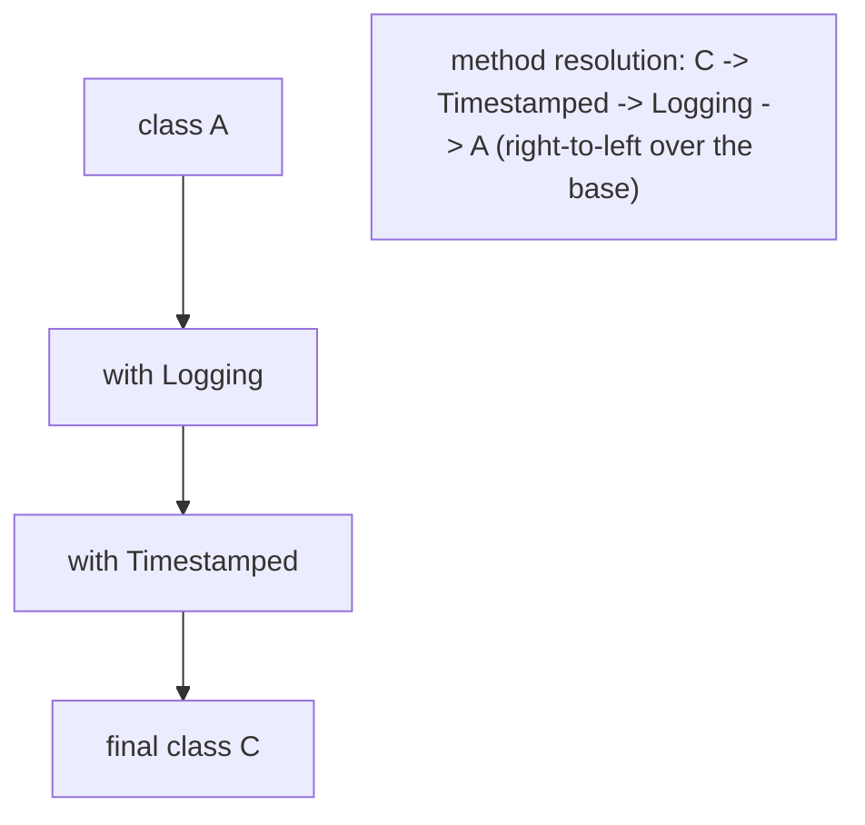
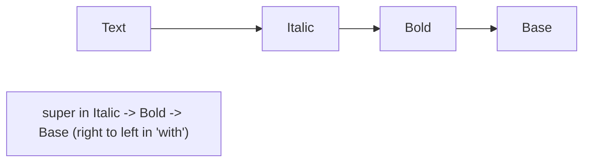

# Mixins (`mixin`, `on`, Linearization)

> A mixin is reusable behavior you "mix into" a class without inheritance — Dart's answer to sharing code across unrelated class hierarchies while avoiding the diamond problem.

## Introduction

A mixin packages methods/fields that can be applied to many classes via `with`. Unlike inheritance (one superclass) you can mix in **several**. This file covers declaring mixins, the `on` constraint, how conflicts resolve via **linearization**, and when to choose a mixin over inheritance or composition.

## Why this concept exists

Dart has **single inheritance**: a class has one superclass. But behavior like "can be serialized," "is loggable," "is a `ChangeNotifier`" cuts across unrelated types. Copy-pasting is bad; forcing a shared base class is worse. Mixins let you compose orthogonal behaviors cleanly — the core mechanism behind Flutter's `SingleTickerProviderStateMixin`, `WidgetsBindingObserver`, etc.

## Real-world analogy

Mixins are **superpowers you grant a character**. A base `Hero` can gain `Flying`, `Healing`, and `Invisibility` independently. Each power is defined once and mixed into many characters. `on Hero` means "this power only works on Heroes" (it relies on Hero abilities).

## Problem Statement

Add JSON-logging and timestamping behavior to several unrelated classes, and add ticker behavior that requires a `State`. You'll write mixins, use `on` to require a base, and resolve a method-name conflict via ordering.

## Internal Working



- Declare with `mixin Logging { ... }`; apply with `class C extends A with Logging, Timestamped`.
- `mixin M on Base` constrains: `M` can only be mixed into classes that are (or extend) `Base`, and may call `Base`'s members and `super`.
- **Linearization:** Dart flattens the mixin application into a linear chain. Later mixins (rightmost in `with`) override earlier ones. `super` inside a mixin refers to the *next* type down the linearized chain — enabling stackable behavior.
- A mixin can't have a (generative) constructor; `mixin class` (Dart 3) can be used both as a mixin and a normal class.

## Memory Representation

- No separate runtime object: mixin members become part of the composed class's method table via the synthesized linearized classes. Instances are ordinary objects.

## Compiler Behavior

- Applying a mixin whose `on` constraint isn't satisfied is a compile error.
- Name conflicts resolve by linearization order; ambiguous cases you don't override may require an explicit override.
- `mixin` (pure) can't be instantiated or extended; `mixin class` can.

## Runtime Behavior

- Method dispatch follows the linearized order; `super.method()` in a mixin walks to the next member in the chain (used for "wrap the parent" patterns).

## Flutter Engine Behavior

Not applicable. But Flutter relies heavily on mixins: `SingleTickerProviderStateMixin` (animations), `WidgetsBindingObserver` (lifecycle), `AutomaticKeepAliveClientMixin` (list item retention).

## Dart VM Behavior

- Linearized mixin application produces synthetic classes the VM treats like normal classes for dispatch; no special runtime cost beyond normal virtual calls.

## Examples

```dart
mixin Logging {
  void log(String msg) => print('[${runtimeType}] $msg');
}

mixin Timestamped {
  DateTime get now => DateTime.now();
  String stamp(String msg) => '$now: $msg';
}

// `on` constraint: requires a base that has `describe`
abstract class Describable {
  String describe();
}

mixin PrettyPrint on Describable {
  void printPretty() => print('>> ${describe()}'); // can call base member
}

class Service with Logging, Timestamped {
  void run() {
    log(stamp('started')); // uses both mixins
  }
}

class Report extends Describable with PrettyPrint {
  @override
  String describe() => 'Q3 report';
}

// stackable super in mixins (linearization):
class Base {
  String render() => 'base';
}
mixin Bold on Base {
  @override
  String render() => '<b>${super.render()}</b>';
}
mixin Italic on Base {
  @override
  String render() => '<i>${super.render()}</i>';
}

class Text extends Base with Bold, Italic {} // Italic is applied last

void main() {
  Service().run(); // [Service] <timestamp>: started

  Report().printPretty(); // >> Q3 report

  // linearization: Text -> Italic -> Bold -> Base
  print(Text().render()); // <i><b>base</b></i>
}
```

## Diagrams



## Common Mistakes

| Mistake | Why | Fix |
|---------|-----|-----|
| Expecting left-to-right override | Rightmost mixin wins (applied last) | Order `with` deliberately |
| Adding a constructor to a mixin | Pure mixins can't have generative ctors | Use `mixin class` or move state to the host |
| Using inheritance for cross-cutting behavior | Forces artificial hierarchies | Use a mixin |
| Ignoring `on` needs | Mixin can't access required base members | Add `on Base` |
| Mixin with mutable state shared confusion | State lives per-instance of host | Keep mixins behavior-focused |

## Best Practices

- Use mixins for **orthogonal, reusable behavior**; keep them small and focused (SRP).
- Prefer `on` to declare dependencies explicitly rather than assuming host members.
- Order `with` clauses intentionally when behaviors stack via `super`.
- Prefer **composition** when the behavior has its own lifecycle/state or you need runtime swapping.

## Performance

- No meaningful runtime overhead beyond normal virtual dispatch.

## Advantages / Disadvantages

- **+** Reuse across unrelated hierarchies; multiple mixins; stackable via `super`; no diamond ambiguity.
- **−** Order-sensitive; can obscure where a method comes from; not a substitute for composition when state/lifecycle is involved.

## Interview Questions

1. **🟢 What is a mixin and why use it?** — Reusable behavior mixed into classes via `with`, enabling code sharing across unrelated hierarchies without multiple inheritance.
2. **🟢 `extends` vs `with` vs `implements`?** — `extends`: inherit one superclass's implementation. `with`: mix in reusable implementation(s). `implements`: adopt only a contract (reimplement all).
3. **🟡 What does `on` do in a mixin?** — Constrains which classes can use the mixin and lets it call the required base's members/`super`.
4. **🟡 How are method conflicts resolved?** — By linearization: the class flattens into a chain; the rightmost mixin in `with` wins; `super` walks the chain.
5. **🟡 Can a mixin have a constructor?** — A pure `mixin` can't have a generative constructor; a `mixin class` can act as both a class and a mixin.
6. **🔴 How does Dart avoid the diamond problem?** — Linearization imposes a single, unambiguous order of superclasses/mixins, so there's always exactly one method to call.
7. **🔴 When choose composition over a mixin?** — When the behavior has independent state/lifecycle, needs runtime swapping, or you want to avoid tight coupling to the host's type.

## Senior Engineer Tips

- Read `with A, B, C` as "apply A, then B, then C over the base" — that's your `super` chain and override order.
- Use `on` to make mixin dependencies explicit and self-documenting; it turns "assumes host has X" into a compile-time guarantee.
- Flutter's `...Mixin` classes are your models: study `SingleTickerProviderStateMixin` to see `on State` + lifecycle hooks in action.

## Architect Perspective

Mixins are a composition tool for cross-cutting concerns (logging, caching hooks, lifecycle observation). Used judiciously they reduce duplication; overused they create "where did this method come from?" confusion. Establish conventions: small, single-purpose, `on`-constrained mixins, and prefer explicit composition for stateful collaborators ([Module 03 OOP](../03%20Object%20Oriented%20Programming/README.md)).

## Summary

- Mixins add reusable behavior via `with`, across unrelated hierarchies, without multiple inheritance.
- `on` constrains the host; linearization resolves conflicts (rightmost wins; `super` stacks).
- Prefer small focused mixins; use composition for stateful/lifecycle behavior.

## Revision Notes

- `with M1, M2` = apply left→right; rightmost overrides; `super` walks the linearized chain.
- `on Base` = required host type; enables `super`/base calls.
- Pure `mixin` has no generative ctor; `mixin class` doubles as a class.
- extends=inherit code, with=mix behavior, implements=contract only.

## Practice Questions

1. Predict `Text().render()` and explain via linearization.
2. When is `on` necessary, and what does it buy you?
3. Mixin vs composition — give a case for each.

## Coding Questions

1. Write a `Serializable` mixin (`toJson`) and mix it into two unrelated classes.
2. Create stackable `Encrypted` and `Compressed` mixins over a `Pipeline` base using `super`.
3. Implement a `Disposable` mixin tracking and closing resources.

## Mini Project

**Text decoration engine (pure Dart):** Build a `Base` renderer plus stackable mixins (`Bold`, `Italic`, `Underline`) using `super`, and demonstrate how `with` order changes the output nesting. Add an `on`-constrained `Debuggable` mixin. Acceptance: linearization behavior documented with expected outputs; mixins are single-purpose; `dart analyze` clean.
