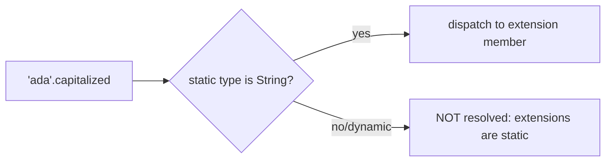
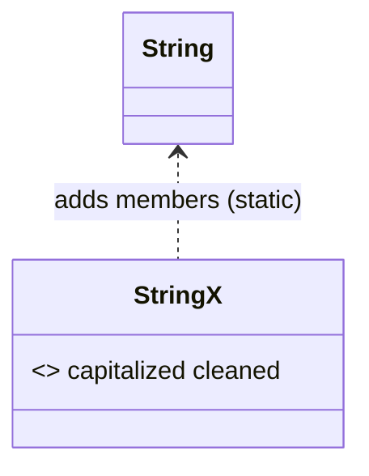

# Extension Methods

> Extensions let you add methods, getters, and operators to *existing* types you don't own — without subclassing or modifying the original.

## Introduction

An `extension` adds functionality to a type (`String`, `int`, `BuildContext`, a third-party class) as if the members were part of it. This file covers declaring extensions, how they resolve statically, named/unnamed extensions, generic extensions, and their limits.

## Why this concept exists

You often want a helper "on" a type — `'  hi '.cleaned`, `context.theme`, `42.seconds` — but can't edit `String`/`Duration`/the SDK. Before extensions you wrote `StringUtils.cleaned(s)`, which reads backwards and doesn't autocomplete on the value. Extensions give fluent, discoverable, type-safe helpers without inheritance.

## Real-world analogy

An extension is a **clip-on attachment** for a tool you already own — a bottle-opener that snaps onto your keychain. The keychain (the type) is unchanged; you've added a capability you can use as if it were built in.

## Problem Statement

Add `String.capitalized`, `int.isPrime`, `List<T>.secondOrNull`, and a Flutter-style `BuildContext.theme`. You'll write extensions, including a generic one, and understand static resolution.

## Internal Working



- Syntax: `extension Name on Type { members }`. `Name` can be omitted (but named extensions can be hidden/shown on import to resolve conflicts).
- Members can be methods, getters/setters, operators — but **not instance fields** (no per-object state) and not new constructors.
- **Static resolution:** the extension chosen is based on the **static type** at the call site. Extensions do *not* work through `dynamic`.
- Generic extensions: `extension ListX<T> on List<T> { ... }`.

## Memory Representation

- Extensions add **no state** to instances (fields aren't allowed). They compile to static calls passing the receiver — zero per-object memory cost.

## Compiler Behavior

- Extension dispatch is resolved at **compile time** by static type; a real instance method with the same name always wins over an extension.
- Import conflicts (two extensions with the same member on the same type) are resolved with `show`/`hide` or explicit application `ExtensionName(value).member`.

## Runtime Behavior

- Because resolution is static, calling an extension member on a `dynamic` receiver throws `NoSuchMethodError` at runtime (it wasn't resolved to the extension).

## Flutter Engine Behavior

Not applicable. (But `context.theme`/`context.textTheme` style extensions are ubiquitous in Flutter codebases and packages.)

## Dart VM Behavior

- Compiled to ordinary static method calls; no dynamic lookup or overhead beyond a normal function call.

## Examples

```dart
extension StringX on String {
  String get capitalized =>
      isEmpty ? this : '${this[0].toUpperCase()}${substring(1)}';
  String get cleaned => trim().replaceAll(RegExp(r'\s+'), ' ');
}

extension IntX on int {
  bool get isPrime {
    if (this < 2) return false;
    for (var i = 2; i * i <= this; i++) {
      if (this % i == 0) return false;
    }
    return true;
  }

  Duration get seconds => Duration(seconds: this);
}

// generic extension
extension ListX<T> on List<T> {
  T? get secondOrNull => length >= 2 ? this[1] : null;
}

void main() {
  print('ada'.capitalized);        // Ada
  print('  a   b '.cleaned);       // a b
  print(7.isPrime);                // true
  print(30.seconds);               // 0:00:30.000000
  print(<int>[1, 2, 3].secondOrNull); // 2

  // static resolution gotcha:
  dynamic d = 'ada';
  // print(d.capitalized); // runtime NoSuchMethodError — dynamic bypasses extensions
}
```

## Diagrams



## Common Mistakes

| Mistake | Why | Fix |
|---------|-----|-----|
| Calling an extension on `dynamic` | Not resolved statically | Use a typed variable |
| Trying to add instance fields | Extensions are stateless | Use a wrapper class / extension type |
| Name clashes across packages | Ambiguous member | `show`/`hide` on import, or `Ext(x).m()` |
| Shadowing a real method unintentionally | Instance method wins silently | Name extension members distinctly |
| Overstuffing "God" extensions | Hard to discover/maintain | Group cohesive helpers per extension |

## Best Practices

- Name extensions (helps conflict resolution and readability).
- Keep them **cohesive and small**; group by purpose (`StringCaseX`, `ContextThemeX`).
- Use for fluent, discoverable helpers; don't hide heavy logic behind a trivial-looking getter.
- Prefer extensions over `XyzUtils` static-helper classes for value-oriented helpers.

## Performance

- Zero runtime overhead beyond a static call; safe in hot paths.

## Advantages / Disadvantages

- **+** Fluent, discoverable, type-safe helpers on any type; no subclassing; no runtime cost.
- **−** No state/fields; static-only (no `dynamic`); potential import conflicts; can be overused.

## Interview Questions

1. **🟢 What are extension methods for?** — Adding methods/getters/operators to existing types you don't own, without subclassing or editing them.
2. **🟢 Can extensions hold state?** — No; they can't declare instance fields (use a wrapper class or extension type).
3. **🟡 How are extension members resolved?** — Statically, by the receiver's static type at compile time; a real instance method with the same name wins.
4. **🟡 Why doesn't an extension work on `dynamic`?** — Resolution is static; a `dynamic` receiver has no static type to dispatch on, so it fails at runtime.
5. **🟡 How do you resolve two extensions with the same member?** — `show`/`hide` on import, or apply explicitly: `MyExt(value).member`.
6. **🔴 Extension vs inheritance vs wrapper?** — Extension: stateless helpers on existing types. Inheritance: is-a with shared implementation. Wrapper/extension type: add state or a distinct type identity.
7. **🔴 Do extensions have runtime cost?** — No; they compile to static calls.

## Senior Engineer Tips

- Extensions shine for domain-specific fluency: `context.theme`, `ref.watch(...)`-style helpers, `DateTime.isSameDay(...)`.
- Keep them in a well-known `extensions/` location so the team discovers and reuses them.
- If you find yourself wanting a field, you actually want an **extension type** or a wrapper class, not an extension.

## Architect Perspective

Extensions let you build an ergonomic, consistent "vocabulary" over SDK/third-party types without wrapping everything. Standardize a small set of project extensions (theme access, spacing, formatting) to reduce boilerplate and enforce consistency across teams — a subtle but real maintainability win.

## Summary

- `extension X on T` adds stateless methods/getters/operators to `T`.
- Resolved statically by the receiver's static type; instance methods win; no `dynamic`.
- Great for fluent helpers with zero runtime cost; use wrappers/extension types when you need state.

## Revision Notes

- `extension Name on Type {}`; methods/getters/operators, **no fields**.
- Static resolution by static type; real method wins; fails on `dynamic`.
- Conflicts: `show`/`hide` or `Ext(x).m()`.
- Zero runtime cost (static calls).

## Practice Questions

1. Why does calling an extension getter on a `dynamic` variable throw?
2. When would you choose a wrapper class over an extension?
3. How do you disambiguate two same-named extension members from different packages?

## Coding Questions

1. Write `NumX` with `clampMin`, `clampMax`, and `percentOf`.
2. Add `DateTimeX` with `isToday`, `startOfDay`, and `isSameDay(other)`.
3. Create a generic `IterableX<T>` with `firstWhereOrNull(test)` and `partition(test)`.

## Mini Project

**Fluent formatting toolkit (pure Dart):** Build cohesive extensions for `String` (case/trim/mask), `num` (currency/percent), and `DateTime` (relative/format), each named and grouped. Add tests. Acceptance: no state in extensions; named extensions; conflicts avoidable via naming; `dart analyze` clean.
