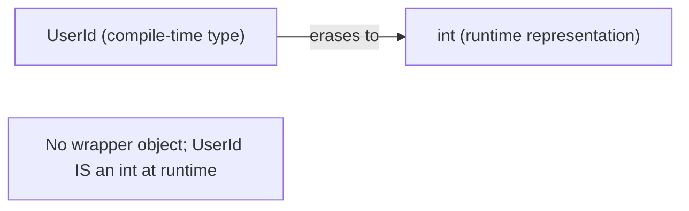
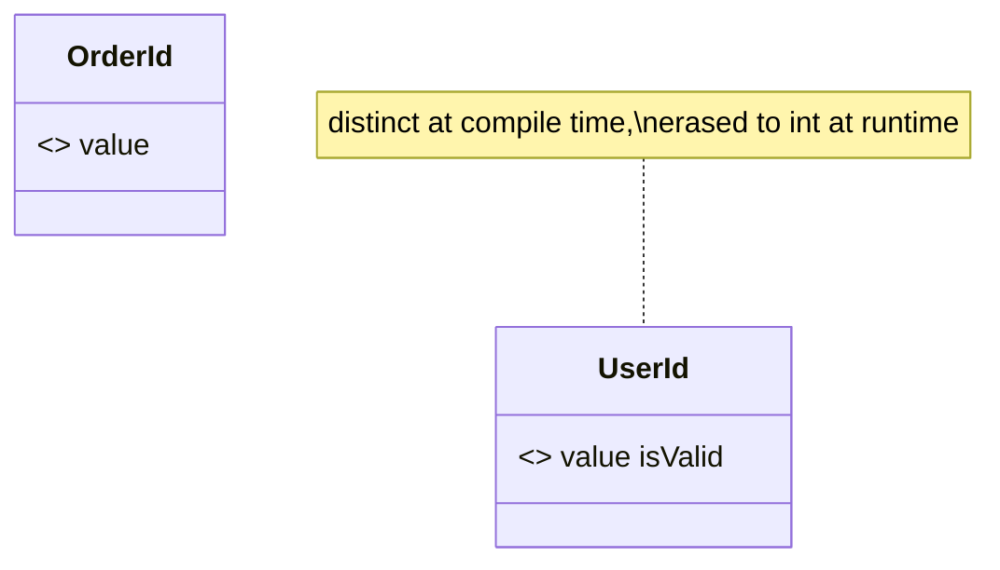

# Extension Types (Zero-Cost Wrappers)

> An extension type is a compile-time-only wrapper that gives an existing type a new, distinct static identity and API — with **no runtime allocation or overhead**.

## Introduction

Extension types (stable since Dart 3.3) let you wrap an existing representation type (e.g., `int`, `String`) in a new named type that the compiler treats as distinct, while at runtime it *is* the underlying value — no wrapper object is created. This file covers what they are, how they differ from extensions and wrapper classes, `implements` for transparency, and their key limitation (no runtime type identity).

## Why this concept exists

You often want type-safe distinctions that shouldn't cost performance: a `UserId` that can't be mixed up with an `OrderId` even though both are `int`; a `Meters` that isn't accidentally added to `Seconds`. A wrapper class gives safety but allocates an object per value. Extension types give the **safety of a distinct type with the performance of the raw value** — zero-cost domain typing.

## Real-world analogy

An extension type is a **role badge** on a person. The person (the `int`) is unchanged and weighs nothing extra; the badge ("Doctor") changes how the system treats them and what they're allowed to do — but it's purely a label enforced by the rules, not a second physical person following them around.

## Problem Statement

You keep passing `int` IDs around and once swapped a `userId` for an `orderId` — a bug the compiler didn't catch. Introduce distinct `UserId`/`OrderId` types with no runtime cost, exposing only safe operations. You'll use extension types.

## Internal Working



- Declared: `extension type UserId(int value) { ... }` — `int value` is the **representation**.
- The new type is **distinct at compile time**: you can't pass a raw `int` where `UserId` is expected (unless via the constructor), and `UserId`/`OrderId` aren't interchangeable.
- At **runtime** it's erased to the representation type (`int`) — no allocation.
- You choose the exposed API: only members you declare (plus, if you write `implements int`, the underlying `int` members are visible too — a "transparent" extension type).
- Can be generic: `extension type Wrapped<T>(T value)`.

## Memory Representation

- **Zero wrapper allocation.** A `List<UserId>` has the same memory layout as a `List<int>`. This is the headline benefit over wrapper classes.

## Compiler Behavior

- Enforces the distinct type statically: `takesUserId(orderId)` is a compile error.
- Without `implements`, the underlying type's members are **hidden** (you expose a curated API). With `implements int`, they're available (transparent).
- Conversions to/from the representation are explicit (via the constructor / `.value`).

## Runtime Behavior

- Because it erases to the representation, **`is`/runtime type checks see the representation**, not the extension type. `userId is int` is `true`; there's no distinct runtime `UserId` type to test. This is the main caveat.
- No runtime safety: if you obtain the value via `dynamic`/casts, the distinction is gone.

## Flutter Engine Behavior

Not applicable. (Useful for typed IDs/units in domain and data layers; JS interop also uses extension types heavily on web.)

## Dart VM Behavior

- Fully erased in AOT/JIT; call sites compile to operations on the representation type — identical performance to using the raw value.

## Examples

```dart
extension type UserId(int value) {
  // curated API only:
  bool get isValid => value > 0;
}

extension type OrderId(int value) {}

// transparent: also exposes int's members
extension type Cents(int value) implements int {
  String get formatted => '\$${(value / 100).toStringAsFixed(2)}';
}

void takesUserId(UserId id) => print('user ${id.value}');

void main() {
  final u = UserId(42);
  final o = OrderId(42);

  takesUserId(u);        // ok
  // takesUserId(o);     // COMPILE ERROR: OrderId is not UserId
  // takesUserId(42);    // COMPILE ERROR: int is not UserId

  print(u.isValid);      // true
  print(u.value);        // 42

  // transparent extension type can use int's API directly:
  final price = Cents(1999);
  print(price + 1);      // 2000 (int member available via implements int)
  print(price.formatted);// $19.99

  // runtime caveat: erases to int
  print(u.value is int); // true
  print(u is int);       // true — no distinct runtime type
}
```

## Diagrams



## Common Mistakes

| Mistake | Why | Fix |
|---------|-----|-----|
| Expecting runtime type safety | Erases to representation | Rely on it only at compile time |
| Using `is ExtensionType` checks | Not a distinct runtime type | Check the representation, or use a real class |
| Confusing with extension methods | Extensions add methods to a type; extension types make a *new* type | Pick by whether you need a distinct identity |
| Overusing `implements` | Leaks the whole underlying API | Only implement when you want transparency |
| Needing polymorphism/subtyping | Extension types aren't for rich hierarchies | Use classes |

## Best Practices

- Use for **zero-cost domain typing**: IDs, units, validated primitives, opaque handles.
- Expose a **minimal curated API**; add `implements` only when transparency is genuinely wanted.
- Document that safety is **compile-time only**; don't rely on runtime checks.
- Prefer a real class when you need runtime type identity, inheritance, or added state beyond the representation.

## Performance

- Identical to the underlying representation — no allocation, no boxing. Ideal for large collections of typed primitives.

## Advantages / Disadvantages

- **+** Distinct type safety at zero runtime cost; curated APIs over primitives; great for interop.
- **−** Compile-time only (no runtime type identity/`is`); no subtyping/polymorphism; can confuse newcomers.

## Interview Questions

1. **🟢 What is an extension type?** — A compile-time-only wrapper giving an existing representation type a new distinct static type and curated API, erased to the representation at runtime (zero cost).
2. **🟢 Extension type vs wrapper class?** — Wrapper allocates an object per value; extension type has zero runtime allocation but only compile-time distinctness.
3. **🟡 Extension type vs extension method?** — Extension methods add members to an existing type (same identity); extension types create a new distinct type over a representation.
4. **🟡 What does `implements int` do on an extension type?** — Makes it "transparent" — the underlying `int`'s members are accessible through it.
5. **🟡 What's the main caveat?** — No runtime type identity: `userId is int` is true and there's no distinct `UserId` at runtime; safety is compile-time only.
6. **🔴 When choose an extension type over a class?** — When you want type-safe primitives/IDs/units in hot or large-collection code paths without allocation cost, and don't need runtime polymorphism.
7. **🔴 Why are extension types big for web interop?** — They provide typed, zero-cost views over JS values without wrapper allocations.

## Senior Engineer Tips

- Reach for extension types to kill "stringly/inty-typed" bugs (mixing `userId`/`orderId`, `email`/`name`) without perf cost.
- Keep the API curated: the whole point is to *prevent* invalid operations, so don't blanket-`implements` the representation.
- Remember tests/JSON/`is`-based dispatch see the representation — design serialization and equality accordingly.

## Architect Perspective

Extension types enable **making illegal states unrepresentable** cheaply — a DDD value-object flavor at primitive cost. In large domains, typed IDs and units eliminate a whole class of mix-up bugs at compile time while keeping data structures lean, which matters in data-heavy and performance-sensitive apps ([Module 46 DDD](../46%20Domain%20Driven%20Design/README.md)).

## Summary

- Extension types: distinct compile-time type over a representation, erased to it at runtime — zero cost.
- Curate the API; add `implements` for transparency; safety is compile-time only.
- Prefer classes when you need runtime type identity, state, or polymorphism.

## Revision Notes

- `extension type UserId(int value) {}` — distinct at compile time, IS `int` at runtime.
- Zero allocation; `List<UserId>` == `List<int>` in memory.
- `implements int` = transparent (exposes int API).
- Caveat: no runtime type (`is int` true); compile-time safety only.

## Practice Questions

1. Why can't the compiler let you pass an `OrderId` to a `UserId` parameter?
2. What does `userId is int` return and why does that matter?
3. When is a wrapper class the better choice?

## Coding Questions

1. Define `Email(String value)` extension type with a `isValid` getter and a validating factory-like constructor.
2. Model `Meters` and `Seconds` extension types; make `Meters + Meters` compile but `Meters + Seconds` fail.
3. Create a transparent `Percentage(double value) implements double` with a `clamped` getter.

## Mini Project

**Typed-primitives domain kit (pure Dart):** Introduce `UserId`, `OrderId`, `Email`, and `Money`(Cents) extension types; refactor a small service so IDs can't be swapped and money math is safe — all with zero wrapper allocation. Add tests proving type mix-ups fail to compile (documented) and behavior is correct. Acceptance: minimal curated APIs; documented runtime caveat; `dart analyze` clean.
