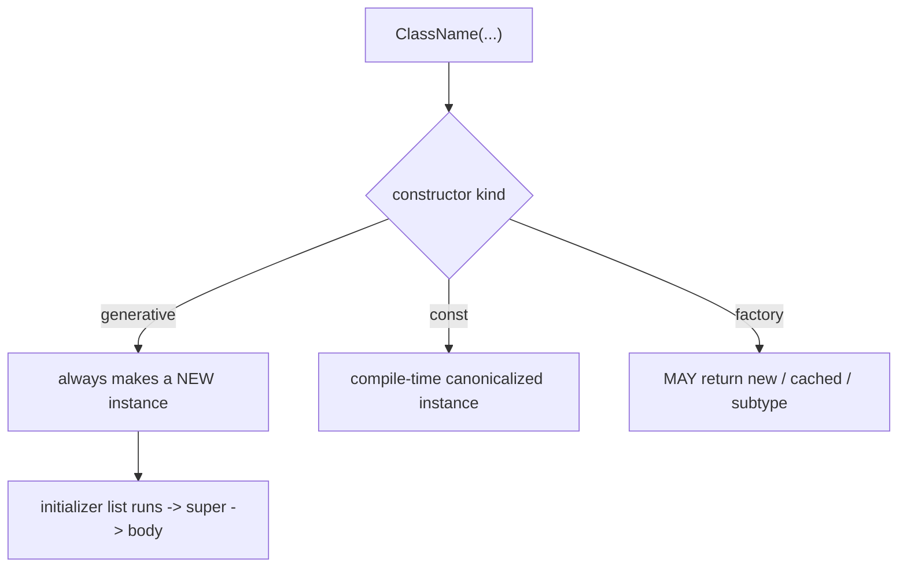
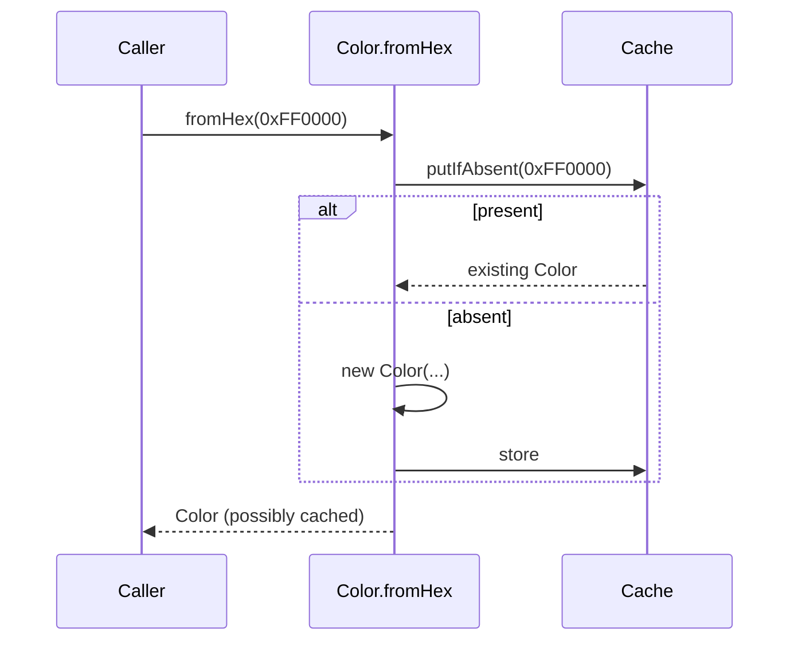

# Constructors, Factories, Singletons & Callable Classes

> Dart's constructor toolkit — generative, named, `const`, factory, private — controls *how* and *whether* an object is created, enabling patterns from immutability to singletons to caching.

## Introduction

This file covers Dart's full constructor system: generative (default/named), initializer lists, `const` constructors, **factory** constructors (which may return existing/cached/subtype instances), private constructors (`_`), the **singleton** pattern, and **callable classes** (objects invoked like functions via `call`).

## Why this concept exists

Object creation isn't one-size-fits-all. Sometimes you must set `final` fields before the body (initializer lists), enable compile-time constants (`const`), return a cached instance instead of a new one (factory + singleton), forbid external construction (private constructor), or make an object behave like a function (`call`). Dart bakes these into the language rather than requiring boilerplate.

## Real-world analogy

- Generative constructor = **building a house from scratch** to spec.
- Factory constructor = **a dealership**: you ask for a car; it might hand you one off the lot (cached), a specific model (subtype), or refuse — you don't control *whether* a new one is built.
- Singleton = **the one and only town hall** — everyone gets the same instance.
- Callable class = **a stamp** — it's an object, but you "use" it by pressing it (`stamp(doc)`).

## Problem Statement

Create an immutable `Point` with a `const` constructor, a `Color.fromHex` factory that caches, a `Logger` singleton, and a `Validator` object you can call like a function. You'll use each constructor kind.

## Internal Working



- **Generative:** `Point(this.x, this.y)` — always creates a new instance. Shorthand `this.field` assigns fields.
- **Initializer list:** `Point(int x, int y) : _x = x, assert(...) { }` — runs before the body; required for `final` fields, asserts, and `super(...)`. `this` isn't available yet.
- **Named:** `Point.origin() : this(0, 0);` — alternative constructors; can redirect.
- **`const` constructor:** all fields `final`; enables compile-time constant, canonicalized instances.
- **Factory:** `factory Color.fromHex(...)` — has **no initializer list**, must `return` an instance; can return cached objects or subtypes.
- **Private constructor:** `ClassName._()` — blocks external instantiation (basis of singletons/enums-like patterns).
- **Callable class:** define `ReturnType call(args)` → instances are invocable as `obj(args)`.

## Memory Representation

- Generative constructors allocate a new heap object each call. Factories may return an existing object (no allocation). `const` instances are shared canonical objects.

## Compiler Behavior

- `const` constructor requires all fields `final` and all initializers const-compatible.
- Factory constructors can't access `this` (nothing constructed yet) and can't have initializer lists.
- Private constructor + no public constructor → the compiler prevents external `new`.

## Runtime Behavior

- Factory logic runs at call time (e.g., look up a cache map, decide subtype).
- Singleton: the single instance is created lazily (often `static final _instance = Foo._();` or `late final`).
- `obj(args)` dispatches to `call`.

## Flutter Engine Behavior

Not applicable. (But `const` widget constructors are central to rebuild performance, and factory constructors appear across the SDK, e.g., `List.from`, `Map.of`.)

## Dart VM Behavior

- `const` instances live in the constant pool (canonicalized). Factory returns are ordinary heap references or cached ones.

## Examples

```dart
class Point {
  final int x, y;
  const Point(this.x, this.y);         // const generative
  const Point.origin() : this(0, 0);   // named, redirecting

  @override
  bool operator ==(Object o) => o is Point && o.x == x && o.y == y;
  @override
  int get hashCode => Object.hash(x, y);
}

class Color {
  final int argb;
  const Color(this.argb);

  static final _cache = <int, Color>{};
  factory Color.fromHex(int hex) =>
      _cache.putIfAbsent(hex, () => Color(hex)); // cached factory
}

class Logger {
  Logger._(); // private constructor
  static final Logger instance = Logger._(); // eager singleton
  void log(String m) => print('[LOG] $m');
}

// callable class
class Validator {
  final int min;
  const Validator(this.min);
  bool call(String s) => s.length >= min; // invoked as validator(x)
}

void main() {
  const a = Point(1, 2);
  const b = Point(1, 2);
  print(identical(a, b)); // true — const canonicalized

  final c1 = Color.fromHex(0xFF0000);
  final c2 = Color.fromHex(0xFF0000);
  print(identical(c1, c2)); // true — same cached instance

  Logger.instance.log('hi'); // singleton
  print(identical(Logger.instance, Logger.instance)); // true

  const isLongEnough = Validator(3);
  print(isLongEnough('ab'));  // false
  print(isLongEnough('abc')); // true — object called like a function
}
```

## Diagrams



## Common Mistakes

| Mistake | Why | Fix |
|---------|-----|-----|
| `this` in an initializer list | Object not built yet | Use fields/params, not `this` |
| Expecting a factory to always create new | It may cache/return subtype | Read the contract; don't assume identity |
| Mutable global instead of a proper singleton | Uncontrolled state | Private ctor + single static instance (or DI) |
| Overusing singletons | Hidden global state, hard to test | Prefer dependency injection ([Module 14](../14%20Dependency%20Injection/README.md)) |
| `const` ctor with non-final field | Won't compile | Make all fields `final` |

## Best Practices

- Use initializer lists for `final` fields, asserts, and `super(...)`.
- Add `const` constructors to immutable value types (unlocks `const` usage/perf).
- Use factories for caching, subtype selection, and validation-at-construction.
- Prefer **DI over singletons**; when you must, use a private-constructor singleton and keep it stateless/small.
- Reserve callable classes for genuinely function-like objects (validators, formatters, strategies).

## Performance

- `const`/cached factories avoid allocations. Singletons avoid repeated construction but can hide lifecycle/testability costs.

## Advantages / Disadvantages

- **+** Precise control over creation; enables immutability, caching, singletons, function-like objects.
- **−** Factory/singleton indirection can obscure identity and complicate testing if overused.

## Interview Questions

1. **🟢 Named vs factory constructor?** — Named: an additional constructor that always creates a new instance normally. Factory: may return an existing/cached instance or a subtype and has no initializer list.
2. **🟢 What is an initializer list and when is it required?** — The `: field = v, assert(...)` before the body; required to set `final` fields, run asserts, and call `super(...)` — all before `this` exists.
3. **🟡 How do you implement a singleton in Dart?** — Private constructor `Foo._()` plus a single `static final Foo instance = Foo._();` (or a lazy `late final`).
4. **🟡 Why can't a factory use `this`?** — No instance exists yet; the factory decides *what* to return, so there's nothing to reference.
5. **🟡 What is a callable class?** — A class defining `call(...)`; its instances can be invoked like functions (`obj(args)`).
6. **🔴 Why prefer DI over singletons?** — Singletons are global mutable state: they couple code, hide dependencies, and make testing/mocking hard. DI injects the instance, keeping code testable and swappable.
7. **🔴 How does a factory enable the flyweight/cache pattern?** — By returning a shared cached instance for equal inputs instead of allocating a new object each time.

## Senior Engineer Tips

- A "singleton" registered in a DI container gives you one instance *and* testability — best of both.
- Use factory constructors to validate and normalize inputs so invalid objects can never be constructed.
- Callable classes + `const` make excellent injectable strategies (a `const Validator(3)`).

## Architect Perspective

Construction policy is an architectural lever: immutable value objects (`const` ctors), controlled creation (factories/validation), and single instances via DI shape testability and coupling across the system. Favor explicit DI-managed lifetimes over ad-hoc singletons so the dependency graph stays visible and mockable ([Modules 14, 40](../14%20Dependency%20Injection/README.md)).

## Summary

- Generative (new), named (alt/redirect), `const` (canonical immutable), factory (may cache/subtype), private (`_`, blocks external new).
- Singletons = private ctor + single static instance; callable classes define `call`.
- Prefer DI over singletons; use factories for caching/validation; `const` for value types.

## Revision Notes

- Initializer list: `final` fields/asserts/`super`, runs before body, no `this`.
- Factory: may return cached/subtype, no initializer list, no `this`.
- Singleton: `Foo._()` + `static final instance`.
- Callable: define `call(...)` → `obj(args)`.
- Prefer DI > singleton.

## Practice Questions

1. Why does a `const` constructor require all fields to be `final`?
2. Give a case where a factory constructor returns a subtype.
3. Why are singletons considered a testability risk?

## Coding Questions

1. Implement `Temperature` with `const` ctor, `Temperature.celsius`/`.fahrenheit` named ctors, and value equality.
2. Build a `ShapeFactory` factory constructor returning `Circle`/`Square` based on input.
3. Create a callable `RateLimiter` object that returns whether a call is allowed now.

## Mini Project

**Object-creation patterns kit (pure Dart):** Implement an immutable `Money` (`const` + named ctors + equality), a caching `Icon.named(...)` factory, a DI-friendly `Clock` (interface + real/fake), and a callable `PasswordPolicy`. Wire a tiny service using them. Acceptance: no ad-hoc mutable globals; factory caching proven by `identical`; `Clock` swappable in tests; `dart analyze` clean.
