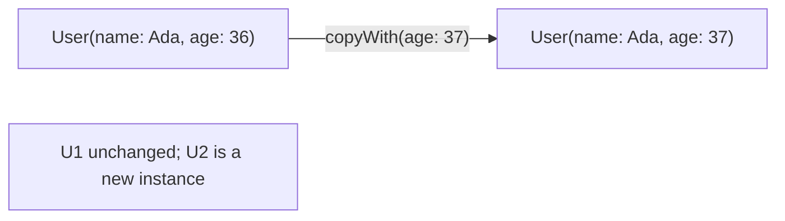
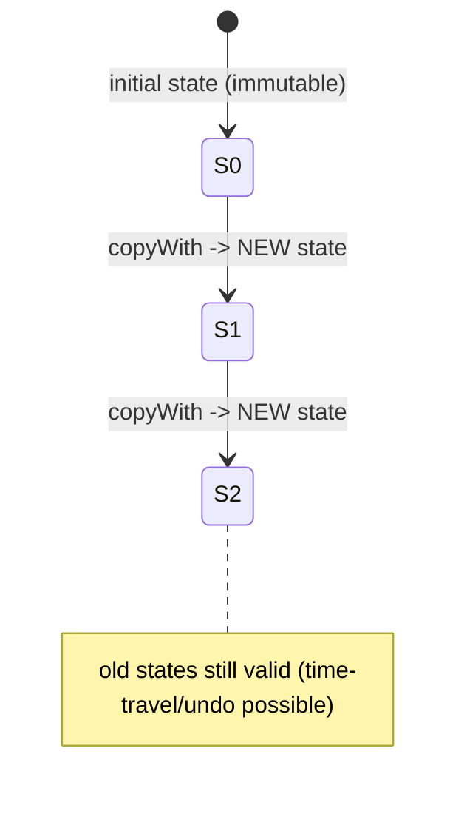

# Immutability (Immutable Objects, `copyWith`, Value Equality)

> An immutable object never changes after construction; you "change" it by producing a new copy — the foundation of predictable state, cheap change detection, and safe concurrency.

## Introduction

Immutability means an object's fields are `final` and never mutate. To model "edits," you create a modified **copy** (`copyWith`). This file covers building immutable classes, `const` immutability, value equality (`==`/`hashCode`), `copyWith`, and why immutability is central to Flutter's rebuild model and modern state management.

## Why this concept exists

Mutable shared state is the root of most concurrency bugs, hard-to-trace UI glitches, and "who changed this?" debugging. Flutter's reactive model compares old vs new state to decide what to rebuild; that comparison is only reliable and cheap when state is immutable with value equality. Immutability makes state **predictable, diffable, and shareable** (even across isolates).

## Real-world analogy

A mutable object is a **whiteboard** anyone can edit — you never know its history or who's editing now. An immutable object is a **printed document**: to make changes you print a new version (`copyWith`), leaving the original intact. You can hand copies to many people safely; nobody can alter the original under you.

## Problem Statement

Model an immutable `User` with value equality and a `copyWith`, so state updates create new instances and equal users compare equal (enabling rebuild-skipping). You'll implement it by hand, then see how `freezed`/`equatable` automate it.

## Internal Working



- All fields `final`; a `const` constructor when possible.
- **Value equality:** override `==` and `hashCode` together so equal-by-content objects are equal (needed for diffing, Set/Map keys, `Bloc`/`Riverpod` selectors).
- **`copyWith`:** returns a new instance with some fields replaced; unspecified fields keep old values.
- Immutable collections: expose `List.unmodifiable`/`const []` to prevent internal mutation.
- Tools: `package:equatable` (value equality), `package:freezed` (immutable data classes + `copyWith` + unions), Dart 3 `records` (built-in value equality for tuples).

## Memory Representation

- Each edit allocates a new object; unchanged nested immutable objects can be **shared** (structural sharing) rather than deep-copied — so immutability isn't as expensive as it sounds.

## Compiler Behavior

- `const` constructors require all-`final` fields and enable canonicalization.
- `@immutable` (from `meta`) makes the analyzer warn if a subtype adds mutable state.

## Runtime Behavior

- Value equality drives framework decisions: `if (oldState == newState)` skip rebuild. Wrong/absent equality → missed or excessive rebuilds.
- Copying is O(fields) but shallow (shares nested immutables).

## Flutter Engine Behavior

Not applicable at engine level, but immutability + `const` widgets let the framework skip subtree rebuilds; value equality powers `BuildWhen`/selectors to avoid unnecessary paints ([Modules 11, 21](../11%20State%20Management/README.md)).

## Dart VM Behavior

- Immutable objects are GC-friendly (no long-lived mutable references creating surprising retention); `const` instances are shared canonical objects.

## Examples

```dart
import 'package:meta/meta.dart';

@immutable
class User {
  final String name;
  final int age;
  final List<String> roles;

  User({required this.name, required this.age, List<String>? roles})
      : roles = List.unmodifiable(roles ?? const []);

  User copyWith({String? name, int? age, List<String>? roles}) => User(
        name: name ?? this.name,
        age: age ?? this.age,
        roles: roles ?? this.roles,
      );

  @override
  bool operator ==(Object o) =>
      o is User &&
      o.name == name &&
      o.age == age &&
      _listEq(o.roles, roles);

  @override
  int get hashCode => Object.hash(name, age, Object.hashAll(roles));

  static bool _listEq(List a, List b) {
    if (a.length != b.length) return false;
    for (var i = 0; i < a.length; i++) {
      if (a[i] != b[i]) return false;
    }
    return true;
  }
}

void main() {
  final u1 = User(name: 'Ada', age: 36, roles: ['admin']);
  final u2 = u1.copyWith(age: 37);

  print(u1.age); // 36 — original unchanged
  print(u2.age); // 37 — new copy

  final u3 = User(name: 'Ada', age: 37, roles: ['admin']);
  print(u2 == u3); // true — value equality
  print({u2, u3}.length); // 1 — equal objects dedupe in a Set

  // immutability of collection:
  // u1.roles.add('x'); // throws: Unsupported (unmodifiable list)
}
```

## Diagrams



## Common Mistakes

| Mistake | Why | Fix |
|---------|-----|-----|
| Overriding `==` without `hashCode` | Breaks Set/Map, diffing | Override both (or use equatable/freezed) |
| Exposing a mutable `List` field | Callers mutate internal state | `List.unmodifiable`/`const` |
| Deep-mutating a nested object | Immutability broken | Copy nested immutables too |
| Hand-writing equality for many fields | Error-prone | Use `equatable`/`freezed`/records |
| Assuming copies are expensive | They share nested immutables | Measure; structural sharing is cheap |

## Best Practices

- Make domain/state models immutable: all `final`, `const` where possible, value equality, `copyWith`.
- Prefer `freezed` (data classes + unions + `copyWith`) or `equatable` for boilerplate-free equality.
- Expose collections as unmodifiable views.
- Keep nested models immutable too (immutability is only as deep as its weakest field).

## Performance

- Change detection becomes O(1)-ish reference/`==` checks; rebuild-skipping saves paint work.
- Copies allocate but share nested immutables; churn only matters in very hot update loops (then consider targeted mutation behind an immutable facade).

## Advantages / Disadvantages

- **+** Predictable state, reliable diffing/rebuild-skipping, safe sharing/concurrency, easy undo/time-travel.
- **−** More allocation; boilerplate without codegen; must be disciplined about nested mutability.

## Interview Questions

1. **🟢 How do you make an immutable class in Dart?** — All fields `final`, a `const` constructor when possible, value equality (`==`+`hashCode`), and a `copyWith` for edits.
2. **🟢 Why override `==` and `hashCode` together?** — Hash collections and framework diffing use both; overriding one alone breaks Set/Map semantics and change detection.
3. **🟡 Why is immutability important in Flutter?** — Reactive rebuilds rely on comparing old/new state; immutable value-equal state makes those comparisons correct and cheap, enabling rebuild-skipping.
4. **🟡 What is `copyWith` and why not mutate in place?** — It returns a modified copy, preserving the original; mutation breaks predictability, diffing, and shareability.
5. **🟡 Is copying immutable state expensive?** — Usually not: unchanged nested immutables are shared (structural sharing); only changed fields differ.
6. **🔴 How do `freezed`/`equatable` help?** — They generate `==`/`hashCode`/`copyWith` (and unions for freezed), removing error-prone boilerplate.
7. **🔴 What's the risk of a mutable field inside an "immutable" class?** — It leaks mutability; callers can change internal state, breaking equality/diffing. Use unmodifiable/immutable nested types.

## Senior Engineer Tips

- Adopt `freezed` for state classes early; hand-written equality across a big model set is a bug farm.
- Treat "expose unmodifiable views" as a hard rule for public APIs returning collections.
- For hot, high-frequency updates (e.g., animation state), an immutable snapshot per frame is fine; measure before optimizing to mutation.

## Architect Perspective

Immutability is a load-bearing architectural decision: it makes state management (BLoC/Riverpod), undo/redo, caching, and cross-isolate messaging correct and simple. Standardize immutable models + value equality across the codebase; it pays off in fewer heisenbugs and reliable rebuild performance at scale ([Modules 11, 40, 46](../11%20State%20Management/README.md)).

## Summary

- Immutable = all `final`, edits via `copyWith`, value equality via `==`/`hashCode`.
- Enables predictable, diffable state and rebuild-skipping; expose unmodifiable collections.
- Use `freezed`/`equatable`/records to avoid boilerplate; keep nesting immutable.

## Revision Notes

- Immutable: `final` fields + `const` ctor + `==`/`hashCode` + `copyWith`.
- Value equality powers diffing / Set-Map keys / rebuild-skip.
- Expose `List.unmodifiable`; keep nested models immutable.
- `freezed`/`equatable`/records automate equality + copyWith.

## Practice Questions

1. Why does missing `hashCode` break a `Set<User>`?
2. How does immutability make undo/redo trivial?
3. When might immutable copying actually hurt performance, and what would you do?

## Coding Questions

1. Implement an immutable `Address` with `copyWith` and value equality (no packages).
2. Convert a mutable `CartItem` to immutable + `copyWith`; update quantity via copy.
3. Rewrite the hand-written `User` using `equatable` (or `freezed`) and compare boilerplate.

## Mini Project

**Immutable app-state core (pure Dart):** Model an immutable `AppState` (user + settings + cart) with `copyWith` and value equality, and a pure reducer `AppState next(AppState, Action)` producing new states. Keep a history list to demonstrate undo. Acceptance: no in-place mutation; equal states compare equal; undo restores prior state; `dart analyze` clean.
