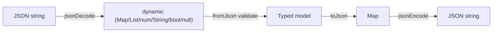
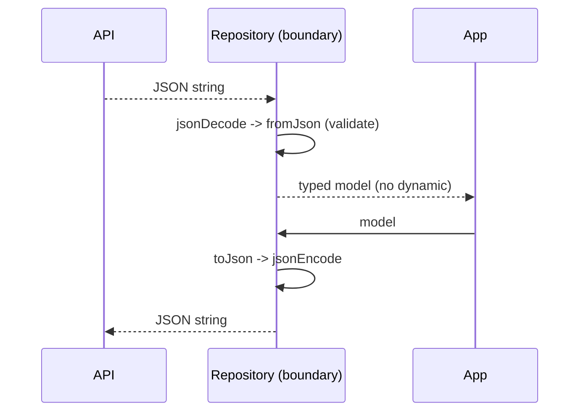

# JSON & Serialization

> Serialization is converting objects to/from a transferable format (JSON); doing it at a strict boundary — `dynamic` in, typed models out — is what keeps the rest of your app safe.

## Introduction

Almost every app talks JSON to an API. Dart's `dart:convert` gives `jsonEncode`/`jsonDecode`, but decoded JSON is `dynamic`. This file covers manual `fromJson`/`toJson`, code generation (`json_serializable`/`freezed`), handling nulls/nesting/lists/enums, and why serialization is a **type firewall**.

## Why this concept exists

Wire formats are untyped text; your app wants typed, validated objects. Serialization bridges them. Concentrating parsing at the boundary prevents `dynamic` from leaking everywhere (the failure mode from [02_data_types.md](../01%20Dart%20Fundamentals/02_data_types.md)) and turns malformed data into a clear, single point of failure instead of scattered runtime crashes.

## Real-world analogy

Serialization is **customs at a border**. Goods (JSON) arrive loosely packed and unverified. Customs (`fromJson`) inspects, validates, and repackages them into your country's standard containers (typed models). Nothing enters the country unchecked; on the way out, `toJson` re-packs into the international format.

## Problem Statement

Parse a nested API response (`user` with a list of `orders`, an optional `nickname`, an enum `status`) into typed models, validate it, and serialize back — first by hand, then with codegen. You'll build a robust `fromJson`/`toJson`.

## Internal Working



- `jsonDecode(str)` → a tree of `Map<String,dynamic>`, `List<dynamic>`, `num`, `String`, `bool`, `null`.
- `jsonEncode(obj)` → string; it calls `toJson()` on objects that define it (or you pass a `toEncodable`).
- **Manual:** write `factory Model.fromJson(Map<String,dynamic>)` casting each field, and `Map<String,dynamic> toJson()`.
- **Codegen:** annotate with `@JsonSerializable()` (json_serializable) or use `freezed` + `fromJson`; run `dart run build_runner build` to generate `*.g.dart`.
- Nested/lists: map recursively (`(json['orders'] as List).map((e)=>Order.fromJson(e as Map<String,dynamic>)).toList()`).

## Memory Representation

- Decoded JSON is a heap tree of maps/lists. Large payloads are large trees — parse them off the UI isolate (`compute`) to avoid jank ([04_isolates.md](04_isolates.md)).

## Compiler Behavior

- `jsonDecode` returns `dynamic`; the compiler can't check field access — you must cast, which is exactly why you confine it to `fromJson`.
- Codegen produces typed, analyzable `*.g.dart` with explicit casts.

## Runtime Behavior

- Bad casts/missing fields throw at parse time (`TypeError`/`FormatException`) — surface them as clear errors.
- `jsonEncode` throws if it hits a non-encodable object without `toJson`/`toEncodable`.

## Flutter Engine Behavior

Not applicable. (Parsing big responses on the main isolate causes dropped frames — offload.)

## Dart VM Behavior

- Parsing is CPU work on the calling isolate; `compute(jsonDecodeAndMap, raw)` moves it to a worker.

## Examples

```dart
import 'dart:convert';

enum OrderStatus { pending, paid, cancelled }

class Order {
  final String id;
  final int amount;
  final OrderStatus status;
  Order({required this.id, required this.amount, required this.status});

  factory Order.fromJson(Map<String, dynamic> j) => Order(
        id: j['id'] as String,
        amount: (j['amount'] as num).toInt(),
        status: OrderStatus.values.byName(j['status'] as String),
      );

  Map<String, dynamic> toJson() =>
      {'id': id, 'amount': amount, 'status': status.name};
}

class User {
  final String name;
  final String? nickname; // optional
  final List<Order> orders;
  User({required this.name, this.nickname, required this.orders});

  factory User.fromJson(Map<String, dynamic> j) => User(
        name: j['name'] as String,
        nickname: j['nickname'] as String?, // null-safe optional
        orders: (j['orders'] as List<dynamic>)
            .map((e) => Order.fromJson(e as Map<String, dynamic>))
            .toList(),
      );

  Map<String, dynamic> toJson() => {
        'name': name,
        if (nickname != null) 'nickname': nickname, // omit null
        'orders': orders.map((o) => o.toJson()).toList(),
      };
}

void main() {
  const raw = '''
  {"name":"Ada","orders":[{"id":"o1","amount":1200,"status":"paid"}]}
  ''';

  final user = User.fromJson(jsonDecode(raw) as Map<String, dynamic>);
  print('${user.name}: ${user.orders.first.status}'); // Ada: OrderStatus.paid

  final back = jsonEncode(user.toJson());
  print(back); // {"name":"Ada","orders":[{"id":"o1","amount":1200,"status":"paid"}]}
}
```

## Diagrams



## Common Mistakes

| Mistake | Why | Fix |
|---------|-----|-----|
| Leaking `Map<String,dynamic>` into the app | Loses type safety everywhere | Parse to models at the boundary |
| Unchecked `as int` on a `num` | JSON numbers may be double | `(j['x'] as num).toInt()` |
| Ignoring null/missing keys | Runtime crash | Use `as T?` + defaults; validate |
| Parsing huge JSON on UI isolate | Jank | `compute`/`Isolate.run` |
| Hand-writing many models | Error-prone/tedious | Use `json_serializable`/`freezed` |
| Persisting enum `index` | Reorder corrupts data | Serialize enum `name` |

## Best Practices

- Treat serialization as a **firewall**: `dynamic` only inside `fromJson`; typed models everywhere else.
- Validate required fields and throw a clear `FormatException` on bad data.
- Use codegen (`json_serializable`/`freezed`) for anything beyond a couple of models.
- Offload large parses to an isolate.
- Serialize enums by `name`; omit nulls when the API expects absence.

## Performance

- `jsonDecode` is O(size); big payloads belong on a worker isolate.
- Codegen parsers are as fast as hand-written and far less error-prone.

## Advantages / Disadvantages

- **+** Type-safe boundary, single failure point, codegen removes boilerplate.
- **−** Manual parsing is tedious/fragile; codegen adds a build step; large parses need isolates.

## Interview Questions

1. **🟢 What does `jsonDecode` return?** — A `dynamic` tree of `Map<String,dynamic>`/`List`/`num`/`String`/`bool`/`null`.
2. **🟢 Why keep parsing at the boundary?** — To prevent `dynamic` from leaking through the app; malformed data fails in one clear place.
3. **🟡 How do you parse a nested list of objects?** — Cast the list, `map` each element through its `fromJson`, `.toList()`.
4. **🟡 Manual vs codegen serialization?** — Manual is fine for a few models; `json_serializable`/`freezed` generate `fromJson`/`toJson` (and equality/copyWith for freezed), reducing bugs at scale.
5. **🟡 Why serialize enums by `name` not `index`?** — `index` shifts if you reorder values, corrupting stored/transmitted data; `name` is stable.
6. **🔴 Why parse large JSON off the main isolate?** — Decoding is CPU-bound and blocks the event loop → dropped frames; use `compute`/`Isolate.run`.
7. **🔴 How do you handle API nulls/optional fields safely?** — Type fields as nullable (`String?`), cast with `as T?`, and apply defaults/validation in `fromJson`.

## Senior Engineer Tips

- Separate **DTOs** (mirror the wire) from **domain entities** (your model); map between them so API changes don't ripple into the domain ([Module 40](../40%20Clean%20Architecture/README.md)).
- Centralize a `safeCast<T>`/validation helper to standardize error messages.
- For polymorphic JSON, use a discriminator field + a `switch`/pattern to pick the subtype.

## Architect Perspective

Serialization strategy is a boundary-layer decision: DTOs + mappers isolate the domain from API drift, codegen enforces consistency, and isolate offloading protects UX. Combined with typed failures ([Module 38](../38%20Error%20Handling/README.md)), this yields a resilient data layer that fails loudly at exactly one place.

## Summary

- `dart:convert` gives `jsonEncode`/`jsonDecode`; decoded JSON is `dynamic`.
- Parse to typed models at the boundary (manual or codegen); validate, handle nulls, serialize enums by `name`.
- Offload big parses to isolates; separate DTOs from domain entities.

## Revision Notes

- `jsonDecode`→dynamic tree; confine to `fromJson`.
- Nested lists: `(j['x'] as List).map(fromJson).toList()`.
- Enums by `name`; omit/allow nulls with `as T?` + defaults.
- Big parse → `compute`; use `json_serializable`/`freezed`; DTO ≠ entity.

## Practice Questions

1. Why is `(j['amount'] as num).toInt()` safer than `j['amount'] as int`?
2. How would you parse a response whose `data` is either an object or a list?
3. What breaks if you stored an enum by index and later reordered it?

## Coding Questions

1. Write `fromJson`/`toJson` for a `Product` with nested `Category` and a `List<String> tags`.
2. Add codegen: annotate a model with `@JsonSerializable()` and generate the parser.
3. Implement `Future<List<User>> parseUsers(String raw)` that decodes+maps inside `Isolate.run`.

## Mini Project

**Typed API client (pure Dart):** Build DTOs + domain entities + mappers for a small API (users/orders), a `parse` layer that validates and throws clear `FormatException`s, and an isolate-backed parser for large payloads. Add tests for valid/invalid/edge JSON. Acceptance: no `dynamic` beyond `fromJson`; enums by name; big parse offloaded; `dart analyze` clean.
