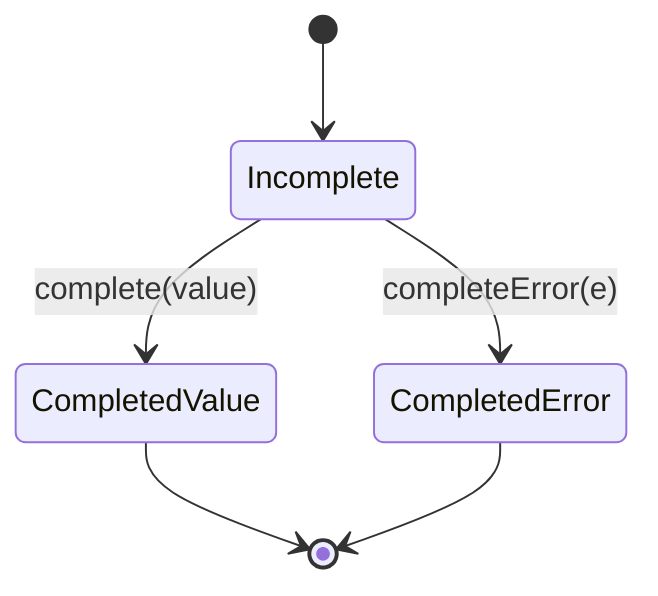
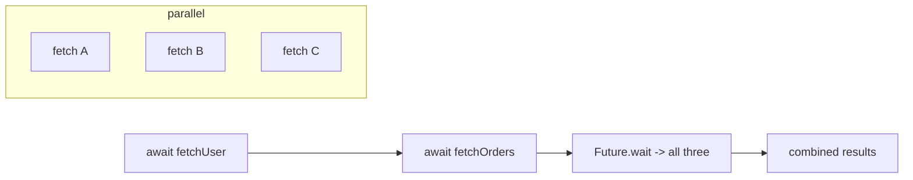

# Futures & `async`/`await`

> A `Future<T>` is a promise of a value (or error) that will arrive later; `async`/`await` lets you write asynchronous code that reads like synchronous code without blocking the event loop.

## Introduction

A `Future<T>` represents a computation that completes **later** with either a value of type `T` or an error. `async`/`await` is syntactic sugar over `Future` that removes callback nesting. This file covers creating, chaining, awaiting, combining, and error-handling futures — the daily grammar of I/O in Flutter.

## Why this concept exists

Network calls, file reads, and timers don't finish instantly. Blocking the single thread until they do would freeze the UI. Futures let you *register interest* in a later result and let the event loop keep running. `async`/`await` makes that readable, turning callback pyramids into linear code.

## Real-world analogy

Ordering coffee with a **buzzer**: you place the order (start the future), take the buzzer, and go sit down (the thread keeps working). When it buzzes (the future completes), you collect your coffee (the value) — or the barista tells you they're out (an error). `await` is "sit and do nothing *of your own* until it buzzes," but the café (event loop) keeps serving others.

## Problem Statement

Fetch a user, then their orders, handle a network error gracefully, add a timeout, and fetch three independent resources in parallel. You'll use `await`, `try`/`catch`, `.timeout`, and `Future.wait`.

## Internal Working



- A `Future` is a single-shot container: it completes **once**, with a value or an error.
- `.then(onValue, onError:)` / `.catchError` / `.whenComplete` register callbacks (run as microtasks on completion).
- `async` functions **always return a `Future`**; `await` suspends the function, scheduling the rest as a continuation (microtask) when the awaited future completes.
- `Completer<T>` lets you create and complete a future manually (bridging callback APIs).

## Memory Representation

- A `Future` object holds its state (pending/value/error) and a list of registered continuation closures. Those closures capture their surrounding variables until the future completes and they run.

## Compiler Behavior

- `async`/`await` compiles to a **state machine** (see [event_loop.md](event_loop.md)); each `await` is a suspension point.
- Returning a value from an `async` function wraps it in `Future.value`; throwing inside becomes a completed-with-error future.
- The analyzer warns on **unawaited** futures (`unawaited_futures`) — a common bug source.

## Runtime Behavior

- Awaiting a completed future still yields to the microtask queue (never fully synchronous).
- Errors in an awaited future are **rethrown** at the `await` point, catchable by a surrounding `try`/`catch`.
- An unhandled future error becomes an uncaught async error (goes to the zone/`PlatformDispatcher.onError`).

## Flutter Engine Behavior

Not applicable at engine level. Flutter's `FutureBuilder` subscribes to a future and rebuilds on completion; awaited I/O keeps frames flowing because the loop isn't blocked.

## Dart VM Behavior

- Continuations are scheduled as microtasks; the VM's async infrastructure integrates with the isolate loop.

## Examples

```dart
import 'dart:async';

Future<String> fetchUser() async =>
    Future.delayed(const Duration(milliseconds: 100), () => 'Ada');

Future<List<String>> fetchOrders(String user) async =>
    Future.delayed(const Duration(milliseconds: 100), () => ['o1', 'o2']);

Future<void> main() async {
  // sequential dependency
  try {
    final user = await fetchUser();
    final orders = await fetchOrders(user);
    print('$user has ${orders.length} orders'); // Ada has 2 orders
  } on TimeoutException {
    print('timed out');
  } catch (e) {
    print('failed: $e');
  }

  // timeout
  final slow = Future.delayed(const Duration(seconds: 5), () => 'late');
  try {
    await slow.timeout(const Duration(milliseconds: 200));
  } on TimeoutException {
    print('gave up waiting'); // this prints
  }

  // parallel independent work (fan-out)
  final results = await Future.wait([
    Future.delayed(const Duration(milliseconds: 50), () => 1),
    Future.delayed(const Duration(milliseconds: 80), () => 2),
    Future.delayed(const Duration(milliseconds: 30), () => 3),
  ]);
  print(results); // [1, 2, 3] — waits for all, ~80ms not 160ms

  // Completer: bridge a callback API to a Future
  final completer = Completer<int>();
  Timer(const Duration(milliseconds: 10), () => completer.complete(42));
  print(await completer.future); // 42
}
```

## Diagrams



## Common Mistakes

| Mistake | Why | Fix |
|---------|-----|-----|
| Awaiting independent calls sequentially | Wastes time (sum of durations) | `Future.wait([...])` for parallel |
| Forgetting to `await` (fire-and-forget) | Errors vanish, ordering bugs | `await` or `unawaited(...)` deliberately |
| `try`/`catch` around a non-awaited future | Won't catch its error | Await inside the try, or use `.catchError` |
| CPU-bound work in `async` | Blocks the loop | Use isolates/`compute` |
| `Future.wait` with one failure | Rejects whole batch | Use `eagerError:false` or wrap each with `catchError` |

## Best Practices

- Parallelize independent awaits with `Future.wait`.
- Always handle errors: `try`/`catch` around awaits, or `.catchError`.
- Add `.timeout` to network calls.
- Mark intentional fire-and-forget with `unawaited(...)`.
- Return `Future<void>` (not `void`) from async APIs so callers can await.

## Performance

- `Future.wait` turns N sequential I/O waits into one parallel wait (~max, not sum).
- Avoid creating unnecessary futures in hot paths; each schedules a microtask.

## Advantages / Disadvantages

- **+** Readable async, composition (`wait`/`any`), integrated error handling, timeouts.
- **−** Single-shot only (use `Stream` for multiple values); easy to forget `await`; doesn't parallelize CPU work.

## Interview Questions

1. **🟢 What is a `Future`?** — A container for a value/error that becomes available later; completes exactly once.
2. **🟢 Does an `async` function always return a Future?** — Yes; a returned value is wrapped in `Future.value`, a throw becomes a completed-with-error future.
3. **🟡 How do you run two independent async calls in parallel?** — Start both (don't await individually), then `await Future.wait([a, b])`.
4. **🟡 Where is an awaited future's error caught?** — It's rethrown at the `await`; a surrounding `try`/`catch` handles it.
5. **🟡 `Future` vs `Stream`?** — `Future` = one async value; `Stream` = zero or more async values over time.
6. **🔴 What is a `Completer` for?** — To create a future you complete manually — bridging callback-based APIs into the future world.
7. **🔴 Why can awaiting still not run synchronously on a completed future?** — Continuations are scheduled as microtasks; `await` always yields to the loop.

## Senior Engineer Tips

- `Future.wait` fails fast by default; for "collect all results and errors," map each to a result-capturing wrapper before `wait`.
- Prefer returning typed failures (`Result`) over throwing across async boundaries for expected errors ([Module 38](../38%20Error%20Handling/README.md)).
- Beware `await` in loops — it serializes; use `Future.wait(list.map(...))` for concurrency (bounded, to avoid overload).

## Architect Perspective

Async design shapes latency and resilience: fan-out with `Future.wait`, add timeouts/retries/backoff, and convert exceptions to typed failures at the repository boundary. A consistent async policy (timeouts everywhere, bounded concurrency, cancellation strategy) is a hallmark of production-grade apps and directly affects perceived speed.

## Summary

- `Future<T>` = one later value/error; `async`/`await` = readable, non-blocking async.
- Parallelize with `Future.wait`; guard with `try`/`catch` and `.timeout`.
- `async` doesn't parallelize CPU work — that's isolates.

## Revision Notes

- `async` fn always returns a `Future`; `await` suspends (continuation = microtask).
- Parallel: `Future.wait`; timeout: `.timeout`; manual: `Completer`.
- Await errors caught by surrounding try/catch; unawaited errors go to zone.
- CPU work → isolate, not `async`.

## Practice Questions

1. Rewrite three sequential awaits that are independent to run in parallel; estimate the time saved.
2. Why does a `try/catch` around an un-awaited future fail to catch its error?
3. When do you need a `Completer`?

## Coding Questions

1. Implement `Future<T> retry<T>(Future<T> Function() op, {int times, Duration delay})`.
2. Implement `Future<T> withTimeout<T>(Future<T> f, Duration d, {T Function()? onTimeout})`.
3. Write `Future<List<R>> mapConcurrent<T,R>(Iterable<T> xs, Future<R> Function(T) f, {int concurrency})` (bounded parallelism).

## Mini Project

**Resilient fetch layer (pure Dart):** Build a `fetch` helper with timeout, exponential-backoff retry, and `Future.wait`-based parallel fetching of multiple simulated endpoints, returning a combined typed result and collecting per-endpoint errors. Acceptance: no unawaited futures; timeouts and retries covered by tests using injected fake delays; `dart analyze` clean.
