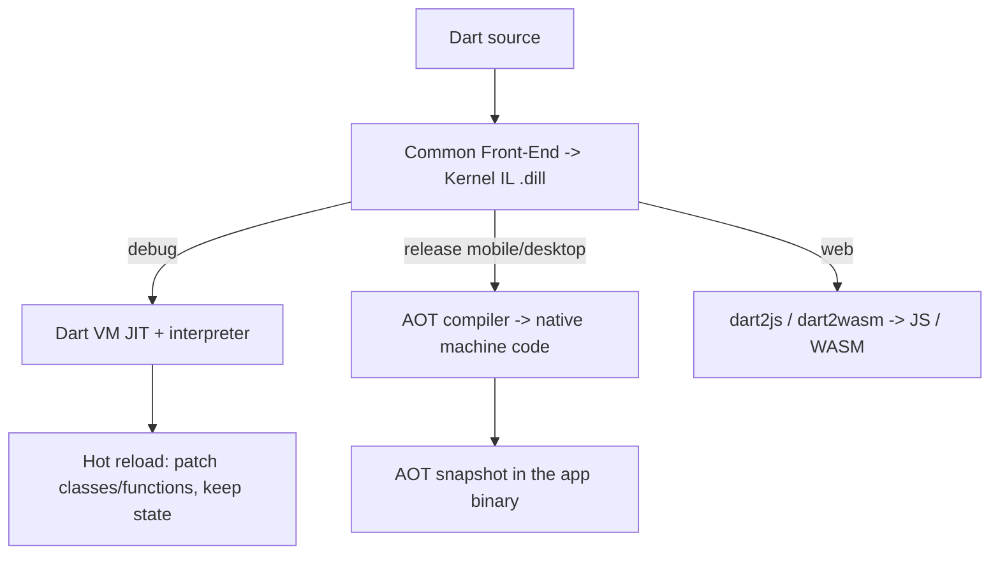
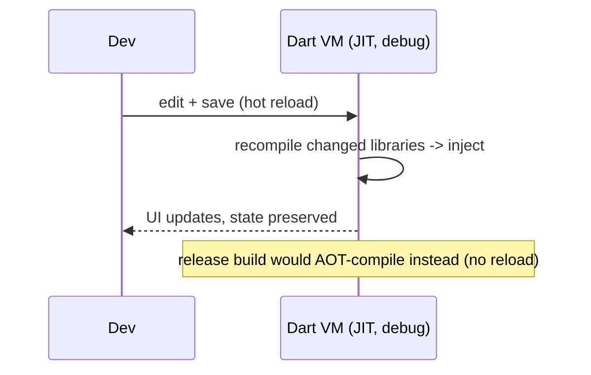

# Dart Compilation (VM, JIT, AOT, Snapshots, Tree Shaking)

> Dart compiles two ways: **JIT** during development (enabling stateful hot reload) and **AOT** for release (native machine code, fast startup, small size) — one language, two pipelines tuned for two goals.

## Introduction

Understanding Dart's compilation model explains Flutter's superpowers: sub-second **hot reload** in debug and **native, fast-starting** release builds. This file covers the Dart VM, **JIT** vs **AOT**, kernel/snapshots, **tree shaking**, `dart2js`/wasm for web, and how each affects the developer experience and app size/performance.

## Why this concept exists

Development and production have opposite priorities. Development wants **fast iteration** (change code, see it live) — served by JIT + hot reload. Production wants **fast startup, predictable performance, small size, no JIT** (app-store rules on iOS forbid runtime codegen) — served by AOT. Dart supports both from one codebase, which is a core reason Flutter feels productive *and* ships fast apps.

## Real-world analogy

JIT is a **live theater rehearsal**: actors can change lines mid-scene and you see it instantly (hot reload), at the cost of some overhead. AOT is the **filmed, edited movie**: locked, optimized, plays back fast anywhere — but you can't change a line without re-shooting (rebuild).

## Problem Statement

Explain why hot reload works in debug but not release, why release builds start faster and are smaller, and why unused code doesn't bloat your app. You'll connect JIT→hot reload and AOT→tree-shaken native binary.

## Internal Working



- **Front end (CFE):** parses/type-checks Dart into **Kernel** (a.k.a. `.dill`), a language-level IL shared by all backends.
- **JIT (debug):** the VM runs Kernel via an interpreter + just-in-time compiler that optimizes hot code at runtime. Supports **hot reload** (inject updated code, preserve app state) and **hot restart** (reset state).
- **AOT (release, mobile/desktop):** compiles Kernel to **native machine code** ahead of time, bundled as an AOT snapshot. No JIT at runtime → fast startup, consistent perf, satisfies iOS's no-runtime-codegen rule.
- **Web:** `dart2js` compiles to JavaScript; `dart2wasm` compiles to WebAssembly.
- **Tree shaking:** the AOT/web compilers perform whole-program analysis and **drop unreferenced code** (functions, classes, even unused icon glyphs via `--tree-shake-icons`), shrinking the binary.

## Memory Representation

- **Snapshots** serialize compiled code/data for fast loading: JIT can use app/kernel snapshots to speed startup; AOT snapshots contain native code + heap image loaded directly at launch.

## Compiler Behavior

- Type checking and const evaluation happen in the front end (shared).
- Tree shaking requires a *closed world* (whole-program) view — which is why it's an AOT/web feature; reflection (`dart:mirrors`) breaks it and is therefore **unavailable in Flutter/AOT**.

## Runtime Behavior

- JIT: first runs are interpreted, hot paths get optimized (and can deoptimize) → variable early performance but great flexibility.
- AOT: uniform, predictable performance from the first frame; no warmup, no JIT pauses.

## Flutter Engine Behavior

- **Debug builds** ship the Dart VM with JIT → hot reload/restart via DevTools/IDE.
- **Release builds** are AOT-compiled → smaller, faster-starting, no hot reload. This is why `flutter run` (debug) supports hot reload but `flutter build apk --release` does not. See [Module 10 Flutter Architecture](../10%20Flutter%20Architecture/README.md) and [Module 51 Deployment](../51%20Deployment/README.md).

## Dart VM Behavior

- The VM hosts isolates, GC ([memory_and_gc.md](memory_and_gc.md)), and (in debug) JIT. In release the VM runs precompiled AOT code (no JIT compiler shipped).

## Examples

```text
# Debug (JIT) — hot reload available:
flutter run                       # press 'r' = hot reload, 'R' = hot restart

# Release (AOT) — optimized, no hot reload:
flutter build apk --release
flutter build ios --release
flutter build web --release       # dart2js (or --wasm for dart2wasm)

# Pure Dart:
dart run bin/main.dart            # JIT
dart compile exe bin/main.dart    # AOT native executable
dart compile js bin/main.dart     # to JavaScript

# Icon tree shaking (Flutter release) drops unused MaterialIcons glyphs:
#   "Font asset ... tree-shaken, reducing it from XKB to YKB"
```

```dart
// Reflection is NOT available under AOT/Flutter (breaks tree shaking):
// import 'dart:mirrors'; // ❌ not supported in Flutter
// Use code generation (build_runner) instead of runtime reflection.
```

## Diagrams



## Common Mistakes

| Mistake | Why | Fix |
|---------|-----|-----|
| Expecting hot reload in release | Release is AOT (no JIT) | Use debug for iteration |
| Relying on `dart:mirrors`/reflection | Unavailable under AOT; breaks tree shaking | Use codegen (`build_runner`) |
| Benchmarking in debug | JIT + asserts skew results | Profile/benchmark in `--profile`/`--release` |
| Assuming unused imports bloat release | Tree shaking removes dead code | Still avoid unused deps that *are* referenced |
| Confusing hot reload vs hot restart | Reload keeps state; restart resets | Reload for UI tweaks; restart for state/main changes |

## Best Practices

- Iterate in **debug** (hot reload); always **profile/measure in profile/release** builds.
- Avoid reflection; adopt code generation for serialization/DI where needed.
- Keep dependencies lean; tree shaking helps but referenced-yet-unused-heavy libs still cost.
- Use `--split-debug-info`/obfuscation for release size/security ([Modules 37, 51](../37%20Security/README.md)).

## Performance

- AOT: fast cold start, no JIT warmup/pauses, predictable — ideal for mobile.
- JIT: flexible, good for dev; not representative of release performance.
- Tree shaking + icon shaking materially reduce app size.

## Advantages / Disadvantages

- **+** Best-of-both: fast dev iteration (JIT/hot reload) and fast, small, secure release (AOT/tree shaking).
- **−** Release loses hot reload; no runtime reflection; two behavior profiles to keep in mind (debug vs release).

## Interview Questions

1. **🟢 Why does Flutter have hot reload in debug but not release?** — Debug uses the JIT-capable Dart VM (can inject updated code, keep state); release is AOT-compiled native code with no JIT.
2. **🟢 JIT vs AOT?** — JIT compiles at runtime (flexible, warms up, enables hot reload); AOT compiles ahead of time to native code (fast startup, predictable, no runtime codegen).
3. **🟡 What is Kernel/`.dill`?** — The common front-end's intermediate representation of Dart, consumed by both JIT and AOT/web backends.
4. **🟡 What is tree shaking?** — Whole-program elimination of unreferenced code (and unused icon glyphs) during AOT/web compilation, shrinking output.
5. **🟡 Why is `dart:mirrors` unavailable in Flutter?** — Runtime reflection defeats whole-program tree shaking (can't prove what's unused) and conflicts with AOT; codegen is used instead.
6. **🔴 Hot reload vs hot restart?** — Reload recompiles/injects changed libraries and preserves app state; restart rebuilds and resets state (re-runs `main`).
7. **🔴 How does Dart target the web?** — `dart2js` (to JavaScript) and `dart2wasm` (to WebAssembly), separate from the VM/AOT pipelines.

## Senior Engineer Tips

- Treat debug numbers as meaningless for performance; always confirm in profile/release.
- If a package needs reflection, it won't work in Flutter release — prefer codegen-based equivalents.
- Understand snapshots when optimizing startup: AOT snapshot size and deferred loading (web) affect launch time.

## Architect Perspective

The dual pipeline shapes tooling and delivery decisions: fast local iteration for teams, AOT for store-compliant, performant releases, and tree shaking + deferred loading for size budgets. Choosing codegen over reflection is a foundational constraint that influences serialization, DI, and routing architecture across the whole app ([Modules 12–14, 40](../14%20Dependency%20Injection/README.md)).

## Summary

- One front end (Kernel) feeds two backends: JIT (debug, hot reload) and AOT (release, native).
- Web targets JS/WASM; tree shaking removes dead code; reflection is unavailable under AOT.
- Iterate in debug, measure in release; prefer codegen over reflection.

## Revision Notes

- CFE → Kernel `.dill` → JIT (debug/hot reload) or AOT (release/native) or dart2js/wasm (web).
- Hot reload = inject + keep state (JIT only); hot restart = reset state.
- AOT: fast startup, predictable, no runtime codegen (iOS-compliant).
- Tree shaking drops dead code/icons; `dart:mirrors` unsupported → use codegen.
- Benchmark in profile/release, never debug.

## Practice Questions

1. Explain to a teammate why their release build ignores hot reload.
2. Why does adopting reflection-based serialization break a Flutter release?
3. What does tree shaking do to unused code and icon fonts?

## Coding Questions

1. Compare `dart run` vs `dart compile exe` startup time for a small program; explain the difference.
2. Trigger and read the "tree-shaken icons" message in a Flutter release build.
3. Convert a hypothetical reflection-based mapper to a `build_runner` codegen approach (design/pseudocode).

## Mini Project

**Compilation report (docs + measurements):** For a small Flutter app, build debug, profile, and release variants; record startup time and APK/web size, capture the icon-tree-shaking log, and document why each differs. Add a note on why a reflection-dependent package fails in release. Acceptance: measured numbers for all three modes; a clear JIT-vs-AOT explanation tied to observed behavior.
