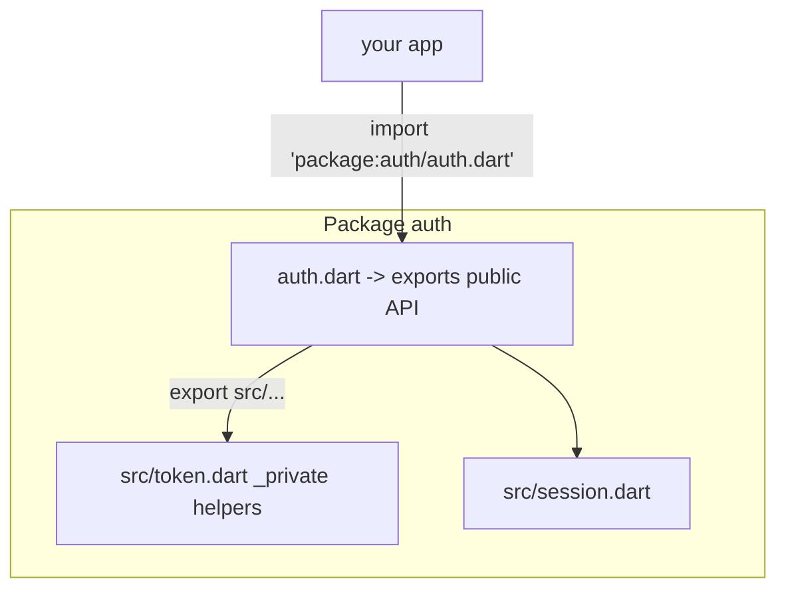
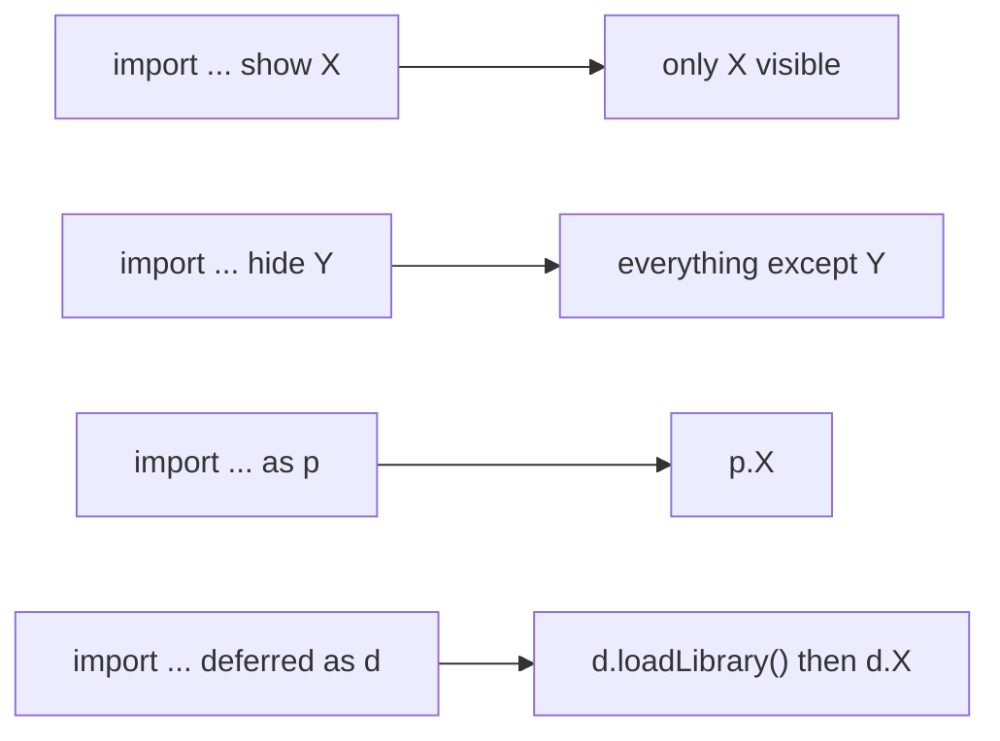

# Libraries & Packages (`library`, `part`, `import`/`export`, pub)

> A Dart *library* is the unit of privacy and reuse (usually one file); a *package* bundles libraries with a `pubspec.yaml` so others can depend on them.

## Introduction

Dart's code organization has two levels: **libraries** (privacy + import boundary) and **packages** (distribution unit on pub.dev). This file covers `import`/`export`/`show`/`hide`/`as`, `part`/`part of`, library-level privacy (`_`), `pubspec.yaml`, dependency types, and versioning.

## Why this concept exists

Big codebases need boundaries: what's public vs private, what a module exposes, and how to depend on external code reproducibly. Libraries give encapsulation (the `_` privacy you've used is *library*-scoped). Packages + pub give semantic-versioned, reproducible dependency management — the reason `flutter pub get` yields consistent builds.

## Real-world analogy

A library is a **room** in a house: things marked private (`_`) stay inside the room; a door (`export`) decides what the rest of the house sees. A package is a **prefab module** shipped with a spec sheet (`pubspec.yaml`) you bolt onto your house; the version number is the model number so you can reorder the exact same part.

## Problem Statement

You're building a reusable `auth` module: hide internal helpers, expose a clean public API from one entry file, split a big library across files, and depend on `http` with a sane version constraint. You'll use `_` privacy, `export`, `part`, and `pubspec.yaml`.

## Internal Working



- **Privacy** is per-library: `_name` is visible only within the same library (file, or files joined by `part`).
- **`import`** brings a library in; modifiers: `show`/`hide` (select names), `as` (prefix), `deferred as` (lazy load, web).
- **`export`** re-exposes another library's API from your entry file (the "barrel" pattern) — consumers import one file.
- **`part`/`part of`** splits one *library* across multiple files (they share privacy). Modern style prefers many small libraries + `export` over `part`, except for codegen (`*.g.dart`).
- **Package layout:** public API in `lib/`, private implementation in `lib/src/` (convention: don't import another package's `src/`). `pubspec.yaml` declares name, SDK/env constraints, and dependencies.

## Memory Representation

Not applicable — libraries/packages are a source-organization and linking concern, not runtime data.

## Compiler Behavior

- The analyzer enforces library privacy and unresolved imports.
- Tree shaking (see [dart_compilation.md](dart_compilation.md)) drops unused top-level symbols across libraries in AOT.
- `deferred as` splits code for lazy loading (primarily Flutter web).

## Runtime Behavior

- Normal imports are resolved at compile/link time; `deferred` libraries load on `await lib.loadLibrary()`.

## Flutter Engine Behavior

Not applicable. (Package structure affects app size via tree shaking and deferred loading on web.)

## Dart VM Behavior

- Libraries compile into the kernel/snapshot; unused code is shaken out in AOT builds.

## Examples

```dart
// lib/src/token.dart
String _sign(String data) => 'signed:$data'; // library-private helper
class TokenService {
  String issue(String user) => _sign(user);  // can use private in same library
}

// lib/src/session.dart
class Session {
  final String user;
  Session(this.user);
}

// lib/auth.dart  (public entry / barrel)
export 'src/token.dart' show TokenService; // expose only TokenService
export 'src/session.dart';

// ---- consumer ----
// import 'package:auth/auth.dart';
// import 'package:http/http.dart' as http;      // prefix
// import 'dart:math' show max, min;             // selective

void main() {
  // print(max(2, 9)); // from dart:math via show
}
```

```yaml
# pubspec.yaml
name: auth
description: Reusable auth module
environment:
  sdk: ^3.4.0
dependencies:
  http: ^1.2.0          # ^ = >=1.2.0 <2.0.0 (caret / semver)
dev_dependencies:
  test: ^1.25.0
  lints: ^4.0.0
```

## Diagrams



## Common Mistakes

| Mistake | Why | Fix |
|---------|-----|-----|
| Importing another package's `lib/src/` | Not part of its public API; breaks on updates | Import its public entry file |
| Overusing `part`/`part of` | Fragile, shares privacy widely | Prefer small libraries + `export` (barrel) |
| Loose version constraints (`any`) | Non-reproducible/breaking builds | Use caret `^` constraints; commit lockfile |
| Name conflicts on import | Ambiguous symbols | `show`/`hide`/`as` prefix |
| Putting public API in `lib/src/` | Consumers can't (shouldn't) reach it | Public API in `lib/`, internals in `lib/src/` |

## Best Practices

- Expose a **single barrel entry** (`lib/package_name.dart`) via `export`; keep internals in `lib/src/`.
- Use `show`/`hide`/`as` to keep imports clean and unambiguous.
- Pin dependencies with caret constraints; commit `pubspec.lock` for apps (not for published packages).
- Reserve `part` for generated files; otherwise prefer many focused libraries.
- Follow semantic versioning when publishing.

## Performance

- Good modularization + tree shaking reduces binary size; `deferred` imports cut initial web load.

## Advantages / Disadvantages

- **+** Encapsulation, reusable distribution, reproducible builds, clean public APIs.
- **−** `part` fragility if overused; dependency management/version conflicts require care.

## Interview Questions

1. **🟢 How is privacy scoped in Dart?** — Per library (file, or files joined by `part`): a `_name` is visible only within the same library, not per class.
2. **🟢 `import` vs `export`?** — `import` brings names into your library; `export` re-exposes another library's names from yours (barrel pattern).
3. **🟡 `show`/`hide`/`as`?** — Selectively import specific names, exclude names, or prefix an import to avoid conflicts.
4. **🟡 `part`/`part of` vs multiple libraries?** — `part` splits one library across files (shared privacy); modern style favors separate libraries + `export`, reserving `part` for codegen.
5. **🟡 What does `^1.2.0` mean?** — Caret/semver: `>=1.2.0 <2.0.0` — compatible updates within the same major version.
6. **🔴 Why not import a package's `lib/src/`?** — It's private-by-convention implementation; it can change/break across versions. Only the public entry is stable API.
7. **🔴 What is a deferred import for?** — Lazy-loading a library on demand (`loadLibrary()`), primarily to reduce initial load size on Flutter web.

## Senior Engineer Tips

- Design packages with a **narrow public surface**: one barrel, `src/` internals, and `show` on exports to hide accidentals.
- Use a monorepo with path/workspace dependencies for modular apps ([Module 45 Modular Architecture](../45%20Modular%20Architecture/README.md)).
- Keep `pubspec.lock` committed for apps to guarantee reproducible CI builds.

## Architect Perspective

Library/package boundaries *are* your architecture's enforcement mechanism: separate feature packages with explicit public APIs prevent cross-layer leakage far better than folder conventions alone. This underpins modular and Clean Architecture at scale ([Modules 40, 44, 45](../45%20Modular%20Architecture/README.md)).

## Summary

- Library = privacy + import unit (per file/`part`); package = distribution unit with `pubspec.yaml`.
- `import`/`export`/`show`/`hide`/`as`/`deferred` control visibility; barrel + `src/` gives clean public APIs.
- Use semver caret constraints; commit lockfiles for apps; reserve `part` for codegen.

## Revision Notes

- `_privacy` = library-scoped (file/`part`).
- `import` in, `export` out (barrel); `show`/`hide`/`as`/`deferred`.
- Public API in `lib/`, internals in `lib/src/`; never import others' `src/`.
- `^1.2.0` = `>=1.2.0 <2.0.0`; commit `pubspec.lock` for apps.

## Practice Questions

1. Why is `_helper` in one file invisible to a class in another file (without `part`)?
2. When is `export` (barrel) better than making consumers import many files?
3. What breaks if you depend on `any` versions?

## Coding Questions

1. Structure a mini package with `lib/calc.dart` (barrel), `lib/src/ops.dart`, and a private helper; expose only the public API.
2. Write imports using `show`, `hide`, and `as` to resolve a name clash between two libraries.
3. Draft a `pubspec.yaml` with runtime + dev deps and correct caret constraints.

## Mini Project

**Reusable utility package (pure Dart):** Create a package with a barrel entry exporting a curated API, internals under `src/` with library-private helpers, a `pubspec.yaml` with pinned deps, and unit tests. Document the public API. Acceptance: only intended symbols are importable; internals hidden; `dart pub get` + `dart test` pass; `dart analyze` clean.
