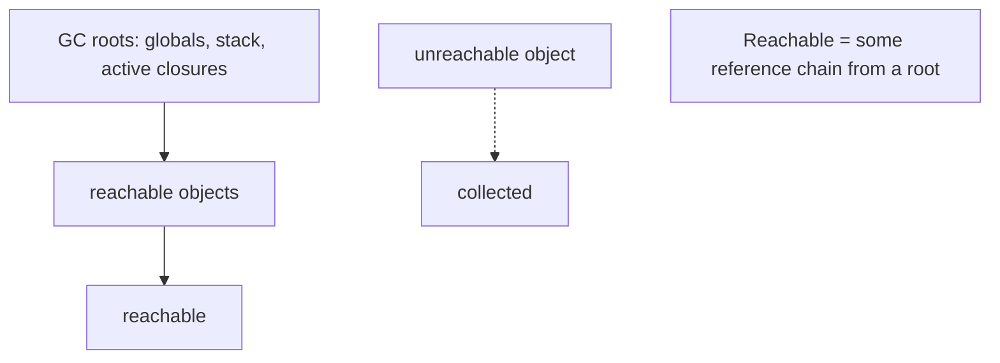
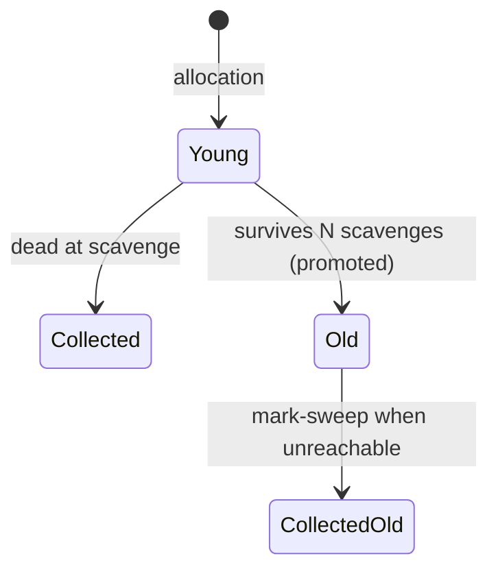

# Memory Management & Garbage Collection

> Dart manages memory automatically with a generational garbage collector; your job is to avoid *retaining* objects longer than needed — leaks in Dart are almost always unintended references, not missing frees.

## Introduction

Dart has **automatic memory management**: you never `free`/`delete`. A **generational garbage collector (GC)** reclaims unreachable objects. This file covers the heap model, the young/old generation GC, what "reachable" means, common Flutter memory leaks (uncancelled subscriptions, retained `context`, controllers), and how to find them with DevTools.

## Why this concept exists

Manual memory management (C/C++) is error-prone (leaks, use-after-free). GC trades a little runtime cost for safety and productivity. But GC only reclaims what's **unreachable** — so understanding *reachability* is the key skill: a leak in Dart means something still points to an object you thought was gone.

## Real-world analogy

The GC is a **janitor** who throws away anything no one is "holding onto." An object is kept as long as *any* chain of references reaches it from a root (globals, the stack, active closures/subscriptions). A leak is like leaving a **sticky note** (a subscription/timer) pinned to a whiteboard you meant to erase — the janitor sees it's still referenced and won't clear it.

## Problem Statement

Your Flutter screen's memory keeps climbing each time it's opened and closed. You suspect a leak. You'll learn the reachability model, the usual culprits (subscriptions/controllers/timers not disposed), and how to confirm with DevTools' memory tools.

## Internal Working



Dart's GC is **generational**, exploiting "most objects die young":
- **Young/new generation** — a small space collected frequently with a fast **scavenger** (copying) collector. Cheap because most young objects are already dead.
- **Old generation** — objects that survive several young collections are **promoted**; collected less often via a **mark-sweep(-compact)** collector.
- GC runs concurrently/incrementally where possible to minimize pauses (important for frame timing).

Reachability, not scope, determines lifetime: an object is alive while any root can reach it (a static list holding it, an active `StreamSubscription`'s closure capturing it, a running `Timer`).

## Memory Representation

- Objects live on the isolate's heap; each isolate has its own heap and GC (no cross-isolate references — see [isolates.md](isolates.md)).
- The stack holds references (locals); the heap holds the objects. Closures move captured variables to the heap.

## Compiler Behavior

- Not a compile-time concern directly, but `const` canonicalization reduces allocations, and tree shaking removes dead code (less to load, not less to GC).

## Runtime Behavior

- Allocation is fast (bump-pointer in the young space). Collection pauses are usually sub-millisecond for young GC; old-gen GC is rarer and larger.
- Finalizers (`Finalizer`) can run cleanup when an object is collected, but timing is **not guaranteed** — don't rely on them for critical resource release.

## Flutter Engine Behavior

GC pauses that coincide with a frame can cause jank. Excessive per-frame allocation (rebuilding heavy objects, closures, or lists every frame) increases young-GC frequency. The framework's `dispose()` lifecycle exists precisely so you release retained references (controllers, subscriptions) and let the GC reclaim them. See [Module 08 Widget Lifecycle](../08%20Widget%20Lifecycle/README.md) and [Module 21 Performance](../21%20Performance/README.md).

## Dart VM Behavior

- The VM uses a generational GC (scavenger for young, mark-sweep-compact for old), tuned to keep pauses short. AOT and JIT share the model; heap is per-isolate (isolate groups may share runtime metadata).

## Examples

```dart
import 'dart:async';

// LEAK PATTERN (Flutter-style, illustrated in pure Dart):
class Screen {
  StreamSubscription<int>? _sub;
  final _timer = <Timer>[];

  void open(Stream<int> ticks) {
    // ❌ if never cancelled, this subscription (and its captured `this`)
    //    stays reachable from the stream -> Screen can't be GC'd.
    _sub = ticks.listen((v) => _handle(v));
    _timer.add(Timer.periodic(const Duration(seconds: 1), (_) => _handle(0)));
  }

  void _handle(int v) {/* ... */}

  // ✅ release references so the GC can reclaim this object graph
  void dispose() {
    _sub?.cancel();
    for (final t in _timer) {
      t.cancel();
    }
    _timer.clear();
  }
}

void main() {
  // demonstrate reachability keeping objects alive
  final held = <Object>[];
  var o = Object();
  held.add(o); // still reachable via `held`
  o = Object(); // the FIRST object is still alive (held references it)
  print(held.length); // 1 — not collected because reachable
}
```

## Diagrams



## Common Mistakes (Flutter leaks)

| Leak source | Why it retains | Fix |
|-------------|----------------|-----|
| Uncancelled `StreamSubscription` | Stream holds the callback (+ captured `this`) | `cancel()` in `dispose()` |
| Undisposed controllers (`AnimationController`, `TextEditingController`, `ScrollController`) | Framework/ticker keeps references | `dispose()` them |
| `Timer`/`Timer.periodic` not cancelled | Scheduler holds the callback | `cancel()` |
| Static/global caches without eviction | Roots keep everything reachable | Bound size / evict / use weak refs |
| Capturing `BuildContext`/`State` in long-lived closures | Keeps whole subtree alive | Avoid capturing; cancel owners |
| Global `ValueNotifier` with many listeners never removed | Listeners retained | `removeListener`/`dispose` |

## Best Practices

- Every subscription/controller/timer has an **owner** that disposes it (in Flutter, `State.dispose`).
- Bound caches (size/TTL); consider `WeakReference`/`Expando` for associative caches that shouldn't retain.
- Minimize per-frame allocations: `const` widgets, hoist closures, reuse buffers.
- Use `Finalizer` only for best-effort native-resource cleanup, never for correctness.
- Profile with **DevTools Memory** (heap snapshot, allocation tracing, "retaining path").

## Performance

- Allocation is cheap; *churn* is the cost (more young GCs). Reduce allocations in hot paths.
- Large retained graphs push objects into old gen, making eventual collection more expensive.

## Advantages / Disadvantages

- **+** No manual free/use-after-free; fast young-gen allocation/collection; incremental pauses.
- **−** Leaks via unintended references still happen; GC pauses can (rarely) affect frames; finalizer timing unguaranteed.

## Interview Questions

1. **🟢 Does Dart require manual memory management?** — No; it's garbage collected. You avoid leaks by not retaining references, not by freeing.
2. **🟢 What makes an object eligible for collection?** — Being **unreachable** — no reference chain from any GC root reaches it.
3. **🟡 Describe Dart's GC.** — Generational: a frequent, cheap copying scavenger for the young space; a less-frequent mark-sweep(-compact) for the old space; survivors are promoted young→old.
4. **🟡 Name three common Flutter leaks.** — Uncancelled stream subscriptions, undisposed controllers (animation/text/scroll), and uncancelled timers — all retain via held references (often capturing `this`/`context`).
5. **🟡 Why does an uncancelled subscription leak the whole screen?** — The stream holds the `onData` closure, which captures `this` (the `State`), keeping the entire widget/state graph reachable.
6. **🔴 Can you rely on finalizers for resource cleanup?** — No; finalizer execution timing isn't guaranteed. Use explicit `dispose`/`close`; finalizers are best-effort fallbacks.
7. **🔴 How do you find a leak?** — DevTools Memory: take heap snapshots across open/close cycles, look for growing instance counts, and inspect the **retaining path** to see what still references the object.

## Senior Engineer Tips

- Adopt a rule: "if you `listen`/`create a controller`/`start a timer`, you own its disposal." Code review for it.
- Watch static singletons and app-wide notifiers — they're roots; anything they reference lives forever.
- Reduce per-frame garbage first (it's the common, cheap win) before chasing rare old-gen pauses.

## Architect Perspective

Memory discipline is a cross-cutting reliability concern. Establish lifecycle ownership conventions (dispose patterns, bounded caches, weak references for observers) and enforce them via lints/reviews and leak-detection in tests (`flutter test` + leak_tracker). At scale, unmanaged retention is a top cause of gradual slowdowns and OOM crashes on low-end devices ([Module 21](../21%20Performance/README.md)).

## Summary

- Dart is GC-managed; objects die when unreachable. GC is generational (fast young scavenger + old mark-sweep).
- Leaks = unintended retained references — cancel subscriptions/timers, dispose controllers, bound caches.
- Reduce per-frame allocations; profile with DevTools; don't rely on finalizers.

## Revision Notes

- Automatic GC; collect when **unreachable** (no root chain).
- Generational: young scavenge (frequent/cheap) → promote → old mark-sweep.
- Leaks: uncancelled subs/timers, undisposed controllers, unbounded static caches, captured `context`.
- Fix: dispose owners; bound caches; weak refs; cut per-frame allocation.
- Finalizers = best-effort only. Debug via DevTools retaining path.

## Practice Questions

1. Why can an object referenced only by a still-active `Timer` never be collected?
2. Explain how capturing `this` in a stream callback leaks a whole screen.
3. When would you use `WeakReference`/`Expando`?

## Coding Questions

1. Write a `Disposable` base that tracks subscriptions/timers and cancels all in `dispose()`.
2. Implement a size-bounded LRU cache that evicts (so it doesn't retain forever).
3. Use `WeakReference` to build an observer registry that doesn't keep observers alive.

## Mini Project

**Leak-safe resource manager (pure Dart):** Build a `ResourceScope` that registers streams/timers/controllers and disposes them all at once, plus a bounded cache. Simulate open/close cycles and assert (via counters/finalizers) that resources are released. Acceptance: no leaked timers/subscriptions after `dispose`; cache stays bounded; documented reachability reasoning; `dart analyze` clean.
