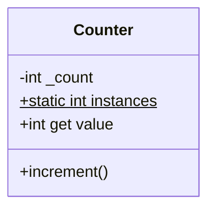
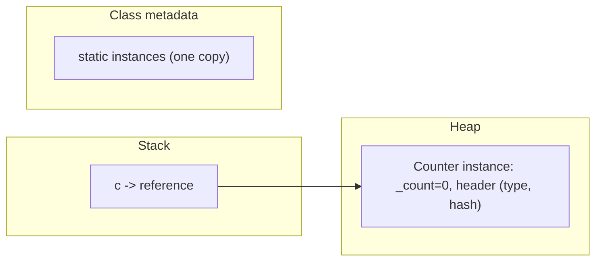
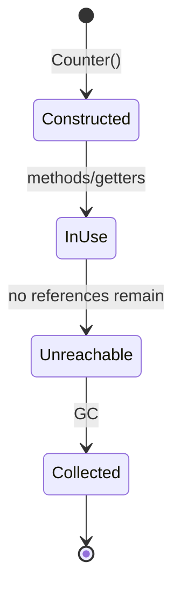

# Classes & Objects (Fields, Methods, `static`, `this`, Lifecycle)

> A class is a blueprint describing state (fields) and behavior (methods); an object is a concrete instance built from that blueprint and living on the heap.

## Introduction

The class/object distinction is the atom of OOP. This file covers declaring classes, instance vs `static` members, `this`, getters, the object's lifecycle (construction → use → collection), and its memory layout. Constructors are covered in depth in [02 · constructors_and_singletons](../02%20Advanced%20Dart/09_constructors_and_singletons.md); here we focus on structure and lifecycle.

## Why this concept exists

Programs manipulate *things* with state and behavior. Grouping related data and the operations on it into a class gives you a reusable, testable unit and a vocabulary that mirrors the problem domain — the essence of modeling.

## Real-world analogy

A class is an **architectural blueprint**; an object is a **house built from it**. Many houses (objects) share one blueprint (class). Instance fields are each house's own furniture; `static` members are shared neighborhood facilities (one park for all houses).

## Problem Statement

Model a `Counter` (instance state + methods), track how many counters exist (`static`), expose a read-only computed value (getter), and understand when the object becomes eligible for garbage collection. You'll build it and reason about its lifecycle.

## Internal Working



- **Instance members** belong to each object (`_count`, `increment`).
- **`static` members** belong to the class itself (shared): `static int instances`.
- **`this`** refers to the current instance; needed to disambiguate (`this.x = x`) or pass the object.
- **Getters/setters** expose computed/controlled access (`int get value => _count`).
- A class with no explicit constructor gets a default no-arg one.

## Memory Representation



- An object on the heap holds its **instance fields** plus a header (type info, identity hash).
- **`static` fields** live once per class (not per instance).
- The variable holds a **reference** (on the stack/enclosing object), not the object itself — Dart is reference-semantics for objects.

## Compiler Behavior

- Field access/method calls are type-checked against the static type.
- `static` members are resolved via the class, not an instance (`Counter.instances`).
- Getters look like fields at call sites (`c.value`) — uniform access principle.

## Runtime Behavior

- `Counter()` allocates a heap object, runs the constructor, returns a reference.
- Instance methods dispatch on the runtime type (virtual dispatch — see [04_polymorphism.md](04_polymorphism.md)).
- The object is collectible once unreachable ([02 · memory_and_gc](../02%20Advanced%20Dart/13_memory_and_gc.md)).

## Flutter Engine Behavior

Not applicable directly. (Widgets/Elements/RenderObjects are all classes/objects; `State` objects have a framework-managed lifecycle — [Module 08](../08%20Widget%20Lifecycle/README.md).)

## Dart VM Behavior

- Object layout is compact; the VM may inline/optimize field access. Identity hash is assigned lazily on first `identityHashCode`/`hashCode` use (for default identity).

## Examples

```dart
class Counter {
  int _count; // instance field
  static int instances = 0; // shared class field

  Counter({int start = 0}) : _count = start {
    instances++; // track how many created
  }

  int get value => _count; // read-only getter
  bool get isZero => _count == 0; // computed getter

  void increment() => _count++;
  void reset() => _count = 0;

  @override
  String toString() => 'Counter($_count)';
}

void main() {
  final a = Counter();
  final b = Counter(start: 5);
  a.increment();
  a.increment();

  print(a.value);            // 2
  print(b.value);            // 5
  print(a.isZero);           // false
  print(Counter.instances);  // 2 — static, shared across instances
  print(a);                  // Counter(2) — toString()

  // reference semantics:
  final c = a;   // c and a point to the SAME object
  c.increment();
  print(a.value); // 3 — mutating via c is visible via a
}
```

## Diagrams



## Common Mistakes

| Mistake | Why | Fix |
|---------|-----|-----|
| Public mutable fields | Breaks encapsulation/invariants | Private field + getter (see [02_encapsulation.md](02_encapsulation.md)) |
| Using `static` for per-instance state | All instances share it (bug) | Use an instance field |
| Assuming value semantics | Objects are references | Copy explicitly when you need independence |
| Forgetting `toString()` | Prints `Instance of 'X'` | Override it for debugging |
| `static` as a global dumping ground | Hidden global state | Prefer instances + DI |

## Best Practices

- Keep fields private; expose intent via getters/methods.
- Use `static` only for truly class-level data/utilities (constants, counters, factories).
- Override `toString()` for debuggability.
- Keep classes cohesive (one responsibility — bridge to [SRP, Module 04](../04%20SOLID%20Principles/README.md)).

## Performance

- Object allocation is cheap but not free; avoid churning short-lived objects in hot paths ([02 · memory_and_gc](../02%20Advanced%20Dart/13_memory_and_gc.md)).
- Getters are as fast as field access after optimization.

## Advantages / Disadvantages

- **+** Bundles state+behavior, reusable, testable, models the domain.
- **−** Poorly designed classes (God objects, public mutable state) become maintenance hazards.

## Interview Questions

1. **🟢 Class vs object?** — A class is the blueprint (type); an object is a concrete instance of it on the heap.
2. **🟢 Instance vs `static` member?** — Instance members exist per object; `static` members exist once per class and are accessed via the class.
3. **🟡 What does `this` refer to and when is it required?** — The current instance; required to disambiguate a field from a same-named parameter or to pass/return the instance.
4. **🟡 Does Dart use value or reference semantics for objects?** — Reference: a variable holds a reference; assigning/passing shares the same object (primitives-like `int` behave value-like but are still objects).
5. **🟡 What is the uniform access principle?** — Callers can't tell a getter from a field (`c.value`), so you can switch a field to a computed getter without changing call sites.
6. **🔴 When is an object eligible for GC?** — When it becomes unreachable from all roots ([02 · memory_and_gc](../02%20Advanced%20Dart/13_memory_and_gc.md)).
7. **🔴 Where do `static` fields live vs instance fields?** — `static` fields: once per class in class metadata; instance fields: in each heap object.

## Senior Engineer Tips

- Default fields to `private + final`; open them up only when a real need appears.
- Treat `static` mutable state as a smell — it's a global; prefer instances managed by DI.
- Model behavior *with* data: if a class is all getters/setters and logic lives elsewhere, you have an anemic model (bridge to [DDD, Module 46](../46%20Domain%20Driven%20Design/README.md)).

## Architect Perspective

Class design sets the grain of your system. Cohesive classes with clear responsibilities and private state compose into maintainable modules; God classes and public mutable state metastasize into coupling. This is the substrate on which SOLID, patterns, and clean architecture build.

## Summary

- Class = blueprint; object = heap instance (reference semantics).
- Instance members are per-object; `static` members are per-class.
- Keep fields private, expose getters/methods, override `toString()`, and mind the object lifecycle.

## Revision Notes

- Class = type/blueprint; object = instance on heap; variables hold references.
- Instance field = per object; `static` = one per class (`Class.member`).
- `this` disambiguates/returns instance; getters give uniform access.
- Object collectible when unreachable; override `toString()`.

## Practice Questions

1. Why does mutating via `c = a; c.increment()` change `a`?
2. When is `static` correct and when is it a bug?
3. What's the difference between a getter and a public field to a caller?

## Coding Questions

1. Build a `Stopwatch`-like class with instance state and a `static` count of created instances.
2. Add a computed getter (`elapsedSeconds`) and prove uniform access by swapping a field to a getter.
3. Demonstrate reference semantics: two variables mutating one object.

## Mini Project

**Domain object toolkit (pure Dart):** Model a `Playlist` (private track list, add/remove methods, computed `duration` getter, `static` count of playlists, `toString`). Enforce that tracks can't be mutated externally. Acceptance: no public mutable fields; static used only for the counter; `dart analyze` clean; tests cover behavior + reference semantics.
