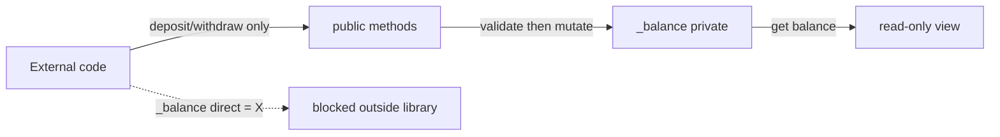
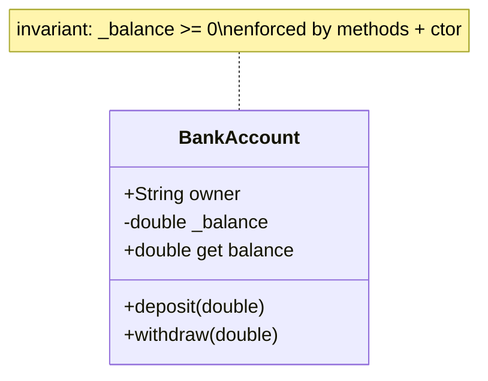

# Encapsulation (Privacy, Getters/Setters, Invariants)

> Encapsulation means hiding internal state behind a controlled interface so an object can *guarantee its own invariants* — the balance can never go negative because only the object can change it.

## Introduction

Encapsulation bundles data with the methods that operate on it and **restricts direct access** to the internals. In Dart, privacy is library-scoped via a leading underscore (`_`). This file covers `_` privacy, getters/setters, validation, and the design goal that ties them together: protecting **invariants**.

## Why this concept exists

If any code can mutate an object's fields directly, no one can guarantee the object is ever in a valid state — a `BankAccount._balance` set to `-9999` from anywhere is a bug waiting to happen. Encapsulation makes the object the *sole guardian* of its rules, so invalid states become impossible by construction.

## Real-world analogy

An ATM encapsulates the vault. You can't reach into the cash drawer (`_balance`); you interact through a controlled panel (`deposit`, `withdraw`) that enforces rules (sufficient funds, positive amounts). The vault's integrity is guaranteed because only the machine touches the cash.

## Problem Statement

Model a `BankAccount` whose balance can only change through `deposit`/`withdraw`, never go negative, and be readable but not writable from outside. You'll use a private field, a getter, and validating methods.

## Internal Working



- **Privacy:** `_balance` is visible only within its **library** (file, or files joined by `part`) — not per class. Same-file code *can* see another class's `_members`.
- **Getter without setter** → read-only public access.
- **Setter** → controlled write with validation (`set price(v) { if (v<0) throw; _price=v; }`).
- **Invariant:** a rule that must always hold (balance ≥ 0). Methods enforce it; construction validates it (asserts/initializer list — see [02 · constructors](../02%20Advanced%20Dart/09_constructors_and_singletons.md)).

## Memory Representation

Not applicable beyond normal object layout — privacy is a compile-time visibility rule, not a runtime tag ([01_classes_and_objects.md](01_classes_and_objects.md)).

## Compiler Behavior

- Accessing another **library's** `_member` is a compile error (undefined name).
- Getters/setters are checked like fields (uniform access); a getter-only field can't be assigned.

## Runtime Behavior

- Setters run their validation logic on each assignment; a rejected value throws where you decide.
- No runtime privacy enforcement is needed — the compiler already prevented cross-library access.

## Flutter Engine Behavior

Not applicable. (Flutter widgets encapsulate config as `final` fields; `State` encapsulates mutable UI state behind `setState`.)

## Dart VM Behavior

Not applicable — privacy is erased to normal member access at runtime.

## Examples

```dart
class BankAccount {
  final String owner;
  double _balance; // private: guarded state

  BankAccount({required this.owner, double opening = 0})
      : assert(opening >= 0, 'opening cannot be negative'),
        _balance = opening;

  double get balance => _balance; // read-only

  void deposit(double amount) {
    if (amount <= 0) {
      throw ArgumentError.value(amount, 'amount', 'must be positive');
    }
    _balance += amount; // invariant preserved
  }

  void withdraw(double amount) {
    if (amount <= 0) {
      throw ArgumentError.value(amount, 'amount', 'must be positive');
    }
    if (amount > _balance) {
      throw StateError('insufficient funds'); // invariant: never negative
    }
    _balance -= amount;
  }
}

// controlled setter with validation
class Product {
  double _price;
  Product(this._price);
  double get price => _price;
  set price(double v) {
    if (v < 0) throw ArgumentError('price cannot be negative');
    _price = v;
  }
}

void main() {
  final acc = BankAccount(owner: 'Ada', opening: 1000);
  acc.deposit(500);
  acc.withdraw(200);
  print(acc.balance); // 1300
  // acc._balance = -1; // COMPILE ERROR outside this library
  // acc.balance = 5000; // COMPILE ERROR: no setter (read-only)

  final p = Product(10);
  p.price = 20; // ok
  try {
    p.price = -5; // throws
  } on ArgumentError catch (e) {
    print(e.message); // price cannot be negative
  }
}
```

## Diagrams



## Common Mistakes

| Mistake | Why | Fix |
|---------|-----|-----|
| Public mutable field | Anyone breaks invariants | Private field + getter/methods |
| Getter + unguarded setter that just assigns | No protection gained | Validate in the setter or drop it |
| Assuming `_` is class-private | It's *library*-private | Split files if you need stricter boundaries |
| Exposing internal mutable collection | Callers mutate internals | Return `List.unmodifiable` (see [immutability](../02%20Advanced%20Dart/10_immutability.md)) |
| Anemic model (all getters/setters, logic elsewhere) | Invariants unprotected | Put behavior on the object |

## Best Practices

- Default to **private fields**; expose read-only getters and intention-revealing methods.
- Validate at **construction** (asserts/initializer list) and at every mutation point.
- Return **unmodifiable views** of internal collections.
- Keep the public surface minimal — "make illegal states unrepresentable."

## Performance

- Negligible; getters/validation are cheap. Encapsulation is a design/correctness concern, not a perf one.

## Advantages / Disadvantages

- **+** Guaranteed invariants, safer refactoring (change internals freely), clearer API, better testability.
- **−** Slightly more boilerplate (getters/methods); over-encapsulation can add ceremony for simple data.

## Interview Questions

1. **🟢 What is encapsulation?** — Bundling state with behavior and hiding internals behind a controlled interface so the object protects its own invariants.
2. **🟢 How is privacy implemented in Dart?** — A leading underscore makes a member **library-private** (per file/`part`), not class-private; Dart has no `public`/`private`/`protected` keywords.
3. **🟡 Getter vs public field — when prefer a getter?** — When the value is computed/derived, when you want read-only access, or to add validation/logic without changing call sites (uniform access).
4. **🟡 What is an invariant and how do you protect it?** — A rule that must always hold (e.g., balance ≥ 0); protect it by validating at construction and confining all mutations to methods that enforce it.
5. **🟡 Why return `List.unmodifiable` from a getter?** — To prevent callers from mutating the object's internal collection and breaking encapsulation.
6. **🔴 Since `_` is library-scoped, how do you get stricter boundaries?** — Put the class in its own library/file (and package `src/`) so no same-file code can reach its privates ([02 · libraries](../02%20Advanced%20Dart/11_libraries_and_packages.md)).
7. **🔴 What is an anemic domain model and why is it discouraged?** — A class that's just data (getters/setters) with logic elsewhere; it can't protect invariants and scatters behavior — prefer rich models ([DDD, Module 46](../46%20Domain%20Driven%20Design/README.md)).

## Senior Engineer Tips

- Design the **public API first** (what callers should do), then hide everything else.
- Prefer construction-time validation so an object is *never* born invalid.
- Expose immutable/unmodifiable views; mutation should go through named, meaningful operations.

## Architect Perspective

Encapsulation is the local enforcement of invariants that, aggregated, keeps a large system consistent. It's the class-level analogue of module boundaries ([02 · libraries](../02%20Advanced%20Dart/11_libraries_and_packages.md)) and the foundation of DDD aggregates that guard consistency rules ([Module 46](../46%20Domain%20Driven%20Design/README.md)). Weak encapsulation is a leading cause of "spooky action at a distance" bugs at scale.

## Summary

- Encapsulation hides internals behind a controlled interface so objects guard their invariants.
- Dart privacy is library-scoped (`_`); use getters for read-only/computed access and setters (validated) sparingly.
- Validate at construction and at every mutation; expose unmodifiable views.

## Revision Notes

- `_member` = library-private (file/`part`), not class-private.
- Getter-only = read-only; validating setter or none.
- Invariant protected by ctor validation + method-only mutation.
- Return `List.unmodifiable`; keep public surface minimal; avoid anemic models.

## Practice Questions

1. Why can't external code set `acc.balance = 5000`?
2. When is a validated setter worth it vs a method like `changePrice`?
3. Why is exposing a raw internal `List` a leak of encapsulation?

## Coding Questions

1. Model a `TemperatureSensor` with a private reading, a clamped setter, and a read-only `celsius` getter.
2. Build a `Cart` that exposes items only as an unmodifiable list and mutates via `add`/`remove`.
3. Add construction-time validation so a `Rectangle` can never have negative sides.

## Mini Project

**Guarded account domain (pure Dart):** Implement `BankAccount` + `SavingsAccount` (min-balance rule) with fully encapsulated balances, validated construction, custom exceptions, and read-only exposure. Add tests proving invariants can't be violated (negative opening, over-withdraw, direct field access impossible). Acceptance: no public mutable state; invariants enforced everywhere; `dart analyze` clean.
