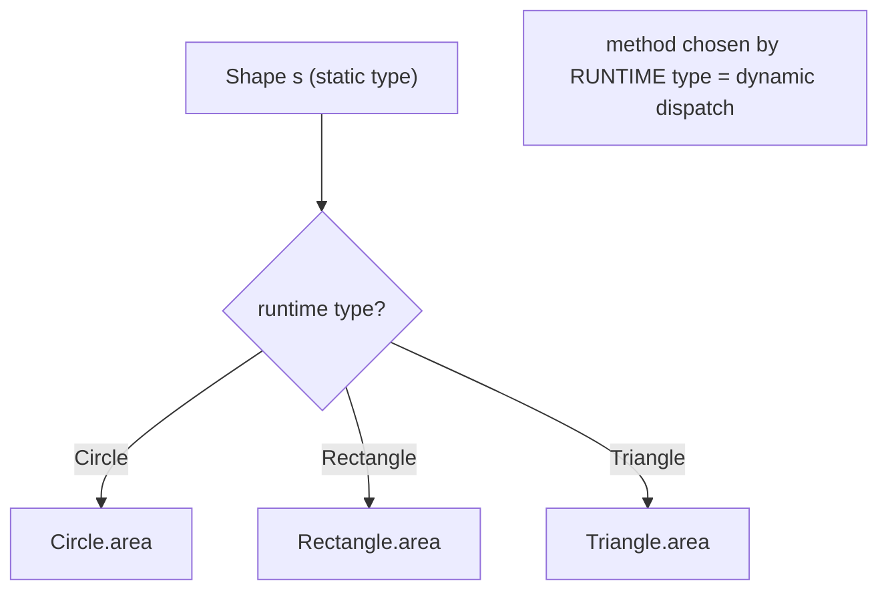
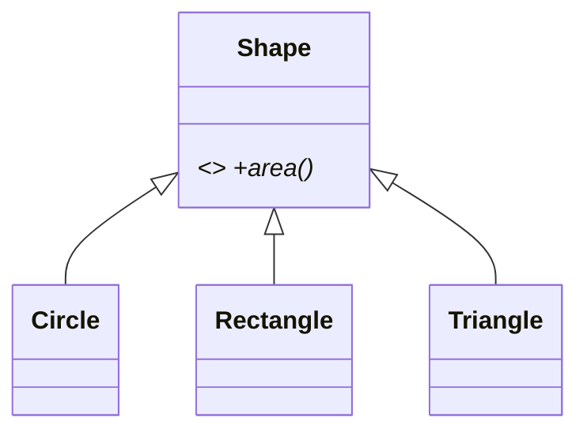

# Polymorphism (Dynamic Dispatch, Overriding, Liskov)

> Polymorphism lets one reference of a base type invoke the *correct subtype behavior* at runtime — write code against an abstraction, and each concrete type does the right thing.

## Introduction

Polymorphism ("many forms") means a variable of a supertype can hold any subtype, and calling a method runs the **subtype's** implementation via **dynamic dispatch**. This file covers method overriding, runtime dispatch, treating collections uniformly, and the **Liskov Substitution Principle** (subtypes must be usable wherever the base is).

## Why this concept exists

Extensibility. Instead of `if (type == circle) ... else if (type == square) ...` scattered everywhere, you call `shape.area()` and each shape computes its own. Adding a new shape doesn't touch existing code — this is the engine of the Open/Closed Principle ([Module 04](../04%20SOLID%20Principles/README.md)) and most design patterns.

## Real-world analogy

A universal **remote's** "play" button works on a TV, a soundbar, and a DVD player — same command, device-specific behavior. You (the caller) press "play" (`area()`) without caring which device (subtype) it is; each responds correctly.

## Problem Statement

Compute the total area of a mixed list of shapes without type checks, and let a payment processor charge any `PaymentMethod` uniformly. Adding a new shape/method must require **zero** changes to the totaling/processing code. You'll use overriding + dynamic dispatch.

## Internal Working



- A supertype reference (`Shape s`) can point to any subtype instance.
- Calling `s.area()` uses **dynamic (virtual) dispatch**: the runtime looks up the method on the object's actual class.
- **Overriding** provides the subtype-specific behavior (`@override double area()`).
- **Liskov Substitution Principle (LSP):** any subtype must honor the base's contract so it can substitute the base without surprising callers (no strengthening preconditions, no weakening postconditions, no throwing where the base wouldn't).

## Memory Representation

- Each object carries its class identity; the method table maps method names to the concrete implementations for that class, enabling O(1) virtual dispatch ([01_classes_and_objects.md](01_classes_and_objects.md)).

## Compiler Behavior

- The compiler checks the call against the **static type** (`Shape` must declare `area()`), but the *implementation* is chosen at runtime.
- Overrides are validated (`@override`) against the supertype signature.

## Runtime Behavior

- Virtual dispatch resolves to the actual class's method. `is`/`as` let you narrow when you truly need subtype-specific API (but heavy `is` chains often signal a missing polymorphic method).

## Flutter Engine Behavior

Not applicable, but the framework is polymorphism in action: it calls `build()` / `paint()` / `layout()` on your subclasses through base references without knowing your concrete types.

## Dart VM Behavior

- Monomorphic/polymorphic inline caches optimize hot virtual call sites; AOT devirtualizes where the concrete type is provable.

## Examples

```dart
abstract class Shape {
  double area(); // contract
}

class Circle extends Shape {
  final double r;
  Circle(this.r);
  @override
  double area() => 3.141592653589793 * r * r;
}

class Rectangle extends Shape {
  final double w, h;
  Rectangle(this.w, this.h);
  @override
  double area() => w * h;
}

class Triangle extends Shape {
  final double b, h;
  Triangle(this.b, this.h);
  @override
  double area() => 0.5 * b * h;
}

// Works for ANY Shape — no type checks, open for new subtypes:
double totalArea(List<Shape> shapes) =>
    shapes.fold(0.0, (sum, s) => sum + s.area());

void main() {
  final shapes = <Shape>[Circle(1), Rectangle(2, 3), Triangle(4, 5)];
  print(totalArea(shapes)); // 3.14... + 6 + 10 = 19.14...

  // dynamic dispatch: same call, different behavior
  for (final s in shapes) {
    print('${s.runtimeType}: ${s.area().toStringAsFixed(2)}');
  }
  // Adding a Pentagon subtype needs ZERO changes to totalArea.
}
```

## Diagrams



## Common Mistakes

| Mistake | Why | Fix |
|---------|-----|-----|
| `if (s is Circle) ... else if (s is Rectangle)` | Not polymorphic; must edit for each new type | Put behavior on the type (override) |
| Subtype throwing where base doesn't | Breaks LSP; callers surprised | Honor the base contract |
| Overriding but changing semantics | Callers relying on base behavior break | Keep pre/postconditions compatible |
| Downcasting everywhere (`as`) | Fragile, defeats abstraction | Add a polymorphic method to the base |
| Calling a subtype-only method via base ref | Not in the contract | Narrow with `is` only when justified |

## Best Practices

- Program to the **abstraction** (base type/interface), not concrete types.
- Add polymorphic methods instead of type-switch chains.
- Uphold **LSP**: subtypes are drop-in replacements; don't weaken guarantees or add surprising preconditions.
- Use sealed classes + exhaustive `switch` when a *closed* set of variants needs different handling ([05_abstraction_and_interfaces.md](05_abstraction_and_interfaces.md)).

## Performance

- Virtual dispatch is fast; inline caches + AOT devirtualization minimize overhead. Don't micro-optimize away polymorphism for negligible gains.

## Advantages / Disadvantages

- **+** Extensible (Open/Closed), removes type-switch sprawl, decouples callers from concretes.
- **−** Behavior spread across subclasses can be harder to trace; misuse (LSP violations) causes subtle bugs.

## Interview Questions

1. **🟢 What is polymorphism?** — The ability to use a supertype reference to invoke the correct subtype behavior, resolved at runtime via dynamic dispatch.
2. **🟢 What is method overriding?** — A subclass providing its own implementation of a superclass method (`@override`), selected at runtime.
3. **🟡 Static type vs runtime type in dispatch?** — The compiler checks the call against the static (declared) type; the actual method runs based on the object's runtime type.
4. **🟡 What is the Liskov Substitution Principle?** — Subtypes must be substitutable for their base without breaking correctness: don't strengthen preconditions, weaken postconditions, or violate the base's invariants/contract.
5. **🟡 Why are `is`/`as` chains a smell?** — They centralize type knowledge that should be distributed as polymorphic methods; each new subtype forces edits (violates Open/Closed).
6. **🔴 How does the VM make virtual dispatch fast?** — Method tables + inline caches for hot call sites; AOT devirtualizes when the concrete type is known.
7. **🔴 Polymorphism vs sealed-class `switch` — when each?** — Polymorphism for open extension (new subtypes without editing callers); sealed `switch` for a closed, known set where the compiler should enforce exhaustive handling.

## Senior Engineer Tips

- When you feel a growing `switch`/`is` chain on a type, that's the signal to introduce a polymorphic method (or the Strategy pattern).
- LSP violations often hide in overrides that throw `UnsupportedError` — a sign the hierarchy is wrong (the classic `Square extends Rectangle` setter trap).
- Choose polymorphism (open) vs sealed types (closed) based on who's expected to add variants — you, or external code.

## Architect Perspective

Polymorphism is the mechanism behind pluggable architectures: define stable abstractions (repositories, payment methods, notification channels) and let concrete implementations vary independently. It's the runtime counterpart to dependency inversion and the backbone of testability (swap real for fake) and extensibility across the whole system ([Modules 04, 05, 40](../04%20SOLID%20Principles/README.md)).

## Summary

- Polymorphism = supertype reference, subtype behavior, via dynamic dispatch.
- Prefer overriding to type-switch chains; program to abstractions; uphold LSP.
- Use polymorphism for open extension, sealed `switch` for closed exhaustive handling.

## Revision Notes

- Dynamic dispatch: method chosen by runtime type; compiler checks static type.
- Override with `@override`; program to the base/abstraction.
- LSP: subtypes substitutable — no stronger preconditions/weaker postconditions/surprise throws.
- `is`/`as` chains → replace with polymorphic method or Strategy.

## Practice Questions

1. Why does adding a `Pentagon` require no change to `totalArea`?
2. Give a concrete LSP violation and explain the breakage.
3. When would you pick a sealed `switch` over polymorphism?

## Coding Questions

1. Build a `Notifier` base with `EmailNotifier`/`SmsNotifier`/`PushNotifier` overrides and a `sendAll(List<Notifier>)`.
2. Refactor an `if (shape is ...)` area calculator into polymorphic `area()` methods.
3. Demonstrate the `Square extends Rectangle` LSP trap and fix it (separate types).

## Mini Project

**Payment processor (pure Dart):** Define an abstract `PaymentMethod` with `charge(amount)`; implement `Card`, `Upi`, and `Wallet` subtypes; write a `Checkout` that charges any method uniformly and totals fees — all without type checks. Add a new method type to prove Open/Closed. Acceptance: no `is`/`as` in `Checkout`; new subtype added with zero edits to `Checkout`; LSP honored; `dart analyze` clean.
