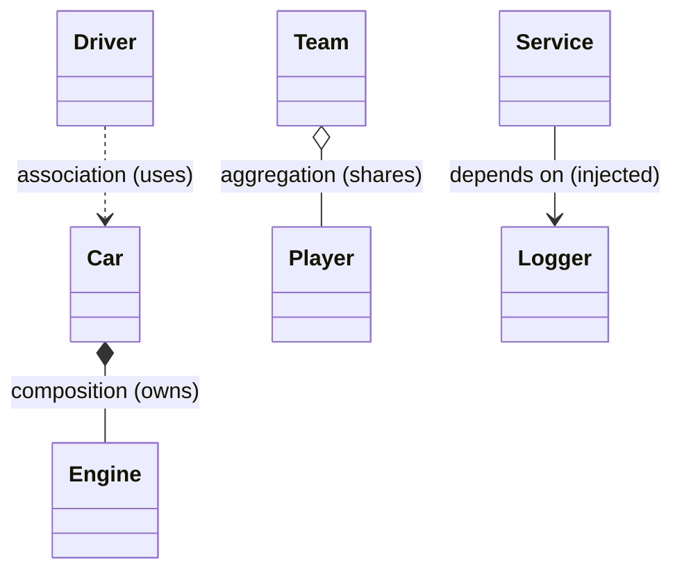
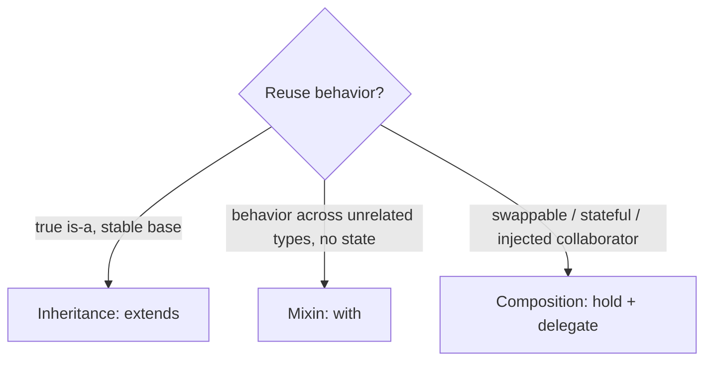

# Composition & Relationships (Composition vs Inheritance, Aggregation, Association)

> "Favor composition over inheritance": build behavior by *combining* objects (has-a) rather than *extending* them (is-a) — it's more flexible, swappable, and testable.

## Introduction

Objects relate in several ways: **inheritance** (is-a), **composition** (has-a, owned/lifecycle-bound part), **aggregation** (has-a, independent lifecycle), and **association** (uses/knows-a). This file defines each, contrasts composition with inheritance (and mixins), and gives the decision rules senior engineers actually use.

## Why this concept exists

Inheritance couples a subclass to a base's implementation and forces a rigid taxonomy. Most reuse needs are better served by **plugging in collaborators** — you can swap them, test them in isolation, and change behavior at runtime. Recognizing the *kind* of relationship also keeps ownership and lifecycles clear (who disposes what).

## Real-world analogy

- **Inheritance (is-a):** a `Car` *is a* `Vehicle`.
- **Composition (has-a, owned):** a `Car` *has an* `Engine` that lives and dies with the car — no car, no engine.
- **Aggregation (has-a, independent):** a `Team` *has* `Players`, but players exist before/after the team; disbanding the team doesn't destroy the players.
- **Association (uses-a):** a `Driver` *uses* a `Car` — they interact, neither owns the other.

## Problem Statement

Add "logging" and "caching" behavior to several services without a fragile base class, and model a `Car`/`Engine` (composition) and `PlaylistLibrary`/`Song` (aggregation). You'll compose collaborators and inject them.

## Internal Working



| Relationship | UML | Semantics | Lifecycle | Dart shape |
|--------------|-----|-----------|-----------|------------|
| Inheritance | ▷ (hollow) | is-a | — | `extends` |
| Composition | ◆ filled | has-a, owns the part | part dies with whole | field created/owned by the object |
| Aggregation | ◇ hollow | has-a, shares the part | independent | field referencing an externally-owned object |
| Association | → | uses/knows | independent | passed-in reference / method param |

- **Composition:** the object *creates and owns* its parts (`_engine = Engine()`), and is responsible for their disposal.
- **Aggregation:** the object *references* parts owned elsewhere (`Team(this.players)`), and must **not** dispose them.
- **Delegation:** composition's mechanism — forward calls to a collaborator (`void start() => _engine.ignite();`).
- **Composition vs mixins:** mixins add behavior at *compile time* into the type; composition holds a *runtime* collaborator you can swap/inject. Prefer composition when the behavior has state/lifecycle or should be swappable ([02 · mixins](../02%20Advanced%20Dart/06_mixins.md)).

## Memory Representation

- Composition: the whole holds a reference to its owned part; both are heap objects, the part reachable through the whole (and typically only through it).
- Aggregation: the part is reachable through multiple owners; disposing one owner must not free a shared part.

## Compiler Behavior

Not special — these are design patterns expressed with ordinary fields/constructors. The compiler enforces types of injected collaborators.

## Runtime Behavior

- Delegated calls dispatch to the collaborator at runtime; swapping the collaborator (e.g., a fake logger in tests) changes behavior without touching the host.

## Flutter Engine Behavior

Not applicable, but Flutter is composition-first: widgets are *composed* trees (`Padding(child: Text(...))`), not deep inheritance hierarchies — "composition over inheritance" is a core Flutter philosophy ([Module 07](../07%20Widgets/README.md)).

## Dart VM Behavior

Not applicable beyond normal dispatch.

## Examples

```dart
// COMPOSITION via delegation + dependency injection
abstract interface class Logger {
  void log(String msg);
}
class ConsoleLogger implements Logger {
  @override
  void log(String msg) => print('[LOG] $msg');
}

class PaymentService {
  final Logger _logger; // injected collaborator (composition/DI)
  PaymentService(this._logger);
  void pay(double amount) {
    _logger.log('charging $amount'); // delegate
  }
}

// COMPOSITION with ownership
class Engine {
  void ignite() => print('vroom');
  void dispose() => print('engine off');
}
class Car {
  final Engine _engine = Engine(); // Car OWNS the engine
  void start() => _engine.ignite(); // delegation
  void scrap() => _engine.dispose(); // owner disposes the part
}

// AGGREGATION: shared, independent lifecycle
class Song {
  final String title;
  Song(this.title);
}
class Playlist {
  final List<Song> songs; // referenced, NOT owned
  Playlist(this.songs);   // songs live independently
}

void main() {
  PaymentService(ConsoleLogger()).pay(100); // swap logger freely (tests: FakeLogger)
  Car().start(); // vroom

  final s1 = Song('A'), s2 = Song('B');
  final rock = Playlist([s1, s2]);
  final chill = Playlist([s1]); // s1 shared across playlists (aggregation)
  print(rock.songs.length + chill.songs.length); // 3 references, 2 songs
}
```

## Diagrams



## Common Mistakes

| Mistake | Why | Fix |
|---------|-----|-----|
| Inheriting to reuse a method | Fragile, wrong is-a | Compose/delegate instead |
| Disposing an aggregated (shared) part | Frees something others use | Only owners (composition) dispose |
| Deep inheritance for cross-cutting behavior | Rigid | Composition + DI, or a mixin |
| God object composing everything | Low cohesion | Split responsibilities (SRP) |
| Confusing composition and aggregation ownership | Lifecycle/leak bugs | Decide who owns/disposes |

## Best Practices

- **Favor composition over inheritance**; use inheritance only for true, stable is-a.
- Inject collaborators (constructor DI) so they're swappable and testable ([Module 14](../14%20Dependency%20Injection/README.md)).
- Be explicit about ownership: the owner (composition) disposes; aggregators don't.
- Use mixins for stateless cross-cutting behavior; composition when state/lifecycle/swapping is involved.

## Performance

- Delegation adds a cheap indirection; negligible. The win is maintainability, not speed.

## Advantages / Disadvantages

- **+ Composition:** flexible, swappable, testable, runtime-configurable, avoids fragile base class.
- **− Composition:** more wiring/boilerplate (mitigated by DI); many small collaborators to track.
- **+ Inheritance:** concise reuse when is-a truly holds.
- **− Inheritance:** tight coupling, single-inheritance limit, fragility.

## Interview Questions

1. **🟢 What does "favor composition over inheritance" mean?** — Prefer building behavior by combining/delegating to collaborator objects (has-a) rather than extending a base (is-a), for flexibility and testability.
2. **🟢 Composition vs aggregation?** — Both are has-a; composition **owns** the part (shared lifecycle, disposes it), aggregation references an **independently-owned** part (must not dispose it).
3. **🟡 Composition vs inheritance tradeoffs?** — Inheritance couples to the base's implementation and forces is-a; composition is swappable, testable, runtime-configurable, and avoids the fragile base class problem.
4. **🟡 Composition vs mixin?** — Mixins add behavior into the type at compile time (stateless cross-cutting); composition holds a runtime collaborator you can inject/swap (good when state/lifecycle matters).
5. **🟡 What is delegation?** — Forwarding a call to a held collaborator object — the mechanism composition uses to reuse behavior.
6. **🔴 How does composition enable testability?** — You inject a fake collaborator (e.g., `FakeLogger`/`FakeRepo`) in tests without changing the host class.
7. **🔴 Why is Flutter "composition over inheritance"?** — UIs are built by nesting/composing widgets (has-a child trees) rather than subclassing, which is more flexible and reusable.

## Senior Engineer Tips

- Default to composition + constructor injection; introduce inheritance only when you can defend the is-a and the base is stable.
- Draw the relationship (◆ owns vs ◇ shares vs → uses) to decide disposal responsibility — most leak/lifecycle bugs are ownership confusion.
- Keep composed collaborators behind interfaces so they're mockable and replaceable ([05_abstraction_and_interfaces.md](05_abstraction_and_interfaces.md)).

## Architect Perspective

A composition-first design yields loosely coupled, independently testable, swappable modules — the practical enablement of Dependency Inversion and Clean Architecture. Ownership clarity (composition vs aggregation) governs resource lifecycle and prevents leaks at scale. This philosophy is why Flutter and modern Dart apps compose small pieces rather than build deep hierarchies ([Modules 14, 40, 07](../40%20Clean%20Architecture/README.md)).

## Summary

- Relationships: is-a (inheritance), has-a-owned (composition), has-a-shared (aggregation), uses-a (association).
- Favor composition + DI over inheritance; delegate to swappable collaborators.
- Be explicit about ownership/disposal; use mixins for stateless cross-cutting behavior.

## Revision Notes

- Composition = owns part (disposes it); aggregation = shares part (don't dispose); association = uses.
- Favor composition over inheritance; delegate + inject collaborators.
- Mixin = compile-time behavior (stateless); composition = runtime, swappable, stateful.
- Flutter = compose widgets, not subclass.

## Practice Questions

1. Should a `Team` dispose its `Player`s? Why (which relationship)?
2. When is a mixin better than composition, and vice versa?
3. How does composition make a class easier to unit test?

## Coding Questions

1. Refactor a `LoggingRepository extends Repository` into composition (repo *has-a* logger).
2. Model `Car`(owns `Engine`) vs `Garage`(aggregates `Car`s) and show correct disposal.
3. Build a `NotificationSender` composed of a swappable `Channel` (email/sms), injected via constructor.

## Mini Project

**Composable service layer (pure Dart):** Build a `CheckoutService` composed of injected collaborators (`PaymentGateway`, `Logger`, `InventoryClient`), each behind an interface, plus a `Cart` (owns line items) and a `Catalog` (aggregates products). Swap real collaborators for fakes in tests. Acceptance: no inheritance-for-reuse; collaborators injected + mockable; correct ownership/disposal documented; `dart analyze` clean.
