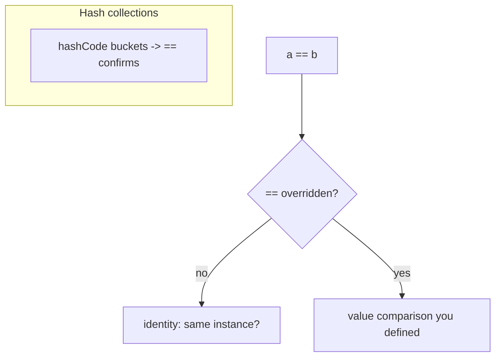
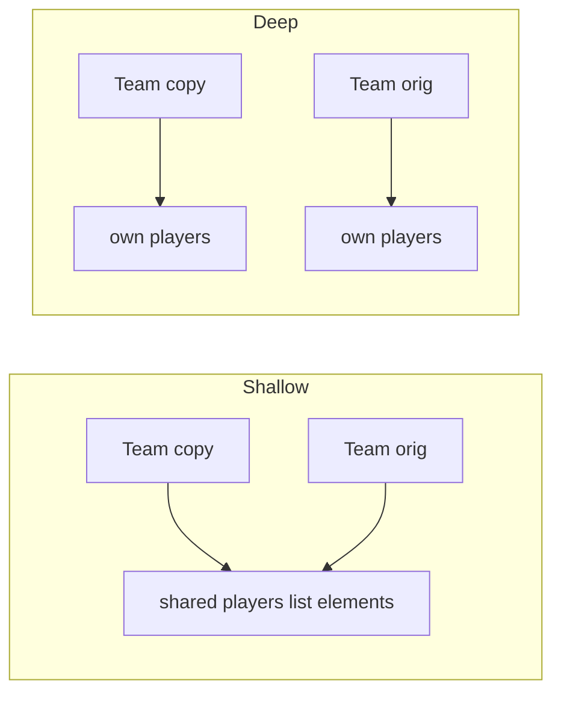
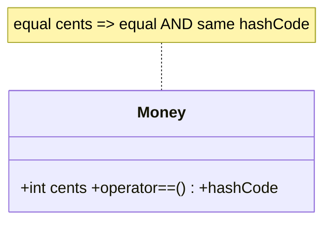

# Equality & Copying (`==`/`hashCode`, Identity, Deep vs Shallow Copy)

> By default `==` means "same object" (identity); to make it mean "same value" you must override `==` **and** `hashCode` together — and know whether your copies are shallow (share nested objects) or deep (fully independent).

## Introduction

This file covers Dart's two notions of equality — **identity** (`identical`) vs **value** (`==`), how to implement value equality correctly (`==` + `hashCode`), and **deep vs shallow copying**. These underpin correct `Set`/`Map` behavior, reactive-state diffing, and avoiding shared-mutation bugs.

## Why this concept exists

Sometimes two distinct objects should be considered "equal" (two `Money(100)` are the same value); sometimes you care they're literally the same instance. Hash-based collections and Flutter's rebuild-diffing rely on consistent equality. Copying matters because Dart objects are references — a naive copy can secretly share mutable inner objects, causing "I changed A and B changed too" bugs.

## Real-world analogy

- **Identity vs value:** two identical ₹100 notes are *equal in value* but are *different physical notes* (different identity). `==` can be taught to treat them as equal; `identical` never will.
- **Shallow vs deep copy:** photocopying a folder's cover but keeping the *same* documents inside (shallow — edits leak) vs photocopying the cover *and every document* (deep — fully independent).

## Problem Statement

Make `Money(100) == Money(100)` true and safe as a `Map` key, then copy a `Team` with a list of players such that editing the copy's list doesn't affect the original. You'll override `==`/`hashCode` and implement deep vs shallow copies.

## Internal Working



- **Identity:** `identical(a, b)` — same object in memory. Default `==` falls back to identity.
- **Value equality:** override `bool operator ==(Object other)` to compare fields, and override `int get hashCode` consistently (**equal objects must have equal hash codes**).
- **The contract:** if `a == b` then `a.hashCode == b.hashCode`; equality must be reflexive, symmetric, transitive, and consistent.
- **`Object.hash` / `Object.hashAll`** build good hash codes from fields.
- **Shallow copy:** new outer object, **same** references to nested objects (`List.of` copies the list but shares elements).
- **Deep copy:** new outer object **and** new copies of nested mutable objects (recursively).

## Memory Representation



- Immutable objects make copying moot (share freely — they can't change). Deep copies are only needed for **mutable** nested state.

## Compiler Behavior

- Overriding `==` but not `hashCode` triggers a lint (`hash_and_equals`) — a common bug source.
- `const` canonicalization makes structurally-equal `const` instances `identical` (so `==` is trivially true and hashing consistent).

## Runtime Behavior

- `Set`/`Map` use `hashCode` to bucket, then `==` to confirm. Wrong/absent `hashCode` → lookups miss, duplicates sneak in.
- Mutating a field used in `hashCode` **after** inserting into a hash set corrupts the set (the object is in the wrong bucket) — keys should be immutable.

## Flutter Engine Behavior

Not applicable at engine level, but value equality drives rebuild-skipping and selector correctness in state management ([Modules 11, 21](../11%20State%20Management/README.md)); `Key` equality affects element reuse ([Module 08](../08%20Widget%20Lifecycle/README.md)).

## Dart VM Behavior

- Default `hashCode` is an identity hash assigned lazily. Custom `hashCode` runs your computation each call (cache it for expensive cases if profiling warrants).

## Examples

```dart
class Money {
  final int cents;
  const Money(this.cents);

  @override
  bool operator ==(Object other) => other is Money && other.cents == cents;
  @override
  int get hashCode => cents.hashCode;
}

class Player {
  String name; // mutable
  Player(this.name);
}

class Team {
  final String name;
  final List<Player> players;
  Team(this.name, this.players);

  // SHALLOW: new list, SAME Player objects
  Team shallowCopy() => Team(name, List.of(players));

  // DEEP: new list AND new Player objects
  Team deepCopy() => Team(name, players.map((p) => Player(p.name)).toList());
}

void main() {
  // value equality:
  print(Money(100) == Money(100));      // true
  print(identical(Money(100), Money(100))); // false (distinct instances)
  print({Money(100), Money(100)}.length);   // 1 — dedup via == + hashCode
  final prices = {Money(100): 'cheap'};
  print(prices[Money(100)]);            // cheap — works as a key

  // shallow vs deep copy:
  final orig = Team('A', [Player('Ada')]);
  final shallow = orig.shallowCopy();
  final deep = orig.deepCopy();

  shallow.players.add(Player('Bob')); // list is independent (shallow copied list)
  print(orig.players.length);         // 1 — orig list unaffected

  shallow.players[0].name = 'CHANGED'; // SAME Player object as orig!
  print(orig.players[0].name);         // CHANGED — shared nested object (shallow)

  deep.players[0].name = 'X';          // deep copy: independent
  print(orig.players[0].name);         // CHANGED (unchanged by deep copy)
}
```

## Diagrams



## Common Mistakes

| Mistake | Why | Fix |
|---------|-----|-----|
| Override `==` without `hashCode` | Breaks Set/Map | Override both (or use equatable/freezed/records) |
| Inconsistent `==`/`hashCode` (different fields) | Contract violated → collection bugs | Use the same fields in both |
| Mutating a hash-key field after insertion | Object lands in wrong bucket | Use immutable keys |
| Assuming a copy is deep | Shared nested mutables leak edits | Deep-copy mutable nesting (or use immutables) |
| Hand-rolling equality for many models | Error-prone | Use `equatable`/`freezed`/records ([02 · immutability](../02%20Advanced%20Dart/10_immutability.md)) |

## Best Practices

- Implement value equality with **the same fields** in `==` and `hashCode`; use `Object.hash`/`hashAll`.
- Keep hash-key objects **immutable**.
- Prefer **immutable models** so copying is unnecessary; when copying mutable state, be explicit about shallow vs deep.
- Prefer `records`/`equatable`/`freezed` to generate correct equality/`copyWith`.

## Performance

- `hashCode` runs per lookup; keep it cheap (combine field hashes). Cache only if profiling shows a hotspot.
- Deep copies cost O(size); immutability + structural sharing usually avoids the need.

## Advantages / Disadvantages

- **+ Value equality:** correct dedup/keys, reliable state diffing.
- **− Value equality:** boilerplate (mitigated by tooling); must maintain the contract.
- **+ Deep copy:** true independence. **− Deep copy:** cost; often unnecessary with immutability.

## Interview Questions

1. **🟢 `==` vs `identical`?** — `==` is value/logical equality (overridable, default identity); `identical(a,b)` is reference equality (same instance), never overridable.
2. **🟢 Why override `hashCode` with `==`?** — Hash collections bucket by `hashCode` then confirm with `==`; equal objects must share a hash code or Set/Map break.
3. **🟡 What is the equality contract?** — Reflexive, symmetric, transitive, consistent; and `a == b ⇒ a.hashCode == b.hashCode`.
4. **🟡 Shallow vs deep copy?** — Shallow copies the outer object but shares nested references; deep copies nested mutable objects too, giving full independence.
5. **🟡 Why keep hash keys immutable?** — Mutating a field used in `hashCode` after insertion misplaces the object in its bucket, corrupting lookups.
6. **🔴 How does value equality affect Flutter rebuilds?** — State diffing compares old/new via `==`; correct value equality enables rebuild-skipping and correct selectors, avoiding missed/extra rebuilds.
7. **🔴 How do `const` objects interact with equality?** — Structurally-equal `const` instances are canonicalized (`identical` true), so equality and hashing are trivially consistent.

## Senior Engineer Tips

- Reach for `freezed`/`equatable`/`records` immediately for models — hand-written equality across many classes is a recurring bug source.
- Make copies unnecessary by defaulting to immutability; when you must copy mutable graphs, document/test the depth.
- Beware equality that includes volatile fields (timestamps, caches) — it breaks memoization and diffing.

## Architect Perspective

Equality and copy semantics are load-bearing for reactive state, caching, and messaging (immutable value-equal objects can be shared/compared safely, even across isolates). Standardize on immutable models with generated value equality; it eliminates a whole class of aliasing and diffing bugs and makes the system's data flow predictable ([Modules 02, 11, 46](../02%20Advanced%20Dart/10_immutability.md)).

## Summary

- Default `==` is identity; override `==` **and** `hashCode` (same fields) for value equality.
- Keep hash keys immutable; honor the equality contract.
- Shallow copies share nested objects; deep copies don't. Prefer immutability to make copying moot; use tooling for equality.

## Revision Notes

- `==` value (overridable, default identity); `identical` = same instance.
- Override `==` + `hashCode` together, same fields; `a==b ⇒ hashCode==`.
- Immutable hash keys; shallow shares nested, deep copies nested.
- Prefer immutability + `equatable`/`freezed`/records.

## Practice Questions

1. Why does a `Set<Money>` need `hashCode`, not just `==`?
2. Explain why `shallow.players[0].name = 'X'` changed the original.
3. When is a deep copy unnecessary?

## Coding Questions

1. Implement value equality for a `Point3D(x,y,z)` using `Object.hash`; prove Set dedup.
2. Given a mutable nested model, write `shallowCopy` and `deepCopy` and demonstrate the difference.
3. Show a bug where mutating a key after `Set.add` breaks `contains`, then fix with immutability.

## Mini Project

**Equality & copy lab (pure Dart):** Build an immutable `Money` value object (value equality + Map key), and a mutable `Document` graph with correct `shallowCopy`/`deepCopy`. Write tests demonstrating: value equality dedup, hash-key correctness, shallow sharing, and deep independence. Acceptance: `==`/`hashCode` consistent; documented shallow vs deep behavior verified by tests; `dart analyze` clean.
