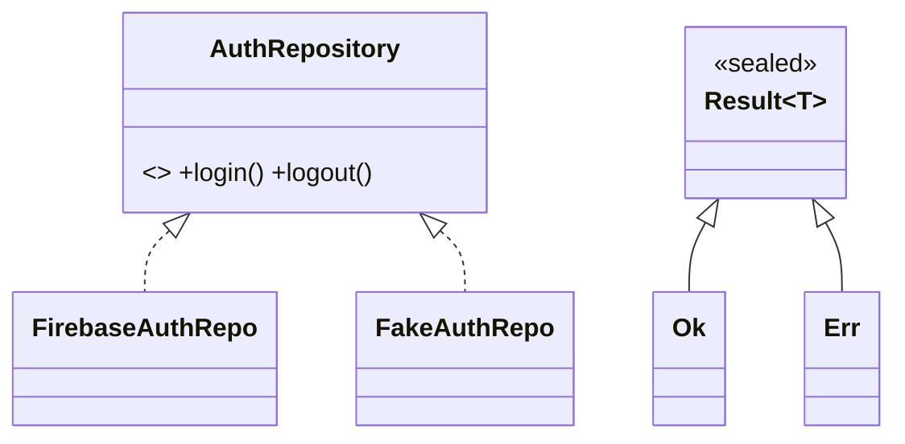
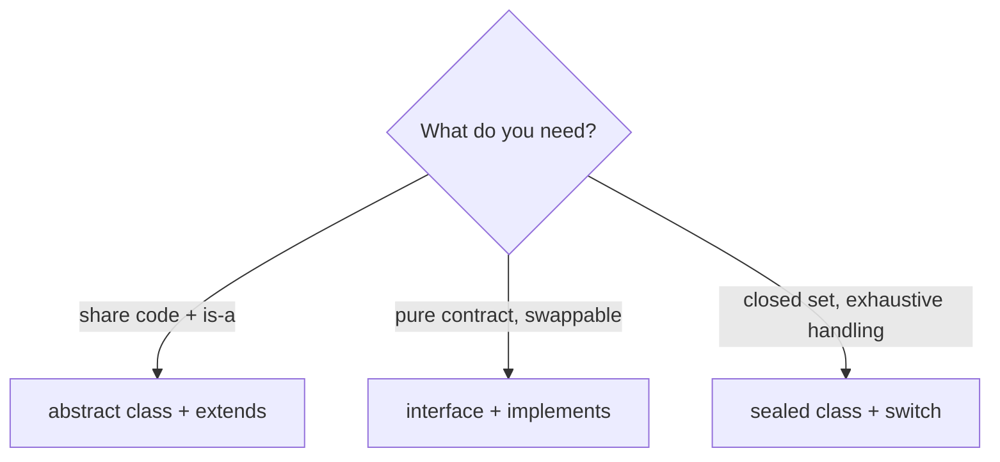

# Abstraction & Interfaces (`abstract`, `implements`, `sealed`)

> Abstraction exposes *what* a type does while hiding *how*; in Dart, abstract classes define partial contracts, every class is an implicit interface, and `sealed` classes create closed, exhaustively-checkable type families.

## Introduction

This file covers **abstract classes** (can't be instantiated; mix concrete + abstract members), Dart's **implicit interfaces** (every class defines one; `implements` adopts the contract with no implementation reuse), Dart 3 **class modifiers** (`sealed`, `final`, `base`, `interface`, `mixin`), and when to use each.

## Why this concept exists

Callers should depend on **capabilities**, not concrete implementations — so you can swap a real database for a fake in tests, or one payment provider for another. Abstraction provides that seam. Sealed classes solve the opposite need: a *closed* set of variants where the compiler forces you to handle every case (state machines, results).

## Real-world analogy

- **Abstract class / interface** = a **job description** ("must be able to `authenticate` and `logout`"). Anyone who fulfills it can do the job; you hire against the description, not the person.
- **Sealed class** = a **fixed multiple-choice question** — the answer is exactly one of a known set (`Loading | Success | Error`), and you must account for all of them.

## Problem Statement

Define an `AuthRepository` contract so your app doesn't depend on Firebase directly (swap it in tests), and model a `Result` type as a closed set (`Ok`/`Err`) the compiler forces you to handle exhaustively. You'll use an abstract class/interface and a sealed class.

## Internal Working



- **Abstract class:** `abstract class A { void doIt(); String shared() => '...'; }` — can't be instantiated; subclasses implement abstract members and inherit concrete ones (`extends`).
- **Implicit interface:** *every* class induces an interface (its public members). `class B implements A` must provide **all** of `A`'s members — no implementation is inherited.
- **`extends` vs `implements`:** `extends` reuses code (one superclass, `super`); `implements` adopts only the contract (any number).
- **Dart 3 class modifiers:**
  - `sealed` — abstract + **exhaustively switchable**; all direct subtypes must be in the same library. Enables compiler-checked `switch`.
  - `final` — cannot be extended or implemented outside its library.
  - `base` — can be extended (inheriting implementation) but not implemented; forces subclasses to use `extends`.
  - `interface` — can be implemented but not extended outside its library (pure contract).

## Memory Representation

Not applicable beyond normal objects. `sealed`/modifiers are compile-time constraints; instances are ordinary.

## Compiler Behavior

- Instantiating an abstract class is a compile error.
- `implements X` without providing all of `X`'s members is a compile error.
- `switch` over a `sealed` type is checked for **exhaustiveness** (missing a subtype = compile error, no `default` needed).
- Modifiers enforce extend/implement rules across library boundaries.

## Runtime Behavior

- Interfaces/abstracts dispatch polymorphically ([polymorphism.md](polymorphism.md)).
- Sealed `switch` picks the arm by runtime subtype; adding a subtype breaks compilation until handled.

## Flutter Engine Behavior

Not applicable. (Flutter's `Listenable`, `Comparable`, and many contracts are interfaces you implement; sealed types are increasingly used for BLoC states.)

## Dart VM Behavior

- Modifiers affect only compile-time checking; no runtime cost. Exhaustive switches may compile to efficient dispatch.

## Examples

```dart
// Interface via abstract class (contract only, then implemented):
abstract interface class AuthRepository {
  Future<String> login(String user, String pass);
  Future<void> logout();
}

class FakeAuthRepo implements AuthRepository {
  @override
  Future<String> login(String user, String pass) async => 'token_$user';
  @override
  Future<void> logout() async {}
}

// Abstract class with SHARED code + abstract member (use extends):
abstract class Animal {
  String get name;              // abstract
  String describe() => 'I am $name'; // shared concrete
}

class Dog extends Animal {
  @override
  String get name => 'Dog';
}

// Sealed: closed set, exhaustive switch
sealed class Result<T> {
  const Result();
}
class Ok<T> extends Result<T> {
  final T value;
  const Ok(this.value);
}
class Err<T> extends Result<T> {
  final String message;
  const Err(this.message);
}

String render<T>(Result<T> r) => switch (r) {
      Ok(:final value) => 'ok: $value',
      Err(:final message) => 'err: $message',
      // no default needed — compiler knows the set is closed & complete
    };

Future<void> main() async {
  final AuthRepository repo = FakeAuthRepo(); // depend on the abstraction
  print(await repo.login('ada', 'pw'));       // token_ada

  print(Dog().describe()); // I am Dog

  print(render(const Ok(42)));       // ok: 42
  print(render(const Err('boom')));  // err: boom
}
```

## Diagrams



## Common Mistakes

| Mistake | Why | Fix |
|---------|-----|-----|
| `implements` a class then forgetting members | Compile error (must provide all) | Implement the full contract |
| Depending on a concrete class instead of an interface | Not swappable/testable | Depend on the abstraction (DIP) |
| Using `sealed` for an open/extensible set | External code can't add variants | Use abstract/interface for open extension |
| Adding `default` to a sealed `switch` | Defeats exhaustiveness protection | Handle each subtype |
| Confusing `extends` (reuse) with `implements` (contract) | Wrong reuse semantics | Pick by whether you want implementation |

## Best Practices

- **Depend on abstractions** (interfaces) for anything you'll swap/mock (repositories, services, clients).
- Use **abstract classes** when subtypes share real implementation; **interfaces** for pure contracts.
- Use **sealed classes** for closed variant sets (results, UI states, events) to get exhaustive `switch`.
- Apply Dart 3 modifiers (`final`/`base`/`interface`/`sealed`) to make your design intent enforceable.

## Performance

- No runtime cost from abstraction/modifiers; dispatch is normal virtual dispatch.

## Advantages / Disadvantages

- **+** Decoupling, testability, extensibility (interfaces); compiler-enforced completeness (sealed).
- **−** More types/indirection; sealed sets can't be extended by consumers (by design).

## Interview Questions

1. **🟢 Abstract class vs interface in Dart?** — Dart has no separate `interface` keyword by default: every class is an implicit interface. An abstract class can't be instantiated and may mix concrete + abstract members; you `extend` it to reuse code or `implement` it to take only its contract.
2. **🟢 `extends` vs `implements`?** — `extends` inherits implementation (one superclass, `super`); `implements` adopts only the contract and forces you to reimplement everything.
3. **🟡 What is a sealed class and why use it?** — A closed type family (all subtypes in one library) that enables exhaustive `switch` — the compiler forces handling of every variant, ideal for results/states.
4. **🟡 Name the Dart 3 class modifiers and their effect.** — `sealed` (closed + exhaustive), `final` (no extend/implement outside lib), `base` (extend-only), `interface` (implement-only), `mixin`/`mixin class`.
5. **🟡 Why depend on an interface instead of a concrete class?** — Decoupling and testability: you can swap implementations (real/fake) without changing callers (Dependency Inversion — [Module 04](../04%20SOLID%20Principles/README.md)).
6. **🔴 When choose sealed vs an open interface?** — Sealed when the variant set is closed and you want compiler-enforced exhaustiveness; open interface/abstract when external code should add new implementations.
7. **🔴 Can you implement multiple interfaces? Extend multiple classes?** — Implement many interfaces: yes. Extend multiple classes: no (single inheritance); use mixins for extra behavior.

## Senior Engineer Tips

- Define interfaces at the **consumer's** side (what the caller needs), not mirroring an implementation — keeps them lean and stable (Interface Segregation).
- Reach for `sealed` + patterns to replace enum-plus-nullable-fields state modeling ([02 · records_and_patterns](../02%20Advanced%20Dart/records_and_patterns.md)).
- Use `base`/`final` to stop accidental implementation of classes not designed for it.

## Architect Perspective

Abstraction boundaries are where architecture lives: interfaces define the contracts between layers (UI↔domain↔data), enabling substitution, testing, and parallel team work; sealed types make domain state spaces explicit and total. Together they are the backbone of Clean Architecture and robust state management ([Modules 40, 11](../40%20Clean%20Architecture/README.md)).

## Summary

- Abstract classes: partial contracts + shared code (`extends`). Interfaces: pure contracts every class induces (`implements`).
- Sealed classes: closed variant sets with exhaustive `switch`.
- Depend on abstractions for swap/test; use Dart 3 modifiers to enforce design intent.

## Revision Notes

- Every class = implicit interface; `implements` = contract only (reimplement all); `extends` = reuse (one).
- Abstract class = no instances; mix concrete + abstract members.
- `sealed` = closed + exhaustive `switch` (subtypes same library, no `default`).
- Modifiers: `sealed`/`final`/`base`/`interface`; depend on abstractions (DIP).

## Practice Questions

1. Why does a sealed `switch` need no `default`?
2. When would you pick an abstract class over an interface?
3. What does `base` prevent and why might you want it?

## Coding Questions

1. Define a `Cache` interface and provide `MemoryCache`/`NoopCache` implementations; depend on the interface.
2. Model a sealed `RemoteData<T>` (`Loading`/`Data`/`Failure`) and an exhaustive renderer.
3. Create an abstract `Report` with shared `header()` + abstract `body()`; implement two report types.

## Mini Project

**Auth + result contracts (pure Dart):** Define an `AuthRepository` interface with `FakeAuthRepo`/`HttpAuthRepo` implementations, and a sealed `AuthResult` (`Authenticated`/`Failed`/`Locked`) handled by an exhaustive `switch`. Wire a `LoginUseCase` depending only on the interface. Acceptance: no concrete dependency in the use case; exhaustive result handling (no `default`); swappable in tests; `dart analyze` clean.
