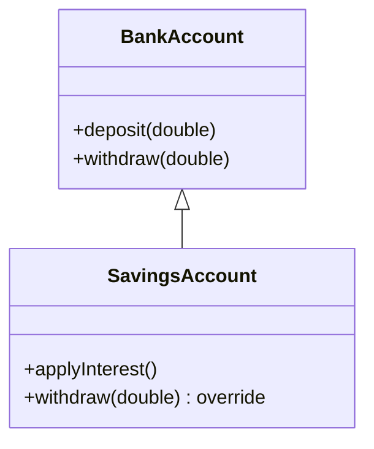
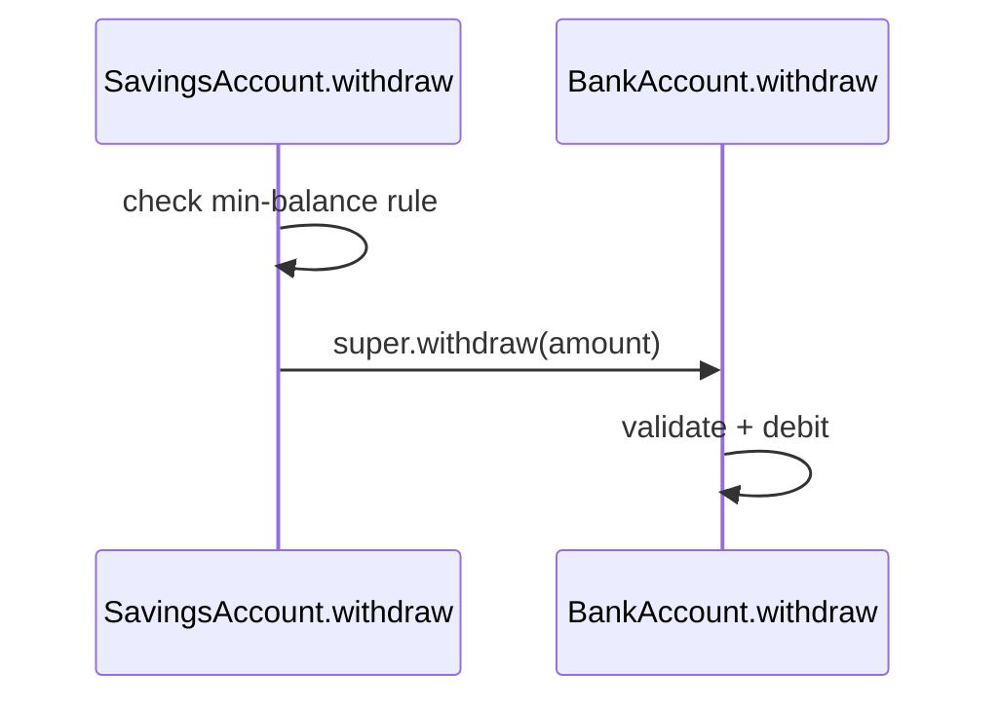

# Inheritance (`extends`, `super`, `@override`)

> Inheritance models an **is-a** relationship: a subclass reuses and specializes a superclass's implementation — powerful, but easy to overuse where composition fits better.

## Introduction

Inheritance (`class B extends A`) lets `B` reuse `A`'s fields/methods and add or override behavior. This file covers `extends`, calling `super`, `@override`, constructor chaining with `super(...)`, abstract base classes, and — crucially — *when inheritance is the wrong tool*.

## Why this concept exists

Many types share behavior (all accounts can deposit; all shapes have a position). Inheritance lets you write that once in a base class and specialize per subtype, avoiding duplication and enabling polymorphism. Dart supports **single inheritance** (one superclass) to keep dispatch unambiguous.

## Real-world analogy

Inheritance is a **family trait**: a `SavingsAccount` inherits everything a `BankAccount` can do (deposit, withdraw) and adds its own (interest), the way a child inherits general human abilities and adds personal skills. But "is-a" must be *true*: a `Stack` is not really a `List` even if it could reuse one — that's a classic inheritance misuse.

## Problem Statement

Model `BankAccount` (base) and `SavingsAccount` (adds interest, tightens `withdraw` with a minimum balance, reuses base validation via `super`). You'll use `extends`, `super(...)` in the constructor, `@override`, and `super.method()`.

## Internal Working



- `class B extends A` — `B` gets `A`'s non-private members and can add/override.
- **Constructor chaining:** `B`'s constructor must initialize `A` via `super(...)` (or `super.field` forwarding). The superclass constructor runs before `B`'s body.
- **`@override`** annotates a method that replaces the superclass version (analyzer-checked).
- **`super.method()`** calls the superclass implementation — to *extend* rather than fully replace behavior.
- **Abstract base class:** `abstract class A` can't be instantiated; defines shared code + abstract methods subclasses must implement.

## Memory Representation

- A subclass instance is one object containing **all** fields (inherited + own). The method table links to inherited and overridden implementations for dynamic dispatch ([polymorphism.md](polymorphism.md)).

## Compiler Behavior

- Missing `super(...)` when the superclass has no default constructor is a compile error.
- `@override` mismatches (wrong signature, no such super method) are flagged.
- Overriding must respect the supertype's signature (parameters may be covariantly narrowed only with `covariant`).

## Runtime Behavior

- Construction order: superclass initializer list/constructor → subclass initializer list → superclass body? Precisely: field initializers + `super` call resolve, base constructor body runs, then the subclass constructor body. (Initializer lists run before bodies.)
- Method calls dispatch to the **runtime type's** override; `super.m()` statically targets the superclass version.

## Flutter Engine Behavior

Not applicable, but Flutter uses inheritance pervasively: `StatelessWidget`/`StatefulWidget` extend `Widget`; your widgets extend those; `RenderBox` extends `RenderObject`.

## Dart VM Behavior

- Virtual dispatch via method tables; monomorphic call sites are optimized/inlined in AOT.

## Examples

```dart
class BankAccount {
  final String owner;
  double _balance;
  BankAccount({required this.owner, double opening = 0}) : _balance = opening;

  double get balance => _balance;

  void deposit(double amount) {
    if (amount <= 0) throw ArgumentError('positive only');
    _balance += amount;
  }

  void withdraw(double amount) {
    if (amount <= 0) throw ArgumentError('positive only');
    if (amount > _balance) throw StateError('insufficient funds');
    _balance -= amount;
  }

  @override
  String toString() => '$runtimeType($owner): ${_balance.toStringAsFixed(2)}';
}

class SavingsAccount extends BankAccount {
  static const double minBalance = 100;
  final double annualRate;

  SavingsAccount({
    required super.owner,      // forward to BankAccount.owner
    super.opening,
    required this.annualRate,
  });

  void applyMonthlyInterest() => deposit(balance * annualRate / 12); // reuse deposit

  @override
  void withdraw(double amount) {
    if (balance - amount < minBalance) {
      throw StateError('must keep min balance of $minBalance');
    }
    super.withdraw(amount); // extend: run base validation + debit
  }
}

void main() {
  final s = SavingsAccount(owner: 'Ada', opening: 1000, annualRate: 0.06);
  s.deposit(500);
  s.applyMonthlyInterest(); // +1500*0.06/12 = 7.5
  print(s); // SavingsAccount(Ada): 1507.50

  try {
    s.withdraw(1500); // would drop below min
  } on StateError catch (e) {
    print(e.message); // must keep min balance of 100.0
  }
}
```

## Diagrams



## Common Mistakes

| Mistake | Why | Fix |
|---------|-----|-----|
| Inheriting for code reuse without is-a | Fragile hierarchies, LSP violations | Use composition ([composition_and_relationships.md](composition_and_relationships.md)) |
| Forgetting `super(...)` | Compile error / uninitialized base | Forward constructor args |
| Overriding without calling `super` when you meant to extend | Loses base behavior | Call `super.method()` |
| Deep inheritance chains | Rigid, hard to change | Flatten; prefer composition/mixins |
| Overriding + changing the contract | Breaks polymorphism/LSP | Keep the supertype's contract ([Module 04](../04%20SOLID%20Principles/README.md)) |

## Best Practices

- Use inheritance only for genuine **is-a** with a stable base contract.
- Prefer shallow hierarchies; favor **composition** and **mixins** for reuse across unrelated types.
- Call `super.method()` when extending; document overrides.
- Make base classes designed-for-inheritance (or `final`/sealed to forbid it) — don't leave it ambiguous.

## Performance

- Virtual dispatch is cheap; deep hierarchies don't cost much at runtime but hurt *maintainability*.

## Advantages / Disadvantages

- **+** Code reuse, polymorphism, clear taxonomy when is-a truly holds.
- **−** Tight coupling to the base, fragile-base-class problem, single-inheritance limit, easy to misuse for reuse.

## Interview Questions

1. **🟢 What does `extends` give a subclass?** — The superclass's non-private fields/methods, which it can use, add to, or override.
2. **🟢 `extends` vs `with` vs `implements`?** — `extends`: inherit one superclass's implementation (`super` available). `with`: mix in reusable implementation(s). `implements`: adopt only the contract, reimplementing everything.
3. **🟡 What is `super` for?** — Calling the superclass constructor (`super(...)`) and superclass method implementations (`super.method()`) to reuse/extend behavior.
4. **🟡 Describe construction order in a subclass.** — Initializer lists resolve and the superclass constructor runs first, then the subclass constructor body; `this` isn't available in initializer lists.
5. **🟡 Why prefer composition over inheritance?** — Inheritance couples you to the base's implementation (fragile base class) and forces an is-a; composition is more flexible, swappable, and testable.
6. **🔴 What is the fragile base class problem?** — Changes to a superclass can unexpectedly break subclasses that depend on its internal behavior — a maintenance hazard of deep inheritance.
7. **🔴 How do you forbid or design for inheritance?** — Mark classes `final`/`sealed`/`base` (Dart 3 class modifiers) to control subclassing, or document/`@protected` the extension points.

## Senior Engineer Tips

- Ask "is-a or has-a?" before `extends`. If you're inheriting to reuse a method, you probably want composition.
- Use Dart 3 **class modifiers** (`final`, `sealed`, `base`, `interface`) to make your inheritance intent explicit and enforceable.
- When you must inherit, keep the base's protected surface small and stable.

## Architect Perspective

Inheritance choices shape coupling. Shallow, intentional hierarchies (or sealed type families) with composition for reuse keep systems flexible; sprawling inheritance trees ossify them. This directly feeds the Liskov and Open/Closed principles ([Module 04](../04%20SOLID%20Principles/README.md)) and pattern choices like Strategy/Decorator over subclass explosions ([Module 05](../05%20Design%20Patterns/README.md)).

## Summary

- `extends` gives is-a reuse + specialization; chain constructors via `super(...)`, extend via `super.method()`, mark overrides with `@override`.
- Prefer shallow hierarchies and composition; reserve inheritance for true is-a with stable contracts.
- Use Dart 3 class modifiers to make inheritance intent explicit.

## Revision Notes

- `extends` = single inheritance + `super`; `@override` to specialize.
- Constructor: `super(...)`/`super.field`; base runs before subclass body.
- `super.method()` extends base behavior; keep the contract (LSP).
- Prefer composition; avoid deep chains + fragile base class; use class modifiers.

## Practice Questions

1. Why does `SavingsAccount.withdraw` call `super.withdraw`?
2. When is `extends` the wrong choice and what do you use instead?
3. Explain the construction order for a two-level hierarchy.

## Coding Questions

1. Build a `Vehicle → ElectricCar` hierarchy where `ElectricCar` overrides `refuel` (charge) and reuses `move` via `super`.
2. Create an abstract `Shape` with `area()` and concrete `Circle`/`Rectangle` subclasses.
3. Demonstrate the fragile base class problem with a base change breaking a subclass, then fix it via composition.

## Mini Project

**Account hierarchy (pure Dart):** Implement `BankAccount`, `SavingsAccount` (min balance + interest), and `CheckingAccount` (overdraft limit), each overriding `withdraw` and reusing base validation via `super`. Add `toString` via `runtimeType`. Acceptance: correct construction chaining; overrides preserve the base contract; tests cover each subtype; `dart analyze` clean.
