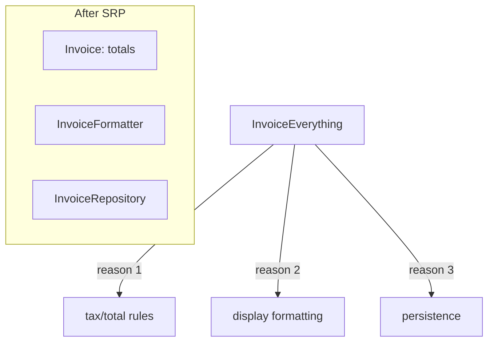
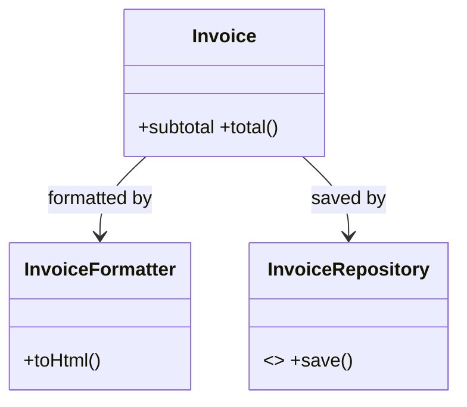

# S — Single Responsibility Principle (SRP)

> A class should have exactly one reason to change — one responsibility, one axis of change, one owner of that concern.

## Introduction

SRP says each class (or function/module) should do **one thing** and have **one reason to change**. "Reason to change" means a distinct *actor* or concern: persistence, formatting, business rules, networking. When a class mixes concerns, a change to one drags in risk for the others.

## Why this concept exists

God classes are the most common cause of unmaintainable code. When persistence, validation, UI formatting, and networking live in one class, every requirement touching any of them edits the same file — merge conflicts, fragile tests, and ripple bugs. SRP splits concerns so each changes independently.

## Real-world analogy

A restaurant separates **chef**, **waiter**, and **cashier**. If one person did all three, changing the payment system would risk breaking how food is cooked. Separate roles = changes stay contained. A class that "cooks, serves, and bills" is a God class.

## Problem Statement

An `Invoice` class computes totals, formats them for display, and saves to a database. A DB change forces edits to the same class that owns tax rules and formatting — three reasons to change in one place. You'll split it into cohesive units.

## Internal Working



- Identify the **axes of change** (who asks for changes: finance, UI, ops).
- Give each axis its own class with a focused API.
- Coordinate them via composition/injection ([03 · composition](../03%20Object%20Oriented%20Programming/06_composition_and_relationships.md)), not by merging.

## Memory Representation

Not applicable — SRP is a structural design principle, not a runtime data concern.

## Compiler Behavior

Not applicable directly, though smaller cohesive classes give the analyzer clearer types and dead-code detection.

## Runtime Behavior

Not applicable — behavior is unchanged by refactoring; *changeability* improves.

## Flutter Engine Behavior

Not applicable. (But Flutter's widget/build vs state vs logic separation is SRP in practice — keep `build()` about UI, not business rules.)

## Dart VM Behavior

Not applicable.

## Examples

### ❌ Violation — one class, three reasons to change

```dart
class InvoiceEverything {
  final List<double> items;
  InvoiceEverything(this.items);

  double total() => items.fold(0, (s, x) => s + x) * 1.18; // tax rule (finance)

  String toHtml() => '<b>${total().toStringAsFixed(2)}</b>'; // formatting (UI)

  void saveToDb() {
    // SQL persistence (ops/infra) — DB change edits THIS class too
    print('INSERT INTO invoices ... ${total()}');
  }
}
```

### ✅ Refactor — one responsibility each

```dart
class Invoice {
  final List<double> items;
  const Invoice(this.items);
  double get subtotal => items.fold(0, (s, x) => s + x);
  double total({double taxRate = 0.18}) => subtotal * (1 + taxRate); // finance only
}

class InvoiceFormatter {
  String toHtml(Invoice inv) =>
      '<b>${inv.total().toStringAsFixed(2)}</b>'; // UI only
}

abstract interface class InvoiceRepository {
  Future<void> save(Invoice inv);
}
class SqlInvoiceRepository implements InvoiceRepository {
  @override
  Future<void> save(Invoice inv) async => print('INSERT ... ${inv.total()}');
}

Future<void> main() async {
  const inv = Invoice([100, 200]);
  print(InvoiceFormatter().toHtml(inv)); // <b>354.00</b>
  await SqlInvoiceRepository().save(inv);
}
```

### Flutter example

```dart
// ❌ Widget doing networking + parsing + UI (three reasons to change)
// class UserScreen extends StatelessWidget { ...http.get, jsonDecode, build... }

// ✅ Separate: Repository (data), ViewModel/Cubit (state/logic), Widget (UI only)
// UserRepository.fetch() -> UserViewModel exposes state -> UserScreen just renders it
// A UI change never risks the parsing logic, and vice versa. (See Modules 11, 40.)
```

### Enterprise example

In a payments system, split `PaymentProcessor` into: `PaymentValidator` (rules), `PaymentGateway` (network), `PaymentRepository` (persistence), `ReceiptFormatter` (documents), `PaymentLogger` (observability). A gateway swap (Razorpay→Stripe) touches only `PaymentGateway`.

## Diagrams



## Common Mistakes

| Mistake | Why | Fix |
|---------|-----|-----|
| God class ("Manager"/"Helper"/"Utils" that does everything) | Many reasons to change | Split by concern/actor |
| Widgets containing business + network logic | Untestable, coupled | Extract repository + view model |
| Over-splitting into trivial classes | Ceremony, indirection overload | One responsibility ≠ one method — group cohesive behavior |
| "Utility" dumping grounds | Low cohesion | Group by domain, not by "misc" |

## Best Practices

- Ask: **"What are this class's reasons to change?"** More than one → split.
- Name classes by their single responsibility (`InvoiceFormatter`, not `InvoiceManager`).
- Keep `build()` methods about UI; push logic to view models/use cases.
- Balance: cohesion, not fragmentation — related behavior stays together.

## Performance

Neutral. SRP is about maintainability; runtime cost is unchanged (a tiny extra indirection at most).

## Advantages / Disadvantages

- **+** Localized changes, focused tests, reuse, parallel teamwork, clearer names.
- **−** More classes/files; over-application creates needless indirection.

## Interview Questions

1. **🟢 State SRP.** — A class should have one responsibility and therefore one reason to change.
2. **🟢 What's a "reason to change"?** — A distinct concern/actor requesting changes (finance rules vs UI formatting vs persistence).
3. **🟡 How does SRP improve testability?** — Small, single-purpose units have fewer dependencies and simpler tests; you can test rules without a database or UI.
4. **🟡 How does SRP apply to Flutter widgets?** — Keep widgets rendering-only; move networking/parsing/business logic to repositories and view models so UI and logic change independently.
5. **🟡 Can SRP be over-applied?** — Yes; splitting cohesive behavior into anemic one-method classes adds indirection without benefit. Group by responsibility, not by line count.
6. **🔴 How does SRP relate to cohesion/coupling?** — SRP maximizes cohesion (a class's parts belong together) and reduces coupling (fewer cross-concern dependencies).
7. **🔴 How do you detect an SRP violation in review?** — Look for "and" in the class's description, multiple unrelated dependencies (DB + HTTP + UI), or churn from unrelated features touching the same file.

## Senior Engineer Tips

- The `Manager`/`Helper`/`Util` suffix is a code smell for hidden multi-responsibility — name the actual responsibility.
- Use git churn as evidence: files changed by many unrelated PRs often violate SRP.
- SRP at the module/package level (feature-first) matters as much as at the class level ([Modules 44, 45](../44%20Feature%20First%20Architecture/README.md)).

## Architect Perspective

SRP is the seed of layered/clean architecture: separate presentation, domain, and data so each evolves on its own axis. Applied at package granularity it enables independent deployability and team ownership. Violations compound — a God class becomes a God module becomes an unshippable monolith.

## Summary

- One class, one responsibility, one reason to change.
- Split God classes by concern; compose the pieces; keep widgets UI-only.
- Balance cohesion vs fragmentation; name by responsibility.

## Revision Notes

- SRP = one reason to change (one actor/concern).
- Smell: God class, `Manager`/`Util`, DB+HTTP+UI together, "and" in the description.
- Fix: split by concern, compose/inject.
- Flutter: widget=UI, repo=data, viewmodel=logic.

## Practice Questions

1. List the reasons to change in a class that fetches, parses, caches, and renders data.
2. When is splitting a class *over*-applying SRP?
3. How does SRP make unit tests simpler?

## Coding Questions

1. Refactor a `ReportManager` (compute + format + email + save) into four cohesive classes.
2. Extract business logic out of a Flutter widget into a testable view model.
3. Identify and split the responsibilities of a `UserUtils` grab-bag.

## Mini Project

**Invoice module refactor (pure Dart):** Start from an `InvoiceEverything` God class; refactor into `Invoice` (rules), `InvoiceFormatter` (multiple formats), and `InvoiceRepository` (interface + impl). Add tests for each in isolation (rules without a DB, formatting without persistence). Acceptance: each class has one responsibility; tests need no unrelated dependencies; `dart analyze` clean.
