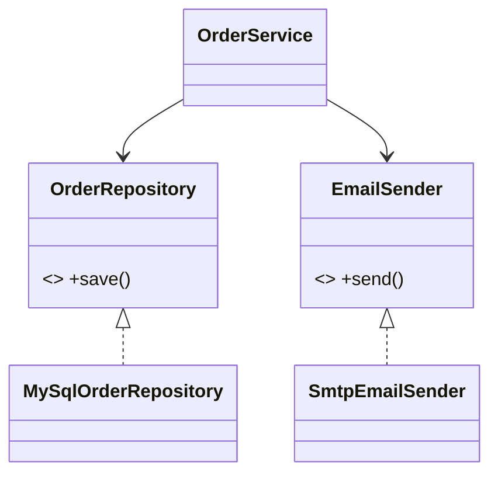

# D — Dependency Inversion Principle (DIP)

> High-level modules should not depend on low-level modules; both should depend on **abstractions**. And abstractions should not depend on details — details depend on abstractions.

## Introduction

DIP inverts the "natural" dependency direction. Normally a high-level `OrderService` would directly `new` a low-level `MySqlDatabase`. DIP says: define an **abstraction** (`OrderRepository`) that the high-level module owns and depends on, and make the low-level detail (`MySqlOrderRepository`) implement it. The concrete dependency is then **injected**, not constructed inside.

## Why this concept exists

Hard-wired dependencies (`final db = MySqlDatabase()`) make high-level policy code impossible to test in isolation and impossible to swap (change DB, mock in tests, support another provider). Inverting the dependency onto an abstraction decouples *what* the app does (policy) from *how* it's done (details), which is the core of testable, flexible architecture.

## Real-world analogy

A **lamp** doesn't hard-wire itself to a specific power plant; it depends on the **socket standard** (abstraction). Any conforming power source plugs in. The lamp (high-level) and the power plant (low-level detail) both depend on the socket (abstraction) — not on each other.

## Problem Statement

An `OrderService` directly instantiates a concrete `SmtpEmailSender` and `MySqlOrderRepository`, so you can't unit-test it without a real SMTP server and DB, and can't swap providers. You'll invert: depend on interfaces, inject implementations.

## Internal Working

```mermaid
flowchart TD
    subgraph Without DIP
      HS[OrderService] --> LD[MySqlDatabase concrete]
    end
    subgraph With DIP
      HS2[OrderService] --> AB[OrderRepository interface]
      AB <|.. Impl[MySqlOrderRepository]
    end
    Note["dependency arrow now points to the abstraction, owned by the high-level module"]
```

- The **high-level module owns the abstraction** (interface) it needs.
- **Low-level details implement** that abstraction.
- The concrete implementation is **injected** (constructor injection is the simplest form) — see [Module 14 Dependency Injection](../14%20Dependency%20Injection/README.md).
- DIP is the mechanism that makes **OCP** and swap/mocking possible; it relies on polymorphism ([03](../03%20Object%20Oriented%20Programming/04_polymorphism.md)) and lean interfaces (ISP).

> **DIP vs DI:** DIP is the *principle* (depend on abstractions). **Dependency Injection** is a *technique* for supplying those dependencies. You can follow DIP with manual constructor injection; DI frameworks just automate wiring.

## Memory Representation

Not applicable — a structural principle.

## Compiler Behavior

- Depending on an interface type means the compiler accepts any implementation, enabling compile-time-safe substitution (real vs fake).

## Runtime Behavior

- The injected implementation is used via dynamic dispatch; tests inject fakes, production injects real adapters — no code change in the high-level module.

## Flutter Engine Behavior

Not applicable. (Flutter/Riverpod/get_it/Provider all exist to inject dependencies — DIP in practice. `InheritedWidget` provides dependencies down the tree.)

## Dart VM Behavior

Not applicable beyond normal dispatch.

## Examples

### ❌ Violation — high-level depends on concretes

```dart
class SmtpEmailSender {
  void send(String to, String body) => print('SMTP -> $to'); // low-level detail
}
class MySqlOrderRepository {
  void save(String order) => print('MySQL save $order'); // low-level detail
}

class OrderServiceBad {
  final _email = SmtpEmailSender();        // ❌ hard-wired
  final _repo = MySqlOrderRepository();    // ❌ hard-wired — untestable, unswappable
  void placeOrder(String order, String customer) {
    _repo.save(order);
    _email.send(customer, 'Order placed');
  }
}
```

### ✅ Refactor — depend on abstractions, inject details

```dart
// Abstractions OWNED by the high-level module:
abstract interface class OrderRepository {
  Future<void> save(String order);
}
abstract interface class EmailSender {
  Future<void> send(String to, String body);
}

class OrderService {
  final OrderRepository _repo;
  final EmailSender _email;
  OrderService(this._repo, this._email); // injected

  Future<void> placeOrder(String order, String customer) async {
    await _repo.save(order);
    await _email.send(customer, 'Order placed');
  }
}

// Low-level details implement the abstractions:
class MySqlOrderRepository implements OrderRepository {
  @override
  Future<void> save(String order) async => print('MySQL save $order');
}
class SmtpEmailSender implements EmailSender {
  @override
  Future<void> send(String to, String body) async => print('SMTP -> $to');
}

// Test doubles — no real DB/SMTP needed:
class FakeRepo implements OrderRepository {
  final saved = <String>[];
  @override
  Future<void> save(String order) async => saved.add(order);
}
class FakeEmail implements EmailSender {
  int count = 0;
  @override
  Future<void> send(String to, String body) async => count++;
}

Future<void> main() async {
  // production wiring:
  final prod = OrderService(MySqlOrderRepository(), SmtpEmailSender());
  await prod.placeOrder('o1', 'ada@x.com');

  // test wiring:
  final fakeRepo = FakeRepo();
  final fakeEmail = FakeEmail();
  final sut = OrderService(fakeRepo, fakeEmail);
  await sut.placeOrder('o2', 'test@x.com');
  print('${fakeRepo.saved} emails=${fakeEmail.count}'); // [o2] emails=1
}
```

### Flutter example

```dart
// ❌ Widget/Cubit that does `final repo = FirebaseUserRepo();` inside.
// ✅ Depend on an abstract UserRepository; inject FirebaseUserRepo in production and
//    FakeUserRepo in tests via Provider/Riverpod/get_it. UI/logic never names Firebase.
//    (See Modules 11, 14, 40.)
```

### Enterprise example

Clean Architecture: the **domain** layer defines repository interfaces; the **data** layer implements them (REST/DB); the app **wires** them via DI at startup. The domain (policy) has zero imports of Flutter/HTTP/DB — it depends only on its own abstractions. This is DIP scaled to layers ([Module 40](../40%20Clean%20Architecture/README.md)).

## Diagrams



## Common Mistakes

| Mistake | Why | Fix |
|---------|-----|-----|
| `new`/instantiating concretes inside high-level code | Untestable, unswappable | Depend on an interface, inject the impl |
| Interface owned by the low-level module | Dependency not truly inverted | Define the abstraction where it's *used* |
| Service locator overuse (hidden globals) | Opaque dependencies | Prefer constructor injection; use DI containers judiciously |
| Leaking implementation types through the interface | Re-couples to details | Keep interfaces detail-free (no `HttpResponse` in domain) |
| Injecting everything, even stable leaf values | Ceremony | Invert *volatile*/external dependencies, not trivial ones |

## Best Practices

- Depend on **abstractions**; inject concretes via constructors (simplest, most explicit DI).
- **The consumer owns the interface** (define `OrderRepository` in the domain, not the DB layer).
- Keep abstractions free of implementation detail types.
- Invert **volatile/external** dependencies (DB, network, clock, platform); don't over-inject stable, pure values.
- Wire the object graph at the **composition root** (app startup / DI container — [Module 14](../14%20Dependency%20Injection/README.md)).

## Performance

Neutral; one indirection. The gain is testability and flexibility.

## Advantages / Disadvantages

- **+** Testable (inject fakes), swappable (providers/DBs), decoupled layers, enables OCP + Clean Architecture.
- **−** More interfaces + wiring; over-injection adds ceremony; needs a composition root/DI strategy.

## Interview Questions

1. **🟢 State DIP.** — High- and low-level modules should both depend on abstractions, not on each other; details depend on abstractions, not vice versa.
2. **🟢 DIP vs Dependency Injection?** — DIP is the principle (depend on abstractions); DI is the technique for supplying dependencies (e.g., constructor injection, DI containers).
3. **🟡 Who should own the interface?** — The high-level consumer that uses it (define the repository interface in the domain), so the dependency truly points inward.
4. **🟡 How does DIP enable testing?** — You inject fake implementations of the abstractions, testing high-level logic without real DBs/networks.
5. **🟡 How do DIP and OCP relate?** — DIP's abstractions let you add/swap implementations (OCP) without editing the high-level module.
6. **🔴 Constructor injection vs service locator?** — Constructor injection makes dependencies explicit and testable; service locators hide them (global lookup) and can obscure the graph — prefer constructor injection, use locators sparingly.
7. **🔴 What's the composition root?** — The single place (app startup / DI setup) where concrete implementations are wired to abstractions; the rest of the app stays detail-agnostic.

## Senior Engineer Tips

- Define interfaces by the **need**, not the provider's API (ties DIP to ISP): `Clock`, `UserRepository`, `PaymentGateway` — small and detail-free.
- Only invert *volatile* dependencies (things that change or reach outside the process). Inverting pure, stable helpers is noise.
- Keep the composition root thin and explicit; that's where the "dirty" concrete wiring is allowed to live.

## Architect Perspective

DIP is the keystone of Clean/Hexagonal architecture: the domain defines ports (interfaces), adapters implement them, and DI wires them at the edge. This inversion is what keeps business rules independent of frameworks, databases, and UI — making the system testable, framework-agnostic, and adaptable to new providers or platforms ([Modules 40, 45, 46](../40%20Clean%20Architecture/README.md)).

## Summary

- Depend on abstractions, not concretions; inject the details (constructor injection).
- The consumer owns the interface; wire concretes at the composition root.
- DIP enables OCP, testing-with-fakes, provider swaps, and Clean Architecture; invert volatile dependencies, not trivial ones.

## Revision Notes

- DIP: both levels depend on abstractions; details depend on abstractions.
- DIP = principle; DI = technique (constructor injection preferred).
- Consumer owns the interface; keep it detail-free; wire at composition root.
- Invert volatile/external deps; enables OCP + testability + Clean Arch.

## Practice Questions

1. Why is `OrderServiceBad` impossible to unit-test?
2. Why should the domain, not the data layer, define `OrderRepository`?
3. When is injecting a dependency *not* worth it?

## Coding Questions

1. Invert a `WeatherWidget` that `new`s an `HttpWeatherApi` so it depends on a `WeatherRepository` and injects the impl.
2. Add a `Clock` abstraction so time-dependent logic is testable with a fake clock.
3. Wire a small object graph at a composition root (manual DI), then swap one impl for a fake.

## Mini Project — SOLID capstone refactor

**Order service refactor (pure Dart, the module capstone):** You're given a deliberately bad `OrderEverything` class that: parses input, validates, computes totals with `if (type == ...)`, saves to a DB, sends email, formats a receipt, and logs — all with `new`ed dependencies. Refactor it to satisfy **all five** principles:

- **SRP:** split parsing/validation/pricing/persistence/notification/formatting/logging.
- **OCP:** discount/pricing as strategies added without editing the service.
- **LSP:** gateways/repositories honor contracts (return `Result`, no surprise throws).
- **ISP:** narrow role interfaces (`OrderRepository`, `EmailSender`, `Logger`), no fat interface.
- **DIP:** the `OrderService` depends only on abstractions; concretes injected at a composition root; fakes injected in tests.

Acceptance: `OrderService` has no `new`/type-switch; a full test suite runs with fakes (no real DB/SMTP); adding a new discount tier or notification channel edits no existing class; `dart analyze` clean.
