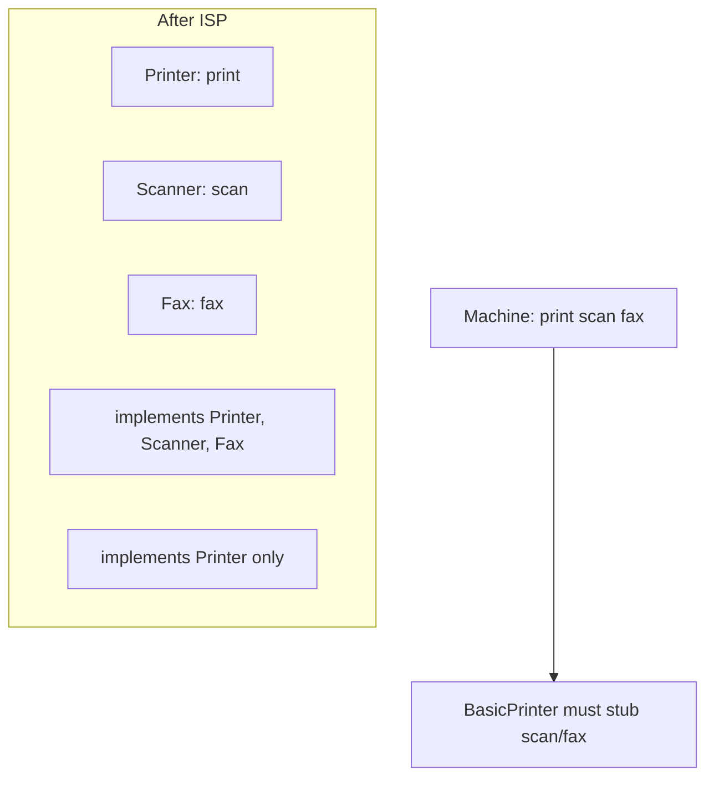
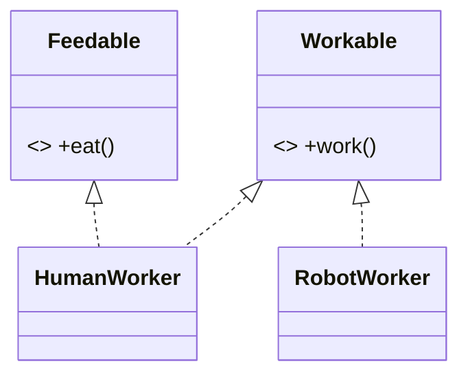

# I — Interface Segregation Principle (ISP)

> No client should be forced to depend on methods it does not use — prefer many small, role-specific interfaces over one fat, do-everything interface.

## Introduction

ISP says interfaces should be **narrow and client-focused**. A "fat" interface forces implementers to provide (and clients to depend on) members irrelevant to them, causing empty/`throw`-ing implementations and needless coupling. Split it into cohesive role interfaces.

## Why this concept exists

Fat interfaces couple unrelated concerns. When one interface declares `print`, `scan`, `fax`, and `staple`, a simple printer must implement (or stub) scanning and faxing, and any change to the fax API recompiles/affects every implementer — even printers that can't fax. ISP decouples clients from capabilities they don't need.

## Real-world analogy

A **Swiss-army-knife job description** ("must cook, drive, code, and do surgery") forces every hire to fake most skills. Split roles (chef, driver, developer, surgeon) so each person implements only what they actually do — and changing the surgery requirements doesn't affect the chef.

## Problem Statement

A `Worker` interface has `work()` and `eat()`. A `RobotWorker` can `work()` but doesn't `eat()` — forcing an empty/throwing `eat()`. And a `MultiFunctionDevice` interface forces a basic printer to stub `scan()`/`fax()`. You'll segregate into role interfaces.

## Internal Working



- Break a fat interface into **role interfaces** (`Printer`, `Scanner`, `Fax`).
- Each class implements **only** the roles it fulfills; multi-capable classes implement several.
- Clients depend on the **narrowest** interface they need — often defined at the **consumer** side.
- Complements LSP: small honest interfaces are easy to satisfy without contract-breaking stubs.

## Memory Representation

Not applicable — a structural/interface-design principle.

## Compiler Behavior

- Implementing a fat interface forces providing every member (Dart `implements` requires all) — the compiler makes the pain visible as stubs.
- Segregated interfaces let the analyzer track precise capabilities per type.

## Runtime Behavior

- No forced `UnsupportedError` stubs → fewer runtime surprises (also an LSP win — [lsp_liskov_substitution.md](lsp_liskov_substitution.md)).

## Flutter Engine Behavior

Not applicable. (Flutter favors small, focused contracts — `Listenable`, `ValueListenable<T>`, `Comparable<T>` — rather than one giant interface.)

## Dart VM Behavior

Not applicable.

## Examples

### ❌ Violation — fat interface forces useless members

```dart
abstract interface class Worker {
  void work();
  void eat();
}

class HumanWorker implements Worker {
  @override
  void work() => print('working');
  @override
  void eat() => print('lunch');
}

class RobotWorker implements Worker {
  @override
  void work() => print('working 24/7');
  @override
  void eat() => throw UnsupportedError('robots do not eat'); // ❌ forced stub
}
```

### ✅ Refactor — role interfaces

```dart
abstract interface class Workable {
  void work();
}
abstract interface class Feedable {
  void eat();
}

class HumanWorker implements Workable, Feedable {
  @override
  void work() => print('working');
  @override
  void eat() => print('lunch');
}

class RobotWorker implements Workable { // only what it can do
  @override
  void work() => print('working 24/7');
}

// Clients depend on the narrow role they need:
void runShift(Iterable<Workable> crew) {
  for (final w in crew) {
    w.work();
  }
}
void lunchBreak(Iterable<Feedable> people) {
  for (final p in people) {
    p.eat();
  }
}

void main() {
  final crew = [HumanWorker(), RobotWorker()];
  runShift(crew);                 // both work
  lunchBreak([HumanWorker()]);    // only feedable clients
}
```

### Flutter example

```dart
// ❌ A single `DataSource` interface with read+write+sync+cache methods forces a
//    read-only remote source to stub write/sync.
// ✅ Split into ReadableSource / WritableSource / SyncableSource; a read-only API
//    depends only on ReadableSource. Repositories compose the roles they need.
```

### Enterprise example

An office-device driver: instead of one `MultiFunctionDevice` (print/scan/fax/staple), define `Printer`, `Scanner`, `FaxMachine`. A cheap printer implements `Printer` only; an all-in-one implements all three. Changing the fax spec never touches printer-only clients or code.

## Diagrams



## Common Mistakes

| Mistake | Why | Fix |
|---------|-----|-----|
| One fat interface for many clients | Forces useless stubs, wide coupling | Split into role interfaces |
| `throw UnsupportedError()` stubs | Signals a wrong/fat interface (also breaks LSP) | Segregate; implement only real roles |
| Interface mirroring an implementation's full API | Leaks capabilities clients don't need | Define interfaces from the *client's* needs |
| Over-segmenting into single-method interfaces everywhere | Ceremony without benefit | Group cohesive operations per role |

## Best Practices

- Define interfaces from the **consumer's** perspective (what that client needs), not the provider's full surface.
- Keep interfaces **cohesive and role-sized**; combine roles via multiple `implements` when needed.
- Treat `UnsupportedError` stubs as evidence of an ISP (and LSP) violation.
- Balance: cohesive roles, not a swarm of trivial one-method interfaces.

## Performance

Neutral.

## Advantages / Disadvantages

- **+** Lower coupling, no forced stubs, easier mocking (small fakes), safer changes, better LSP compliance.
- **−** More interfaces to manage; over-segmentation adds ceremony.

## Interview Questions

1. **🟢 State ISP.** — Clients shouldn't be forced to depend on interface members they don't use; prefer small role-specific interfaces.
2. **🟢 What's the smell of an ISP violation?** — Implementations with empty or `throw UnsupportedError()` methods, and clients depending on capabilities they never call.
3. **🟡 How do you apply ISP?** — Split fat interfaces into cohesive role interfaces; each class implements only the roles it supports; clients depend on the narrowest interface.
4. **🟡 How does ISP relate to LSP?** — Fat interfaces push implementers to stub/throw, violating LSP; segregated interfaces are easy to honor fully, keeping substitution safe.
5. **🟡 Where should interfaces be defined?** — At the consumer side, shaped by what the client needs — not as a mirror of a provider's entire API.
6. **🔴 Can ISP be over-applied?** — Yes; a swarm of single-method interfaces adds indirection. Group cohesive operations into a role.
7. **🔴 How does ISP improve testability?** — Small interfaces mean small fakes/mocks — you stub only the few methods a test needs.

## Senior Engineer Tips

- Let **clients own the interfaces** they depend on (define `ReadableUserSource` where the reader lives), then implementations adapt to them — this also enables DIP ([dip_dependency_inversion.md](dip_dependency_inversion.md)).
- Fewer methods per interface = smaller mocks = faster, clearer tests.
- If an implementer keeps throwing "not supported," your interface is doing too much.

## Architect Perspective

ISP keeps module contracts lean and stable, minimizing the ripple of change across a system. Narrow, client-defined interfaces are the seams that make layers independently testable and swappable — the interface-level complement of SRP and the enabler of DIP and Clean Architecture boundaries ([Module 40](../40%20Clean%20Architecture/README.md)).

## Summary

- Prefer many small, role-specific interfaces over one fat interface.
- Segregation removes forced stubs, lowers coupling, and supports LSP.
- Define interfaces from the client's needs; balance cohesion vs over-segmentation.

## Revision Notes

- ISP: no client depends on unused members; split fat interfaces into roles.
- Smell: empty/`UnsupportedError` stubs; clients coupled to unused methods.
- Define interfaces client-side; implement only real roles; combine via multiple `implements`.
- Supports LSP + testability (small mocks).

## Practice Questions

1. Why does `RobotWorker` implementing `Worker` violate ISP?
2. How does ISP make mocking easier in tests?
3. When is splitting into more interfaces *not* worth it?

## Coding Questions

1. Split a `MultiFunctionDevice` interface into `Printer`/`Scanner`/`Fax`; implement a printer-only and an all-in-one device.
2. Refactor a fat `Repository` into `ReadRepository`/`WriteRepository` and depend on the needed role per use case.
3. Define a client-side `ReadableSettings` interface a widget depends on, backed by a larger settings service.

## Mini Project

**Device driver roles (pure Dart):** Model `Printer`, `Scanner`, `Fax` role interfaces; implement `BasicPrinter` (print only) and `AllInOne` (all three). Write client functions each depending on a single role, and tests using tiny fakes. Acceptance: no `UnsupportedError` stubs; clients depend only on needed roles; `dart analyze` clean.
