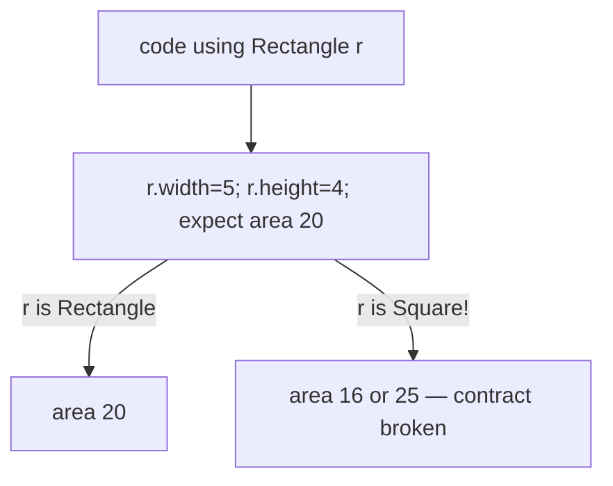
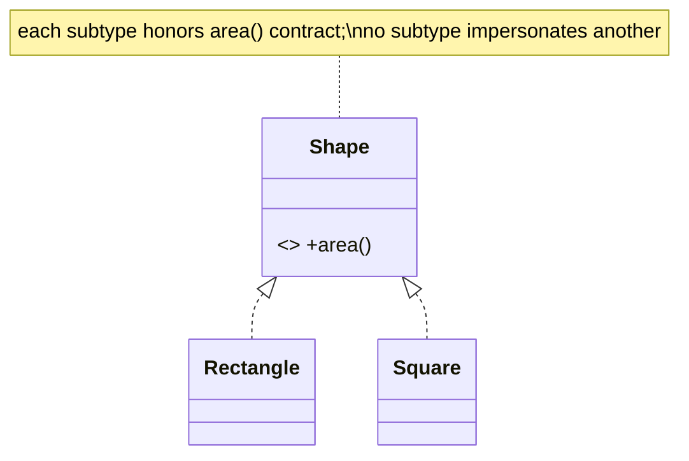

# L — Liskov Substitution Principle (LSP)

> Subtypes must be substitutable for their base type without breaking correctness — if `S` is a subtype of `T`, code written against `T` must work when handed an `S`.

## Introduction

LSP (Barbara Liskov, 1987) constrains inheritance: a subclass must honor the **behavioral contract** of its superclass. Overriding is allowed, but not in ways that surprise callers — no strengthening preconditions, no weakening postconditions, no throwing where the base wouldn't, no violating invariants. Violations make polymorphism unsafe.

## Why this concept exists

Polymorphism ([03 · polymorphism](../03%20Object%20Oriented%20Programming/polymorphism.md)) only works if a base reference behaves predictably regardless of the concrete subtype. If a subtype breaks the base's promises, callers must special-case it (`if (x is Weird)`) — which destroys the extensibility inheritance was supposed to provide.

## Real-world analogy

If a "coffee machine" contract says "press brew → get coffee," any machine you swap in must honor it. A machine that dispenses tea, or explodes when the tank is half-full (a stricter precondition the base didn't have), is **not substitutable** — anyone relying on the contract breaks.

## Problem Statement

The classic trap: `Square extends Rectangle`. A `Rectangle` lets you set width and height independently; a `Square` can't. Code that sets width then height and asserts area breaks for `Square`. You'll see the violation and fix it by rethinking the hierarchy.

## Internal Working

LSP requires overrides to obey the base's contract:

| Rule | Meaning |
|------|---------|
| Preconditions | Not **stronger** in the subtype (don't demand more than the base) |
| Postconditions | Not **weaker** in the subtype (don't promise less) |
| Invariants | Preserved by the subtype |
| Exceptions | Don't throw new types the base's callers don't expect |
| History (mutation) | Don't allow state changes the base forbids |



## Memory Representation

Not applicable — a behavioral contract principle.

## Compiler Behavior

- The compiler enforces *type* substitutability (signatures), **not behavioral** substitutability — LSP is about semantics the compiler can't check. `covariant` narrowing can even let unsafe overrides compile.

## Runtime Behavior

- Violations manifest as wrong results or unexpected exceptions when a subtype is used through a base reference — often far from the subtype's definition, making them hard to debug.

## Flutter Engine Behavior

Not applicable. (But a custom `ScrollController`/`Listenable` subclass that breaks the base contract will misbehave inside framework code that assumes the contract.)

## Dart VM Behavior

Not applicable.

## Examples

### ❌ Violation — Square is not a (behavioral) Rectangle

```dart
class Rectangle {
  int width, height;
  Rectangle(this.width, this.height);
  int area() => width * height;
}

class Square extends Rectangle {
  Square(int side) : super(side, side);
  // Force both dimensions equal — breaks Rectangle's contract:
  @override
  set width(int w) { super.width = w; super.height = w; }
  @override
  set height(int h) { super.width = h; super.height = h; }
}

void resizeAndCheck(Rectangle r) {
  r.width = 5;
  r.height = 4;
  assert(r.area() == 20); // holds for Rectangle...
}

void main() {
  resizeAndCheck(Rectangle(1, 1)); // ok: area 20
  resizeAndCheck(Square(1));       // ❌ area 16 — LSP violated, assert fails
}
```

### ✅ Refactor — model the real contract (no false is-a)

```dart
abstract class Shape {
  int area();
}

class Rectangle implements Shape {
  final int width, height; // immutable -> no independent-setter trap
  const Rectangle(this.width, this.height);
  @override
  int area() => width * height;
}

class Square implements Shape {
  final int side;
  const Square(this.side);
  @override
  int area() => side * side;
}

int totalArea(List<Shape> shapes) =>
    shapes.fold(0, (s, sh) => s + sh.area());

void main() {
  print(totalArea([const Rectangle(5, 4), const Square(3)])); // 20 + 9 = 29
  // No subtype pretends to be another; each honors the Shape contract.
}
```

### Flutter example

```dart
// ❌ A ReadOnlyList that extends List but throws on add() strengthens no-op into a
//    surprise UnsupportedError -> callers treating it as a List break at runtime.
// ✅ Expose an Iterable / UnmodifiableListView, or a separate read-only type,
//    so the declared type already communicates the contract (no false substitutability).
```

### Enterprise example

A `PaymentGateway` base promises `charge()` never throws for a validated request (returns a failure result). A `LegacyGateway` subclass that *throws* on certain currencies violates LSP — every caller must now wrap it specially. Fix: make the base contract return a `Result` and have all gateways honor it uniformly.

## Diagrams



## Common Mistakes

| Mistake | Why | Fix |
|---------|-----|-----|
| `Square extends Rectangle` with coupled setters | Breaks independent-dimension contract | Separate types under a `Shape` abstraction |
| Override throwing `UnsupportedError` | Weakens/breaks the base contract | Don't inherit a capability you can't fulfill |
| Strengthening preconditions in a subtype | Callers passing base-valid input fail | Keep preconditions ≤ base's |
| Returning `null`/less where base returns a value | Weakens postcondition | Honor the base's guarantees |
| `is`-checks to special-case a subtype | Symptom of an LSP violation | Fix the hierarchy so it's unnecessary |

## Best Practices

- Design the **contract** (pre/postconditions, invariants, exceptions) explicitly; subtypes must obey it.
- Prefer **immutability** to avoid mutation-based traps (the Rectangle/Square setter issue vanishes).
- If a subtype can't fulfill a capability, it **isn't** a subtype — use composition or a different abstraction.
- Watch for `UnsupportedError` overrides — a red flag.

## Performance

Neutral; LSP is about correctness/design.

## Advantages / Disadvantages

- **+** Safe polymorphism, no special-casing, reliable extensibility, honest hierarchies.
- **−** Requires disciplined contract thinking; sometimes forces flatter hierarchies (which is usually good).

## Interview Questions

1. **🟢 State LSP.** — Subtypes must be usable anywhere their base is expected without breaking correctness.
2. **🟢 Give the classic LSP violation.** — `Square extends Rectangle`: coupling width/height setters breaks code relying on independent dimensions.
3. **🟡 What rules must overrides obey?** — No stronger preconditions, no weaker postconditions, preserve invariants, don't throw unexpected exceptions, don't forbid base-allowed state changes.
4. **🟡 Why can't the compiler enforce LSP?** — It checks type/signature substitutability, not *behavioral* semantics; an override can type-check yet violate the contract.
5. **🟡 What's a runtime symptom of an LSP violation?** — Wrong results or surprise exceptions when a subtype flows through base-typed code; callers adding `is`-checks to compensate.
6. **🔴 How does immutability help with LSP?** — It removes mutation-based contract traps (no independent setters to violate), making substitution safe by construction.
7. **🔴 How do LSP and polymorphism/OCP connect?** — Polymorphism and OCP assume subtypes are substitutable; an LSP violation forces special-casing, breaking both.

## Senior Engineer Tips

- If you're tempted to override a method to throw `UnsupportedError`, stop — the inheritance is wrong; use composition or split the abstraction.
- Encode contracts in types where possible (return `Result`, expose read-only interfaces) so violations are hard to write.
- A proliferation of `is`/`as` downcasts is often an LSP smell in disguise.

## Architect Perspective

LSP keeps abstraction boundaries trustworthy: repositories, gateways, and strategies can be swapped (real/fake/provider-A/provider-B) only if every implementation honors the contract. This trust is what makes testing-with-fakes, provider migration, and plugin ecosystems safe at scale. Contract-first design (interfaces with documented guarantees) is the enterprise enforcement of LSP.

## Summary

- Subtypes must honor the base's behavioral contract (pre/postconditions, invariants, exceptions).
- The compiler checks types, not behavior — LSP is a design discipline.
- Prefer immutability and honest abstractions; if a subtype can't fulfill the contract, it isn't one.

## Revision Notes

- LSP: subtype substitutable for base without breaking callers.
- No stronger preconditions / weaker postconditions / broken invariants / surprise exceptions.
- Classic trap: Square/Rectangle setters. Fix: separate types + immutability.
- `UnsupportedError` override / `is`-special-casing = LSP smell. Compiler can't enforce it.

## Practice Questions

1. Why does `resizeAndCheck(Square(1))` fail while `Rectangle` passes?
2. Give a non-geometry LSP violation from a service contract.
3. How does returning `Result` instead of throwing help honor a contract?

## Coding Questions

1. Fix the Square/Rectangle hierarchy using a `Shape` abstraction + immutability.
2. Find and fix an LSP violation in a `Bird`/`Penguin` (can't `fly()`) hierarchy.
3. Refactor a gateway that throws on some inputs to a `Result`-returning contract all impls honor.

## Mini Project

**Contract-safe gateway (pure Dart):** Define a `PaymentGateway` interface whose `charge()` returns a `Result` (never throws for validated input); implement `CardGateway`, `UpiGateway`, and a `LegacyGateway` adapter that *wraps* a throwing legacy API to honor the contract. Write tests substituting each gateway through the interface. Acceptance: all implementations honor the contract; no caller special-cases a subtype; `dart analyze` clean.
