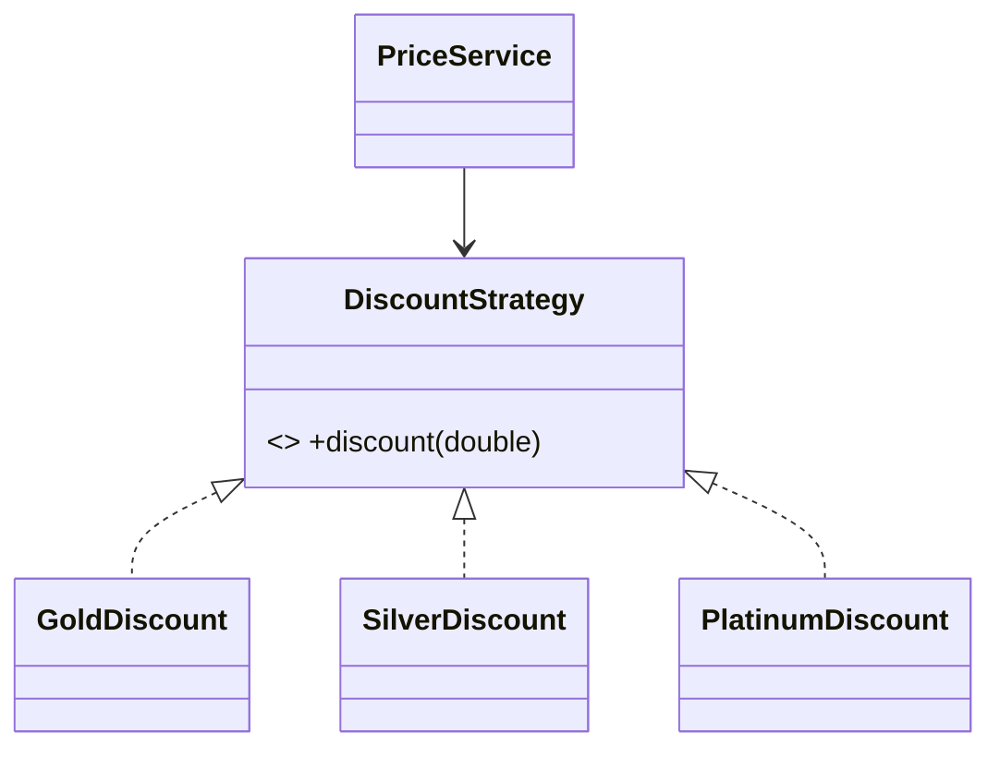

# O — Open/Closed Principle (OCP)

> Software entities should be **open for extension but closed for modification** — add new behavior by adding new code, not by editing tested, working code.

## Introduction

OCP says you should be able to extend a system's behavior **without changing** its existing source. In practice: replace growing `if/else`/`switch`-on-type chains with **polymorphism** or **strategies**, so adding a case means adding a class, not editing a battle-tested method.

## Why this concept exists

Every edit to working code risks regressions and re-testing. When a single function must change every time a new "type" appears, it becomes a bug magnet and a merge-conflict hotspot. OCP isolates variation behind an abstraction so new variants plug in without touching stable code.

## Real-world analogy

A **power strip**: to add a new appliance you plug it into an open socket — you don't rewire the wall. The socket (abstraction) is the stable, closed part; appliances (implementations) are the open, extensible part.

## Problem Statement

A `DiscountCalculator` uses `if (customer.type == 'gold') ... else if ('silver') ...`. Every new tier edits (and risks breaking) this method. You'll refactor to a strategy abstraction so new tiers are new classes.

## Internal Working

```mermaid
flowchart LR
    Ctx[PriceService] --> Abs[DiscountStrategy interface]
    Abs <|.. Gold[GoldDiscount]
    Abs <|.. Silver[SilverDiscount]
    Abs <|.. New[NewTier - added later, no edits upstream]
```

- Define a **stable abstraction** (interface/abstract class) for the varying behavior.
- Put each variation in its own implementation.
- The consumer depends on the abstraction and never changes when variants are added.
- Mechanisms: polymorphism ([03 · polymorphism](../03%20Object%20Oriented%20Programming/polymorphism.md)), Strategy/Factory patterns ([Module 05](../05%20Design%20Patterns/README.md)), and DIP ([dip_dependency_inversion.md](dip_dependency_inversion.md)).

## Memory Representation

Not applicable — a structural principle.

## Compiler Behavior

- With `sealed` types, an exhaustive `switch` gives a *controlled* form of OCP: adding a variant forces you to handle it (compile error) — appropriate for **closed** sets. For **open** sets (third parties add variants), use open interfaces.

## Runtime Behavior

- New strategies dispatch polymorphically; existing code paths are untouched and don't need re-testing.

## Flutter Engine Behavior

Not applicable. (Flutter's widget composition is OCP-friendly: extend UIs by composing new widgets, not editing existing ones.)

## Dart VM Behavior

Not applicable beyond normal virtual dispatch.

## Examples

### ❌ Violation — edit the method for every new type

```dart
class DiscountCalculatorBad {
  double discount(String tier, double amount) {
    if (tier == 'gold') return amount * 0.20;
    else if (tier == 'silver') return amount * 0.10;
    else if (tier == 'bronze') return amount * 0.05;
    // adding 'platinum' means EDITING this tested method — OCP violation
    else return 0;
  }
}
```

### ✅ Refactor — extend by adding a class

```dart
abstract interface class DiscountStrategy {
  double discount(double amount);
}

class GoldDiscount implements DiscountStrategy {
  @override
  double discount(double amount) => amount * 0.20;
}
class SilverDiscount implements DiscountStrategy {
  @override
  double discount(double amount) => amount * 0.10;
}
// New tier = NEW class, zero edits to PriceService:
class PlatinumDiscount implements DiscountStrategy {
  @override
  double discount(double amount) => amount * 0.30;
}

class PriceService {
  final DiscountStrategy strategy; // depends on abstraction
  PriceService(this.strategy);
  double finalPrice(double amount) => amount - strategy.discount(amount);
}

void main() {
  print(PriceService(GoldDiscount()).finalPrice(100));     // 80.0
  print(PriceService(PlatinumDiscount()).finalPrice(100)); // 70.0 — added w/o edits
}
```

### Flutter example

```dart
// ❌ A widget with switch(type) building different cards, edited per new type.
// ✅ Define an abstract CardBuilder / pass a WidgetBuilder per type via a registry/map:
//    final builders = <CardType, Widget Function(Data)>{ ... };
//    Widget build(...) => builders[type]!(data);
// Adding a new card type registers a new builder — no edits to the rendering widget.
```

### Enterprise example

A notification system with `NotificationChannel` (email/SMS/push/WhatsApp). Adding a new channel (e.g., Slack) is a new `SlackChannel` class registered with the dispatcher; the dispatcher, tests, and existing channels are untouched — critical when the dispatcher is high-risk shared code.

## Diagrams



## Common Mistakes

| Mistake | Why | Fix |
|---------|-----|-----|
| `switch`/`if`-on-type chains that grow | Edit-per-variant (violates OCP) | Strategy/polymorphism |
| Abstracting *everything* preemptively | Speculative generality (YAGNI) | Abstract when a *second* variant appears |
| Using `sealed` for an externally-extensible set | Third parties can't add variants | Open interface for open sets |
| Editing shared code for each feature flag | Risky, conflict-prone | Register behaviors via a map/DI |

## Best Practices

- Introduce the abstraction when the **second** variant arrives (rule of three), not before.
- Prefer composition/strategy + registries/maps over type switches for open sets.
- Use `sealed` + exhaustive `switch` for **closed** sets where compiler-enforced completeness is the goal.
- Keep the abstraction stable; variants carry the change.

## Performance

Neutral; virtual dispatch/registry lookup is cheap.

## Advantages / Disadvantages

- **+** Add features without touching stable code; fewer regressions; parallel work; smaller diffs.
- **−** More types/indirection; premature abstraction hurts (speculative generality).

## Interview Questions

1. **🟢 State OCP.** — Entities should be open for extension but closed for modification: add behavior via new code, not by editing existing code.
2. **🟢 What's the classic OCP smell?** — A growing `if/else`/`switch` on a type/enum that must be edited for every new variant.
3. **🟡 How do you achieve OCP?** — Depend on a stable abstraction (interface); put each variation in its own implementation; add variants without editing the consumer (Strategy/Factory + DIP).
4. **🟡 When is a `sealed` `switch` compatible with OCP?** — For **closed** sets: the compiler enforces handling every variant. For **open** sets (external extension), use open interfaces instead.
5. **🟡 Doesn't OCP contradict "don't over-abstract"?** — No: apply it when a real second variant appears (rule of three); premature abstraction (speculative generality) is the failure mode.
6. **🔴 How do OCP and DIP relate?** — DIP (depend on abstractions) is the mechanism that makes OCP achievable; polymorphism dispatches to the new implementation.
7. **🔴 Give an enterprise OCP win.** — A payment/notification dispatcher where new providers/channels are added as classes registered via DI, leaving the high-risk dispatcher untouched.

## Senior Engineer Tips

- Watch for the *third* `else if` — that's usually the signal to extract a strategy.
- A `Map<Type, Builder>` registry is often the simplest OCP tool in Flutter (card builders, route factories, handlers).
- Balance: don't invert everything. Abstractions have carrying cost; introduce them where variation is real or clearly imminent.

## Architect Perspective

OCP is what lets teams add features fast and safely: plugins, provider adapters, feature modules that register capabilities without editing the core. It underpins extensible architectures (Strategy, plugin systems, adapter layers) and reduces the blast radius of change — a direct driver of delivery velocity at scale.

## Summary

- Open for extension, closed for modification: add variants as new classes behind a stable abstraction.
- Replace type-switch chains with polymorphism/strategy + registries; use `sealed` for closed sets.
- Introduce abstractions when real variation appears, not speculatively.

## Revision Notes

- OCP: extend without editing existing code.
- Smell: growing `switch`/`if`-on-type.
- Fix: interface + implementations + DI/registry (Strategy/Factory).
- `sealed`+exhaustive `switch` = closed-set OCP; open interface = open-set.
- Apply on the 2nd–3rd variant (avoid speculative generality).

## Practice Questions

1. Why does adding a `PlatinumDiscount` require no edits to `PriceService`?
2. When is a type `switch` acceptable (and even preferable)?
3. How does OCP reduce regression risk?

## Coding Questions

1. Refactor a `ShippingCostCalculator` with `if(country==...)` into a strategy per region.
2. Build a `Map<EventType, Handler>` registry so new event types register handlers without editing the dispatcher.
3. Implement an open `ExportFormat` abstraction (CSV/JSON/PDF) and add a new format with zero edits upstream.

## Mini Project

**Pluggable discount engine (pure Dart):** Implement a `DiscountStrategy` abstraction with several tiers and a `PriceService`, plus a registry that resolves strategies by tier. Add a brand-new tier and prove no existing file changed. Add tests. Acceptance: no type-switch in `PriceService`; new variant added without editing consumer/tests; `dart analyze` clean.
