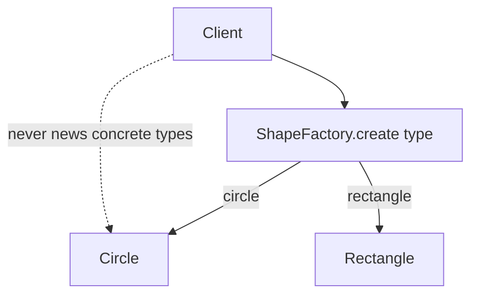
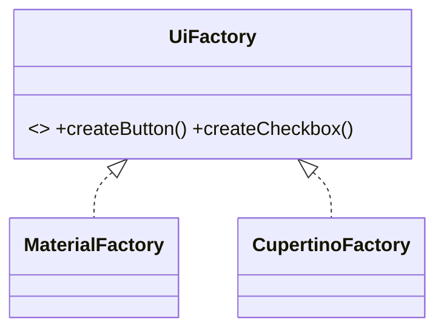

# Factory Pattern (Simple Factory, Factory Method, Abstract Factory)

> A factory centralizes object creation so callers ask *what* they want, not *how* to build it — decoupling code from concrete classes.

## Introduction

The "factory" family hides instantiation behind a method or class:
- **Simple Factory** — one method/class that returns the right concrete type.
- **Factory Method** — subclasses decide which concrete product to create.
- **Abstract Factory** — creates *families* of related products.

## Why this concept exists

Direct `new ConcreteClass()` calls scatter concrete-type knowledge everywhere, violating OCP and DIP ([Module 04](../04%20SOLID%20Principles/README.md)). Factories centralize creation logic (selection, caching, validation) in one place, so adding a new product type or swapping implementations touches minimal code.

## Real-world analogy

A **pizza shop**: you order "Margherita" (a name); the kitchen (factory) decides how to build it. You don't assemble dough and toppings yourself. An **abstract factory** is a shop that makes a whole *matching set* — a "Veg combo" (matching pizza + side + drink).

## Problem Statement

You parse a `type` field from JSON (`'circle'`, `'rectangle'`) and must create the right `Shape`. Sprinkling `if (type == 'circle') Circle(...)` everywhere is fragile. You'll centralize it in a factory, then scale to families with an abstract factory (e.g., Material vs Cupertino widget sets).

## Internal Working



- **Simple Factory:** a `static` method returning the base type based on input.
- **Factory Method:** an abstract `createProduct()` overridden per subclass (creation deferred to subtypes).
- **Abstract Factory:** an interface with multiple `createX()` methods producing a consistent family; concrete factories yield matching sets.
- Dart's `factory` constructor ([02 · constructors](../02%20Advanced%20Dart/09_constructors_and_singletons.md)) natively supports the Simple Factory idiom.

## Memory Representation

Not applicable beyond normal allocation; factories may return cached instances (flyweight) instead of new ones.

## Compiler Behavior

Not applicable — a design structure. Return type is the abstraction, so callers are statically decoupled from concretes.

## Runtime Behavior

Factory logic runs at call time (parse `type`, choose subtype, optionally cache).

## Flutter Engine Behavior

Not applicable. (Flutter uses factory-like selection everywhere: `Theme.of(context)` returns platform-appropriate values; adaptive widgets pick Material/Cupertino.)

## Dart VM Behavior

Not applicable.

## Examples

```dart
// Simple Factory via Dart factory constructor
abstract class Shape {
  double area();
  factory Shape.fromType(String type, Map<String, double> p) => switch (type) {
        'circle' => Circle(p['r']!),
        'rectangle' => Rectangle(p['w']!, p['h']!),
        _ => throw ArgumentError('unknown shape $type'),
      };
}

class Circle implements Shape {
  final double r;
  Circle(this.r);
  @override
  double area() => 3.14159 * r * r;
}
class Rectangle implements Shape {
  final double w, h;
  Rectangle(this.w, this.h);
  @override
  double area() => w * h;
}

// Abstract Factory: families of related products (UI kits)
abstract interface class Button { String render(); }
abstract interface class Checkbox { String render(); }

abstract interface class UiFactory {
  Button createButton();
  Checkbox createCheckbox();
}

class MaterialFactory implements UiFactory {
  @override
  Button createButton() => _MButton();
  @override
  Checkbox createCheckbox() => _MCheckbox();
}
class CupertinoFactory implements UiFactory {
  @override
  Button createButton() => _CButton();
  @override
  Checkbox createCheckbox() => _CCheckbox();
}
class _MButton implements Button { @override String render() => '[Material Button]'; }
class _MCheckbox implements Checkbox { @override String render() => '[Material Checkbox]'; }
class _CButton implements Button { @override String render() => '(Cupertino Button)'; }
class _CCheckbox implements Checkbox { @override String render() => '(Cupertino Checkbox)'; }

void main() {
  final s = Shape.fromType('circle', {'r': 2});
  print(s.area()); // 12.56...

  final UiFactory ui = MaterialFactory(); // swap to CupertinoFactory for iOS
  print(ui.createButton().render());   // [Material Button]
  print(ui.createCheckbox().render()); // [Material Checkbox] — consistent family
}
```

## Diagrams



## Common Mistakes

| Mistake | Why | Fix |
|---------|-----|-----|
| `new` concrete types scattered in callers | Coupling, OCP violation | Centralize in a factory |
| Factory returning concrete types | Recouples callers | Return the abstraction |
| Giant factory `switch` that also does business logic | SRP violation | Keep factories creation-only; consider a registry map |
| Abstract Factory when you only have one family | Over-engineering | Use a simple factory |

## Best Practices

- Return the **abstraction**, not concretes.
- Keep factories creation-focused (selection/validation/caching), not business logic.
- Use a `Map<Key, Builder>` registry for open extensibility (OCP) instead of a growing `switch`.
- Use Dart's `factory` constructor for the simple case.

## Performance

Neutral; factories can *improve* it via caching/flyweight (return shared instances).

## Advantages / Disadvantages

- **+** Decouples creation from use, centralizes selection, supports families, enables caching.
- **−** Extra indirection; Abstract Factory adds many types; overkill for trivial creation.

## Interview Questions

1. **🟢 What problem does a factory solve?** — It decouples clients from concrete classes by centralizing object creation behind a method/abstraction.
2. **🟢 Factory Method vs Abstract Factory?** — Factory Method: subclasses decide which single product to create. Abstract Factory: creates *families* of related products consistently.
3. **🟡 How does Dart support the factory pattern natively?** — `factory` constructors can return cached instances or subtypes without exposing `new`.
4. **🟡 How do factories support OCP?** — New product types are added in the factory (ideally a registry), leaving callers unchanged.
5. **🟡 When is Abstract Factory overkill?** — When there's only one product family or creation is trivial — use a simple factory.
6. **🔴 How do you make a factory open for extension without editing it?** — Use a registry (`Map<Type, Builder>`) that new modules populate, instead of a hard-coded `switch`.
7. **🔴 Where does Flutter use abstract-factory-like selection?** — Adaptive UI choosing Material vs Cupertino component families per platform.

## Senior Engineer Tips

- Prefer a **registry map** over a `switch` for factories that grow; it turns OCP violations into registrations.
- Combine factory + DI: register factories in the container so creation and wiring stay centralized ([21_dependency_injection.md](21_dependency_injection.md)).
- Keep the "dirty" concrete knowledge in the factory (composition root), not spread across the app.

## Architect Perspective

Factories are a creation seam that keeps the bulk of the codebase depending on abstractions (DIP). Combined with DI, they localize concrete-type decisions to composition roots and platform adapters, enabling multi-platform (Material/Cupertino), multi-provider, and testable designs.

## Summary

- Factories centralize object creation behind abstractions; variants: Simple, Factory Method, Abstract Factory.
- Return abstractions; prefer registries for extensibility; use Dart `factory` constructors.
- Great with DI; don't over-apply for trivial creation.

## Revision Notes

- Simple factory = method returns base type; Factory Method = subclass chooses product; Abstract Factory = family of products.
- Dart `factory` ctor supports it natively.
- Return abstraction; registry map > switch (OCP).
- Flutter: adaptive Material/Cupertino families.

## Practice Questions

1. When would you choose Abstract Factory over a simple factory?
2. How does a registry map make a factory OCP-compliant?
3. Why should a factory return the base type, not the concrete?

## Coding Questions

1. Build a `NotificationFactory.create(channel)` returning `EmailNotifier`/`SmsNotifier` via a registry.
2. Implement an abstract `ThemeFactory` producing matching `Button`+`Card` for Light/Dark.
3. Convert a `switch`-based shape creator into a registry-backed factory.

## Mini Project

**UI-kit abstract factory (pure Dart):** Implement `UiFactory` with `Material`/`Cupertino` families (`Button`, `Checkbox`, `Switch`), select by a `Platform` flag, and render a form using only the abstract types. Acceptance: callers never name concrete widgets; adding a third family (e.g., `Fluent`) edits no client code; `dart analyze` clean.
