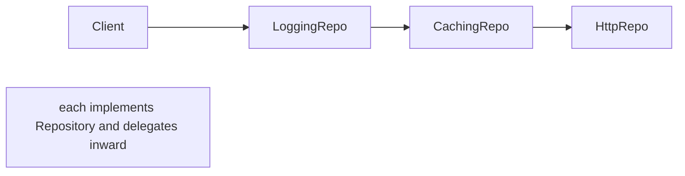
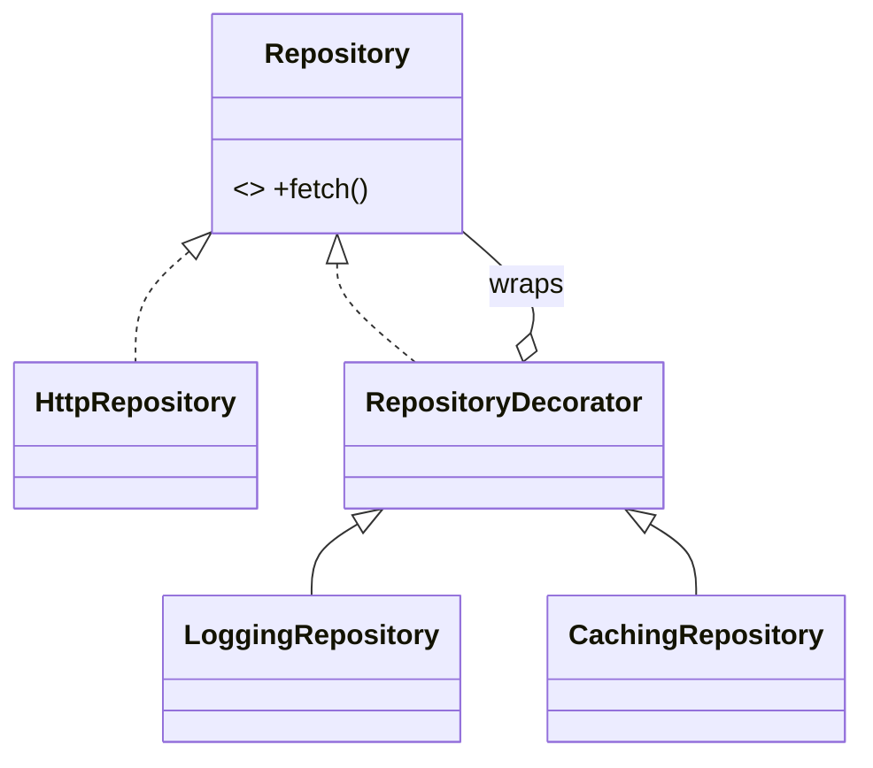

# Decorator Pattern

> A decorator wraps an object to add behavior dynamically, keeping the same interface — layering features without subclass explosion.

## Introduction

Decorator attaches responsibilities to an object at runtime by wrapping it in another object that implements the same interface and delegates to it, adding behavior before/after. Stack decorators to compose features (logging + caching + retry over a base service).

## Why this concept exists

Adding every feature combination via subclasses explodes (`LoggingCachingRetryRepository`...). Decorators let you **compose** features independently and stack them in any order, honoring the Open/Closed Principle — add a new decorator without touching existing ones.

## Real-world analogy

**Coffee add-ons**: start with espresso, wrap with "add milk," then "add caramel," then "add whip." Each wrapper is still "a drink" (same interface) and adds cost/behavior. You mix and match without a class per combination.

## Problem Statement

You have a `Repository` and want to optionally add logging, caching, and retry — in different combinations per environment — without a subclass per combo. You'll wrap the base repository in stackable decorators.

## Internal Working



- **Component interface** (`Repository`) shared by the base and all decorators.
- **Concrete component** (`HttpRepository`) does the real work.
- **Decorator** implements the interface, holds a component, delegates, and adds behavior.
- Decorators **stack**: each wraps the next; call order follows the wrapping order.

## Memory Representation

A chain of wrapper objects, each referencing the inner one; linear in the number of decorators.

## Compiler Behavior

Not applicable. (All layers share the component interface, so clients are agnostic.)

## Runtime Behavior

A call traverses the wrapper chain outermost→innermost, each adding pre/post behavior around `super`/inner call.

## Flutter Engine Behavior

Not applicable. (Flutter's *widget* composition is decorator-like: `Padding(child: DecoratedBox(child: ...))` layers visual behavior around a child.)

## Dart VM Behavior

Not applicable.

## Examples

```dart
abstract interface class Repository {
  Future<String> fetch(String id);
}

class HttpRepository implements Repository {
  @override
  Future<String> fetch(String id) async => 'data($id)';
}

// Base decorator: delegates by default
abstract class RepositoryDecorator implements Repository {
  final Repository inner;
  RepositoryDecorator(this.inner);
}

class LoggingRepository extends RepositoryDecorator {
  LoggingRepository(super.inner);
  @override
  Future<String> fetch(String id) async {
    print('-> fetch $id');
    final result = await inner.fetch(id);
    print('<- $result');
    return result;
  }
}

class CachingRepository extends RepositoryDecorator {
  CachingRepository(super.inner);
  final _cache = <String, String>{};
  @override
  Future<String> fetch(String id) async =>
      _cache[id] ??= await inner.fetch(id); // add caching
}

class RetryRepository extends RepositoryDecorator {
  final int times;
  RetryRepository(super.inner, {this.times = 3});
  @override
  Future<String> fetch(String id) async {
    for (var i = 0; i < times; i++) {
      try {
        return await inner.fetch(id);
      } catch (_) {
        if (i == times - 1) rethrow;
      }
    }
    throw StateError('unreachable');
  }
}

Future<void> main() async {
  // stack features in any order — no subclass per combination
  final Repository repo =
      LoggingRepository(CachingRepository(RetryRepository(HttpRepository())));
  print(await repo.fetch('42'));
  print(await repo.fetch('42')); // second call served from cache
}
```

## Diagrams



## Common Mistakes

| Mistake | Why | Fix |
|---------|-----|-----|
| Subclass explosion for feature combos | Unmaintainable | Compose decorators |
| Decorators changing the interface | Breaks transparency | Keep the same interface |
| Order-dependent bugs (cache before retry?) | Wrong wrapping order | Decide/ document ordering intent |
| Heavy logic making the chain slow | Latency per layer | Keep decorators focused/light |

## Best Practices

- All decorators share the **component interface** (transparent wrapping).
- Keep each decorator **single-purpose** (SRP): one concern per wrapper.
- Be intentional about **stacking order** (e.g., retry inside cache vs outside).
- Provide a base delegating decorator to reduce boilerplate.

## Performance

Each layer adds a delegation hop; keep decorators light. Caching/retry decorators can *improve* net performance/resilience.

## Advantages / Disadvantages

- **+** Compose behavior at runtime, avoid subclass explosion, OCP-friendly, single-purpose layers.
- **−** Many small classes; deep chains harder to debug; order sensitivity.

## Interview Questions

1. **🟢 What does Decorator do?** — Adds behavior to an object dynamically by wrapping it in an object of the same interface that delegates and augments.
2. **🟢 Decorator vs inheritance for adding behavior?** — Decorator composes at runtime and avoids the subclass explosion of every feature combination.
3. **🟡 Why must decorators share the component interface?** — So they're transparent — clients treat a decorated object like the original.
4. **🟡 Give a real stack example.** — `Logging(Caching(Retry(HttpRepository)))` — cross-cutting concerns layered over a base.
5. **🟡 Why does stacking order matter?** — Behavior differs (e.g., caching a retried result vs retrying a cache miss); order encodes intent.
6. **🔴 Decorator vs Proxy?** — Both wrap and share the interface; Decorator *adds behavior*, Proxy *controls access* (lazy/remote/protection) — intent differs.
7. **🔴 Where is Decorator visible in Flutter?** — Widget composition layering visual/behavioral wrappers around a child (`Padding`, `Opacity`, `DecoratedBox`).

## Senior Engineer Tips

- Decorators are the cleanest way to add cross-cutting concerns (logging, caching, metrics, retry) to repositories/services without editing them.
- Keep the base delegating decorator so new decorators override only what they change.
- Document the intended composition order; wrap it in a factory so call sites don't get it wrong.

## Architect Perspective

Decorator enables cross-cutting concerns as composable layers, keeping core services clean and OCP-compliant. It's a key tool in data/service layers (resilience, observability) and mirrors Flutter's compositional UI philosophy — behavior by wrapping, not by inheritance ([Modules 16, 21, 39](../16%20Networking/README.md)).

## Summary

- Decorator wraps an object (same interface) to add behavior; stack for composition.
- Avoids subclass explosion; keep layers single-purpose; mind ordering.
- Ideal for cross-cutting concerns over repositories/services; mirrors Flutter widget composition.

## Revision Notes

- Decorator = wrap + same interface + add behavior; stackable.
- Avoids subclass explosion (OCP); one concern per decorator.
- Order matters; base delegating decorator reduces boilerplate.
- Decorator adds behavior; Proxy controls access.

## Practice Questions

1. Why does Decorator avoid a subclass per feature combination?
2. How does caching-then-retry differ from retry-then-caching?
3. How is Flutter widget nesting decorator-like?

## Coding Questions

1. Add a `MetricsRepository` decorator timing each `fetch`.
2. Build a stackable `Stream` decorator adding logging to events.
3. Wrap a `Logger` with a `TimestampLogger` and a `LevelFilterLogger`.

## Mini Project

**Resilient repository stack (pure Dart):** Implement `Repository` with `HttpRepository` and stackable `Logging`/`Caching`/`Retry` decorators, plus a factory that composes them in the correct order per environment. Test each decorator in isolation and the full stack. Acceptance: no subclass-per-combo; decorators single-purpose; order documented; `dart analyze` clean.
