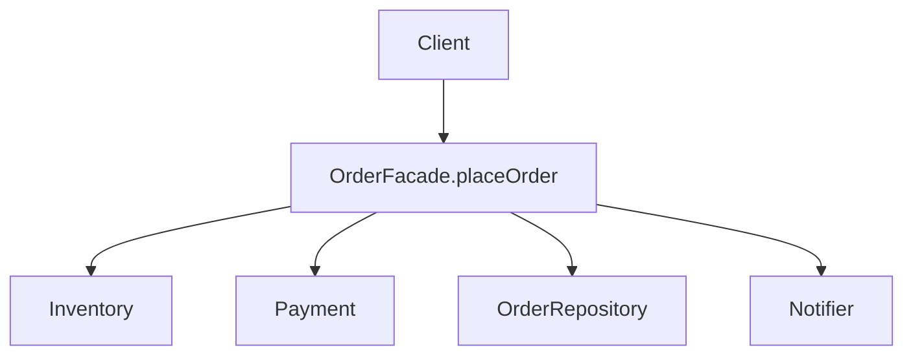
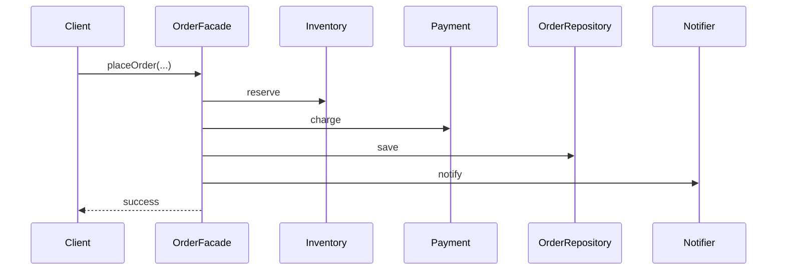

# Facade Pattern

> A facade provides a single, simple interface over a complex subsystem — hiding the messy coordination of many parts behind one easy entry point.

## Introduction

Facade offers a high-level, unified API that delegates to a set of lower-level classes. Clients use the simple facade instead of orchestrating many subsystem objects themselves.

## Why this concept exists

Complex operations often require coordinating several components (validate → charge → persist → notify). Making every caller wire those together is repetitive and coupling-heavy. A facade centralizes that orchestration behind one method, simplifying usage and decoupling clients from the subsystem's structure.

## Real-world analogy

A **hotel concierge**: instead of you calling housekeeping, the restaurant, and the taxi company separately, you ask the concierge, who coordinates everything. One simple interface over many services.

## Problem Statement

Placing an order requires inventory checks, payment, persistence, and notifications across four subsystems. Callers shouldn't orchestrate all four. You'll expose an `OrderFacade.placeOrder(...)` that hides the coordination.

## Internal Working



- The **facade** holds/uses subsystem components and exposes coarse-grained operations.
- It **doesn't** prevent direct subsystem access — it's a convenience layer, not a hard boundary.
- Often combined with DIP: the facade depends on subsystem *interfaces* and is itself injectable.

## Memory Representation

The facade holds references to subsystem components; negligible.

## Compiler Behavior

Not applicable.

## Runtime Behavior

One facade call fans out to ordered subsystem calls, handling their sequencing and errors.

## Flutter Engine Behavior

Not applicable. (Service classes/use cases in Flutter apps are often facades over repositories + clients; `SharedPreferences` is a facade over platform storage.)

## Dart VM Behavior

Not applicable.

## Examples

```dart
// Subsystems (each independently testable)
class Inventory {
  bool reserve(String sku, int qty) => qty <= 10;
}
class Payment {
  Future<bool> charge(double amount) async => true;
}
class OrderRepository {
  Future<void> save(String order) async => print('saved $order');
}
class Notifier {
  Future<void> notify(String to) async => print('notified $to');
}

// Facade: one simple entry point over the messy coordination
class OrderFacade {
  final Inventory inventory;
  final Payment payment;
  final OrderRepository repo;
  final Notifier notifier;
  OrderFacade(this.inventory, this.payment, this.repo, this.notifier);

  Future<bool> placeOrder(String sku, int qty, double amount, String customer) async {
    if (!inventory.reserve(sku, qty)) return false;       // 1 reserve
    if (!await payment.charge(amount)) return false;       // 2 pay
    await repo.save('$sku x$qty');                         // 3 persist
    await notifier.notify(customer);                       // 4 notify
    return true;
  }
}

Future<void> main() async {
  final facade = OrderFacade(Inventory(), Payment(), OrderRepository(), Notifier());
  print(await facade.placeOrder('BOOK1', 2, 39.98, 'ada@x.com')); // true (one call)
}
```

## Diagrams



## Common Mistakes

| Mistake | Why | Fix |
|---------|-----|-----|
| Facade becoming a God object | Absorbs all logic (SRP violation) | Delegate to subsystems; keep facade orchestration-only |
| Facade with business rules baked in | Hard to reuse/test | Push rules into subsystem/domain services |
| Hiding subsystems you still need directly | Over-restriction | Facade is convenience, not a wall — allow direct access when needed |
| Facade depending on concrete subsystems | Coupling | Depend on subsystem interfaces (DIP) |

## Best Practices

- Keep the facade **thin**: orchestration/sequencing, not business logic.
- Depend on subsystem **interfaces**; make the facade injectable.
- Provide coarse-grained operations that match real use cases.
- Don't forbid direct subsystem use — facade is a simplification layer.

## Performance

Neutral; it just sequences existing calls.

## Advantages / Disadvantages

- **+** Simplifies client code, decouples clients from subsystem structure, centralizes orchestration.
- **−** Risk of becoming a God object; can hide capabilities; another layer.

## Interview Questions

1. **🟢 What does Facade do?** — Provides a simple unified interface over a complex subsystem, delegating to its parts.
2. **🟢 Facade vs Adapter?** — Facade *simplifies* a subsystem behind a new easier API; Adapter *converts* one interface to another expected one.
3. **🟡 What should a facade NOT contain?** — Heavy business logic; it should orchestrate, delegating rules to subsystem/domain services.
4. **🟡 Does a facade block direct subsystem access?** — No; it's a convenience layer, not an enforced boundary.
5. **🟡 How does Facade relate to the Use Case/Interactor idea?** — A use case is often a facade over repositories/services for one application operation (Clean Architecture).
6. **🔴 How do you keep a facade from becoming a God object?** — Keep it orchestration-only, depend on interfaces, and split facades by cohesive area.
7. **🔴 Facade vs Mediator?** — Facade is a one-way simplifier over subsystems; Mediator coordinates *bidirectional* interactions among peers.

## Senior Engineer Tips

- Application **use cases/interactors** are the archetypal facade in clean architecture — one operation, orchestrating repositories/services ([Module 40](../40%20Clean%20Architecture/README.md)).
- Keep facades injectable and interface-dependent so they're testable and swappable.
- Resist creeping logic into the facade; when it grows, split by domain area.

## Architect Perspective

Facades define the application's coarse-grained API surface — the operations the UI actually needs — decoupling presentation from the intricate wiring of data/services. This is the role of use cases in layered/clean architecture and keeps the UI thin and the subsystem replaceable ([Modules 40, 43](../40%20Clean%20Architecture/README.md)).

## Summary

- Facade = one simple interface over a complex subsystem; delegates and orchestrates.
- Keep it thin and interface-dependent; it simplifies but doesn't wall off subsystems.
- Application use cases are facades; contrast with Adapter (convert) and Mediator (coordinate peers).

## Revision Notes

- Facade = simple unified API over complex subsystem (orchestration only).
- Facade simplifies; Adapter converts; Mediator coordinates peers.
- Keep thin, interface-dependent, injectable; use-case = facade.
- Risk: God object — split by area.

## Practice Questions

1. How does Facade differ from Adapter and Mediator?
2. Why keep business logic out of the facade?
3. How is a Clean Architecture use case a facade?

## Coding Questions

1. Build a `MediaFacade` over `Downloader`, `Decoder`, and `Cache` exposing `loadImage(url)`.
2. Create a `CheckoutUseCase` facade orchestrating cart, payment, and order repos.
3. Wrap a multi-step auth flow (validate/login/store token) behind an `AuthFacade`.

## Mini Project

**Order placement facade (pure Dart):** Implement `Inventory`, `Payment`, `OrderRepository`, `Notifier` behind interfaces and an `OrderFacade.placeOrder` orchestrating them, injected via constructor. Test with fakes. Acceptance: facade contains only orchestration; depends on interfaces; subsystems independently testable; `dart analyze` clean.
