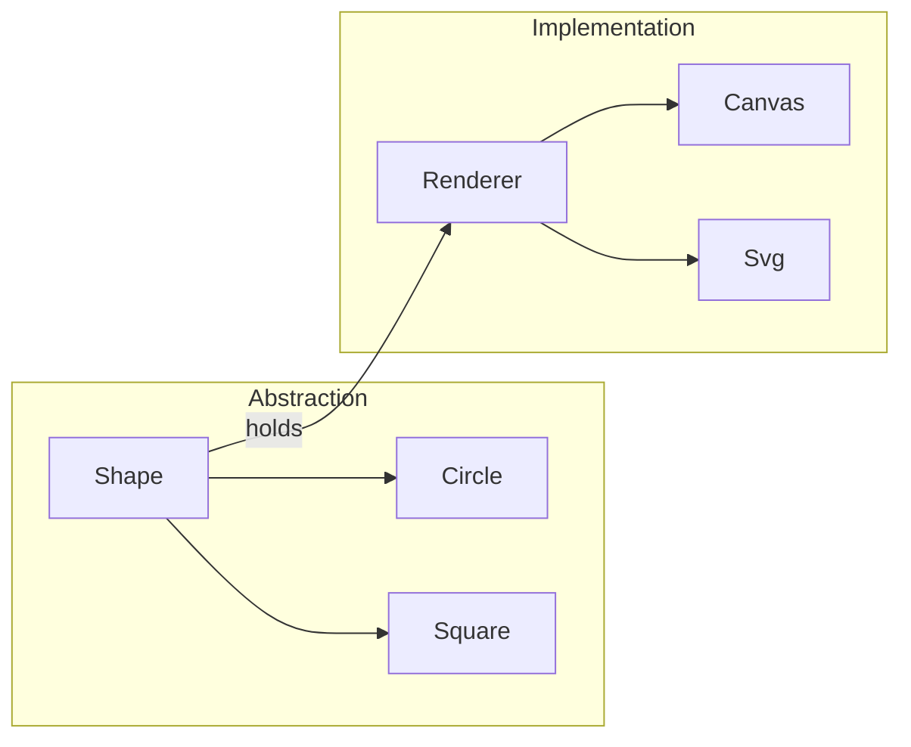
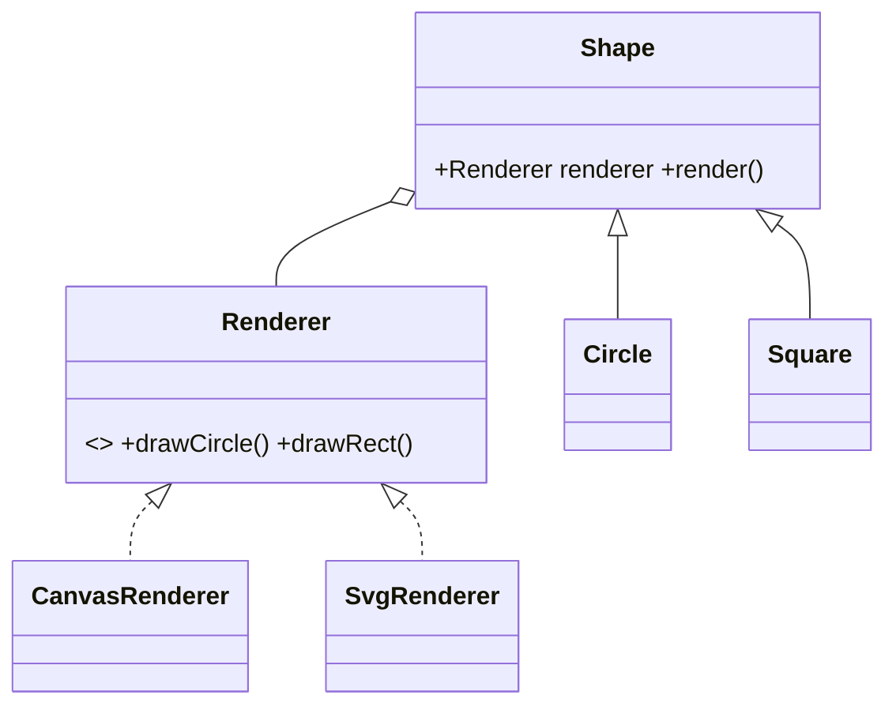

# Bridge Pattern

> Bridge decouples an abstraction from its implementation so the two can vary independently — preventing a combinatorial explosion of subclasses.

## Introduction

Bridge splits a hierarchy into two: an **abstraction** (the high-level control) and an **implementation** (the low-level engine), connected by composition. Each can be extended on its own axis without multiplying classes.

## Why this concept exists

When a class varies along **two independent dimensions** (e.g., shape *type* × rendering *API*), inheritance forces a class per combination (`CircleSvg`, `CircleCanvas`, `SquareSvg`, `SquareCanvas`...). Bridge composes the two dimensions instead, so `M shapes × N renderers` needs `M + N` classes, not `M × N`.

## Real-world analogy

A **TV and its remote**: the remote (abstraction) works with any brand of TV (implementation). Add a new remote type or a new TV brand independently — you don't build a specific remote for every TV model.

## Problem Statement

You have shapes (`Circle`, `Square`) that must render on multiple backends (`Canvas`, `SVG`). Subclassing per combination explodes. You'll bridge `Shape` (abstraction) to `Renderer` (implementation) via composition.

## Internal Working



- **Abstraction** holds a reference to an **Implementor** interface and delegates the low-level work to it.
- Both hierarchies extend independently.
- It's composition-over-inheritance applied to a two-axis variation problem.

## Memory Representation

The abstraction holds one reference to an implementor; negligible.

## Compiler Behavior / Runtime Behavior

Not special — delegation via an interface. Abstraction methods call implementor methods at runtime.

## Flutter Engine Behavior

Not applicable directly. (Conceptually similar to how a `RenderObject` delegates painting to a `Canvas`, or how platform-agnostic widgets delegate to platform renderers.)

## Dart VM Behavior

Not applicable.

## Examples

```dart
// Implementor axis
abstract interface class Renderer {
  String drawCircle(double r);
  String drawRect(double w, double h);
}
class CanvasRenderer implements Renderer {
  @override
  String drawCircle(double r) => 'Canvas: circle r=$r';
  @override
  String drawRect(double w, double h) => 'Canvas: rect ${w}x$h';
}
class SvgRenderer implements Renderer {
  @override
  String drawCircle(double r) => '<circle r="$r"/>';
  @override
  String drawRect(double w, double h) => '<rect w="$w" h="$h"/>';
}

// Abstraction axis (bridged to Renderer via composition)
abstract class Shape {
  final Renderer renderer;
  Shape(this.renderer);
  String render();
}
class Circle extends Shape {
  final double r;
  Circle(super.renderer, this.r);
  @override
  String render() => renderer.drawCircle(r);
}
class Square extends Shape {
  final double side;
  Square(super.renderer, this.side);
  @override
  String render() => renderer.drawRect(side, side);
}

void main() {
  // Mix any shape with any renderer — no CircleSvg/SquareCanvas classes needed
  print(Circle(CanvasRenderer(), 2).render()); // Canvas: circle r=2.0
  print(Circle(SvgRenderer(), 2).render());     // <circle r="2.0"/>
  print(Square(SvgRenderer(), 3).render());      // <rect w="3.0" h="3.0"/>
}
```

## Diagrams



## Common Mistakes

| Mistake | Why | Fix |
|---------|-----|-----|
| One subclass per combination | Class explosion | Bridge the two axes via composition |
| Confusing Bridge with Adapter | Different intent | Bridge is designed up-front; Adapter fixes an existing mismatch |
| Bridging when there's only one axis of change | Over-engineering | Use plain inheritance/composition |

## Best Practices

- Use Bridge when there are **two (or more) independent axes** of variation.
- Design both hierarchies to interfaces; connect via composition.
- Don't apply it speculatively — only when the second axis is real.

## Performance

Negligible (one delegation hop).

## Advantages / Disadvantages

- **+** Independent extension of both axes, avoids `M×N` explosion, composition-based flexibility.
- **−** More upfront structure; unnecessary for single-axis variation.

## Interview Questions

1. **🟢 What does Bridge decouple?** — An abstraction from its implementation so both can vary independently.
2. **🟢 What problem does it prevent?** — The `M×N` subclass explosion when a class varies on two independent dimensions.
3. **🟡 Bridge vs Adapter?** — Bridge is designed up front to separate two axes; Adapter retrofits compatibility onto an existing mismatched interface.
4. **🟡 Bridge vs Strategy?** — Structurally similar (composition + interface), but Strategy swaps an *algorithm*; Bridge separates an *abstraction hierarchy* from an *implementation hierarchy*.
5. **🟡 When is Bridge overkill?** — With a single axis of variation — plain composition/inheritance suffices.
6. **🔴 How does Bridge relate to "composition over inheritance"?** — It's that principle applied to convert a two-axis inheritance explosion into composition.
7. **🔴 Give a real two-axis example.** — Shapes × renderers, messages × transport channels, documents × export formats.

## Senior Engineer Tips

- Spot Bridge opportunities when class names start combining two concepts (`PdfInvoice`, `HtmlInvoice`, `PdfReport`, `HtmlReport`) — separate the axes.
- Bridge and Strategy often look identical in code; the distinction is intent/scale (algorithm swap vs two-hierarchy decoupling).

## Architect Perspective

Bridge keeps orthogonal concerns independently evolvable — e.g., business abstractions vs platform/transport/rendering implementations. This supports multi-platform and multi-backend designs without exponential class growth, aligning with clean-architecture separation of policy and mechanism.

## Summary

- Bridge separates abstraction from implementation via composition so both vary independently.
- Prevents `M×N` subclass explosion; use only with genuine two-axis variation.
- Structurally like Strategy; differs in intent (two hierarchies vs algorithm swap).

## Revision Notes

- Bridge = abstraction ⟂ implementation via composition (avoid M×N).
- Two independent axes → M+N classes, not M×N.
- Bridge (design-time, two hierarchies) vs Adapter (retrofit) vs Strategy (algorithm swap).

## Practice Questions

1. Why does bridging shapes×renderers give M+N instead of M×N classes?
2. How is Bridge different from Adapter in intent?
3. When is Bridge unnecessary?

## Coding Questions

1. Bridge `Message`(`Text`/`Rich`) to `Channel`(`Email`/`Sms`).
2. Bridge `Report`(`Summary`/`Detailed`) to `Exporter`(`Pdf`/`Csv`).
3. Add a new renderer to the shapes example and show zero shape edits.

## Mini Project

**Notification bridge (pure Dart):** Bridge a `Notification` abstraction (`Alert`, `Reminder`) to a `Channel` implementation (`Email`, `Sms`, `Push`); render any combination without per-combo classes; add a new channel with no notification edits. Acceptance: M+N structure; both axes extend independently; `dart analyze` clean.
