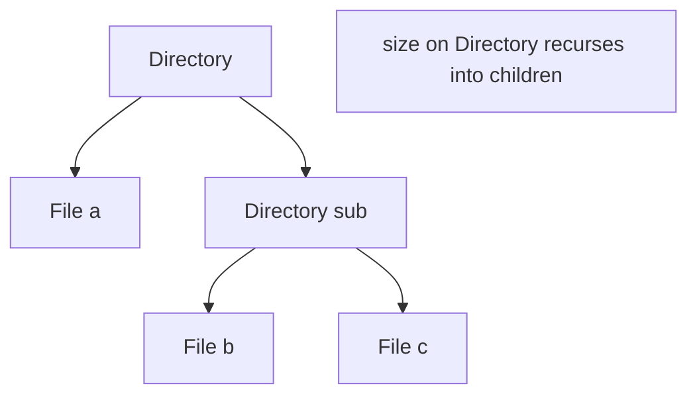
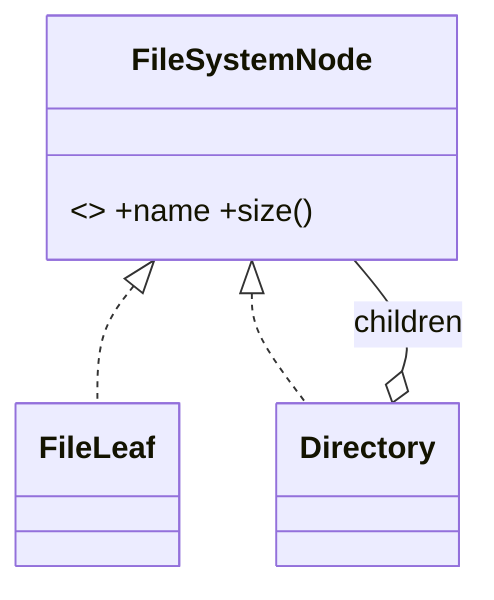

# Composite Pattern

> Composite lets you treat individual objects and compositions of objects uniformly — a tree where leaves and branches share one interface.

## Introduction

Composite arranges objects into **tree structures** and lets clients treat a single leaf and a whole subtree the same way through a common interface. Operations recurse through the tree automatically.

## Why this concept exists

Hierarchical structures (file systems, UI trees, org charts, menus) need uniform operations (`size()`, `render()`, `total()`) whether applied to one item or a group. Without Composite, clients must constantly distinguish "is this a single thing or a group?" — branching everywhere. Composite erases that distinction.

## Real-world analogy

A **folder**: it contains files and other folders. Asking "how big are you?" works the same on a file (its own size) or a folder (sum of children). You don't care which — you just ask.

## Problem Statement

Model a file system where `File` and `Directory` both answer `size()`, and a directory's size is the sum of its children (recursively). You'll define one `FileSystemNode` interface for both.

## Internal Working



- **Component:** the shared interface (`FileSystemNode` with `size()`).
- **Leaf:** a node with no children (`File`).
- **Composite:** a node holding children (`Directory`), implementing operations by aggregating children's results.
- Operations recurse through the composite transparently.

## Memory Representation

A tree of node objects; a composite holds a list of child references. Depth affects recursion stack.

## Compiler Behavior / Runtime Behavior

Not special. Recursive traversal at runtime; watch for very deep trees (stack depth) — use iteration if needed.

## Flutter Engine Behavior

Highly relevant conceptually: the **widget tree** is a composite — a `Column` (composite) holds children; layout/paint recurse uniformly over leaves (`Text`) and branches ([Module 09](../09%20Rendering%20Pipeline/README.md)).

## Dart VM Behavior

Not applicable.

## Examples

```dart
abstract interface class FileSystemNode {
  String get name;
  int size(); // bytes
}

class FileLeaf implements FileSystemNode {
  @override
  final String name;
  final int bytes;
  FileLeaf(this.name, this.bytes);
  @override
  int size() => bytes;
}

class Directory implements FileSystemNode {
  @override
  final String name;
  final List<FileSystemNode> children = [];
  Directory(this.name);

  Directory add(FileSystemNode node) { children.add(node); return this; }

  @override
  int size() => children.fold(0, (sum, c) => sum + c.size()); // recurse uniformly
}

void main() {
  final root = Directory('root')
    ..add(FileLeaf('a.txt', 100))
    ..add(Directory('sub')
      ..add(FileLeaf('b.txt', 200))
      ..add(FileLeaf('c.txt', 300)));

  // treat leaf and composite identically:
  print(root.size());                    // 600
  print(FileLeaf('x.txt', 50).size());   // 50
}
```

## Diagrams



## Common Mistakes

| Mistake | Why | Fix |
|---------|-----|-----|
| Different interfaces for leaf vs composite | Clients must branch | Share one component interface |
| Leaf forced to implement child ops (`add`) | Awkward/`UnsupportedError` (ISP/LSP issue) | Keep child-management on composite only, or use safe defaults |
| Deep recursion on huge trees | Stack overflow | Iterative traversal / bounded depth |
| Cyclic references | Infinite recursion | Enforce a true tree (no cycles) |

## Best Practices

- Share **one component interface** for leaves and composites.
- Keep **child-management methods** (`add`/`remove`) on the composite (not forced on leaves) to respect ISP/LSP.
- Guard against cycles; consider iteration for very deep trees.
- Combine with Visitor ([18_visitor.md](18_visitor.md)) to add operations over the tree without editing node classes.

## Performance

Traversal is O(nodes); recursion depth = tree depth. Fine for typical trees; iterate for pathological depth.

## Advantages / Disadvantages

- **+** Uniform treatment of parts and wholes, recursive operations for free, natural for hierarchies.
- **−** Leaf/composite interface tension (child ops), risk of overly general interfaces, recursion depth.

## Interview Questions

1. **🟢 What does Composite do?** — Lets clients treat individual objects and groups uniformly via a shared interface in a tree structure.
2. **🟢 Leaf vs Composite?** — Leaf has no children; Composite holds children and implements operations by aggregating them.
3. **🟡 Where should `add`/`remove` live?** — On the composite; forcing them on leaves creates `UnsupportedError` stubs (ISP/LSP smell).
4. **🟡 Give a Flutter example of Composite.** — The widget tree: containers hold children; layout/paint recurse over leaves and branches uniformly.
5. **🟡 How do Composite and Visitor combine?** — Visitor adds new operations over the composite tree without modifying node classes.
6. **🔴 What are the risks with large/deep trees?** — Stack overflow from recursion and cycle-induced infinite loops; use iteration and enforce acyclicity.
7. **🔴 How does Composite support Open/Closed?** — New node types plug into the tree implementing the component interface, without changing traversal code.

## Senior Engineer Tips

- Composite pairs naturally with recursion and `fold`; keep node operations pure for easy testing.
- When you need many operations over the tree, add a Visitor rather than bloating node classes.
- Enforce tree invariants (no cycles, single parent) to keep traversal safe.

## Architect Perspective

Composite models any hierarchical domain (UI trees, category trees, permission trees, document structures) with uniform operations, keeping client code simple and extensible. It underlies Flutter's rendering model and is foundational for tree-shaped data throughout apps ([Module 09](../09%20Rendering%20Pipeline/README.md)).

## Summary

- Composite = tree of leaves + composites sharing one interface; operations recurse uniformly.
- Keep child-management on composites; guard depth/cycles.
- Powers the Flutter widget tree; pairs with Visitor for added operations.

## Revision Notes

- Composite = uniform leaf/branch via shared interface (tree).
- Composite holds children + aggregates; leaf has none.
- `add`/`remove` on composite (ISP/LSP); watch recursion depth/cycles.
- Flutter widget tree = composite; pairs with Visitor.

## Practice Questions

1. Why keep `add`/`remove` off the leaf?
2. How is the widget tree a composite?
3. What risks come with deep/cyclic trees?

## Coding Questions

1. Add a `count()` (number of files) to the file-system composite.
2. Model a UI menu tree (`MenuItem`/`Menu`) with a uniform `render()`.
3. Add a `find(name)` search across the composite tree.

## Mini Project

**File system model (pure Dart):** Implement `FileSystemNode` with `File`/`Directory`, supporting `size()`, `count()`, and `find(name)` recursively, with cycle guards. Add tests over a multi-level tree. Acceptance: uniform interface; child ops only on directories; safe on deep trees; `dart analyze` clean.
