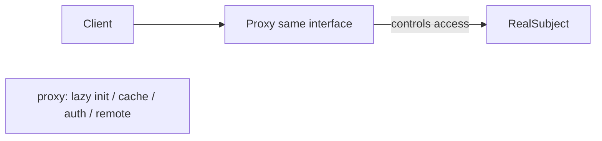
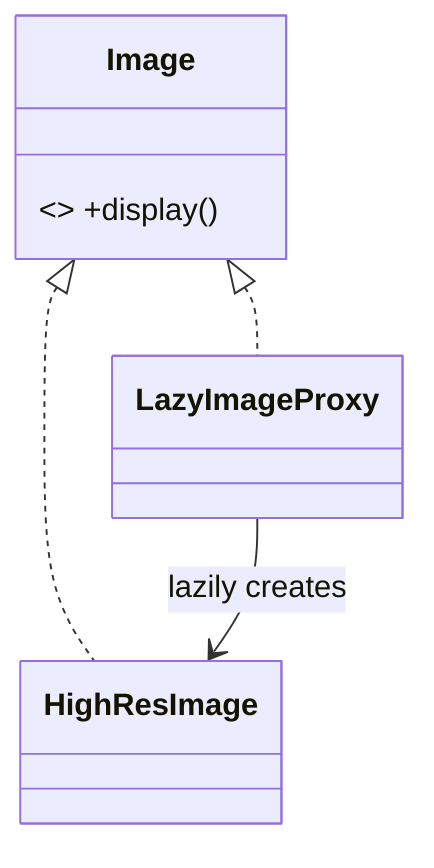

# Proxy Pattern

> A proxy is a stand-in that implements the same interface as a real object and controls access to it — for lazy loading, caching, access control, or remote calls.

## Introduction

Proxy provides a surrogate for another object, sharing its interface, to control access. Common flavors: **virtual** (lazy/expensive init), **caching**, **protection** (authorization), and **remote** (network stand-in).

## Why this concept exists

Sometimes you want to interpose logic *around* using an object — defer its costly creation until needed, cache results, check permissions, or represent a remote resource locally — without changing the object or its callers. Proxy inserts that control transparently behind the same interface.

## Real-world analogy

A **debit card** is a proxy for your bank account: same "pay" interface, but it controls access (PIN check = protection), and doesn't carry the actual cash (remote/virtual). You use it exactly like money, but it mediates.

## Problem Statement

Loading a high-res image is expensive; you want to defer it until first display (virtual proxy) and cache it. And some documents require authorization to open (protection proxy). You'll wrap the real object behind a proxy sharing its interface.

## Internal Working



- **Subject interface** shared by proxy and real subject.
- **Proxy** holds/creates the real subject and adds control logic (lazy create, cache, check, remote call) before/after delegating.
- Clients depend on the interface and can't tell proxy from real.

## Memory Representation

The proxy holds a (possibly-null until lazy-created) reference to the real subject.

## Compiler Behavior / Runtime Behavior

Not special; proxy delegates at runtime after its control logic. Virtual proxy creates the real subject on first use.

## Flutter Engine Behavior

Not applicable directly. (Flutter's image caching, lazy `ListView.builder` item creation, and network layers embody proxy-like deferral/caching.)

## Dart VM Behavior

Not applicable.

## Examples

```dart
abstract interface class Image {
  String display();
}

// Real subject: expensive to create
class HighResImage implements Image {
  final String path;
  HighResImage(this.path) {
    print('loading $path (expensive)'); // simulates heavy load
  }
  @override
  String display() => 'showing $path';
}

// Virtual + caching proxy: defer creation until first display
class LazyImageProxy implements Image {
  final String path;
  HighResImage? _real; // created on demand
  LazyImageProxy(this.path);
  @override
  String display() {
    _real ??= HighResImage(path); // lazy init (only once)
    return _real!.display();
  }
}

// Protection proxy: gate access
class ProtectedDoc implements Image {
  final Image _real;
  final bool Function() _isAuthorized;
  ProtectedDoc(this._real, this._isAuthorized);
  @override
  String display() =>
      _isAuthorized() ? _real.display() : 'access denied';
}

void main() {
  final img = LazyImageProxy('photo.png'); // NOT loaded yet
  print('created proxy, nothing loaded');
  print(img.display()); // loads now, then shows
  print(img.display()); // reuses loaded instance (cached)

  var loggedIn = false;
  final doc = ProtectedDoc(LazyImageProxy('secret.png'), () => loggedIn);
  print(doc.display()); // access denied
  loggedIn = true;
  print(doc.display()); // loads + shows
}
```

## Diagrams



## Common Mistakes

| Mistake | Why | Fix |
|---------|-----|-----|
| Proxy changing the interface | Not transparent | Share the subject interface |
| Business logic in the proxy | SRP violation | Keep proxy to access control only |
| Confusing Proxy with Decorator | Same structure, different intent | Proxy controls access; Decorator adds behavior |
| Not caching in a virtual proxy | Re-creates the expensive object | Create once, reuse |

## Best Practices

- Share the **subject interface**; keep the proxy transparent.
- Keep proxy logic to **access concerns** (lazy/cache/auth/remote), not business rules.
- Create the real subject once in virtual proxies (cache it).
- Combine with DIP: clients depend on the interface; proxy vs real is a wiring choice.

## Performance

Virtual/caching proxies **improve** performance (defer/avoid work). Protection/remote proxies add a small check/round-trip.

## Advantages / Disadvantages

- **+** Lazy loading, caching, access control, remote representation — transparently.
- **−** Extra layer; easy to conflate with Decorator; can hide latency (remote proxy).

## Interview Questions

1. **🟢 What is a Proxy?** — A stand-in sharing a real object's interface that controls access to it.
2. **🟢 Name proxy types.** — Virtual (lazy), caching, protection (authorization), remote (network stand-in).
3. **🟡 Proxy vs Decorator?** — Same wrapping structure; Proxy *controls access*, Decorator *adds behavior*. Intent differs.
4. **🟡 How does a virtual proxy help performance?** — It defers expensive creation until first use and caches it thereafter.
5. **🟡 What should a proxy avoid doing?** — Business logic or changing the interface; it should only mediate access.
6. **🔴 Give Flutter analogues.** — Image cache, lazy `ListView.builder` item creation, network client wrappers.
7. **🔴 How does a remote proxy hide complexity, and what's the risk?** — It represents a network resource behind a local interface; the risk is hidden latency/failure the caller doesn't expect.

## Senior Engineer Tips

- Use a virtual/caching proxy to make "expensive if used, free if not" behavior transparent.
- Protection proxies centralize authorization checks at the resource boundary.
- Distinguish Proxy from Decorator in code review by *intent*: access control vs feature addition.

## Architect Perspective

Proxies place cross-cutting access concerns (lazy init, caching, auth, remoting) at object boundaries without polluting callers or the real subject. They're foundational to performance (deferral/caching), security (protection), and distributed designs (remote stubs), often working alongside Repository and DI ([Modules 15, 16, 37](../15%20Local%20Storage/README.md)).

## Summary

- Proxy is a same-interface stand-in that controls access (virtual/caching/protection/remote).
- Keep it transparent and access-focused; create the real subject lazily and cache it.
- Structurally like Decorator; the intent (access vs behavior) distinguishes them.

## Revision Notes

- Proxy = surrogate sharing interface, controls access.
- Types: virtual (lazy), caching, protection (auth), remote.
- Proxy controls access; Decorator adds behavior (same structure).
- Flutter: image cache, lazy list items, network wrappers.

## Practice Questions

1. Why is a virtual proxy a performance optimization?
2. How do you tell Proxy from Decorator in code?
3. What risk does a remote proxy introduce?

## Coding Questions

1. Build a caching proxy over an expensive `PrimeChecker`.
2. Implement a protection proxy gating a `BankAccount` behind an auth check.
3. Write a virtual proxy that lazily loads a config file on first access.

## Mini Project

**Image loading proxy (pure Dart):** Implement an `Image` interface with an expensive `HighResImage`, a `LazyImageProxy` (defer + cache), and a `ProtectedImage` proxy (auth gate). Compose them and test that loading is deferred, cached, and gated. Acceptance: interface transparent; single expensive load; access control enforced; `dart analyze` clean.
