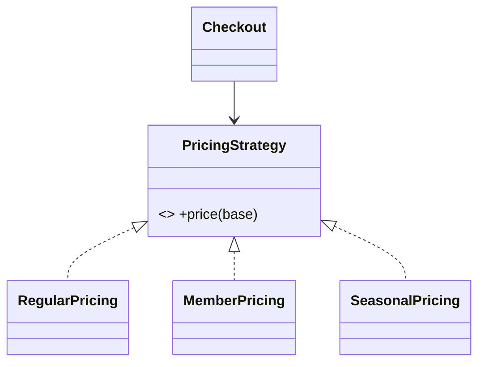

# Strategy Pattern

> Strategy defines a family of interchangeable algorithms behind a common interface, letting you swap behavior at runtime without changing the code that uses it.

## Introduction

Strategy encapsulates each algorithm (sorting, pricing, validation, routing) as an object implementing a shared interface, so the context can switch algorithms at runtime. It's the canonical way to satisfy the Open/Closed Principle for *behavior*.

## Why this concept exists

Hard-coding an algorithm (or `if/else` selecting one) couples the caller to every variant and forces edits to add new ones. Strategy externalizes the algorithm so variants are added/swapped independently — and injected for testing.

## Real-world analogy

**Navigation modes** in a maps app: "drive," "walk," "cycle," "transit" are interchangeable route-finding strategies. You pick one; the app computes the route the same way regardless — and adding "scooter" doesn't change the app's routing call.

## Problem Statement

A checkout must apply different pricing rules (regular, member, seasonal) chosen at runtime. `if (type == ...)` scatters and grows. You'll inject a `PricingStrategy` the context uses.

## Internal Working

```mermaid
flowchart LR
    Ctx[Checkout context] --> S[PricingStrategy interface]
    S <|.. Regular
    S <|.. Member
    S <|.. Seasonal
```

- **Strategy interface** declares the algorithm (`double price(double base)`).
- **Concrete strategies** implement variants.
- **Context** holds a strategy (injected/swappable) and delegates to it.
- In Dart, a strategy can be a **function** (`typedef`) instead of a class — often simpler.

## Memory Representation

The context holds one strategy reference; strategies are usually stateless (can be `const`/singletons).

## Compiler Behavior / Runtime Behavior

Not special; the context calls the strategy polymorphically; swapping changes behavior at runtime.

## Flutter Engine Behavior

Not applicable. (Flutter uses Strategy widely: `ScrollPhysics`, `PageTransitionsBuilder`, comparator functions in `sort`.)

## Dart VM Behavior

Not applicable.

## Examples

```dart
// Class-based strategy
abstract interface class PricingStrategy {
  double price(double base);
}
class RegularPricing implements PricingStrategy {
  @override
  double price(double base) => base;
}
class MemberPricing implements PricingStrategy {
  @override
  double price(double base) => base * 0.9;
}
class SeasonalPricing implements PricingStrategy {
  final double off;
  const SeasonalPricing(this.off);
  @override
  double price(double base) => base * (1 - off);
}

class Checkout {
  PricingStrategy strategy; // swappable at runtime
  Checkout(this.strategy);
  double total(double base) => strategy.price(base);
}

// Function-based strategy (idiomatic Dart)
typedef Pricing = double Function(double base);
double memberPricing(double base) => base * 0.9;

void main() {
  final cart = Checkout(RegularPricing());
  print(cart.total(100)); // 100.0
  cart.strategy = MemberPricing(); // swap behavior at runtime
  print(cart.total(100)); // 90.0
  cart.strategy = const SeasonalPricing(0.25);
  print(cart.total(100)); // 75.0

  // function strategy:
  Pricing p = memberPricing;
  print(p(200)); // 180.0
}
```

## Diagrams



## Common Mistakes

| Mistake | Why | Fix |
|---------|-----|-----|
| `if/switch` selecting behavior inline | OCP violation, coupling | Extract strategies + inject |
| Stateful strategies with hidden state | Surprising behavior | Keep strategies stateless/immutable |
| Class strategy where a function suffices | Boilerplate | Use a `typedef`/closure |
| Context knowing concrete strategies | Coupling | Depend on the strategy interface |

## Best Practices

- Depend on the **strategy interface**; inject the concrete choice.
- Prefer **function-type strategies** (`typedef` + closures) for simple algorithms.
- Keep strategies **stateless/immutable** (make them `const`).
- Combine with Factory/DI to select strategies by config.

## Performance

Negligible (one indirection); stateless strategies can be shared singletons.

## Advantages / Disadvantages

- **+** Swap algorithms at runtime, OCP-compliant, testable (inject fakes), removes conditionals.
- **−** More types (unless using functions); context must expose a way to set the strategy.

## Interview Questions

1. **🟢 What is Strategy?** — A family of interchangeable algorithms behind one interface, selectable/swappable at runtime.
2. **🟢 How does Strategy support OCP?** — New algorithms are new implementations; the context using the interface never changes.
3. **🟡 Class vs function strategy in Dart?** — Functions (`typedef`/closures) are idiomatic for simple, stateless algorithms; classes suit stateful/config-carrying strategies.
4. **🟡 Strategy vs State pattern?** — Strategy swaps an algorithm chosen by the client; State changes behavior based on the object's *internal state*, often transitioning itself.
5. **🟡 Where does Flutter use Strategy?** — `ScrollPhysics`, sort comparators, transition builders.
6. **🔴 How do Strategy and DIP relate?** — The context depends on the strategy abstraction and receives the concrete strategy via injection.
7. **🔴 Why keep strategies stateless?** — So they're reusable, shareable (`const`/singleton), and free of surprising cross-call state.

## Senior Engineer Tips

- In Dart, reach for a function-typed strategy first; escalate to a class only when the strategy needs state/config or multiple methods.
- Pair Strategy with a registry/factory to pick strategies from config or feature flags.
- Strategy is the refactor target when you see a growing behavior-selecting `switch` (OCP file, [Module 04](../04%20SOLID%20Principles/02_ocp_open_closed.md)).

## Architect Perspective

Strategy is the workhorse for pluggable behavior — pricing, ranking, validation, sync policies — enabling A/B tests, feature flags, and per-tenant customization without editing core flows. It's OCP + DIP in miniature and appears throughout well-factored codebases.

## Summary

- Strategy = interchangeable algorithms behind one interface, swapped at runtime.
- Use functions for simple cases, classes for stateful ones; keep them stateless; inject them.
- Distinct from State (internal-state-driven, self-transitioning).

## Revision Notes

- Strategy = swappable algorithm via interface (or `typedef`/closure).
- Inject the strategy; keep stateless (`const`); OCP + DIP.
- Strategy (client-chosen algorithm) vs State (internal-state behavior).
- Flutter: ScrollPhysics, sort comparators.

## Practice Questions

1. When is a function strategy better than a class?
2. How does Strategy differ from State?
3. Why keep strategies stateless?

## Coding Questions

1. Implement `SortStrategy` (asc/desc/byLength) injected into a `Sorter`.
2. Build a function-based `Validator` strategy set (email/phone/nonEmpty).
3. Add a new pricing strategy and prove `Checkout` is unchanged.

## Mini Project

**Pricing engine (pure Dart):** Implement `PricingStrategy` (regular/member/seasonal/coupon) both as classes and function strategies, a `Checkout` context that swaps them at runtime, and a factory selecting by config. Test each and the swap. Acceptance: no behavior-selecting `switch` in `Checkout`; strategies stateless; new strategy added without editing context; `dart analyze` clean.
