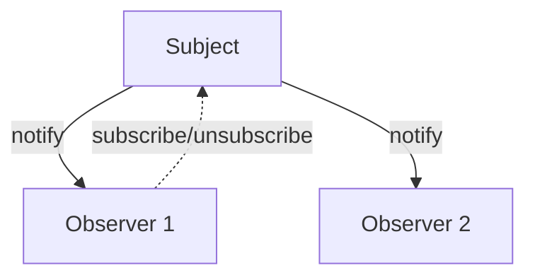
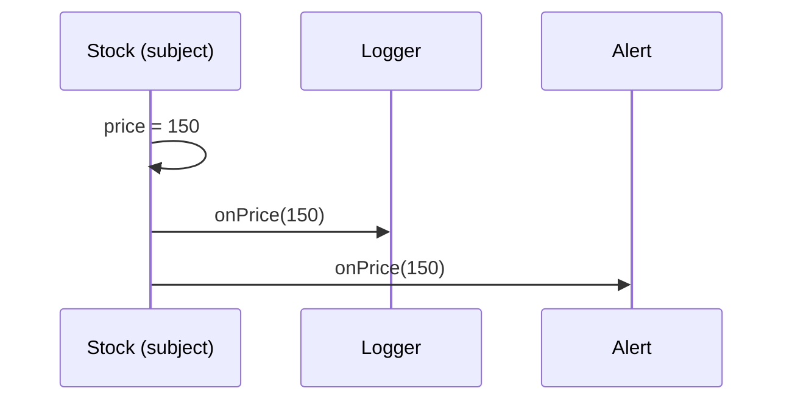

# Observer Pattern

> Observer lets an object (subject) notify a list of dependents (observers) automatically when its state changes — the foundation of reactive UI.

## Introduction

Observer establishes a one-to-many dependency: when the subject changes, all registered observers are notified. It's the mechanism behind `ChangeNotifier`/`ValueNotifier`, streams, and every reactive state-management solution in Flutter.

## Why this concept exists

UIs must react to data changes without the data knowing about the UI. Observer decouples the source of change (subject) from the reactors (observers): the subject just announces "I changed," and interested parties respond — enabling loose coupling and multiple independent listeners.

## Real-world analogy

A **newsletter**: subscribers (observers) register with the publisher (subject). When a new issue is published, everyone subscribed gets it automatically. The publisher doesn't know or care who subscribers are; subscribers can join/leave anytime.

## Problem Statement

A `Stock` price changes and multiple widgets/loggers must update. Hard-wiring the stock to each consumer couples them. You'll implement subscribe/notify so observers react without the subject knowing their concrete types.

## Internal Working



- **Subject** maintains a list of observers and `subscribe`/`unsubscribe`/`notify` methods.
- **Observers** implement an `update(...)` callback (or are just closures).
- On state change, the subject calls each observer.
- Dart-native forms: `Stream`/`StreamController` (broadcast), `ChangeNotifier`/`Listenable`, `ValueNotifier<T>`.

## Memory Representation

The subject holds references to observers → **observers won't be GC'd while subscribed**; forgetting to unsubscribe leaks them ([02 · memory_and_gc](../02%20Advanced%20Dart/13_memory_and_gc.md)).

## Compiler Behavior

Not applicable.

## Runtime Behavior

Notification iterates observers synchronously (or via stream events). Modifying the observer list during notification needs care (iterate a copy).

## Flutter Engine Behavior

Not applicable, but core to Flutter: `setState`, `ChangeNotifier` + `ListenableBuilder`, `ValueListenableBuilder`, and `StreamBuilder` all implement/consume Observer ([Module 11](../11%20State%20Management/README.md)).

## Dart VM Behavior

Not applicable.

## Examples

```dart
// Hand-rolled Observer
abstract interface class PriceObserver {
  void onPrice(double price);
}

class Stock {
  final _observers = <PriceObserver>[];
  double _price = 0;

  void subscribe(PriceObserver o) => _observers.add(o);
  void unsubscribe(PriceObserver o) => _observers.remove(o); // avoid leaks!

  set price(double p) {
    _price = p;
    for (final o in List.of(_observers)) {
      o.onPrice(p); // notify (copy to survive concurrent unsubscribe)
    }
  }
}

class Logger implements PriceObserver {
  @override
  void onPrice(double price) => print('log: $price');
}
class Alert implements PriceObserver {
  @override
  void onPrice(double price) {
    if (price > 100) print('ALERT: $price');
  }
}

void main() {
  final stock = Stock();
  final logger = Logger();
  stock.subscribe(logger);
  stock.subscribe(Alert());

  stock.price = 90;  // log: 90.0
  stock.price = 150; // log: 150.0  +  ALERT: 150.0

  stock.unsubscribe(logger); // stop receiving (and allow GC)
  stock.price = 200; // ALERT: 200.0 only
}
```

```dart
// Idiomatic Dart: broadcast Stream is Observer built-in
// final controller = StreamController<double>.broadcast();
// controller.stream.listen(print); // observer; remember to cancel the subscription
```

## Diagrams



## Common Mistakes

| Mistake | Why | Fix |
|---------|-----|-----|
| Never unsubscribing | Memory leak; callbacks after dispose | Unsubscribe/cancel in `dispose` |
| Mutating observer list during notify | ConcurrentModification | Iterate a copy |
| Heavy work in observer callbacks | Blocks/janks | Keep handlers light; offload |
| Subject knowing concrete observer types | Coupling | Depend on the observer interface/callback |

## Best Practices

- Always provide (and use) **unsubscribe**; cancel in `dispose` to prevent leaks.
- Prefer Dart-native mechanisms (`Stream.broadcast`, `ValueNotifier`, `ChangeNotifier`) over hand-rolled lists.
- Keep observer callbacks fast; iterate a copy when notifying.
- Consider push (send data) vs pull (observer queries subject) notification styles.

## Performance

Notification is O(observers); keep callbacks light. Broadcast streams are efficient but each listener still runs on the loop.

## Advantages / Disadvantages

- **+** Loose coupling, multiple independent listeners, reactive UI foundation.
- **−** Leak-prone (must unsubscribe), notification order/reentrancy pitfalls, debugging "who updated?" can be hard.

## Interview Questions

1. **🟢 What is Observer?** — A one-to-many dependency where a subject notifies registered observers automatically on state change.
2. **🟢 Dart/Flutter built-ins that implement Observer?** — `Stream`/`StreamController.broadcast`, `ChangeNotifier`, `ValueNotifier`, and the builders that listen to them.
3. **🟡 Why is Observer leak-prone?** — The subject holds observer references; unsubscribed observers (and their captures like `State`/`context`) stay reachable — leak. Always unsubscribe/cancel.
4. **🟡 Push vs pull notification?** — Push sends the changed data to observers; pull just signals change and observers query the subject.
5. **🟡 Why iterate a copy of observers when notifying?** — An observer may unsubscribe during notification, mutating the list mid-iteration.
6. **🔴 Observer vs Pub/Sub?** — Observer usually has direct subject↔observer references; Pub/Sub adds a broker/event bus decoupling publishers and subscribers entirely.
7. **🔴 How does Observer underpin state management?** — Reactive solutions expose a listenable/stream subject; widgets observe and rebuild on change.

## Senior Engineer Tips

- Prefer `Stream`/`ValueNotifier`/`ChangeNotifier` over hand-rolled observer lists — they handle the mechanics and integrate with Flutter builders.
- Treat every subscription as owned; cancel in `dispose` (a top Flutter leak source — [02 · memory_and_gc](../02%20Advanced%20Dart/13_memory_and_gc.md)).
- Beware reentrancy: an observer that mutates the subject during notification can cause surprising cascades.

## Architect Perspective

Observer is the backbone of reactive architecture: it decouples state producers from consumers, enabling the entire spectrum of Flutter state management (Provider/Riverpod/BLoC) ([Module 11](../11%20State%20Management/README.md)). Discipline around subscription lifecycle is a system-wide reliability concern.

## Summary

- Observer: subject notifies many observers on change; decouples producer from consumers.
- Use Dart-native streams/notifiers; always unsubscribe (leak risk); iterate a copy on notify.
- Foundation of reactive UI and state management.

## Revision Notes

- Observer = 1-to-many notify on change; subscribe/unsubscribe/notify.
- Dart built-ins: `Stream.broadcast`, `ChangeNotifier`, `ValueNotifier`.
- Must unsubscribe/cancel (leak!); iterate copy on notify.
- Underpins state management; Pub/Sub adds a broker.

## Practice Questions

1. Why does forgetting to unsubscribe leak memory?
2. Push vs pull notification — tradeoffs?
3. Why notify over a copy of the observer list?

## Coding Questions

1. Implement a generic `Observable<T>` with subscribe/unsubscribe/notify.
2. Reimplement the stock example with a broadcast `Stream` and cancellable subscriptions.
3. Build a `ValueNotifier`-like class from scratch with listeners.

## Mini Project

**Reactive stock ticker (pure Dart):** Implement `Observable<double>` with subscribe/unsubscribe, plus `Logger` and `Alert` observers; simulate price changes; prove unsubscribed observers stop receiving and are collectible. Then reimplement using a broadcast `Stream`. Acceptance: no leaks (all cancelled); notify-over-copy; both implementations tested; `dart analyze` clean.
